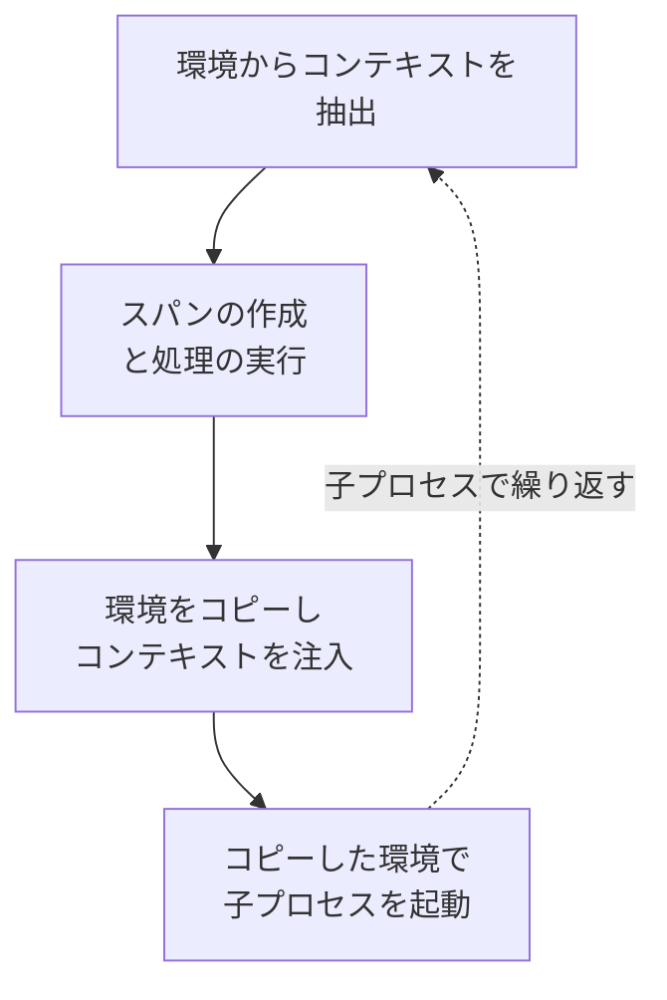
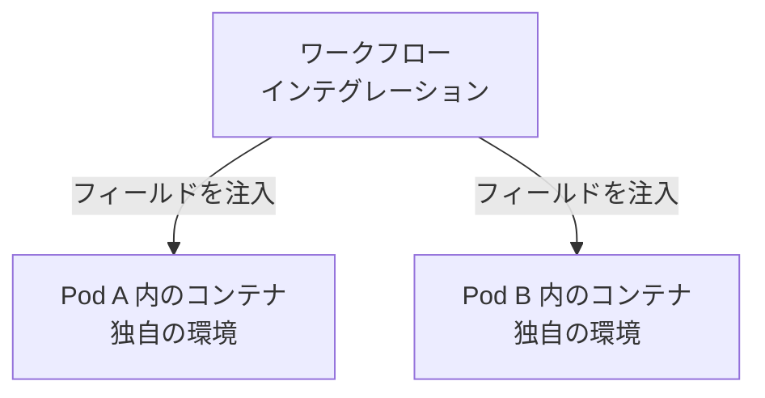

トレースは常にネットワーク境界を越えるわけではありません。
ワークフローランナーがシェルを起動し、シェルがビルドツールを立ち上げ、ビルドツールがテストプロセスを開始します。
バッチ処理やデータ処理システムでも、同様の子プロセスのチェーンが作られます。
これらの境界を越えてトレース情報を受け渡す共通の方法がなければ、各プロセスのスパンは別々のトレースに分かれてしまいます。

[コンテキスト伝搬][context propagation]に馴染みがない方に説明すると、これはあるサービスやプロセスから次のサービスやプロセスへ情報を運ぶ仕組みです。
トレーシングにおいては、新しいスパンが同じトレースに参加できるようにするトレース ID やスパン ID が含まれます。
また、バゲージも運ぶことができます。バゲージとは、下流の処理に渡されるアプリケーション定義のキーバリューペアです。

OpenTelemetry の仕様では、[環境変数をコンテキスト伝搬のキャリアとして使用する][env-carrier-spec]ためのリリース候補が公開されました。
プロトコルヘッダーやメッセージメタデータが利用できない場合に、プロパゲーターが環境変数を使ってトレースコンテキストやバゲージなどのデータをプロセス間で運ぶ方法を標準化するものです。

この仕様を Stable にする前に、言語実装者、ツール作者、プラットフォームエンジニア、そして実際の CI/CD、バッチ処理、コマンドラインのワークロードを運用しているユーザーからのフィードバックを求めています。

## 環境変数キャリアとは {#what-is-an-environment-variable-carrier}

キャリアとは、サービスやプロセス間で伝搬データを受け渡すために使われる媒体です。
プロパゲーターは伝搬フィールドをキャリアに書き込み、受信側でそれを読み取ります。
HTTP ヘッダーはよく知られたキャリアです。
あるプロセスが別のプロセスを起動する場合、子プロセスの環境が同じ役割を果たすことができます。
伝搬フィールドは子プロセスの起動前に書き込まれ、子プロセスの初期化時に読み取られます。

リリース候補では、この仕組みがプラットフォーム間で一貫して動作するためのルールを定義しています。
仕様では、文字列のキーバリューキャリアと共に使われるプロパゲーターの型を [`TextMapPropagator`][text-map-propagator] と呼んでいます。

たとえば、W3C Trace Context と W3C Baggage プロパゲーターを使用する場合、伝搬フィールドは以下のような環境変数で表されます。

```text
TRACEPARENT=00-4bf92f3577b34da6a3ce929d0e0e4736-00f067aa0ba902b7-01
TRACESTATE=vendorname=opaquevalue
BAGGAGE=build.id=42,repository.name=example
```

[OpenTelemetry Propagators API][propagators-api] では、伝搬フィールドをキャリアに書き込むことを**注入**、読み取ることを**抽出**と呼びます。

プロセス内部では、OpenTelemetry は伝搬データを `Context` に保持します。
トレーシングの場合、そのデータには `SpanContext` が含まれ、`Baggage` も含まれることがあります。
注入時に、プロパゲーターは現在の `Context` からデータを読み取り、キャリアに書き込みます。
抽出時には、キャリアを読み取り、そのデータを含む新しい `Context` を返します。

環境変数キャリアはこれらの値を解釈しません。
プレーンな文字列として扱います。
フィールド名の選択、値の検証と解析は、設定されたプロパゲーターが引き続き担当します。
これにより、キャリアは W3C フォーマットだけでなく、B3 のようなフォーマットでも使用できます。

環境変数名は HTTP ヘッダー名よりも制約が多いため、仕様では正規化アルゴリズムを定義しています。
ASCII 文字を大文字に変換し、サポートされない文字をアンダースコアに置き換え、名前が数字で始まらないようにします。
たとえば以下のようになります。

```text
x-b3-traceid -> X_B3_TRACEID
```

このルールは、実装が環境変数を読み取る（`Get`）、書き込む（`Set`）、一覧する（`Keys`）ときに一貫して適用されます。
Windows のような大文字小文字を区別しないプラットフォームも含みます。

## プロセス間での伝搬の仕組み {#how-propagation-works-between-processes}

想定されるライフサイクルは、プロセス環境が元々動作する仕組みに沿っています。

1. 初期化時に、設定されたプロパゲーターが、子プロセスが起動時に受け取った環境から値を `Context` に抽出します。
2. アプリケーションはその `Context` を使ってスパンを作成し、処理を実行します。
3. 別の子プロセスを起動する前に、アプリケーションは環境をコピーし、現在の `Context` から伝搬フィールドをそのコピーに注入します。
4. アプリケーションは変更された環境で子プロセスを起動し、このサイクルが繰り返されます。



アプリケーションは子プロセスごとに個別の環境コピーを使用すべきです。
これは特に、複数のプロセスが同時に実行され、異なるスパンに属している場合に重要です。
伝搬変数を起動時の入力として扱うことで、親プロセスのグローバル環境への変更に依存することも避けられます。

## ユースケースと実装 {#use-cases-and-implementations}

### OpenTelemetry の言語実装 {#opentelemetry-language-implementations}

OpenTelemetry の言語実装は、設定されたプロパゲーターがプロセス環境から読み取り、プロセス環境に書き込めるようにするヘルパーを提供できます。
言語によって、ヘルパーはキャリア型、getter と setter、またはその他の言語に適した API になることがあります。
API、SDK、または contrib パッケージに含まれる場合があります。
計装はこれらのヘルパーを使って、プロセス起動時に受信した値を抽出し、子プロセスを起動する前にコピーした環境にフィールドを注入できます。

これらのヘルパーは子プロセスを起動しません。
アプリケーションコードまたは計装が子プロセスを起動し、準備した環境を該当するプロセス API に渡します。
設定されたプロパゲーターが伝搬フォーマットを処理するため、インテグレーションは W3C Trace Context、W3C Baggage、B3、またはその他のサポートされるフォーマットを自分で解析する必要はありません。

### otel-cli のようなコマンドラインツール {#command-line-tools-such-as-otel-cli}

コマンドラインツールを使えば、すべてのシェルスクリプトが OpenTelemetry API と直接統合しなくても、同じパターンを適用できます。
たとえばトレーシングが設定されている場合（OTLP エンドポイントの設定など）、[otel-cli][] はコマンドを囲むスパンを作成し、そのスパンの `TRACEPARENT` をコマンドの環境に注入できます。

```console
otel-cli exec --service build --name compile -- make all
```

デフォルトでは、有効な受信 `TRACEPARENT` が存在する場合、`otel-cli` はそれを作成するスパンの親として使用します。
`make` や、それが起動するプロセス、または別の `otel-cli` の呼び出しが伝搬された `TRACEPARENT` を抽出すれば、それらのスパンは同じトレースに残ることができます。
これは、環境変数を使ってコマンド境界を越えてトレースを継続する実用的な例です。
OpenTelemetry の言語実装は、計装されたアプリケーションやライブラリに対して、同じ基本的な構成要素を提供します。

### シェルスクリプト {#shell-scripts}

[Thoth][] は、シェルスクリプトおよび GitHub Actions 向けの OpenTelemetry 計装を提供します。
シェルスクリプトでは、`otel.sh` ファイルをソースすることで、プロジェクトの SDK と自動計装が初期化されます。
スクリプトのルートスパンを作成し、サポートされるコマンドのスパンを作成し、シバンを使用する子シェルや実行可能スクリプトへ計装を継続します。
また、`curl` や `wget` などのサポートされる HTTP クライアントを通じて W3C の `traceparent` ヘッダーを注入することもできます。
Thoth は子プロセスの環境を通じて `TRACEPARENT` と `TRACESTATE` を伝搬します。

### GitHub Actions {#github-actions}

GitHub Actions の環境伝搬は仮説的なものではありません。
2つの独立したコミュニティプロジェクトが、異なるアプローチを示しています。

- Thoth はワークフローレベルおよびジョブレベルの計装も提供します。
  ジョブレベルの計装は GitHub ランナー上で実行され、シェル、Node.js、Docker、およびコンポジットアクションステップに計装を注入し、`TRACEPARENT` と `TRACESTATE` を使って子プロセスにコンテキストを継続します。
- [Run with Telemetry][] は特定のコマンドをスパンで囲み、結果の `TRACEPARENT` をそのコマンドの環境に配置します。
  オプションの `job-as-parent` モードでは、生成されたコマンドスパンをより広いジョブを表すトレースに参加させることができます。

### Jenkins {#jenkins}

[Jenkins OpenTelemetry plugin][] は、確立された CI システムにおける具体的な例を提供します。
シェル、バッチ、および PowerShell ステップの環境に現在の `TRACEPARENT` と `TRACESTATE` を公開します。
ステップから呼び出された OpenTelemetry 対応のビルドツールやテストツールは、そのコンテキストを使って自身のスパンを Jenkins パイプラインのトレースに接続できます。

このプラグインには、選択した `OTEL_*` SDK 設定変数を下流のツールにエクスポートする設定オプションもあります。
これらの変数は別の問題を解決します。
`TRACEPARENT` と `TRACESTATE` はトレースコンテキストを運ぶのに対し、`OTEL_EXPORTER_OTLP_ENDPOINT` のような変数は、下流のプロセスがテレメトリーをどのように処理するかを設定します。

### Argo Workflows {#argo-workflows}

[Argo Workflows][] も有用な例です。
Argo はワークフローステップを Kubernetes 上で実行されるコンテナとしてモデル化します。
ワークフローインテグレーションは、各コンテナの環境に伝搬フィールドを注入できます。
計装されたコードや `otel-cli` のようなツールがそれらのフィールドを抽出し、トレースを継続できます。



各ターゲットコンテナには個別の注入が必要です。
Kubernetes Pod は互いのプロセス環境を継承しないためです。
コンテナ内部では、同じキャリアが起動する子プロセスに伝搬フィールドを渡すことができます。

この仕組みは、バッチスケジューラー、ETL システム、テストランナー、その他リクエストプロトコルではなくプロセス生成を通じて処理がつながる環境にも適用されます。

## セキュリティと制限事項 {#security-and-limitations}

環境変数は、プロセス内で実行されるすべてのコードからアクセスできます。
一部のシステムでは、十分な権限を持つ他のプロセスやユーザーからも見える場合があります。
伝搬変数にシークレットを使用しないでください。
また、バゲージを信頼境界を越えて渡す前に内容を確認してください。
受信プロセスは、伝搬フィールドを信頼できない入力として扱い、設定されたプロパゲーターに検証を任せなければなりません。

環境変数キャリアは伝搬フィールドを運ぶだけです。
スパンの作成、SDK の設定、ネットワークプロトコルを通じた伝搬の代替、コンテナや Kubernetes Pod 間の自動伝搬は行いません。

## 今すぐ問題を報告してください {#please-report-problems-now}

このドキュメントは現在リリース候補としてマークされています。
いくつかの OpenTelemetry 言語で実装が利用可能であり、現在のカバレッジは[仕様準拠マトリクス][specification compliance matrix]に記録されています。
より広範な実装作業は [SDK 実装トラッカー Issue 4771][sdk-tracker] で追跡されています。

**フィードバック期間:** 仕様を安定化する前に、少なくとも 2026年11月2日まで、かつ新しい関連 Issue が報告されてから少なくとも14日間が経過するまで待ちます。
重大な発見により仕様の更新が必要になった場合、その更新がレビュー可能になった時点で14日間のフィードバック期間を再開します。
これにより、安定化前にコミュニティが重要な変更を検証する時間が確保されます。

現在、ドキュメントを Stable にするにあたり、要件が十分に明確で、ポータブルで、安全で、実装可能であるかを判断したいと考えています。
特に、以下の点についてのフィードバックをお待ちしています。

- 正規化ルールはお使いのオペレーティングシステムやランタイムで動作しますか？
- お使いの言語実装で、抽出と注入を言語に適した方法で公開できますか？
- プロセス起動時と子プロセス環境に関するガイダンスは十分に明確ですか？
- このモデルは GitHub Actions や Argo Workflows のような CI/CD システム、およびバッチ処理やコマンドラインツールで機能しますか？
- 並行性、セキュリティ、信頼境界に関する懸念事項で、不足しているものはありますか？
- 異なる実装間で互換性のない動作につながる要件はありますか？

[環境変数キャリアの仕様][env-carrier-spec]を読み、実装や具体的なユースケースに照らして評価してください。
問題を見つけた場合は、対処できる場所に報告してください。

- 不明確または不正確な要件、移植性の問題、不足しているユースケース、仕様レベルのセキュリティ上の懸念については、[OpenTelemetry Specification リポジトリで Issue を作成してください][new-spec-issue]。
  新しい Issue へのリンクを[安定化 Issue #5040][stabilization-issue] にコメントとして追加してください。
- 特定の言語実装に固有の動作については、その実装のリポジトリで Issue を作成し、[実装トラッカー][sdk-tracker]を相互参照してください。
- ツールやワークフロープラットフォームに固有の動作については、そのプロジェクトのリポジトリで Issue を作成してください。
  仕様のギャップも明らかになった場合は、仕様 Issue を作成し、両者を関連付けてください。

有用なレポートには、計装対象のプロセスやワークフロー、オペレーティングシステムとランタイム、設定されたプロパゲーター、環境変数名、期待される動作と実際の動作、および可能であれば最小限の再現例を含めてください。
問題が並行する子プロセス、名前の正規化、またはセキュリティ境界に関わるものかどうかも明記してください。

安定化 Issue に対して作業の優先度付けに役立つ「いいね」のリアクションをしてください。
ブロッカーを見つけたり、具体的な実装やプロダクション経験を共有できる場合にコメントを追加してください。
「+1」のみのコメントは仕様の評価に役立ちません。

今フィードバックをいただくことで、Stable が言語実装、ツール、ワークフロープラットフォーム間でこの仕組みが一貫して動作することを意味するものにできます。

[Argo Workflows]: https://github.com/argoproj/argo-workflows
[context propagation]: /docs/concepts/context-propagation/
[env-carrier-spec]: https://github.com/open-telemetry/opentelemetry-specification/blob/eec6fadba46a5002f55ff88ce4405d58a1aa4aec/specification/context/env-carriers.md
[Jenkins OpenTelemetry plugin]: https://github.com/jenkinsci/opentelemetry-plugin/blob/6f67e4ab1d1513f7f513d7570907dd341094a74d/docs/job-traces.md#environment-variables-for-trace-context-propagation-and-integrations
[new-spec-issue]: https://github.com/open-telemetry/opentelemetry-specification/issues/new/choose
[otel-cli]: https://github.com/tobert/otel-cli
[propagators-api]: https://github.com/open-telemetry/opentelemetry-specification/blob/ce9394dc3dd53bb182611d2f3ba1e8f53975e905/specification/context/api-propagators.md#operations
[Run with Telemetry]: https://github.com/krzko/run-with-telemetry/blob/c2636c369317450dfd825ae4b67760d49600ca18/README.md#environment-variables-injection
[sdk-tracker]: https://github.com/open-telemetry/opentelemetry-specification/issues/4771
[specification compliance matrix]: https://github.com/open-telemetry/opentelemetry-specification/blob/eec6fadba46a5002f55ff88ce4405d58a1aa4aec/spec-compliance-matrix.md
[stabilization-issue]: https://github.com/open-telemetry/opentelemetry-specification/issues/5040
[text-map-propagator]: https://github.com/open-telemetry/opentelemetry-specification/blob/ce9394dc3dd53bb182611d2f3ba1e8f53975e905/specification/context/api-propagators.md#textmap-propagator
[Thoth]: https://github.com/plengauer/Thoth/blob/f1837aa22450dd691359f1dd05bcc6aec41162dd/README.md#automatic-instrumentation-of-shell-scrips
