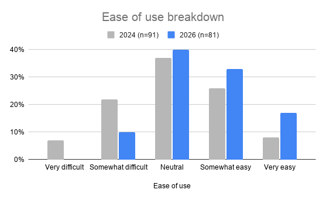
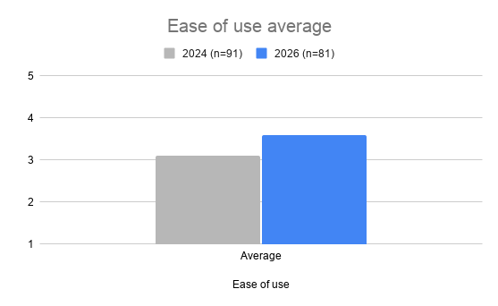
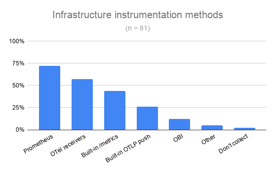
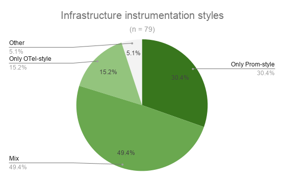
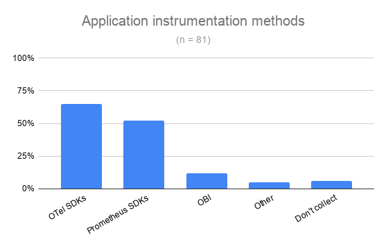
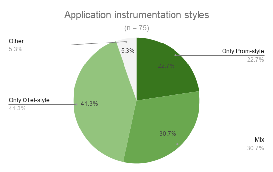
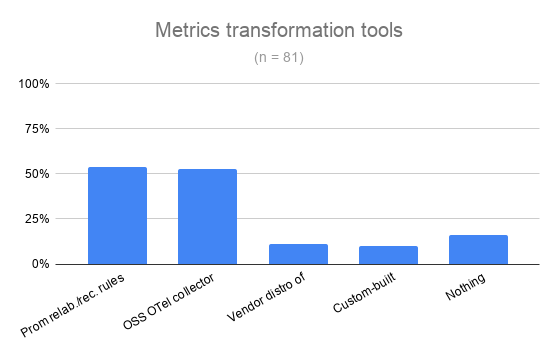
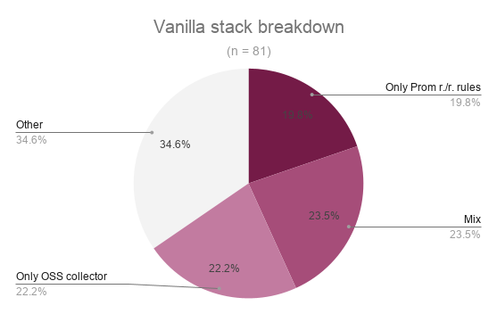

私たちは OpenTelemetry と Prometheus のユーザーを対象に、メトリクスの収集、処理、保存の方法を尋ねるサーベイを実施しました。
目標は、憶測ではなく実際の利用データに基づいて、エコシステムがどこまで進んだか、そして相互運用性にまだ摩擦が残っているかを理解することでした。

## 主なポイント {#key-takeaways}

1. [2024年のサーベイ](/blog/2024/prometheus-compatibility-survey/)以降、相互運用性は測定可能な改善を遂げました。
   使いやすさの平均評価は3.1から3.6に上昇しました。
   これは回答者の2人に1人がカテゴリを丸ごと1段階上に評価した場合に相当し、両者を一緒に使うのが難しいと感じた回答者の割合は29%から10%に減少しました。
2. インフラストラクチャの計装では、Prometheus エクスポーターが最も利用されている方法（72%）であり、OTel レシーバーが僅差で続いています（57%）。
   回答者のほぼ半数は、一方からもう一方に移行するのではなく、両方を同時に使用しています。
3. アプリケーションの計装では、OTel SDK が最も利用されている方法で65%、Prometheus SDK が52%であり、41%の回答者は OTel スタイルのアプリケーション計装のみを使用しています。
4. Prometheus リラベリングルール（54%）とオープンソースの OTel Collector（53%）が最も一般的な2つの処理ステップであり、回答者の65%はパイプライン内にベンダーの変換やカスタムビルドの Collector を含まない、一方または両方の「バニラスタック」を使用しています。

## 人口統計 {#demographics}

回答した186人のうち、81人が Prometheus 隣接バックエンド上のアクティブな OpenTelemetry メトリクスユーザーとしてスクリーニングを通過しました。
また、エンドユーザーに焦点を当てるため、オブザーバビリティベンダーの従業員を除外しました。
分析対象サンプルの特徴は以下のとおりです。

- 回答者全員がアクティブな OpenTelemetry ユーザーです。
- 回答者全員が何らかの Prometheus 系ツールを使用しています。
  Prometheus そのもの（46%）、Thanos、Cortex、Grafana Mimir などのオープンソースの Prometheus 互換バックエンド（42%）、または PromQL 互換のベンダー製品（12%）です。
- 回答者のオブザーバビリティ成熟度は高いです。
  48%は自組織が「確立されたオブザーバビリティプラクティスを持っている」（エキスパート）と回答し、41%は「オブザーバビリティプラクティスを構築中」（中級）であり、初心者と自認しているのはわずか11%でした。
- 組織規模は大きい方に偏っています。
  42%が従業員1,000人以上、31%が100〜999人、15%が50〜99人、12%が50人未満と回答しています。

## 使いやすさの経時変化 {#ease-of-use-change-over-time}

**OpenTelemetry と Prometheus を一緒に使うのはどの程度簡単ですか、あるいは難しいですか？**

今年は、2024年の同様のサーベイと同じ質問を行い、エンドユーザーが相互運用性に進歩を感じているかを確認しました。

平均評価は0.5ポイント上昇し、3.1から3.6になりました。
これは回答者の2人に1人がカテゴリを丸ごと1段階上に移動した場合に相当します。
最も明確な変化はスケールの「難しい」側にあります。
両者を一緒に使うのが難しいと感じた回答者の割合は、2024年の水準のおよそ3分の1にまで低下しました。
また、今年は「非常に難しい」を選んだ人はいませんでした。

2年間の相互運用性に関する取り組みが成果を上げています。
同時に、最も多い回答が「どちらでもない」に位置しているため、この領域ではまだ多くの作業が必要です。

  
  

_**Note**: 2024年のサーベイでは回答者がオブザーバビリティベンダーに勤務しているかを質問していなかったため、母集団が厳密に同一ではありません。
ただし、2026年のサンプルにベンダー従業員を戻しても（n = 108）、使いやすさの評価にはほとんど影響しません（0%、10%、40%、33%、17% → 0%、10%、41%、33%、16%）。
今年の結果の一貫性を保つため、ベンダー従業員を除外した形式を維持することにしました。_

## インフラストラクチャメトリクス {#infrastructure-metrics}

**インフラストラクチャメトリクスの収集をどのように計装していますか？**

Prometheus エクスポーターはインフラストラクチャメトリクスで最も一般的な計装方法ですが、OTel レシーバーが僅差で続いています。
ビルトインの `/metrics` エンドポイント、ビルトインの OTLP プッシュ、OpenTelemetry eBPF 計装（OBI）がそれに続きます。

これらの方法がどう組み合わされているかを見ると、状況は明らかにハイブリッドであり、どちらか一方ではありません。
回答者のほぼ半数は、完全な移行を行うのではなく、インフラストラクチャメトリクスに対して Prometheus と OTel の計装スタイルを同時に併用しています。
単一の計装スタイルを使用している回答者のうちでは、Prometheus のみのスタイルが OTel のみのスタイルの2倍の人気があります。

  
  

_**Note**: 計装スタイルは、回答者が一方のプロジェクトにのみネイティブな方法を使用しているか、両方を組み合わせているかを表します。
OTel スタイルには、OTel レシーバー、ビルトインの OTLP プッシュ、または OpenTelemetry eBPF 計装（OBI）の使用が含まれます。
Prometheus スタイルには、Prometheus エクスポーターまたはビルトインの `/metrics` エンドポイント（エクスポーターなし）が含まれます。
4件の「その他」の回答は自由記述です。
Zabbix、Heorku Telemetry（おそらく「Heroku Telemetry」）、textfile collector、Telegraf です。
4人の回答者全員が自由記述に加えて Prometheus/OTel の実際の方法も選択していましたが、上記のスタイルチャートでは、自由記述は他の選択肢に関係なく回答者を「その他」に分類します。_

_**進行中の作業**: Prometheus と OTel のコミュニティは、Prometheus エクスポーターを OTel Collector ディストリビューションとして実行できるようにする作業を進めています。
議論はまだ継続中です。
ディスカッションは[こちらのイシュー](https://github.com/open-telemetry/opentelemetry-collector-releases/issues/1618)でオープンされています。_

## アプリケーションメトリクス {#application-metrics}

**アプリケーションメトリクスの収集をどのように計装していますか？**

アプリケーション計装では選好が逆転します。
OTel SDK がトップに立ち、Prometheus SDK がその後に続きます。
OBI はインフラストラクチャ計装とほぼ同じシェアを占めています。

計装スタイルも変化しています。
参加者の最大のシェア（41%）が OTel スタイルの計装のみを使用しており、Prometheus スタイルのみの約2倍です。
スタイルを混合しているのは3分の1未満です。

  
  

<!-- prettier-ignore-start -->
<!-- Keeps the respondent's original "OTEl" spelling in the quote below. -->

_**Note**: アプリケーション計装では、OTel スタイルには OTel SDK または OpenTelemetry eBPF 計装（OBI）の使用が含まれます。
Prometheus スタイルには Prometheus SDK が含まれます。
ここでも「その他」に分類した4件の自由記述があります。
already built exporters、Micrometer、textfile collector、jvm-exporter です。
4件中3件は Prometheus/OTel の実際の方法も選択しています。
1人の回答者の元の自由記述「Self instrumentation」と「manual instrumentation for OTEl」は、OTel SDK に再分類しました。_

<!-- prettier-ignore-end -->

## 変換 {#transformation}

**メトリクスをストレージに送信する前に、処理や変換に何を使用していますか？**

Prometheus リラベリングルールとオープンソースの OTel Collector が最も一般的な2つの処理ステップであり、どちらも明確なリードはありません。

ほとんどの回答者はバニラスタックを使用しています。
Prometheus リラベリングルールのみ、またはプレーンな OTel Collector のみ、あるいはその両方であり、パイプラインにベンダーディストリビューションやカスタムビルドの Collector は含まれていません。
3つのバニラパターンはほぼ同等の割合です。

  
  

_**Note**: 「その他」は、変換をまったく行わない回答者（15%、n=12）と、ベンダーディストリビューションまたはカスタムビルドの Collector を使用している回答者（20%、n=16）を合算しています。_

## 実務者が改善を望んでいること {#what-practitioners-want-improved}

**OpenTelemetry と Prometheus をよりうまく連携させるために、何を改善してほしいですか？**

改善提案として19件の自由回答を受け取りました。
このデータから3つのテーマが浮かび上がりました。
Prometheus と OTel のデータモデル（属性/ラベル）の統一、リソース属性とメタデータの取り扱いの改善、そして命名とフォーマットの摩擦です。
個別の要望もいくつかありました。
Prometheus のメンテナーである [György "Krajo" Krajcsovits](https://github.com/krajorama) と [Arthur Sens](https://github.com/ArthurSens) が回答を精査し、以下の各ポイントに対応しました。

- Prometheus と OTel のデータモデル（属性/ラベル）の統一
  - これは私たちも認識している妥当な要望です。
    10月の Prometheus Dev サミットで議論の議題として提起します。
- リソース属性とメタデータのギャップ
  - これは[ネイティブメタデータ設計ドキュメント](https://docs.google.com/document/d/1yYnyD7oJDvJhzFaigdniq6y302Mvp9gDcJUeAj3pJ0s/edit?tab=t.0#heading=h.5prvoamow70t)で対処される予定です。
    待つ必要があるのは、OTel Entities 仕様の完成です。
- 命名とフォーマットの摩擦
  - 関連するものがすでにいくつか存在しています。
    [OpenMetrics 2.0 エクスポジションフォーマット](https://prometheus.io/docs/specs/om/open_metrics_spec_2_0/)により、OTel スタイルの名前をコード内で直接使用できます。
    PromQL はすでに UTF-8 メトリクス名をサポートしており、Prometheus の OTLP レシーバーには[設定可能な変換ストラテジー](https://prometheus.io/docs/prometheus/latest/configuration/configuration/#configuration-file)があります。
    部品は揃っていますが、まだデフォルトにはなっていません。
    この点に取り組む必要があります。
- Collector での Prometheus ネイティブレコーディングルールの使用
  - スクレイプ時のレコーディングルールに関する[Prometheus のプロポーザル](https://github.com/prometheus/proposals/pull/67)と[概念実証 PR](https://github.com/prometheus/prometheus/pull/10529)がオープンされています。
    これは現在のレコーディングルールのように完全な TSDB を必要としません。
    OpenTelemetry Collector の Prometheus Receiver は Prometheus のコードを Go ライブラリとして使用しているため、このプロポーザルは Collector にも恩恵をもたらします。
- MCP やエージェント AI ワークフローの有効化
  - Prometheus は [Prometheus MCP](https://github.com/prometheus/prometheus-mcp) プロジェクトリポジトリを GitHub org にオンボードしたばかりです。
    これにより Prometheus の MCP ワークフローが可能になるはずです。
    Prometheus コミュニティは、ユーザーがこれを使い始めてフィードバックを寄せてくれることを望んでいます。
    また、[ネイティブメタデータ設計ドキュメント](https://docs.google.com/document/d/1yYnyD7oJDvJhzFaigdniq6y302Mvp9gDcJUeAj3pJ0s/edit?tab=t.0#heading=h.5prvoamow70t)では、Prometheus でエージェント AI ワークフローをさらに改善する計画について説明しています。

## 興味深い観察 {#interesting-observations}

### 中規模組織が OTel ネイティブツールの導入で最も進んでいる可能性がある {#mid-size-organizations-may-be-furthest-into-otel-native-tooling}

今回のデータでは、従業員100〜999人の組織がアプリケーションメトリクスにおける OTel SDK の採用率およびインフラストラクチャメトリクスにおける OTel レシーバーの採用率が最も高くなっています。
eBPF ベースの計装（OBI）は同じパターンに従わず、1,000人以上の組織がそれ以下のすべてのバンドと異なる傾向を示しています。

組織規模別の採用率:

| 組織規模             | OTel SDK (アプリケーション) | OTel レシーバー (インフラストラクチャ) | eBPF / OBI (インフラストラクチャ) |
| -------------------- | ------------------------------ | ----------------------------------------- | ------------------------------------ |
| 1〜49人 (n = 10)     | 40%                            | 20%                                       | 20%                                  |
| 50〜99人 (n = 12)    | 58%                            | 58%                                       | 17%                                  |
| 100〜999人 (n = 25)  | 84%                            | 76%                                       | 20%                                  |
| 1,000人以上 (n = 34) | 62%                            | 53%                                       | 3%                                   |

私たちの仮説は、中規模組織（専任のプラットフォームチームを持てる規模だが、複数年の移行計画なしで動ける規模）が、より新しい OTel ネイティブツールの導入において最も進んでいる可能性があるというものです。

_**Note**: これは興味深い観察と仮説であり、確認された結果ではありません。
各バンド10〜34人の回答者では、このサイズのサーベイで確認するにはどの差も十分に大きくありません。_

### チームタイプがバックエンドの選択と相関する {#team-type-tracks-backend-choice}

Platform Engineering チームと SRE チームは OSS の Prometheus 互換バックエンド（Thanos、Cortex、Mimir）を強く好む傾向がある一方、Dev チームは逆にプレーンな Prometheus を好む傾向があります。

ここでの分岐点は好みではなく運用上の責任と考えられます。
組織全体のメトリクスを運用するチームは最終的に単一の Prometheus デプロイメントの限界を超えますが、自分たちのサービスのみを計装するチームは通常そうなりません。

チームタイプ別のバックエンド選択 — OSS Prometheus 互換 (n = 30)、Prometheus (n = 35)、PromQL 互換ベンダー (n = 8):

| チームタイプ         | OSS Prometheus 互換 | Prometheus | PromQL 互換ベンダー |
| -------------------- | ------------------- | ---------- | ------------------- |
| Dev                  | 24%                 | 71%        | 6%                  |
| DevOps               | 23%                 | 62%        | 15%                 |
| Observability        | 29%                 | 41%        | 29%                 |
| Platform Engineering | 69%                 | 31%        | 0%                  |
| SRE                  | 69%                 | 31%        | 0%                  |

_**Note**: Sysadmin (n = 6) と Operations (n = 2) の回答者はこのテーブルから除外しています。
どちらのグループも解釈するには小さすぎるため、81人の回答者のうち n = 73 が残っています。
前述の内訳と同様に、ここでのバンドごとの数値（8〜35）は確定的な結論を導くには小さすぎます。_

## 参加しよう {#get-involved}

相互運用性は2年前と比較して測定可能な改善を遂げていますが、自由回答は具体的なギャップ（データモデルの違い、リソース属性とメタデータのギャップ、命名とフォーマットの摩擦）を指し示しています。
OpenTelemetry 側と Prometheus 側の両方で、まだ多くの作業が必要です。

誰でも貢献を歓迎します。
議論は CNCF Slack の [#otel-prometheus](https://cloud-native.slack.com/archives/C01LSCJBXDZ) チャンネルで行われています。
