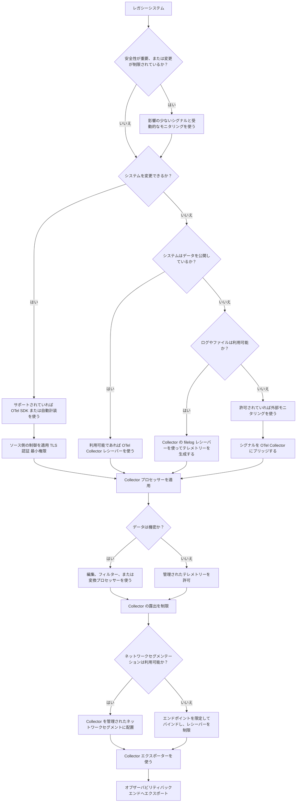

製造業をはじめとするレガシー環境において、組織がモダンなオブザーバビリティのアプローチを模索する中で、OpenTelemetry は注目を集めつつあります。
しかし、こうしたプラクティスを従来型のシステムに適用すると、これまでとは異なるセキュリティ上の課題が生じます。
レガシーインフラの制約は、セキュリティ制御をどこにどのように適用すべきかを根本的に変えてしまいます。

レガシー環境や産業環境には、次のような特徴がよくみられます。

- 変更や計装が不可能なシステム
- 長い機器のライフサイクルと限られたパッチ適用の機会
- フラットなネットワーク、もしくはセグメンテーションが弱いネットワーク
- 一般的な [PII](https://en.wikipedia.org/wiki/Personal_data) ではない、機密性の高い運用データ

本記事では、こうした環境で OpenTelemetry を保護する際に何が異なるのか、そしてそれに応じてアプローチをどのように適応させればよいのかに焦点を当てます。

## なぜレガシー環境は異なるのか {#why-legacy-environments-are-different}

クラウドネイティブシステムにおけるセキュリティのガイダンスは、次のような前提に立っています。

- サービスは計装可能である
- 暗号化と認証はどこでも強制できる
- システムは定期的にパッチを適用できる

レガシー環境や産業環境では、これらの前提が成り立たないことがよくあります。

その結果、セキュリティはどこにでも理想的な制御を適用することではなくなります。
**テレメトリーパイプラインの正しい場所に制御を配置し**、可視性とリスクのバランスを取ることが重要になります。

## レガシーシステム特有のセキュリティ課題 {#security-challenges-unique-to-legacy-systems}

### システムを変更できない {#systems-cannot-be-modified}

多くの産業システムは、エージェントを実行できず、モダンなライブラリをサポートできず、まったく変更できません。
これは次のことを意味します。

- ソースにおけるモダンな TLS や認証のサポートが限定的、あるいは一貫していない
- SDK を用いた直接的な計装ができない
- 中継機能（Collector、ブリッジ、ログパイプライン）に依存する

ソースシステムがモダンな制御を強制できない場合、セキュリティの負担はより多く Collector、中継システム、ネットワーク境界へと移ります。

### 脆弱な、あるいは存在しないネットワークセグメンテーション {#weak-or-non-existent-network-segmentation}

レガシー環境のネットワークアーキテクチャは、モダンなオブザーバビリティを念頭に設計されていないことがよくあります。
セグメンテーションが最小限のフラットあるいは共有ネットワーク上で動作するものもあれば、レガシーなプロトコルが混在する深くネストされたネットワークに依存するものもあります。
いずれの場合も、テレメトリー収集を導入することで次のような事態が起こり得ます。

- 意図しないネットワークセグメントに対して新たな受信エンドポイントが露出する
- Collector やブリッジへの意図しない横方向アクセスが許容される
- これまで分離されていたゾーンの間に予期せぬ経路が生まれる

このような環境では、Collector の配置は Collector の設定と同じくらい重要です。
ネットワーク境界、ファイアウォール、プロトコルゲートウェイに対して Collector がどこに位置するのかを慎重に評価してください。

### 限られたパッチ適用と長いライフサイクル {#limited-patching-and-long-lifecycles}

産業システムはアップグレードなしで何年も稼働することがあります。
Collector の配置方法によって、パッチ適用の戦略は決まります。
一般的なモデルは 2 つあります。

**Collector を外部ブリッジとして配置する（推奨）:**

Collector はレガシーシステムの境界の外側（別のホスト、VM、コンテナ上）で動作し、産業環境とオブザーバビリティバックエンドの間のブリッジとして機能します。
このモデルでは、次のような利点があります。

- Collector はレガシーシステムとは独立してパッチおよび更新できる
- サプライチェーンのセキュリティ問題に即座に対処できる
- レガシーシステムには手を加えず、安定した状態を保てる

**Collector をレガシー環境内に組み込む:**

Collector はレガシーシステムと同じ変更管理および保守期間に従って、同じ場所もしくはその内部で動作します。
このモデルでは、次のような点に注意が必要です。

- 即時のパッチ適用は不可能な場合がある
- 補償制御が重要になる
- 古いバージョンの Collector を稼働させる計画を立て、CVE を監視して、公開からパッチ適用までの間の脆弱性にさらされるリスクを評価する

可能であればブリッジモデルを優先してください。
ブリッジモデルは関心の分離を明確にし、ソースシステムをモダンに保てない場合でもテレメトリーパイプラインをモダンなライフサイクルで保守できるようにします。

ブリッジモデルが実現できない場合は、焦点をパッチ適用から **封じ込めと緩和** に切り替えます。

- 影響を受けるコンポーネントを広範なネットワークから隔離する
- Collector に対するネットワークアクセス（および Collector からのアクセス）を制限する
- 不要なテレメトリー経路やコンポーネントを無効化する
- CVE 情報を監視し、リスクエクスポージャーを継続的に評価する

### 機密データの形は環境によって異なる {#sensitive-data-looks-different-in-these-environments}

製造環境では、機密データには次のようなものが含まれることがよくあります。

- 製造プロセスや機械の構成
- 資産識別子や運用状態
- プラントレベルのパフォーマンスデータ

テレメトリーパイプラインは、こうした情報が管理された境界の外に露出しないように設計する必要があります。

## 制約下でセキュアなテレメトリーパイプラインを設計する {#designing-a-secure-telemetry-pipeline-under-constraints}

ソースシステムを直接保護できない場合、テレメトリーパイプラインが制御点となります。

主要な設計原則は次のとおりです。

- **取り込みポイントを制約する**: Collector のエンドポイントを広く公開しないようにします。
  特定のインターフェイスにバインドし、ネットワークアクセスを制限してください。

- **ソースの信頼レベルでデータを分類する**: テレメトリーをどのように取り込んだかで区別してください。
  たとえば、認証されていないチャネル（UDP マルチキャストなど）で受信したデータは、認証されたチャネル（mTLS など）で受信したデータとは異なる扱いにするべきです。
  リソース属性やメタデータを使ってテレメトリーに取り込みコンテキストでタグ付けし、ダウンストリームのシステムが適切な信頼ポリシーやアクセスポリシーを適用できるようにします。

- **ブリッジコンポーネントを隔離する**: MQTT ブリッジ、ログコレクター、プロトコルアダプターは、管理されたセグメントで動作させ、直接アクセスできないようにします。

- **公開するコンポーネントを最小化する**: レガシー環境では、システムが進化するにつれて不要なコンポーネントが蓄積されることがあります。
  Collector の設定を定期的に監査し、現在のオブザーバビリティ目標に必要なレシーバーとエクスポーターのみが有効になっている状態を保ち、パッチや更新の頻度が低い環境での攻撃対象領域を減らしてください。

- **内部処理を優先する**: テレメトリーを信頼された環境内で収集・変換してから外部にエクスポートします。
  プロセッサーを使って Collector レベルでデータをフィルタリング、機微なデータの削除、再整形し、ネットワーク境界を越えるデータの量と機密性を最小化します。

目標は、OpenTelemetry Collector を単なるデータルーターではなく、**管理された境界** として扱うことです。
このアプローチは、アクセスとデータフローがネットワーク上の場所を根拠に安全とみなされるのではなく、明示的に制限される、ゼロトラスト型の境界制御の考え方と整合します。

## テレメトリーを保護するための実用的な意思決定モデル {#a-pragmatic-decision-model-for-securing-telemetry}

次のモデルは、レガシー環境や産業環境におけるシステム制約に基づいて、テレメトリーを選択しセキュリティ制御を適用する方法を示しています。



## 機密性の高い運用データの取り扱い {#handling-sensitive-operational-data}

OpenTelemetry のツールは、ビジネス上の機密性をそれ自体で判断することはできません。
その責任は実装者にあります。
重要な原則は次の 2 つです。

### データの最小化 {#data-minimization}

明確な目的に資するテレメトリーのみを収集します。
制約のある環境では、次の点を意識してください。

- 必要でない限りペイロード全体を取得しない
- 生データよりも集約されたシグナルを優先する
- 収集する属性を定期的に見直す

### スクラビングと変換 {#scrubbing-and-transformation}

たとえば、Collector のディストリビューションとバージョンに応じて、transform プロセッサーや redaction プロセッサーを使って識別子をハッシュ化したり、機密フィールドを削除したり、許可リストを強制したりできます。

```yaml
processors:
  transform/hash_user:
    trace_statements:
      - context: span
        statements:
          - set(attributes["user.hash"], SHA256(attributes["user.id"]))
          - delete_key(attributes, "user.id")
```

あるいは、厳格な許可リストを強制します。

```yaml
processors:
  redaction/strict:
    allow_all_keys: false
    allowed_keys:
      - id
      - name
      - status
```

レガシー環境では、**Collector での処理が、データを制御できる唯一の場所であることが少なくありません**。

## 攻撃対象領域の削減 {#reducing-attack-surface}

すべてのテレメトリーコンポーネントは、潜在的なリスクをもたらします。
これは、システムが自身を守れない場面では特に重要です。
次の点に注力してください。

- 有効なレシーバーとエクスポーターの数を減らす
- 不要な外部公開を避ける
- Collector を最小限の権限で動作させる
- 受信トラフィックを既知の信頼できるソースに限定する

このような環境では、**テレメトリーインフラと公開エンドポイントを最小化することで、攻撃対象領域を削減できます**。

## トレードオフとしてのセキュリティ {#security-as-a-trade-off}

モダンなシステムでは、目標はしばしば完全なオブザーバビリティです。
レガシー環境では、その目標を次のような要素とバランスさせる必要があります。

- システムの安定性
- 安全上の制約
- ソースシステムに対する制御の制限

これは、異なるマインドセットを必要とします。
_セキュリティとは、理想的なオブザーバビリティを達成することではありません。
それは、有用な可視性を得るためのもっとも安全な方法を選択することです。_

## おわりに {#conclusion}

オペレーショナルテクノロジーや産業環境では、テレメトリーの変更はサイバーセキュリティの目標だけでなく、安全性、信頼性、変更管理の要件に照らしても評価される必要があります。

OpenTelemetry はレガシー環境や産業環境に強力なオブザーバビリティをもたらせますが、その一方で、セキュリティ制御をどこにどのように適用すべきかは変わります。
ソースレベルでの保護に頼るのではなく、チームは次のことを行わなければなりません。

- テレメトリーパイプライン自体を保護する
- データの露出を慎重に管理する
- 制約のある不完全なシステムを前提に設計する

このアプローチによって、組織は従来型の環境の現実を尊重しつつ、意味のある可視性を得ることができます。

## さらに読む / 参考資料 {#further-reading-and-resources}

- [OpenTelemetry セキュリティドキュメント](/docs/security/)
- [OpenTelemetry CVE 一覧](/docs/security/cve/)
- [Collector 設定のベストプラクティス](/docs/security/config-best-practices/)
- [機密データの取り扱い](/docs/security/handling-sensitive-data/)
- [コミュニティのインシデント対応ガイドライン](/docs/security/security-response/)
