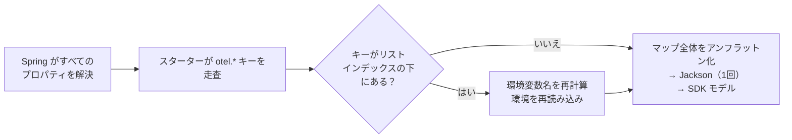
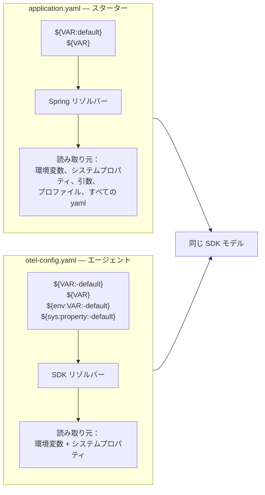
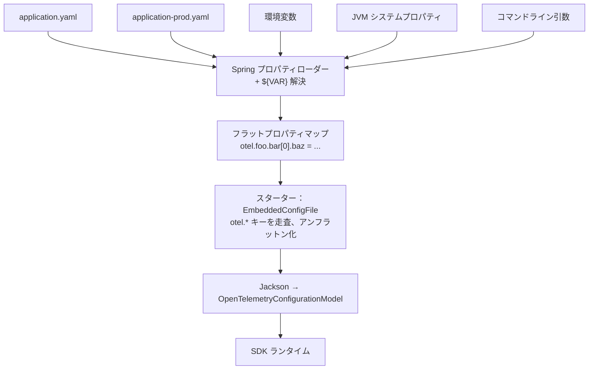

OpenTelemetry の
[Spring Boot スターター](/docs/zero-code/java/spring-boot-starter/)は、バージョン 2.26.0 から宣言的設定をサポートするようになりました。
これは [Java エージェントが 2025 年後半に導入した](/blog/2025/declarative-config/)のと同じ YAML スキーマを `application.yaml` の中に埋め込むものです。
この投稿では、1 つの環境変数 `OTEL_SERVICE_NAME=petclinic` がこの新しい仕組みの中で何をするのかを追跡し、どこに継ぎ目があるのかを明らかにします。

> [!TIP] お急ぎですか？
>
> [Spring Boot スターターの宣言的設定ドキュメント](/docs/zero-code/java/spring-boot-starter/declarative-configuration/)に直接ジャンプするか、
> `application.properties` を[インタラクティブコンバーター](/docs/zero-code/java/spring-boot-starter/declarative-configuration/#convert-your-existing-configuration)に貼り付けるか、
> [Ecosystem Explorer](https://explorer.opentelemetry.io/java-agent/configuration/builder) で Spring Boot スターターのターゲットを選択して SDK のセットアップを選んでください。
> ストーリーはコーヒーを片手にどうぞ。

長年にわたり、環境変数（とその JVM `-D` 版）は OpenTelemetry SDK を設定する唯一の方法でした。
すべてのエクスポーター、すべてのサンプラー、すべてのキャプチャするヘッダーが、フラットな `OTEL_*` 変数のリストとして表現されていました。

OpenTelemetry Spring Boot スターターのバージョン 2.26.0 以降、このリストには新しい兄弟ができました。
SDK の[宣言的設定スキーマ](/docs/languages/sdk-configuration/declarative-configuration/)は、テレメトリーパイプライン全体（すべてのプロセッサー、すべてのエクスポーター、すべてのネストされたオプション）を SDK が実際に動作するのと同じ形で記述できる YAML ツリーです。

環境変数だけでは表現できないことに対して、Spring スターターのユーザーは `@Bean` を書く必要がありました。
Java エージェントのユーザーは、完全な[エクステンション](/docs/zero-code/java/agent/extensions/)を書き、エージェントと一緒に配布する別の jar にパッケージする必要がありましたが、これは負担が大きいことがありました。

これらの新しい変更により、スキーマは `application.yaml` の中の 1 つの `otel:` キーの下に移動します。
環境変数は引き続き機能しますが、その役割はより限定的になります。
`OTEL_SERVICE_NAME` はリソース属性として反映されますが、これはサービス名ディテクターが起動時にそれを読み取るためです。
また、YAML に書いた `${VAR:default}` プレースホルダーは名前を指定して環境変数を取り込みます。
それ以外では、YAML が信頼できる情報源です。

## YAML ファイルの中の YAML ファイル {#a-yaml-file-inside-your-yaml-file}

```yaml
otel:
  file_format: '1.0'

  resource:
    attributes:
      - name: service.name
        value: petclinic

  tracer_provider:
    processors:
      - batch:
          exporter:
            otlp_http:
              endpoint: ${OTEL_EXPORTER_OTLP_TRACES_ENDPOINT:http://localhost:4318/v1/traces}
```

`otel:` の下のブロックは、OpenTelemetry SDK スキーマ（プロセッサーのリスト、それぞれがエクスポーターを保持し、それぞれが設定を保持する）を Spring の `application.yaml` の中に埋め込んだものです。
`otel.file_format` の存在がスイッチです。
その下にあるすべてが SDK スキーマに対してパースされます。
Spring はそれが何を意味するかを知る必要がありません。

## 環境変数だけでは越えられなかった壁 {#the-wall-env-vars-alone-could-not-climb}

環境変数は組み込みの選択肢の固定リストをカバーします。
`OTEL_TRACES_SAMPLER` による[固定のサンプラーセット](/docs/languages/sdk-configuration/general/#otel_traces_sampler)、`OTEL_EXPORTER_OTLP_*` による標準の OTLP エクスポーター、そして通常のシグナル切り替えフラグです。
そのカタログ外のもの（カスタムのルールベースサンプラー、デバッグパイプライン上の 2 番目の OTLP エクスポーター、バゲージプロセッサー、SDK が公開するネストされたオプション）は環境変数モデルの対象外でした。
宣言的設定がツリーの残りの部分を解放します。

スターターのドキュメントページには、ほとんどのチームが初日に必要とする小さな例があります。
[アクチュエーターエンドポイントをトレースから除外する](/docs/zero-code/java/spring-boot-starter/programmatic-configuration/#exclude-actuator-endpoints-from-tracing)方法です。
以前は、これは `@Configuration` クラスで処理されていました。

```java
@Configuration
public class FilterPaths {
  @Bean
  public AutoConfigurationCustomizerProvider otelCustomizer() {
    return p ->
        p.addSamplerCustomizer(
            (fallback, config) ->
                RuleBasedRoutingSampler.builder(SpanKind.SERVER, fallback)
                    .drop(UrlAttributes.URL_PATH, "^/actuator")
                    .build());
  }
}
```

現在は `application.yaml` の YAML ブロックです。

```yaml
otel:
  tracer_provider:
    sampler:
      parent_based:
        root:
          rule_based_routing:
            fallback_sampler:
              always_on:
            span_kind: SERVER
            rules:
              - action: DROP
                attribute: url.path
                pattern: /actuator.*
```

どちらのバージョンも同じ Java コードを実行します。
エージェントとスターターは、どちらもすでに `opentelemetry-samplers` contrib jar をバンドルしています。
変わるのは、誰がワイヤリングを書くかです。

> [!NOTE] 代替手段：組み合わせ可能なルールベースサンプラー
>
> スキーマには組み合わせ可能なルールベースサンプラー（[設定タイプリファレンス](/docs/specs/otel-config/types/)の `composite/development.rule_based` 配下）もあり、より豊富なルール文法で同じことを実現します。
> 属性パターンの include/exclude、複数条件のマッチ、スパン種別フィルター、親の状態、任意のネストされた組み合わせが利用可能です。
> 上記の例では `rule_based_routing` を使っています。
> OTel Java がこの問題に対して長くそのサンプラーを推奨してきたことと、`composite/development` パスが組み合わせ可能なスキーマの安定化まで `*/development` サフィックスを持ち続けるためです。
> SDK 設定リポジトリの実際の[使用例](https://github.com/open-telemetry/opentelemetry-configuration/blob/v1.0.0/snippets/Sampler_rule_based_kitchen_sink.yaml#L10-L53)を参照してください。

この投稿の残りの部分では、`OTEL_SERVICE_NAME` が SDK に到達するまでの 3 つのステージを追跡します。

## ステージ 1：Spring のプロパティスタックへの到着 {#stage-one-arriving-at-springs-property-stack}

Spring のプロパティローダーは、アプリケーションが参照するすべてのソース（`application.yaml`、すべてのアクティブなプロファイルのオーバーレイ、JVM の `-D` フラグ、`--key=value` コマンドライン引数、環境変数）を 1 つのアドレス可能なプロパティユニバースに積み上げます。
`OTEL_SERVICE_NAME` は `SERVER_PORT` や `SPRING_PROFILES_ACTIVE` と並んでそのスタックに存在します。
Spring はこれらのうちどれが OpenTelemetry に属するかを知りません。
それはスターターの仕事であり、処理の最後の段階で行われます。

> [!NOTE] Spring が環境変数と YAML キーを静かに揃える方法
>
> Spring はすべてのプロパティを、1 つの正規化された小文字のドット区切りの名前で公開します。
> 同じプロパティがさまざまなソースから、それぞれ異なる書き方で提供される場合があります。
>
> | ソース             | 記述方法                        |
> | ------------------ | ------------------------------- |
> | 環境変数           | `OTEL_SERVICE_NAME=petclinic`   |
> | システムプロパティ | `-Dotel.service.name=petclinic` |
> | コマンドライン     | `--otel.service.name=petclinic` |
> | `application.yaml` | `otel.service.name: petclinic`  |
>
> Spring は「小文字化し、`_` を `.` にする」などのルールで変換します。
> スターターは、ユーザーがどれを使ったかを知る必要がありません。
>
> これは Spring 固有の強みです。
> OpenTelemetry SDK 自体は環境変数を YAML パスに自動的にマッピングしません。
> これはスキーマの設計中に議論されましたが、複雑すぎるとして却下されました。
> そのため、エージェントのスタンドアロン YAML 内では、`OTEL_SERVICE_NAME` を設定してもツリー内の `service.name` に反映されることはありません。
> スターターはこれを無料で得られます。
> マッピングを行っているのは SDK ではなく Spring だからです。



_スターターは Spring が公開するすべてのプロパティを走査し、`otel.*` キーを選び出し、組み立てたマップを Jackson に渡します。
これはツリー全体に対して 1 回だけ行われ、要素ごとではありません。
ダイヤモンドはこの投稿で取り上げる継ぎ目です。
リストインデックスの下にあるキーに対する追加のステップであり、次のステージで説明します。_

## ステージ 2：Spring が見落としかけた環境変数 {#stage-two-the-env-var-spring-almost-lost}

ほとんどの `otel.*` 環境変数は軽量です。
しかし、この変数はそうではありません。

```bash
OTEL_TRACER_PROVIDER_PROCESSORS_0_BATCH_EXPORTER_OTLP_HTTP_ENDPOINT=http://collector:4318/v1/traces
```

この変数は通過しますが、それはスターターの内部 16 行の深さで名前を指定して探しにいくからです。
上の図のダイヤモンドが、それらが存在する場所です。

> [!NOTE] スターターがすべてのプロパティソースを走査する理由
>
> Spring にプロパティを名前で問い合わせれば、この値は問題なく返されるでしょう。
> Spring の relaxed バインディングは、`OTEL_..._ENDPOINT` が `otel....endpoint` の別の綴りであること（ブラケットを含めて）をずっと理解してきました。
>
> 「設定のツリーがある」場合の通常の Spring の手法は、
> [`@ConfigurationProperties`](https://docs.spring.io/spring-boot/reference/features/external-config.html#features.external-config.typesafe-configuration-properties)
> クラスでしょう。
> 設定ツリーの形をした Java POJO を宣言し、プロパティプレフィックスでアノテーションを付けると、Spring がすべてのソースをバインドしてくれます。
> OTel SDK スキーマは、多くのポリモーフィックな層にまたがる数百のプロパティ（すべてのエクスポーター種別、すべてのサンプラー種別、すべてのプロセッサー種別）を持ち、まだ進化中の YAML スキーマから[生成](/docs/languages/sdk-configuration/declarative-configuration/)されます。
> これをミラーリングする手書きの POJO ツリーは、第 2 の信頼できる情報源となり、常に第 1 のものに遅れを取ります。
> 理想的な解決策は、スキーマ（SDK の DC スキーマと、まだ存在しない `distribution.*` および `instrumentation/development.*` サブツリーのスキーマ）から POJO を*生成*することです。
> 同じ生成された記述は、Spring が IDE 補完に使用する JSON メタデータも駆動できます。
> Java 計装チームは、これを将来の改善として [opentelemetry-java-instrumentation#14083](https://github.com/open-telemetry/opentelemetry-java-instrumentation/issues/14083) で追跡しています。
>
> そのため、スターターは Spring ではめったに見られないことを行います。
> すべての `PropertySource` を直接走査し、`otel.` で始まるキーを収集します。
> この走査では、YAML ソースの名前はブラケット付き（`otel.tracer_provider.processors[0]...`）で、環境変数ソースの名前はアンダースコア付き（`OTEL_TRACER_..._ENDPOINT`）で見えます。
> Spring のリネームはプロパティを*解決*するときにのみ行われ、プロパティを*一覧*するときには行われません。
> その後、Jackson が収集したキーを*生成された*設定モデルにバインドし、このモデルは常にライブスキーマと一致します。
>
> [`EmbeddedConfigFile`](https://github.com/open-telemetry/opentelemetry-java-instrumentation/blob/v2.29.0/instrumentation/spring/spring-boot-autoconfigure/src/main/java/io/opentelemetry/instrumentation/spring/autoconfigure/EmbeddedConfigFile.java#L66-L82)
> の 16 行が、2 つの命名規約の間のギャップを埋めます。
> `[N]` ブラケットを含むすべての `otel.*` キーに対して、スターターはプロパティ名から環境変数名を再構築し、Spring に直接問い合わせます。

## ステージ 3：2 つの置換器、1 つの構文 {#stage-three-two-substituters-one-syntax}

`application.yaml` と SDK のスタンドアロン YAML の両方が `${...}` プレースホルダーを使用します。
これらはほぼ同じことを意味しますが、完全には同じではありません。
Spring は `${OTEL_EXPORTER_OTLP_TRACES_ENDPOINT:${OTEL_EXPORTER_OTLP_ENDPOINT:http://localhost:4318}}/v1/traces` のようなチェーンされたフォールバックを喜んで解決し、外側のプレースホルダーを内側に追跡します。
これにより、シグナル固有のオーバーライドを優先し、汎用的なものにフォールバックし、最終的にリテラルにたどり着くことができます。
SDK の置換器は、再帰しない単一の正規表現パスです。
同じ式が `otel-config.yaml` ではパースされません。



> [!NOTE] 同じドルブレース、2 つの置換器
>
> `application.yaml` の中では、Spring は `${VAR:default}`（コロン 1 つ）を、自身が知るすべてのプロパティソース（環境変数、システムプロパティ、プロファイル、コマンドライン引数、外部設定サーバー）から解決します。
> SDK のスタンドアロン YAML は `${VAR:-default}`（コロン 2 つ、ダッシュ）を使用し、プロセスの環境変数と JVM のシステムプロパティのみから解決します。
> スターターでは、SDK の置換器は実行されません。
> スターターが値を読み取る時点で、Spring がすでに処理を完了しているためです。

これが、Spring ネイティブの設定トリック（プロファイル、コマンドラインの `--key=value`、`@Value` スタイルの外部化、外部設定サーバーまで）がすべて OTel 設定に対して透過的に機能する理由でもあります。
スターターはそれらを一切実装していません。
Spring のリゾルバーがそれを行い、スターターはプロパティを読み取るだけです。

最大の実用的な帰結として、スターターでは同じ正規キーパスに名前が付けられた環境変数は、追加のワイヤリングなしに YAML のリーフを自動的にオーバーライドします。
エージェントのスタンドアロン YAML ではそれができません。
そこでは、環境変数のオーバーライドは事前に YAML に `${VAR}` プレースホルダーとして組み込んでおく必要があり、そうしなければ何も起こりません。

> [!NOTE] 例：環境変数で YAML のリーフをオーバーライドする
>
> スターターでは、YAML に他の変更を加えなくても、起動時にこれが機能します。
>
> ```bash
> OTEL_TRACER_PROVIDER_PROCESSORS_0_BATCH_EXPORTER_OTLP_HTTP_ENDPOINT=\
>   http://prod-collector:4318/v1/traces
> ```
>
> `application.yaml` でそのエンドポイントに設定されていた値が置き換えられます。
>
> エージェントでは、まず YAML に `${MY_ENDPOINT:-http://...}` と書いてから、起動時に `MY_ENDPOINT` を設定する必要があります。
> 本番環境のコンテナは、スターターの方がスムーズに着地します。

## 到達点：SDK が実際に起動する解決済みツリー {#arrival-the-resolved-tree-the-sdk-actually-boots-from}

SDK が起動する時点で、すべての `otel.*` 値は解決、relaxed 処理、正規化され、他のすべてと結合されて 1 つのフラットマップになっています。
スターターはそのフラットマップを SDK が期待するツリーにアンフラットン化し、Jackson に渡します。
Jackson は SDK が起動する `OpenTelemetryConfigurationModel` を生成します。
どの値を yaml、環境変数、プロファイルオーバーレイ、コマンドライン引数のどれが書いたかに関係なく、SDK は解決された結果だけを見ます。



_Spring がフロントドアを所有します。
SDK は生の `${VAR}`、プロファイル名、プロパティファイルを見ることはありません。
完全に解決されたツリーが、起動時に 1 回だけ渡されるだけです。_

## 「実験的」が宣言的設定を今試すべき最大の理由 {#why-experimental-is-the-best-reason-to-try-declarative-config-now}

宣言的設定は、OpenTelemetry がすべての言語で収束しつつあるスキーマです。
まだ完成していません。
Spring Boot スターターのサポートが実験的とマークされているのは、まさにスキーマのどの角を締めるべきかを知るのに十分な数の実際のアプリケーションをまだ見ていないからです。

これは警告ではありません。
招待です。
スキーマがフリーズする前の今が、宣言的設定を実際の `application.yaml` に入れて何が壊れるかを確認する、最もレバレッジの高いタイミングです。
あなたの摩擦こそが、最終的に着地するスキーマを形作るのです。

## 60 秒で始める {#getting-there-in-60-seconds}

2 つの出発点があり、どちらもすでに用意されています。

- **すでに `application.properties` をお持ちですか？**
  ドキュメントページの[インタラクティブコンバーター](/docs/zero-code/java/spring-boot-starter/declarative-configuration/#convert-your-existing-configuration)に貼り付けてください。
  YAML が出力され、`application.yaml` にそのまま入れられます。
- **新規プロジェクトですか？**
  [OpenTelemetry Ecosystem Explorer](https://explorer.opentelemetry.io/java-agent/configuration/builder) が宣言的設定の YAML をインタラクティブに生成します。
  エクスポーター、サンプラー、計装を選択して結果をコピーしてください。
  新しい Spring Boot スターターのターゲットモードが出力を `otel:` の下にラップし、適切な `distribution.spring_starter.*` キーを使用します。

## 注意事項 {#the-fine-print}

- **Spring Boot 3.5 以降では依存関係管理が必要です。**
  Spring Boot 3.5 は、スターターが必要とするものと競合する独自の OpenTelemetry バージョンピンを同梱しています。
  `dependencyManagement` で OTel 計装 BOM をインポートしてください（[ドキュメント](/docs/zero-code/java/spring-boot-starter/getting-started/#dependency-management)を参照）。
  これを省略すると、起動時に `NoClassDefFoundError: io/opentelemetry/common/ComponentLoader` が発生します。
- **Duration はミリ秒の数値です。**
  `5s` ではなく `5000` を使用してください。
- **プログラムによるカスタマイズの形が変わります。**
  `AutoConfigurationCustomizerProvider` は `DeclarativeConfigurationCustomizerProvider` に置き換えられます。
  SDK コンポーネントは `ComponentProvider` API 経由でプラグインします。
  [エージェントのエクステンション API ドキュメント](/docs/zero-code/java/agent/declarative-configuration/#extension-api)がスターターにもそのまま適用されます。

実際のアプリケーションをこの設定に移行して問題が発生した場合は、イシューを起票してください。
コードに関しては [opentelemetry-java-instrumentation](https://github.com/open-telemetry/opentelemetry-java-instrumentation/issues)、ドキュメントに関しては [opentelemetry.io](https://github.com/open-telemetry/opentelemetry.io/issues) です。
