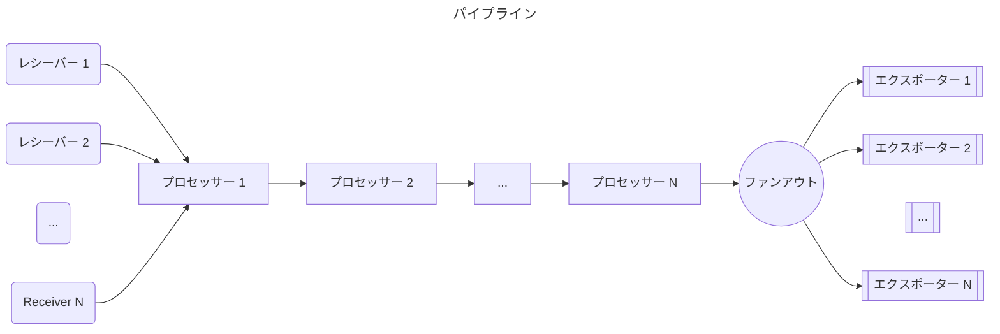
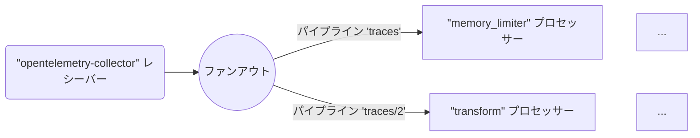
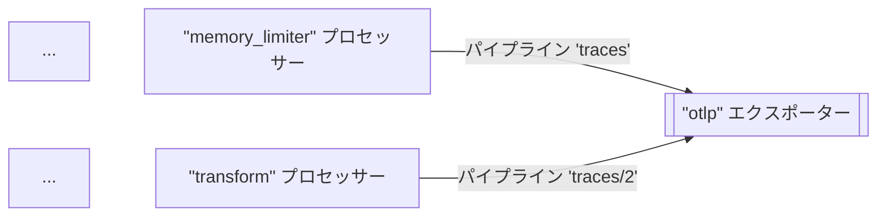
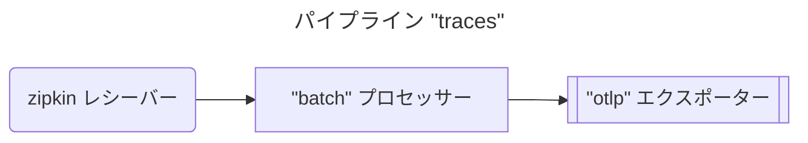
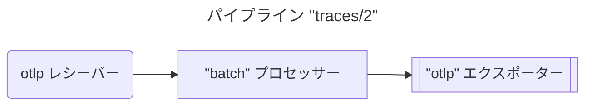
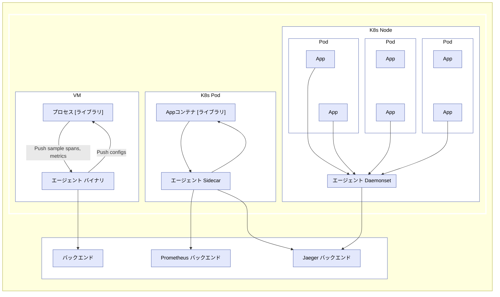
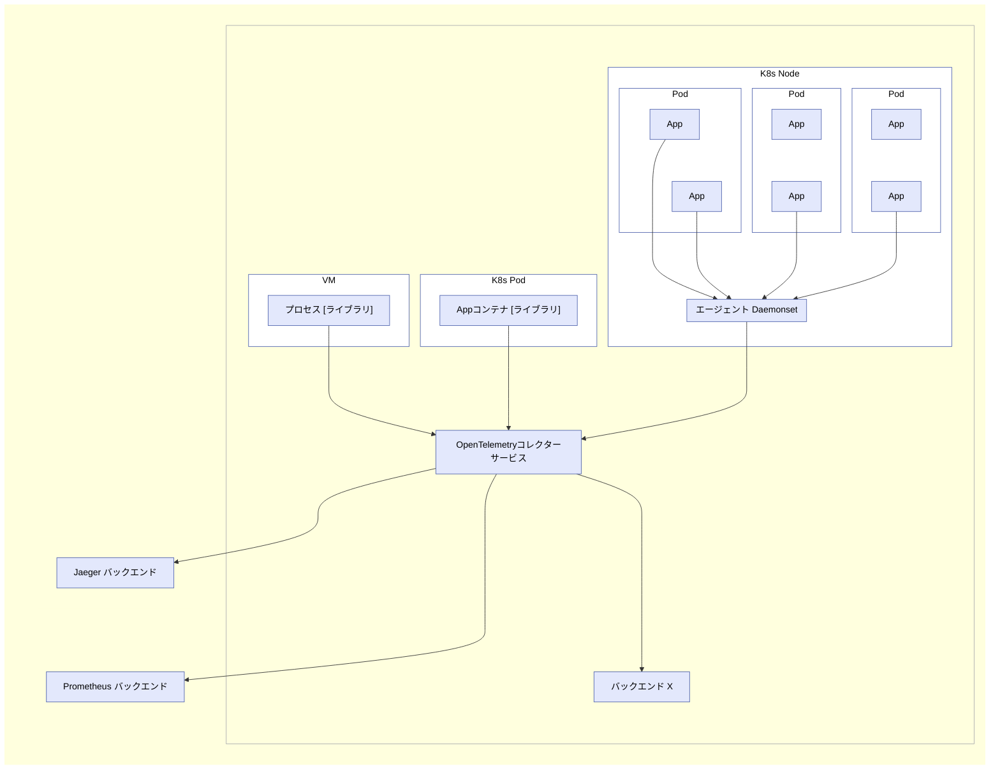

OpenTelemetryコレクターは、テレメトリーを受信、処理、および複数のターゲット（オブザーバビリティバックエンドなど）にエクスポートできる実行可能ファイルです。

コレクターは、テレメトリーデータの受信と送信のためにいくつかの一般的なオープンソースプロトコルをサポートしており、より多くのプロトコルを追加するための拡張可能なアーキテクチャを提供します。

データの受信、処理、およびエクスポートは、[パイプライン](#pipelines)を使用して行われます。
コレクターを構成して、1つ以上のパイプラインを持たせることができます。

それぞれのパイプラインには以下が含まれます。

- データを収集する[レシーバー](#receivers)のセット。
- レシーバーからデータを取得し、処理を行う一連の任意の[プロセッサー](#processors)。
- プロセッサーからデータを取得し、コレクターの外部に送信する[エクスポーター](#exporters)のセット。

同じレシーバーを複数のパイプラインに含めることができ、複数のパイプラインが同じエクスポーターを含むことができます。

## パイプライン {#pipelines}

パイプラインは、受信から処理(または変更)、そして最終的にエクスポートまで、コレクター内でデータがたどるパスを定義します。

パイプラインは、トレース、メトリクス、ログの3種類のテレメトリーデータ型を操作できます。
データ型は、その構成によって定義されるパイプラインのプロパティです。
レシーバー、プロセッサー、およびエクスポーターは、特定のデータ型をサポートしている必要があります。
サポートしていない場合、構成の読み込み時に例外 `pipeline.ErrSignalNotSupported` が報告されます。

次の図は、典型的なパイプラインを表しています。



パイプラインは1つ以上のレシーバーを持つことができます。
すべてのレシーバーからのデータは最初のプロセッサーにプッシュされ、プロセッサーはデータを処理して次のプロセッサーにプッシュします。
プロセッサーは、サンプリングやフィルタリングを行う場合、データをドロップすることもあります。
この処理は、パイプラインの最後のプロセッサーがデータをエクスポーターにプッシュするまで続きます。
各エクスポーターは、各データ要素のコピーを取得します。
最後のプロセッサーは `fanoutconsumer` を使用してデータを複数のエクスポーターに送信します。

パイプラインは、構成されたパイプライン定義に基づいて、コレクターの起動中に構築されます。

パイプライン構成は通常、次のようになります。

```yaml
service:
  pipelines: # パイプラインごとに1つずつ、複数のサブセクションを含むことができるセクション
    traces: # パイプラインタイプ
      receivers: [otlp, zipkin]
      processors: [memory_limiter, batch]
      exporters: [otlp, zipkin]
```

前述の例では、2つのレシーバー、2つのプロセッサー、および2つのエクスポーターを備えたトレースタイプのテレメトリーデータのパイプラインを定義しています。

### レシーバー {#receivers}

レシーバーは通常、ネットワークポートをリッスンし、テレメトリーデータを受信します。
また、スクレイパーのように、能動的にデータを取得することもできます。
通常、1つのレシーバーは受信したデータを1つのパイプラインに送信するように構成されます。
ただし、同じレシーバーが受信した同じデータを複数のパイプラインに送信するように構成することも可能です。
これは複数のパイプラインの `receivers` キーに同じレシーバーをリストすることで実現できます。

```yaml
receivers:
  otlp:
    protocols:
      grpc:
        endpoint: localhost:4317

service:
  pipelines:
    traces: # "traces"タイプのパイプライン
      receivers: [otlp]
      processors: [memory_limiter, batch]
      exporters: [otlp]
    traces/2: # "traces"タイプの別のパイプライン
      receivers: [otlp]
      processors: [transform]
      exporters: [otlp]
```

上記の例では、`otlp` レシーバーは同じデータを `traces` パイプラインと `traces/2` パイプラインに送信します。

> この構成では `type[/name]` の形式の複合キー名を使用しています。

コレクターがこの構成を読み込むと、結果はこの図のようになります(プロセッサーとエクスポーターの一部は簡略化されています)。



{}

同じレシーバーが1つ以上のパイプラインで参照されている場合、コレクターは実行時にレシーバーを1つだけ作成し、データをファンアウトコンシューマーに送信します。
ファンアウトコンシューマーは、各パイプラインの最初のプロセッサーにデータを送信します。
レシーバーからファンアウトコンシューマー、そしてプロセッサーへのデータ伝搬は、同期関数の呼び出しによって完了します。
つまり、1つのプロセッサーが呼び出しをブロックすると、このレシーバーに接続されている他のパイプラインは同じデータの受信がブロックされ、レシーバー自身も新たに受信したデータの処理と転送を停止します。

{}

### エクスポーター {#exporters}

エクスポーターは通常、取得したデータをネットワーク上のターゲットに転送しますが、他の場所にデータを送信することもできます。
たとえば、`debug` エクスポーターはテレメトリーデータをログ出力先に書き込みます。

この構成では、同じパイプライン内でも、同じタイプの複数のエクスポーターを定義できます。
たとえば、2つの `otlp` エクスポーターを定義し、それぞれが異なるOTLPエンドポイントに送信することができます。

```yaml
exporters:
  otlp/1:
    endpoint: example.com:4317
  otlp/2:
    endpoint: localhost:14317
```

エクスポーターは通常、1つのパイプラインからデータを取得します。
ただし、複数のパイプラインを構成して、同じエクスポーターにデータを送信することもできます。

```yaml
exporters:
  otlp:
    protocols:
      grpc:
        endpoint: localhost:14250

service:
  pipelines:
    traces: # "traces"タイプのパイプライン
      receivers: [zipkin]
      processors: [memory_limiter]
      exporters: [otlp]
    traces/2: # "traces"タイプの別のパイプライン
      receivers: [otlp]
      processors: [transform]
      exporters: [otlp]
```

上記の例では、`otlp` エクスポーターは `traces` パイプラインと `traces/2` パイプラインの両方からデータを取得します。
コレクターがこの構成を読み込むと、結果はこの図のようになります(プロセッサーとレシーバーの一部は簡略化されています)。



### プロセッサー {#processors}

パイプラインには、順番に接続されたプロセッサーを複数含めることができます。
最初のプロセッサーは、パイプラインに構成された1つ以上のレシーバーからデータを取得し、最後のプロセッサーはパイプラインに構成された1つ以上のエクスポーターにデータを送信します。
最初と最後のプロセッサー間のすべてのプロセッサーは、1つの先行プロセッサーからのみデータを受け取り、1つの後続プロセッサーにのみデータを送信します。

プロセッサーは、データを転送する前にスパンに属性を追加または削除するなどの変換を行うことができます。
また、(たとえば `probabilisticsampler` プロセッサーなどによって)転送しないことを決定することで、データをドロップすることもできます。
あるいは、新しいデータを生成することもできます。

同じ名前のプロセッサーは、複数のパイプラインの `processors` キーで参照できます。
この場合、同じ構成がこれらの各プロセッサーに使用されますが、各パイプラインは常にプロセッサーの独自のインスタンスを取得します。
これらの各プロセッサーは独自の状態をもち、プロセッサーはパイプライン間で共有されることはありません。
たとえば、`batch` プロセッサーが複数のパイプラインで使用されている場合、各パイプラインには独自のバッチプロセッサーがありますが、構成内で同じキーを参照している場合は各バッチプロセッサーはまったく同じ方法で構成されます。
次の構成を参照してください。

```yaml
processors:
  batch:
    send_batch_size: 10000
    timeout: 10s

service:
  pipelines:
    traces: # "traces"タイプのパイプライン
      receivers: [zipkin]
      processors: [batch]
      exporters: [otlp]
    traces/2: # "traces"タイプの別のパイプライン
      receivers: [otlp]
      processors: [batch]
      exporters: [otlp]
```

この構成をコレクターが読み込むと、結果はこの図のようになります。





各 `batch` プロセッサーは、`send_batch_size` が `10000` で同じように構成されていますが、独立したインスタンスであることに注意してください。

> 単一パイプラインの `processors` キーで同じ名前のプロセッサーを複数回参照してはいけません。

## エージェントとしての実行 {#running-as-an-agent}

一般的なVM/コンテナでは、ユーザーアプリケーションがOpenTelemetryライブラリを使用していくつかのプロセス/Podで実行されています。
以前は、トレース、メトリクス、ログの記録、収集、サンプリング、集計はすべてライブラリが行い、データをライブラリエクスポーターを介して他の永続的なストレージバックエンドにエクスポートするか、ローカルのzPagesに表示していました。
このパターンには、たとえば以下のようないくつかの欠点があります。

1. OpenTelemetryライブラリごとに、エクスポーターとzPagesをネイティブ言語で再実装する必要があります。
2. 一部のプログラミング言語(たとえばRubyやPHP)では、プロセス内で統計情報の集計を行うことが困難です。
3. OpenTelemetryのスパン、統計情報、またはメトリクスのエクスポートを有効化するには、アプリケーションユーザーが手動でライブラリエクスポーターを追加し、バイナリを再デプロイする必要があります。
   これは、インシデントが発生し、ユーザーがOpenTelemetryを使用してすぐに問題を調査したい場合には特に困難です。
4. アプリケーションユーザーは、エクスポーターの構成と初期化の責任を負う必要があります。
   これらのタスクはエラーが発生しやすく(たとえば、誤った認証情報や監視対象リソースの設定など)、ユーザーはOpenTelemetryでコードを「汚染」することに抵抗があるかもしれません。

上記の問題を解決するために、OpenTelemetryコレクターをエージェントとして実行できます。
エージェントは、VM/コンテナ内でデーモンとして実行され、ライブラリとは独立してデプロイできます。
エージェントがデプロイされて実行されると、ライブラリからトレース、メトリクス、ログを取得し、他のバックエンドにエクスポートできるようになります。
またエージェントには、ライブラリに構成(たとえばサンプリング確率など)をプッシュする機能を与えることもできます。
プロセス内で統計情報の集計を行うことができない言語の場合、生の測定値を送信し、エージェントに集計を行わせることができます。



> 他のライブラリ開発者およびメンテナーの方へ。
> 特定のレシーバーを追加することで、Zipkin、Prometheusなど他のトレーシング/モニタリングライブラリからトレース、メトリクス、ログを受け入れるようにエージェントを構成できます。
> 詳細は[レシーバー](#receivers)を参照してください。

## ゲートウェイとして実行 {#running-as-a-gateway}

OpenTelemetryコレクターは、ゲートウェイインスタンスとして実行でき、1つ以上のエージェント、ライブラリまたはサポートされているプロトコルのいずれかで発行するタスク/エージェントによってエクスポートされたスパンとメトリクスを受信できます。
コレクターは、構成されたエクスポーターにデータを送信するように構成されます。
次の図は、デプロイメントアーキテクチャの概要を示しています。



OpenTelemetryコレクターは、レシーバーがサポートするいずれかの形式で他のエージェントまたはクライアントからデータを受信するなど、他の構成でもデプロイできます。
