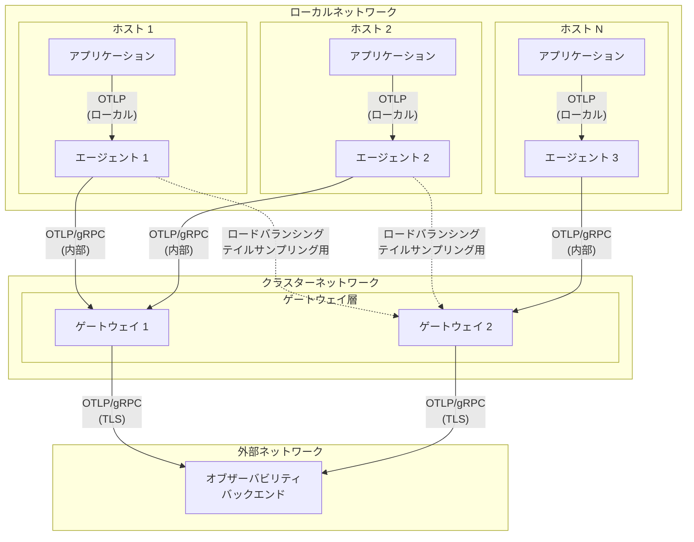
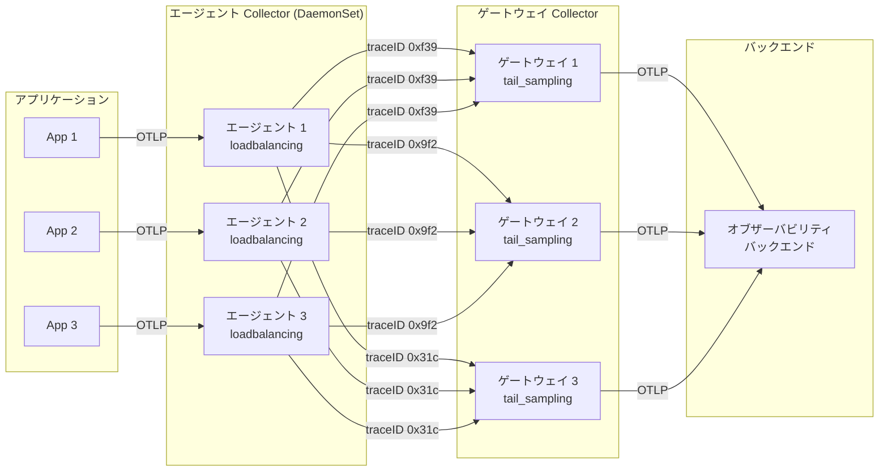

[エージェント](/docs/collector/deploy/agent/)と[ゲートウェイ](/docs/collector/deploy/gateway/)はそれぞれ異なる問題を解決します。
デプロイメントでこれらを組み合わせることで、以下の課題に対処するオブザーバビリティアーキテクチャを構築できます。

- **関心の分離**: すべてのマシンやノードに複雑な設定や処理ロジックを配置することを避けられます。
  エージェントの設定は小さくシンプルに保ち、中央のプロセッサーがより重い収集タスクを処理します。
- **スケーラブルなコスト制御**: 複数のエージェントからテレメトリーを受信するゲートウェイで、より良いサンプリングやバッチ処理の判断ができます。
  ゲートウェイは完全なトレースを含む全体像を把握でき、独立してスケールできます。
- **セキュリティと安定性**: エージェントからゲートウェイへローカルネットワーク経由でテレメトリーを送信します。
  ゲートウェイは安定したエグレスポイントとなり、リトライや認証情報の管理を処理できます。

## エージェントからゲートウェイへのアーキテクチャの例 {#example-agent-to-gateway-architecture}

以下の図は、エージェントからゲートウェイへの組み合わせデプロイメントのアーキテクチャを示しています。

- エージェント Collector は各ホスト上で DaemonSet パターンで実行され、ホスト上で実行されているサービスからのテレメトリーおよびホスト自体のテレメトリーを、ロードバランシングを使って収集します。
- ゲートウェイ Collector はエージェントからデータを受信し、フィルタリングやサンプリングなどの集中処理を行った後、データをバックエンドにエクスポートします。
- アプリケーションは内部ホストネットワークを使用してローカルのエージェントと通信し、エージェントは内部クラスターネットワークを介してゲートウェイと通信し、ゲートウェイは TLS を使用して外部バックエンドとセキュアに通信します。



## このパターンを使用するタイミング {#when-to-use-this-pattern}

エージェントからゲートウェイへのパターンは、よりシンプルなデプロイメントオプションに比べて運用の複雑さが増します。
以下の機能が1つ以上必要な場合にこのパターンを使用してください。

- **集中処理**: テイルベースサンプリング、高度なフィルタリング、データ変換などの複雑な処理を、すべてのホストではなく中央の場所で実行したい場合。

- **ネットワーク分離**: アプリケーションが制限されたネットワーク環境で動作しており、特定のエグレスポイントのみが外部バックエンドと通信できる場合。

- **大規模でのコスト最適化**: 完全なトレースデータに基づいてサンプリングの判断を行ったり、バックエンドにデータを送信する前に複数のソースにまたがるアグリゲーションを実行する必要がある場合。

## よりシンプルなパターンで十分な場合 {#when-simpler-patterns-work-better}

以下の場合は、エージェントからゲートウェイへのパターンは必要ないかもしれません。

- アプリケーションが OTLP を使用してバックエンドにテレメトリーを直接送信できる場合。
- ホスト固有のメトリクスやログを収集する必要がない場合。
- テイルベースサンプリングのような複雑な処理が不要な場合。
- 小規模なデプロイメントで、このパターンが提供するメリットよりも運用のシンプルさが重要な場合。

よりシンプルなユースケースでは、[エージェント](/docs/collector/deploy/agent/)のみ、または[ゲートウェイ](/docs/collector/deploy/gateway/)のみの使用を検討してください。

## 設定例 {#configuration-examples}

以下の例は、エージェントからゲートウェイへのデプロイメントにおけるエージェントとゲートウェイの典型的な設定を示しています。

> [!WARNING]
>
> すべてのクライアントがローカルである場合は一般的にエンドポイントを `localhost` にバインドすることが望ましいですが、この例では便宜上「未指定」アドレスの `0.0.0.0` を使用しています。
> Collector のデフォルトは `localhost` です。
> エンドポイント設定値としてのこれらの選択については、[サービス拒否攻撃からの保護](/docs/security/config-best-practices/#protect-against-denial-of-service-attacks)を参照してください。

### ロードバランシングなしのエージェント設定例 {#example-agent-configuration-without-load-balancing}

この例は、アプリケーションのテレメトリーとホストメトリクスを収集し、ゲートウェイに転送するエージェント設定を示しています。
テイルサンプリング、累積からデルタへのメトリクス変換、またはその他の理由でデータを意識したルーティングを行う場合は、データを意識したロードバランシングの例として[次の設定](#example-agent-configuration-with-load-balancing)を参照してください。

```yaml
receivers:
  # アプリケーションからテレメトリーを受信
  otlp:
    protocols:
      grpc:
        endpoint: 0.0.0.0:4317

  # ホストメトリクスを収集
  hostmetrics:
    scrapers:
      cpu:
      memory:
      disk:
      filesystem:
      network:

processors:
  # ホストに関するリソース属性を検出して追加
  resourcedetection:
    detectors: [env, system, docker]
    timeout: 5s

  # メモリの問題を防止
  memory_limiter:
    check_interval: 1s
    limit_mib: 512

exporters:
  # ゲートウェイに送信
  otlp:
    endpoint: otel-gateway:4317
    # ゲートウェイの短時間の停止を吸収
    sending_queue:
      batch:
        sizer: items
        flush_timeout: 1s

service:
  pipelines:
    traces:
      receivers: [otlp]
      processors: [memory_limiter, resourcedetection]
      exporters: [otlp]
    metrics:
      receivers: [otlp, hostmetrics]
      processors: [memory_limiter, resourcedetection]
      exporters: [otlp]
    logs:
      receivers: [otlp]
      processors: [memory_limiter, resourcedetection]
      exporters: [otlp]
```

### ロードバランシングありのエージェント設定例 {#example-agent-configuration-with-load-balancing}

この例は、ロードバランシングエクスポーターを使用して `traceID` に基づいてテレメトリーをルーティングするエージェントの設定方法を示しています。
データを意識したルーティングは、テイルベースサンプリングや累積からデルタへのメトリクス変換などの処理に必要です。

```yaml
receivers:
  otlp:
    protocols:
      grpc:
        endpoint: 0.0.0.0:4317

processors:
  memory_limiter:
    check_interval: 1s
    limit_mib: 512

exporters:
  # トレース ID によるロードバランシング
  loadbalancing:
    resolver:
      dns:
        hostname: otel-gateway-headless
        port: 4317
    routing_key: traceID
    sending_queue:
      batch:
        sizer: items
        flush_timeout: 1s

service:
  pipelines:
    traces:
      receivers: [otlp]
      processors: [memory_limiter]
      exporters: [loadbalancing]
```

### ゲートウェイ設定例 {#example-gateway-configuration}

この例は、エージェントからデータを受信し、テイルサンプリングを実行してバックエンドにエクスポートするゲートウェイの設定を示しています。

```yaml
receivers:
  # エージェントから受信
  otlp:
    protocols:
      grpc:
        endpoint: 0.0.0.0:4317

processors:
  # より高い制限でメモリの問題を防止
  memory_limiter:
    check_interval: 1s
    limit_mib: 2048

  # オプション: テイルベースサンプリング
  tail_sampling:
    policies:
      # エラーのあるトレースは常にサンプリング
      - name: errors-policy
        type: status_code
        status_code: { status_codes: [ERROR] }
      # その他のトレースの10%をサンプリング
      - name: probabilistic-policy
        type: probabilistic
        probabilistic: { sampling_percentage: 10 }

exporters:
  # オブザーバビリティバックエンドにエクスポート
  otlp:
    endpoint: your-backend:4317
    headers:
      api-key: ${env:BACKEND_API_KEY}
    # バックエンドの停止を吸収
    sending_queue:
      batch:
        sizer: items
        flush_timeout: 10s

service:
  pipelines:
    traces:
      receivers: [otlp]
      processors: [memory_limiter, tail_sampling]
      exporters: [otlp]
    metrics:
      receivers: [otlp]
      processors: [memory_limiter]
      exporters: [otlp]
    logs:
      receivers: [otlp]
      processors: [memory_limiter]
      exporters: [otlp]
```

## エージェントとゲートウェイにおけるプロセッサー {#processors-in-agents-and-gateways}

エージェントからゲートウェイへのパターンでは、データの正確性を確保するために、テレメトリーの処理に注意が必要です。

### 推奨される処理 {#recommended-processing}

エージェントとゲートウェイの両方に以下を含めてください。

- **メモリリミッタープロセッサー**: このプロセッサーは、メモリ使用量が高い場合にバックプレッシャーを適用することで、メモリ不足の問題を防ぎます。
  パイプラインの最初のプロセッサーとして設定してください。
  エージェントは通常より小さな制限が必要で、ゲートウェイはバッチ処理やサンプリング操作のためにより多くのメモリが必要です。
  ワークロードの要件と利用可能なリソースに基づいて制限を調整してください。

- **バッチ処理**: エクスポート前にテレメトリーデータをバッチ処理することで効率を向上できます。
  エージェントにはレイテンシーとメモリ使用量を最小限に抑えるために、小さいバッチサイズと短いタイムアウトを設定してください。
  ゲートウェイにはスループットとバックエンドの効率を向上させるために、大きいバッチサイズと長いタイムアウトを設定してください。

### サンプリングに関する考慮事項 {#sampling-considerations}

- **確率的サンプリング**: 複数の Collector にまたがって確率的サンプリングを使用する場合は、一貫したサンプリング判断のために同じハッシュシードを使用してください。

- **テイルベースサンプリング**: テイルベースサンプリングはゲートウェイにのみ設定してください。
  このプロセッサーがサンプリングの判断を行うには、トレースのすべてのスパンを確認する必要があります。
  エージェントで [`loadbalancingexporter`](https://github.com/open-telemetry/opentelemetry-collector-contrib/tree/main/exporter/loadbalancingexporter) を使用して、トレース ID ごとにトレースをゲートウェイインスタンスに分散してください。

  > [!CAUTION]
  >
  > テイルサンプリングプロセッサーは、トレースのすべてのスパンが同じ Collector インスタンスに到着した場合にのみ正確な判断を行えます。
  > ロードバランシングエクスポーターはトレース ID によるルーティングをサポートしていますが、複数のゲートウェイインスタンスにまたがるテイルサンプリングの実行は高度なセットアップであり、バックエンド変更時のルーティング再分割やキャッシュ/判断の一貫性など、実用上の注意点があります。
  > 堅牢なスティッキールーティング戦略がない限り、十分なリソースを持つ単一のテイルサンプリングゲートウェイを優先し、慎重にテストしてください。

#### テイルサンプリングアーキテクチャの例 {#example-tail-sampling-architecture}

以下の図は、トレース ID ベースのロードバランシングが複数のゲートウェイインスタンスにまたがるテイルベースサンプリングでどのように機能するかを示しています。

`loadbalancingexporter` は `traceID` を使用してどのゲートウェイがスパンを受信するかを決定します。

- **traceID 0xf39** のすべてのスパンは（どのエージェントからでも）ゲートウェイ 1 にルーティングされます。
- **traceID 0x9f2** のすべてのスパンは（どのエージェントからでも）ゲートウェイ 2 にルーティングされます。
- **traceID 0x31c** のすべてのスパンは（どのエージェントからでも）ゲートウェイ 3 にルーティングされます。

この設定により、各ゲートウェイがトレースのすべてのスパンを確認でき、正確なテイルベースサンプリングの判断が可能になります。



### その他の処理に関する考慮事項 {#other-processing-considerations}

- **累積からデルタへの変換**: 累積からデルタへのメトリクス処理にはデータを意識したロードバランシングが必要です。これは、特定のメトリクス系列のすべてのポイントが同じゲートウェイ Collector に到達する場合にのみ、計算が正確になるためです。
  エージェントからゲートウェイへのデプロイメントで [`cumulativetodelta` プロセッサー](https://github.com/open-telemetry/opentelemetry-collector-contrib/tree/main/processor/cumulativetodeltaprocessor)を使用する場合は、各メトリクスストリームが単一の Collector に送信されるようにしてください。

## エージェントとゲートウェイ間の通信 {#communication-between-agents-and-gateways}

エージェントはテレメトリーデータをゲートウェイに確実に送信する必要があります。
環境に応じて、通信プロトコル、エンドポイント、セキュリティ設定を適切に構成してください。

### プロトコルの選択 {#protocol-selection}

エージェントとゲートウェイ間の通信には OTLP プロトコルを使用してください。
OTLP は OpenTelemetry エコシステム全体で最良の互換性を提供します。
エージェントの OTLP エクスポーターを設定して、ゲートウェイの OTLP レシーバーにデータを送信してください。

Kubernetes 環境では、エンドポイント設定にサービス名を使用してください。
たとえば、ゲートウェイサービスの名前が `otel-gateway` の場合、エージェントのエクスポーターを `endpoint: otel-gateway:4317` と設定します。

### リトライ {#retries}

エージェントとゲートウェイ間、またはゲートウェイとバックエンド間の一時的な停止に対応するために、エージェントとゲートウェイにエクスポーターのキューとリトライの設定（たとえば `retry_on_failure` や `sending_queue` の設定）を構成してください。
ゲートウェイはバックエンドの停止に対応するために、より大きなキューとリトライポリシーが必要になることが多いです。
また、サイズ超過のペイロードによる一時的なバックエンドの拒否を避けるために、バッチの `max_size` の設定も検討してください。

## エージェントとゲートウェイのスケーリング {#scaling-agents-and-gateways}

テレメトリーの量が増加するにつれて、Collector を適切にスケールする必要があります。
エージェントとゲートウェイにはそれぞれ異なるスケーリングの特性と要件があります。

### エージェント {#agents}

エージェントは各ホスト上で実行されるため、通常水平スケーリングは不要です。
かわりに、リソース制限を調整してエージェントを垂直方向にスケールしてください。
Collector の[内部メトリクス](/docs/collector/internal-telemetry/)を通じて CPU とメモリの使用量を監視できます。

### ゲートウェイ {#gateways}

ゲートウェイは垂直方向と水平方向の両方でスケールできます。

- **テイルサンプリングなし**: 任意のロードバランサーまたはラウンドロビン分散の Kubernetes サービスを使用してください。
  すべてのゲートウェイインスタンスは独立して動作します。

  > [!NOTE]
  >
  > メトリクスをエクスポートするゲートウェイインスタンスをスケーリングする場合は、複数の Collector が同じ時系列に同時に書き込むことを避けるために、デプロイメントがシングルライター原則に従っていることを確認してください。
  > 詳細については[ゲートウェイデプロイメントのドキュメント](/docs/collector/deploy/gateway/#multiple-collectors-and-the-single-writer-principle)を参照してください。

- **テイルサンプリングあり**: エージェントに `loadbalancingexporter` をデプロイして、トレース ID によってスパンをルーティングし、トレースのすべてのスパンが同じゲートウェイインスタンスに送信されるようにしてください。

Kubernetes での自動スケーリングには、CPU またはメモリメトリクスに基づいた [Horizontal Pod Autoscaling（HPA）](https://kubernetes.io/docs/concepts/workloads/autoscaling/horizontal-pod-autoscale/)を使用してください。
ワークロードパターンに基づいてゲートウェイをスケールするように HPA を設定してください。

## その他のリソース {#additional-resources}

詳細については、以下のドキュメントを参照してください。

- [Collector ベンチマーク](/docs/collector/benchmarks/)
- [Collector 設定](/docs/collector/configuration/)
- [累積からデルタへのプロセッサー](https://github.com/open-telemetry/opentelemetry-collector-contrib/tree/main/processor/cumulativetodeltaprocessor)
- [ロードバランシングエクスポーター](https://github.com/open-telemetry/opentelemetry-collector-contrib/tree/main/exporter/loadbalancingexporter)
- [メモリリミッタープロセッサー](https://github.com/open-telemetry/opentelemetry-collector/tree/main/processor/memorylimiterprocessor)
- [テイルサンプリングプロセッサー](https://github.com/open-telemetry/opentelemetry-collector-contrib/tree/main/processor/tailsamplingprocessor)
