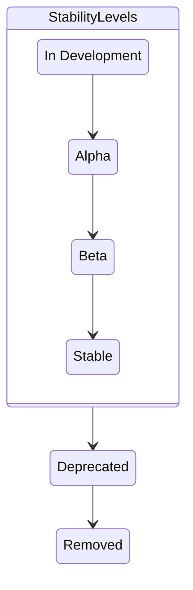

インスタンス自身の内部テレメトリーを確認することで、任意の OpenTelemetry コレクターのインスタンスの健全性を詳しく調べることができます。
このテレメトリーとコレクターの[監視](#use-internal-telemetry-to-monitor-the-collector) および[トラブルシューティング](/docs/collector/troubleshooting/) に役立つように設定する方法を学ぶために読み進めてください。

> [!WARNING]
>
> コレクターは、どのようにその内部テレメトリーをエクスポートするかを設定するために、OpenTelemetry SDK の[宣言的構成スキーマ](https://github.com/open-telemetry/opentelemetry-configuration)を使用します。
> このスキーマはまだ[開発](/docs/specs/otel/document-status/)段階であり、将来のリリースで **破壊的な変更** を受ける可能性があります。
> 私たちは、1.0 スキーマのリリースが利用可能になるまで古いスキーマのサポートを継続する予定で、1.0 より前のスキーマを廃止する前に、ユーザーが構成を更新するための移行期間を提供します。
> 詳細および進捗の追跡については、[issue #10808](https://github.com/open-telemetry/opentelemetry-collector/issues/10808)を参照してください。

## コレクターで内部テレメトリーを有効化する {#activate-internal-telemetry-in-the-collector}

デフォルトでは、コレクターは2つの方法で自身のテレメトリーを公開します。

- 内部 [メトリクス](#configure-internal-metrics) はデフォルトのポート `8888` の Prometheus インターフェイスを使用して公開されます。
- デフォルトで[ログ](#configure-internal-logs) は `stderr` に出力されます。

### リソース属性を設定する {#configure-resource-attributes}

コレクターは、その内部テレメトリーシグナルに `service.name`、`service.version`、および `service.instance.id`（ランダムに生成される）リソース属性を自動的に付与します。
これらは、属性値を `null`（例: `service.name: null`）に設定することで無効化できます。

コレクターの内部テレメトリーシグナル（トレース、メトリクス、ログ）に追加のリソース属性を加えたい場合は、`service::telemetry::resource` の下で設定できます。

```yaml
service:
  telemetry:
    resource:
      attribute_key: 'attribute_value'
```

### 内部メトリクスを設定する {#configure-internal-metrics}

#### 内部メトリクス向けのOTLP エクスポーター {#otlp-exporter-for-internal-metrics}

コレクターによってどのように内部メトリクスが生成され、公開されるかを設定できます。
デフォルトでは、コレクターは自身に関する基本的なメトリクスを生成し、スクレイピング先 `http://127.0.0.1:8888/metrics` 向けに OpenTelemetry Go の[Prometheus エクスポーター](https://github.com/open-telemetry/opentelemetry-go/tree/main/exporters/prometheus)を使用してそれらを公開します。

コレクターは、以下の設定により OTLP バックエンドへ内部メトリクスをプッシュできます。

```yaml
service:
  telemetry:
    metrics:
      readers:
        - periodic:
            exporter:
              otlp:
                protocol: http/protobuf
                endpoint: https://backend:4318
```

#### 内部メトリクス向けの Prometheus エンドポイント {#prometheus-endpoint-for-internal-metrics}

また、必要に応じて、Prometheus エンドポイントを特定の 1 つのネットワークインターフェイス、またはすべてのネットワークインターフェイスで公開できます。
コンテナ化された環境では、このポートをパブリックインターフェイスで公開したい場合があります。

Prometheus の設定を `service::telemetry::metrics` の下に設定してください。

```yaml
service:
  telemetry:
    metrics:
      readers:
        - pull:
            exporter:
              prometheus:
                host: '0.0.0.0'
                port: 8888
```

Prometheus のメトリクスに追加のラベルを加えたい場合、それらを `prometheus::with_resource_constant_labels` で追加できます。

```yaml
prometheus:
  host: '0.0.0.0'
  port: 8888
  with_resource_constant_labels:
    included:
      - label_key
```

そして、`service::telemetry::resource` でラベルを参照してください。

```yaml
resource:
  label_key: label_value
```

#### サービスのアドレス {#service-address}

> [!NOTE] 内部テレメトリー設定の変更点
>
> コレクター [v0.123.0][] 以降では、`service::telemetry::metrics::address` 設定は無視されます。
> 以前のバージョンでは、以下のように設定できました。
>
> ```yaml
> service:
>   telemetry:
>     metrics:
>       address: 0.0.0.0:8888
> ```

[v0.123.0]: https://github.com/open-telemetry/opentelemetry-collector/releases/tag/v0.123.0

#### メトリクスの詳細度 {#metric-verbosity}

以下のいずれかの値を `level` フィールドに設定することで、コレクターのメトリクス出力の詳細度を調整できます。

- `none`: テレメトリーは収集されません。
- `basic`: 標準的なサービスのテレメトリーになります。
- `normal`: デフォルトレベルで、basic に加えて標準的な指標を追加します。
- `detailed`: 最も詳細なレベルで、dimensions と views を含みます。

各詳細度レベルは、特定のメトリクスが出力されるしきい値を表します。
レベルごとの内訳を含むメトリクスの完全な一覧については、[内部メトリクスの一覧](#lists-of-internal-metrics) を参照してください。

メトリクス出力のデフォルトレベルは `normal` です。
別のレベルを使用するには、`service::telemetry::metrics::level` を設定します。

```yaml
service:
  telemetry:
    metrics:
      level: detailed
```

#### メトリクスビュー {#metric-views}

[`views`](/docs/specs/otel/metrics/sdk/#view) を使用することで、コレクターからどのようにメトリクスが出力されるかをさらに設定できます。
たとえば、以下の設定は、`otelcol_process_uptime` という名前のメトリクスを、新しい名前 `process_uptime` と説明で出力するように更新します。

> [!NOTE]
>
> 内部メトリクス用の Prometheus エクスポーターを手動で（`readers` を使って）設定する場合、`otelcol_process_uptime` は `without_type_suffix` と `without_units` が `true` に設定されていない限り、`otelcol_process_uptime_seconds_total` としてエクスポートされる可能性があります。
> それにかかわらず、views では `instrument_name` の値 `otelcol_process_uptime`（OTLP 名）を使用してください。
> Prometheus 固有の接尾辞を制御するには、[単位接尾辞](#unit-suffixes) を参照してください。

```yaml
service:
  telemetry:
    metrics:
      views:
        - selector:
            instrument_name: otelcol_process_uptime
            instrument_type:
          stream:
            name: process_uptime
            description: The amount of time the Collector has been up
```

結果となる集計、属性、およびカーディナリティ制限を更新するために `views` を使用することもできます。
オプションの完全な一覧については、OpenTelemetry 構成スキーマの[リポジトリ](https://github.com/open-telemetry/opentelemetry-configuration/blob/main/snippets/View_kitchen_sink.yaml)にある例を参照してください。

### 内部ログの設定 {#configure-internal-logs}

ログ出力は `stderr` にあります。
ログは構成 `service::telemetry::logs` で設定できます。
[設定のオプション](https://github.com/open-telemetry/opentelemetry-collector/blob/main/service/telemetry/otelconftelemetry/config.go)は以下のとおりです。

| フィールド名           | デフォルト値　　 | 説明 　　　　　                                                                                                                                                                                                                                                                                             |
| ---------------------- | ---------------- | ----------------------------------------------------------------------------------------------------------------------------------------------------------------------------------------------------------------------------------------------------------------------------------------------------------- |
| `level`                | `INFO`           | 有効なロギングレベルの最小値を設定します。指定可能な他の値は `DEBUG`、`WARN`、`ERROR` になります。                                                                                                                                                                                                          |
| `development`          | `false`          | ロガーを開発モードにします。                                                                                                                                                                                                                                                                                |
| `encoding`             | `console`        | ロガーのエンコーディングを設定します。指定可能な他の値は `json` になります。                                                                                                                                                                                                                                |
| `disable_caller`       | `false`          | 呼び出し関数のファイル名と行番号をログに注記しないようにします。デフォルトでは、すべてのログに注記が付与されます。                                                                                                                                                                                          |
| `disable_stacktrace`   | `false`          | スタックトレースの自動取得を無効化します。スタックトレースは、開発環境では `WARN` レベル以上、本番環境では `ERROR` レベル以上のログで取得されます。                                                                                                                                                         |
| `sampling::enabled`    | `true`           | サンプリングポリシーを設定します。                                                                                                                                                                                                                                                                          |
| `sampling::tick`       | `10s`            | ロガーが各サンプリングに適用する秒単位の間隔。                                                                                                                                                                                                                                                              |
| `sampling::initial`    | `10`             | 各 `sampling::tick` の開始時に記録されるメッセージ数。                                                                                                                                                                                                                                                      |
| `sampling::thereafter` | `100`            | `sampling::initial` のメッセージが記録された後の後続メッセージに対するサンプリングポリシーを設定します。`sampling::thereafter` を `N` に設定すると、`N` 番目ごとのメッセージが記録され、それ以外は破棄されます。`N` が 0 の場合、`sampling::initial` のメッセージ記録後はすべてのメッセージが破棄されます。 |
| `output_paths`         | `["stderr"]`     | ロギング出力の書き込み先となる URL またはファイルパスの一覧。                                                                                                                                                                                                                                               |
| `error_output_paths`   | `["stderr"]`     | ロガーエラーの書き込み先となる URL またはファイルパスの一覧。                                                                                                                                                                                                                                               |
| `initial_fields`       |                  | ロギングコンテキストを拡充するため、すべてのログエントリーに追加される静的なキーと値のペアの集合。デフォルトでは initial field がありません。                                                                                                                                                               |

`journalctl` を使用して、Linux の systemd システム上でコレクターのログを確認することもできます。

 {}

```sh
journalctl | grep otelcol
```

{} {}

```sh
journalctl | grep otelcol | grep Error
```

{} 

以下の設定はコレクターから OTLP/HTTP バックエンドへ内部ログを出力するために使用できます。

```yaml
service:
  telemetry:
    logs:
      processors:
        - batch:
            exporter:
              otlp:
                protocol: http/protobuf
                endpoint: https://backend:4318
```

### 内部トレースの設定 {#configure-internal-traces}

コレクターはデフォルトではトレースを公開しませんが、公開するように設定できます。

> [!CAUTION]
>
> 内部トレーシングは実験的な機能であり、出力されるスパン名および属性の安定性については保証されません。

以下の設定はコレクターから OTLP バックエンドへ内部トレースを出力するために使用できます。

```yaml
service:
  telemetry:
    traces:
      processors:
        - batch:
            exporter:
              otlp:
                protocol: http/protobuf
                endpoint: https://backend:4318
```

追加のオプションについては、[設定例][kitchen-sink-config] を参照してください。
`tracer_provider` セクションが、ここでの `traces` に対応していることに注意してください。

[kitchen-sink-config]: https://github.com/open-telemetry/opentelemetry-configuration/blob/v0.3.0/examples/kitchen-sink.yaml

## 内部テレメトリーの種類 {#types-of-internal-telemetry}

OpenTelemetry コレクターは、自身の運用メトリクスを明確に公開することで、可観測なサービスのモデルとなることを目指しています。
さらに、同じホスト上の別のプロセスによって問題が引き起こされているかどうかを把握するのに役立つホストリソースのメトリクスを収集します。
コレクターの特定のコンポーネントは、それぞれ独自のカスタムテレメトリーを出力できます。
このセクションでは、コレクター自身が出力するさまざまな種類の可観測性について学びます。

### 内部メトリクスで観測可能な値の概要{#summary-of-values-observable-with-internal-metrics}

コレクターは、少なくとも以下の値に対して内部メトリクスを出力します。

- プロセスの稼働時間と開始以降の CPU 時間。
- プロセスのメモリとヒープ使用量。
- レシーバーについて: データタイプごとに承認および拒否された項目。
- プロセッサーについて: 入力と出力項目数。
- エクスポーターについて: データの種類ごとの送信した項目数、キューに追加できなかった項目数 および送信に失敗した項目数。
- エクスポーターについて: キューサイズと容量。
- HTTP/gRPC リクエストおよびレスポンスの数、継続時間、サイズ。

より詳細な一覧は、以下のセクションで参照できます。

### メトリクス名 {#metric-names}

このセクションでは、いくつかの内部メトリクスに適用される特別な命名規則を説明します。

#### `otelcol_` 接頭辞 {#otelcol-prefix}

コレクターの v0.106.1 以降では、内部メトリクス名はそのソースに基づいて異なる方法で扱われます。

- コレクターコンポーネントから生成されるメトリクスは、`otelcol_` 接頭辞が付きます。
- 計装ライブラリから生成されるメトリクスは、そのメトリクス名に明示的に接頭辞が付けられていない限り、デフォルトでは `otelcol_` 接頭辞を使用しません。

v0.106.1 より前のコレクターのバージョンにおいて、Prometheus エクスポーターを使用して出力されるすべての内部メトリクスは、そのメトリクスの生成元に関係なく `otelcol_` という接頭辞が付与されます。
これには、コレクターのコンポーネントと計装ライブラリの両方からのメトリクスが含まれます。

#### `_total` 接尾辞 {#total-suffix}

デフォルトで Prometheus 固有の動作として、Prometheus エクスポーターは`otelcol_exporter_send_failed_spans_total` のように、Prometheus の命名規則に従うため合計メトリクスに `_total` 接尾辞を追加します。
この動作は、Prometheus エクスポーターの設定で `without_type_suffix: true` を設定することで無効化できます。

コレクターの設定で `service::telemetry::metrics::readers` を省略する場合、コレクターによって設定されるデフォルトの Prometheus エクスポーターは、すでに `without_type_suffix` が `false` に設定されています。
ただし、readers をカスタマイズして Prometheus エクスポーターを手動で追加する場合は、「raw」メトリクス名に戻すためにそのオプションを設定する必要があります。
詳細については、[コレクター v1.25.0/v0.119.0 リリースノート](https://github.com/codeboten/opentelemetry-collector/blob/313167505b44e5dc9a29c0b9242cc4547db11ec3/CHANGELOG.md#v1250v01190)を参照してください。

OTLP を通じてエクスポートされる内部メトリクスは、この動作がありません。
このページの [内部メトリクス](#lists-of-internal-metrics) は、`otelcol_exporter_send_failed_spans` のような OTLP 形式で一覧化されています。

#### `_seconds` とその他の単位接尾辞 {#unit-suffixes}

Prometheus エクスポーターは、単位を持つメトリクスに単位接尾辞を付加します。
たとえば、`otelcol_process_uptime`（単位: 秒）は `otelcol_process_uptime_seconds_total` としてエクスポートされることがあります。
つまり、`_seconds` の単位接尾辞が先に追加され、その後に `_total` のカウンタを示す接尾辞が追加されます。

コレクターによって設定されるデフォルトの Prometheus エクスポーター（`readers` が指定されていない場合）は、すでに後方互換性のために `without_type_suffix` と `without_units` を `true` に設定しています。
そのため、 `otelcol_process_uptime` はそのまま使用されます。

しかし、`service::telemetry::metrics::readers` の下で Prometheus エクスポーターを手動で設定する場合、それらのオプションはデフォルトでは設定されません。
元のより短いメトリクス名を維持するには、以下のように両方のオプションを明示的に `true` に設定してください。

```yaml
service:
  telemetry:
    metrics:
      readers:
        - pull:
            exporter:
              prometheus:
                host: '0.0.0.0'
                port: 8888
                without_type_suffix: true
                without_units: true
```

この設定では、`otelcol_process_uptime_seconds_total` は `otelcol_process_uptime` としてエクスポートされます。

#### ドット (`.`) とアンダースコア (`_`) {#dots-v-underscores}

`http*` および `rpc*` メトリクスは計装ライブラリに由来します。
それらの元の名前はドット（`.`）を使っていました。
コレクター v0.120.0 より前では、Prometheus で公開される内部メトリクスは、Prometheus の命名規則に合わせるためにドット（`.`）をアンダースコア（`_`）に変更していました。その結果、`rpc_server_duration`のようなメトリクス名になっていました。

コレクターの 0.120.0 以降のバージョンでは Prometheus 3.0 スクレーパーを使用するため、ドットを含む元の `http*` および `rpc*` メトリクス名が保持されます。
このページの[内部メトリクス](#lists-of-internal-metrics) は、`rpc.server.duration` のような元の形式で一覧化されています。
詳細については、[コレクター v0.120.0 リリースノート](https://github.com/open-telemetry/opentelemetry-collector-contrib/blob/main/CHANGELOG.md#v01200)を参照してください。

### 内部メトリクスの一覧 {#lists-of-internal-metrics}

以下の表では、各内部メトリクスを詳細度レベル `basic`、`normal`、`detailed` ごとにグループ化しています。
各メトリクスは名前と説明によって識別され、計装タイプ別に分類されています。



この一覧を作成するには、自身のメトリクスを localhost:8888/metrics エンドポイントに出力させるために、コレクターのインスタンスを設定してください。
メトリクスを選び、コレクター core リポジトリーでそれを grep を使って検索してください。
たとえば、`otelcol_process_memory_rss` は `grep -Hrn "memory_rss" .` を使って見つけられます。
検索文字列からは、接頭辞となる可能性がある単語を必ず取り除いてください。
メトリクス一覧を含む .go ファイルが見つかるまで結果を確認します。
`otelcol_process_memory_rss` の場合、それと他の process メトリクスは<https://github.com/open-telemetry/opentelemetry-collector/blob/31528ce81d44e9265e1a3bbbd27dc86d09ba1354/service/internal/proctelemetry/process_telemetry.go#L92>で見つけることができます。
コレクターの内部メトリクスは、リポジトリー内の複数の異なるファイルで定義されている点に注意してください。



#### `basic` レベルのメトリクス {#basic-level-metrics}

| メトリクス名                                           | 説明                                                                                            | 種別    |
| ------------------------------------------------------ | ----------------------------------------------------------------------------------------------- | ------- |
| `otelcol_exporter_enqueue_failed_`<br>`log_records`    | エクスポーターがキュー投入に失敗したログの数。                                                  | Counter |
| `otelcol_exporter_enqueue_failed_`<br>`metric_points`  | エクスポーターがキュー投入に失敗したメトリクスポイントの数。                                    | Counter |
| `otelcol_exporter_enqueue_failed_`<br>`spans`          | エクスポーターがキュー投入に失敗したスパンの数。                                                | Counter |
| `otelcol_exporter_queue_capacity`                      | 送信キューの固定容量（バッチ単位）。                                                            | Gauge   |
| `otelcol_exporter_queue_size`                          | 送信キューの現在サイズ（バッチ単位）。                                                          | Gauge   |
| `otelcol_exporter_send_failed_`<br>`log_records`       | エクスポーターが宛先への送信に失敗したログの数。                                                | Counter |
| `otelcol_exporter_send_failed_`<br>`metric_points`     | エクスポーターが宛先への送信に失敗したメトリクスポイントの数。                                  | Counter |
| `otelcol_exporter_send_failed_`<br>`spans`             | エクスポーターが宛先への送信に失敗したスパンの数。                                              | Counter |
| `otelcol_exporter_sent_log_records`                    | 宛先に正常に送信されたログの数。                                                                | Counter |
| `otelcol_exporter_sent_metric_points`                  | 宛先に正常に送信されたメトリクスポイントの数。                                                  | Counter |
| `otelcol_exporter_sent_spans`                          | 宛先に正常に送信されたスパンの数。                                                              | Counter |
| `otelcol_process_cpu_seconds`                          | CPU のユーザー時間とシステム時間の合計（秒）。                                                  | Counter |
| `otelcol_process_memory_rss`                           | 物理メモリーの合計（RSS: resident set size）（バイト）。                                        | Gauge   |
| `otelcol_process_runtime_heap_`<br>`alloc_bytes`       | 割り当て済みヒープオブジェクトのバイト数（`go doc runtime.MemStats.HeapAlloc` を参照）。        | Gauge   |
| `otelcol_process_runtime_total_`<br>`alloc_bytes`      | ヒープオブジェクトに割り当てられた累積バイト数（`go doc runtime.MemStats.TotalAlloc` を参照）。 | Counter |
| `otelcol_process_runtime_total_`<br>`sys_memory_bytes` | OS から取得したメモリー総バイト数（`go doc runtime.MemStats.Sys` を参照）。                     | Gauge   |
| `otelcol_process_uptime`                               | プロセスの稼働時間（秒）。                                                                      | Counter |
| `otelcol_processor_incoming_items`                     | processor に渡された項目数。                                                                    | Counter |
| `otelcol_processor_outgoing_items`                     | processor から出力された項目数。                                                                | Counter |
| `otelcol_receiver_accepted_`<br>`log_records`          | 正常に取り込まれ、パイプラインへプッシュされたログの数。                                        | Counter |
| `otelcol_receiver_accepted_`<br>`metric_points`        | 正常に取り込まれ、パイプラインへプッシュされたメトリクスポイントの数。                          | Counter |
| `otelcol_receiver_accepted_spans`                      | 正常に取り込まれ、パイプラインへプッシュされたスパンの数。                                      | Counter |
| `otelcol_receiver_refused_`<br>`log_records`           | パイプラインへプッシュできなかったログの数。                                                    | Counter |
| `otelcol_receiver_refused_`<br>`metric_points`         | パイプラインへプッシュできなかったメトリクスポイントの数。                                      | Counter |
| `otelcol_receiver_refused_spans`                       | パイプラインへプッシュできなかったスパンの数。                                                  | Counter |
| `otelcol_scraper_errored_`<br>`metric_points`          | コレクターがスクレイプに失敗したメトリクスポイントの数。                                        | Counter |
| `otelcol_scraper_scraped_`<br>`metric_points`          | コレクターがスクレイプしたメトリクスポイントの数。                                              | Counter |

#### 追加の `normal` レベルのメトリクス {#additional-normal-level-metrics}

| メトリクス名                                            | 説明                                               | 種別      |
| ------------------------------------------------------- | -------------------------------------------------- | --------- |
| `otelcol_processor_batch_batch_`<br>`send_size`         | 送信されたバッチ内のユニット数。                   | Histogram |
| `otelcol_processor_batch_batch_size_`<br>`trigger_send` | サイズトリガーによりバッチが送信された回数。       | Counter   |
| `otelcol_processor_batch_metadata_`<br>`cardinality`    | 処理されている異なるメタデータ値の組み合わせ数。   | Counter   |
| `otelcol_processor_batch_timeout_`<br>`trigger_send`    | タイムアウトトリガーによりバッチが送信された回数。 | Counter   |

> [!NOTE] Batch processor メトリクスのレベルの変更
>
> コレクター [v0.99.0][] では、導入時から `detailed` となっている `otelcol_processor_batch_batch_send_size_bytes` を除くすべての batch processor メトリクスが `basic` から `normal`（現在のレベル）へ引き上げられました。
> ただし、これらのメトリクスは v0.109.0 から v0.121.0 までの間、意図せず `basic` に戻されていた点に注意してください。

[v0.99.0]: https://github.com/open-telemetry/opentelemetry-collector/releases/tag/v0.99.0

#### 追加の `detailed` レベルのメトリクス {#additional-detailed-level-metrics}

| メトリクス名                                          | 説明                                                                                                     | 種別      |
| ----------------------------------------------------- | -------------------------------------------------------------------------------------------------------- | --------- |
| `http.client.request.body.size`                       | HTTP クライアントリクエストボディーのサイズを測定します。                                                | Counter   |
| `http.client.request.duration`                        | HTTP クライアントリクエストの継続時間を測定します。                                                      | Histogram |
| `http.server.request.body.size`                       | HTTP サーバーリクエストボディーのサイズを測定します。                                                    | Counter   |
| `http.server.request.duration`                        | HTTP サーバーリクエストの継続時間を測定します。                                                          | Histogram |
| `http.server.response.body.size`                      | HTTP サーバーレスポンスボディーのサイズを測定します。                                                    | Counter   |
| `otelcol_processor_batch_batch_`<br>`send_size_bytes` | 送信されたバッチ内のバイト数。                                                                           | Histogram |
| `rpc.client.duration`                                 | アウトバウンド RPC の継続時間を測定します。                                                              | Histogram |
| `rpc.client.request.size`                             | RPC リクエストメッセージ（非圧縮）のサイズを測定します。                                                 | Histogram |
| `rpc.client.requests_per_rpc`                         | RPC ごとに受信されたメッセージ数を測定します。すべての非ストリーミング RPC では 1 になる必要があります。 | Histogram |
| `rpc.client.response.size`                            | RPC レスポンスメッセージ（非圧縮）のサイズを測定します。                                                 | Histogram |
| `rpc.client.responses_per_rpc`                        | RPC ごとに送信されたメッセージ数を測定します。すべての非ストリーミング RPC では 1 になる必要があります。 | Histogram |
| `rpc.server.duration`                                 | インバウンド RPC の継続時間を測定します。                                                                | Histogram |
| `rpc.server.request.size`                             | RPC リクエストメッセージ（非圧縮）のサイズを測定します。                                                 | Histogram |
| `rpc.server.requests_per_rpc`                         | RPC ごとに受信されたメッセージ数を測定します。すべての非ストリーミング RPC では 1 になる必要があります。 | Histogram |
| `rpc.server.response.size`                            | RPC レスポンスメッセージ（非圧縮）のサイズを測定します。                                                 | Histogram |
| `rpc.server.responses_per_rpc`                        | RPC ごとに送信されたメッセージ数を測定します。すべての非ストリーミング RPC では 1 になる必要があります。 | Histogram |

> [!NOTE]
>
> `http*` と `rpc*` のメトリクスは、コレクター SIG の管理下にないため、以下の成熟度レベルの対象外になります。
>
> `otelcol_processor_batch_` メトリクスは `batchprocessor` 固有です。
>
> `otelcol_receiver_`、`otelcol_scraper_`、`otelcol_processor_`、および `otelcol_exporter_` のメトリクスは、それぞれ対応する `helper` パッケージに由来します。
> そのため、これらのパッケージを使用していないいくつかのコンポーネントは、それらを出力しない可能性があります。

### 内部ログで観測可能なイベント {#events-observable-with-internal-logs}

コレクターは以下の内部イベントをログに記録します。

- コレクターのインスタンスの開始または停止。
- ローカル飽和、ダウンストリーム飽和、ダウンストリーム利用不可など、指定された理由によるスロットリングのためにデータドロップが開始される。
- スロットリングによるデータドロップが停止する。
- 無効なデータによるデータドロップが開始される。無効なデータのサンプルが含まれる。
- 無効なデータによるデータドロップが停止する。
- クリーン停止とは区別される形でクラッシュが検出される。利用可能であればクラッシュデータが含まれる。

## テレメトリーの成熟度レベル {#telemetry-maturity-levels}

コレクターのテレメトリーレベルは、コレクターが生成するすべてのファーストパーティーテレメトリーに適用されます。
OpenTelemetry Go のものを含むサードパーティーライブラリは、これらの成熟度レベルの対象外になります。

### トレース {#traces}

トレーシング計装はまだ活発に開発中であり、スパン名、付加される属性、計測対象エンドポイント、またはテレメトリーのその他の側面に変更が加えられる可能性があります。
この機能が安定版に移行するまで、トレーシング計装の後方互換性は保証されません。

### メトリクス {#metrics}

コレクターのファーストパーティーメトリクスは、以下のライフサイクルに従います。



安定性レベルは、[OTEP-0232][OTEP-0232] に由来するセマンティック規約の [ガイダンス][SemConvGuidance] に従います。
コレクターのメトリクスは `release_candidate` レベルをスキップします。

非推奨および削除済の段階は、安定性レベルではなくライフサイクル状態である点に注意してください。

OpenTelemetry Go の計装ライブラリによって生成されるものを含むサードパーティーメトリクスは、これらの成熟度レベルの対象外です。

#### 開発中 {#development}

開発中のメトリクスは、まだ活発に開発中であり、どのリリースでも変更される可能性があります。

#### アルファ {#alpha}

アルファのメトリクスには安定性保証がありません。これらのメトリクスは、いつでも変更または削除される可能性があります。

#### ベータ {#beta}

ベータのメトリクスはリリース間でまだ変更される可能性がありますが、コンポーネントのオーナーは破壊的変更を最小化するよう努める必要があります。
この段階は、より広い利用を促進し、`stable` の前の最終ステップです。

#### 安定版 {#stable}

安定版のメトリクスは変更されないことが保証されています。これは以下を意味します。

- 非推奨シグネチャがない安定版メトリクスは、削除も改名もされません。
- 安定版メトリクスの型と属性は変更されません。

#### 非推奨 {#deprecated}

非推奨メトリクスは削除予定ですが、まだ使用可能です。
これらのメトリクスの説明には、それらが非推奨になったバージョンに関する注記が含まれます。
たとえば、以下になります。

非推奨化前

```sh
# HELP otelcol_exporter_queue_size this counts things
# TYPE otelcol_exporter_queue_size counter
otelcol_exporter_queue_size 0
```

非推奨化後

```sh
# HELP otelcol_exporter_queue_size (Deprecated since 1.15.0) this counts things
# TYPE otelcol_exporter_queue_size counter
otelcol_exporter_queue_size 0
```

#### 削除済み {#deleted}

削除されたメトリクスは、公開されなくなり、使用できません。

### ログ {#logs}

個々のログエントリーとその書式は、あるリリースから次のリリースで変更される可能性があります。
現時点では安定性に関する保証はありません。

## コレクターを監視するために内部テレメトリーを使用する{#use-internal-telemetry-to-monitor-the-collector}

このセクションでは、コレクター自身のテレメトリーを使用して監視するためのベストプラクティスを推奨します。

### 監視 {#monitoring}

#### キュー長 {#queue-length}

ほとんどのエクスポーターは、コレクターのあらゆる本番デプロイメントでの使用が推奨される[キューおよび/または再試行メカニズム](https://github.com/open-telemetry/opentelemetry-collector/blob/main/exporter/exporterhelper/README.md)を提供します。

`otelcol_exporter_queue_capacity` メトリクスは、送信キューの容量をバッチ単位で示します。
`otelcol_exporter_queue_size` メトリクスは、送信キューの現在のサイズを示します。
キュー容量がワークロードをサポートできるかどうか確認するため、これら 2 つのメトリクスを使ってください。

以下の 3 つのメトリクスを使用すると、送信キューへの到達に失敗したスパン、メトリクスポイント、ログの数を特定できます。

- `otelcol_exporter_enqueue_failed_spans`
- `otelcol_exporter_enqueue_failed_metric_points`
- `otelcol_exporter_enqueue_failed_log_records`

これらの失敗は、未処理の要素でキューが埋まっている原因で発生する可能性があります。
送信レートを下げるか、コレクターを水平スケールする必要があるかもしれません。

キューまたは再試行メカニズムは、監視のためのロギングもサポートしています。
`Dropping data because sending_queue is full` のようなメッセージがログにあるか確認してください。

#### 受信失敗 {#receive-failures}

`otelcol_receiver_refused_log_records`、`otelcol_receiver_refused_spans`、および `otelcol_receiver_refused_metric_points` の発生率が継続している場合、クライアントに返されたエラーが多すぎることを示します。
デプロイメントやクライアントの耐障害性によっては、これはクライアントのデータ損失を示す可能性があります。

`otelcol_exporter_send_failed_log_records`、`otelcol_exporter_send_failed_spans`、および `otelcol_exporter_send_failed_metric_points` の発生率が継続している場合、コレクターが期待どおりにデータをエクスポートできていないことを示します。
これらのメトリクスは、再試行の可能性があるため、本質的にデータ損失を意味するものではありません。
しかし、失敗率が高い場合は、データを受信するネットワークまたはバックエンドに問題があることを示している可能性があります。

#### データフロー {#data-flow}

`otelcol_receiver_accepted_log_records`、`otelcol_receiver_accepted_spans`、および `otelcol_receiver_accepted_metric_points` メトリクスでデータ流入を監視できます。
そして、 `otelcol_exporter_sent_log_records`、`otelcol_exporter_sent_spans`、および `otelcol_exporter_sent_metric_points` メトリクスでデータ流出を監視できます。

[SemConvGuidance]: /docs/specs/semconv/general/semantic-convention-groups#group-stability
[OTEP-0232]: https://github.com/open-telemetry/opentelemetry-specification/blob/v1.50.0/oteps/0232-maturity-of-otel.md
