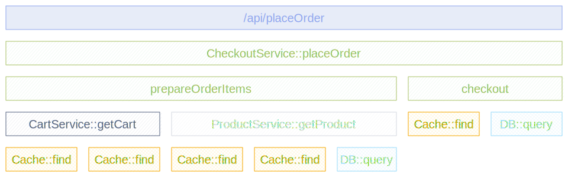

[計装スコープ](/docs/specs/otel/common/instrumentation-scope/)は、送出されたテレメトリーが関連付けられるソフトウェアの論理ユニットです。
モジュール、パッケージ、クラス、ライブラリ、フレームワークなど、あるテレメトリーソースを別のソースと区別するために開発者が選択する、あらゆる意味のある境界を表すことができます。

## スコープの定義方法 {#how-a-scope-is-defined}

スコープは `(name, version, schema_url, attributes)` のタプルで識別されます。
`version`、`schema_url`、`attributes` は省略可能です。
`name` はソフトウェアの論理ユニットを一意に識別する必要があります。たとえば、ライブラリ、クラス、モジュールの完全修飾名などです。

スコープは、トレーサー、メーター、またはロガーをプロバイダーから取得するときに指定します。
そのインスタンスによって生成されたすべてのスパン、メトリクス、ログレコードには、スコープがタグ付けされます。

- **ライブラリやフレームワークの場合**：ライブラリの完全修飾名とバージョンをスコープとして使用します。
  OpenTelemetry の計装が組み込まれていないライブラリ向けの計装ライブラリを作成する場合は、計装ライブラリ自体の名前とバージョンを使用します。
- **アプリケーションコードの場合**：一般的にはクラス名やモジュール名を選択します。たとえば `CheckoutService` です。

## スコープが重要な理由 {#why-scopes-matter}

オブザーバビリティバックエンドでは、スコープによってテレメトリーデータのフィルタリング、グループ化、比較ができます。
これにより、どのライブラリバージョンがレイテンシーの原因になっているかを特定したり、特定のモジュールからのシグナルを分離したり、同じコンポーネントのバージョン間で挙動を比較したりできます。

## トレースにおけるスコープ {#scopes-in-a-trace}

次の図は、6つの異なる計装スコープからのスパンを持つトレースを示しています。各スコープは色分けされ、凡例で識別されます。

- `http-framework` スコープはルートスパン `/api/placeOrder` を生成します。
- `CheckoutService` スコープは `CheckoutService::placeOrder`、`CheckoutService::prepareOrderItems`、`CheckoutService::checkout` を生成します。
  これら3つのスパンは、`CheckoutService` という名前で取得された同じトレーサーインスタンスによって作成されるため、同じ計装スコープを共有します。
- `CartService` スコープと `ProductService` スコープはそれぞれのアプリケーションコンポーネントからスパンを生成します。
- `Cache library` スコープと `DB library` スコープはライブラリコードからのスパンを生成し、ライブラリ名とバージョンでグループ化されています。

