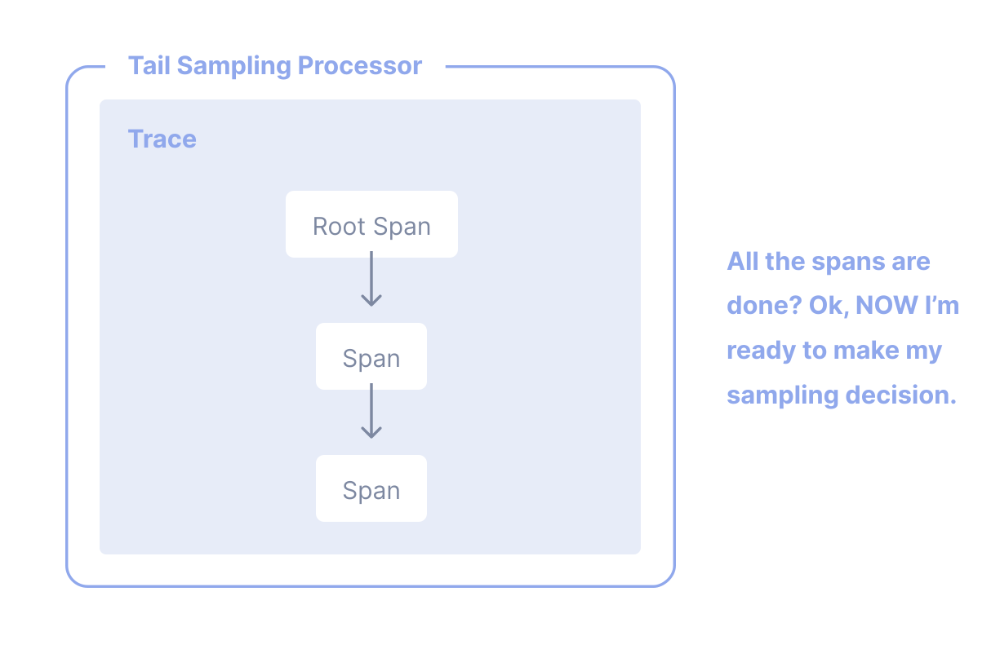

分散システムでは、[トレース](/docs/concepts/signals/traces)で、リクエストが分散システム内のあるサービスから別のサービスに移動するのを観察できます。
トレーシングはシステムの高レベルな分析と詳細な分析の両方において、非常に実用的です。

しかし、リクエストの大半が成功し、許容できるレイテンシーでエラーもなく終了する場合、アプリケーションとシステムを有意義に観測するのに、トレースの 100 % を必要としません。
適切なサンプリングが必要なだけです。

## 用語解説 {#terminology}

サンプリングについて議論する際には、一貫した用語を使用することが重要です。
トレースまたはスパンは、「サンプリングされた」または「サンプリングされていない」と見なされます。

- **サンプリングされた**: トレースまたはスパンが処理され、エクスポートされます。これはサンプラーが母集団の代表として選んだものであるため、「サンプリングされた」とみなされます。
- **サンプリングされていない**: トレースまたはスパンは、処理またはエクスポートされません。サンプラーによって選択されていないため、「サンプリングされていない」とみなされます。

ときどきこれらの用語の定義が混同されることがあります。
誰かが「データをサンプリングアウトしている」と言ったり、処理またはエクスポートされていないデータは「サンプリングされた」と見なされると言ったりするのを見かけるかもしれません。
これらは間違った表現です。

## なぜサンプリングするのか？ {#why-sampling}

サンプリングは、可視性を失わずにオブザーバビリティのコストを削減する最も効果的な方法の 1 つです。
データのフィルタリングや集約といった、より安価な他の方法もありますが、これらの方法はアプリケーションやシステムの動作を詳細に分析する際に重要な代表性の概念に準拠していません。

代表性は、小さな集合が大きな集合を正確に表しているという原則です。
さらに、代表性は数学的に検証可能であるため、小さなデータサンプルが大きなグループを正確に反映していることに高い確信を持つことができます。

加えて、多くのデータを生成するほど、代表的なサンプルを得るために必要なデータ量は実際には少なくなります。
高トラフィックのシステムでは、1 % 以下のサンプリング率でも残りの 99 % のデータを非常に正確に表現できることが一般的です。

### サンプリングすべきとき {#when-to-sample}

もし、次のいずれかを基準の満たす場合、サンプリングを検討してください。

- 1 秒あたり 1000 件以上のトレースを生成している。
- ほとんどのトレースデータが健全なトラフィックを表しており、データの変動が少ない。
- エラーや高レイテンシーなど、問題が発生していることを示す共通の指標がある。
- エラーやレイテンシー以外にも、関連するデータを特定するためのドメイン固有の基準を持っている。
- データをサンプリングするか破棄するかを決定する共通のルールを述べることができる
- サービスごとに識別が可能であり、高トラフィックと低トラフィックのサービスが別々にサンプリングされる
- サンプリングされなかったデータを（「念のため」のシナリオのために）低コストのストレージシステムに保存できる

最終的に、全体の予算を検討してください。
オブザーバビリティの予算に限りがあるが、適切なサンプリングに時間を費やす余裕がある場合、サンプリングは一般的にその価値があります。

### サンプリングすべきでないとき {#when-not-to-sample}

サンプリングが適切でない場合もあります。
次の基準のいずれかを満たしてるため、サンプリングを避けようとしている可能性があります。

- 非常に少ないデータ（1 秒あたり 10 件あたりの小さなトレースまたは、それよりも少ない）を生成している。
- オブザーバビリティデータを集約でのみ使用し、事前にデータを集計できる。
- 規則などの事情によりデータの削除が禁止されている（そして、低コストのストレージにサンプルされていなデータを保存できない）。

最後に、サンプリングに関する 3 つのコストを考慮してください。

1. テイルサンプリングプロキシといった、データを効果的にサンプリングするための計算リソースの直接的なコスト。
2. 関連するアプリケーション、システム、データが増えるにつれて、効果的なサンプリング手法を維持するための間接的なエンジニアリングのコスト。
3. 効果的でないサンプリング技術によって重要な情報を見逃すことによる間接的な機会コスト。

サンプリングは、オブザーバビリティのコストを削減する効果的な方法である一方で、うまく動作しなかったときに予期しない他のコストをもたらす可能性があります。
オブザーバビリティバックエンド、データの性質、そして効果的なサンプリングの試みによっては、かわりにベンダーのまたはセルフホスティング時のコンピューティングを使用して、オブザーバビリティにさらに多くのリソースを割り当てる方が安価になる可能性があります。

## ヘッドサンプリング {#head-sampling}

ヘッドサンプリングは、サンプリングの決定をできるだけ早期に行うために用いられるサンプリング技術です。
スパンやトレースのサンプリングまたはドロップの決定は、トレース全体を検査することによって行われるわけではありません。

たとえば、ヘッドサンプリングのもっとも一般的な形式は、[一貫した確率サンプリング](/docs/specs/otel/trace/tracestate-probability-sampling/#consistent-sampling-decision)です。
決定論的サンプリングと呼ばれることもあります。
この場合、サンプリングの決定は、トレースIDと、サンプリングするトレースの望ましい割合に基づいて行われます。
これにより、全トレースの5%など、一貫した割合で、スパンの欠損無く、全トレースがサンプリングされます。

ヘッドサンプリングの利点は以下の通りです。

- わかりやすい
- 設定しやすい
- 効果的
- トレース収集パイプラインのどの時点でも可能

ヘッドサンプリングの主な欠点は、トレース全体のデータに基づいてサンプリングの決定を下すことができないことです。
たとえば、ヘッドサンプリングを使用して、エラーを含むすべてのトレースを確実にサンプリングすることは不可能です。
そのためには、テイルサンプリングが必要です。

## テイルサンプリング {#tail-sampling}

テイルサンプリングとは、トレース内のすべてのスパンまたはほとんどのスパンを考慮して、トレースのサンプリングを決定することです。
テイルサンプリングは、ヘッドサンプリングでは不可能な、トレースの異なる部分から得られる特定の基準に基づいてトレースをサンプリングするオプションを提供します。

テイルサンプリングの使い方の例としては、以下のようなものがあります。

- エラーを含むトレースを常にサンプリングする
- 全体的なレイテンシーに基づいてトレースをサンプリングする
- トレース内の1つまたは複数のスパンにおける特定の属性の存在または値に基づいてトレースをサンプリングする。たとえば、新しくデプロイされたサービスからより多くのトレースをサンプリングする。
- 低トラフィックのサービスのトレースと高トラフィックのサービスのトレースのように、特定の基準に基づいてトレースに異なるサンプリングレートを適用する

お分かりのように、データのサンプリング手法において、テイルサンプリングはより高度なことを可能にします。
テレメトリーをサンプリングしなければならない大規模なシステムでは、データ量とそのデータの有用性のバランスを取るために、ほとんどの場合、テイルサンプリングを使用する必要があります。

今日のテイルサンプリングには、主に3つの欠点があります。

1. テイルサンプリングの実施は難しいです。
   利用可能なサンプリング技術の種類にもよりますが、それは必ずしも「一度設定したら放置できる」ものではありません。
   システムが変われば、サンプリング戦略も変わります。
   大規模で洗練された分散システムでは、サンプリング戦略を実装するルールも大規模で洗練されたものになります。
2. テイルサンプリングの運用は難しいものです。
   テイルサンプリングを実装するコンポーネントは、大量のデータを受け入れ、保存できるステートフルなシステムでなければなりません。
   トラフィックパターンによっては、リソースの利用方法が異なる数十、数百の計算ノードが必要になることもあります。
   さらに、テイルサンプラーは、受信するデータ量に追いつけない場合、計算量の少ないサンプリング技術に「フォールバック」する必要があるかもしれません。
   このような要因から、テイルサンプリングコンポーネントを監視して、正しいサンプリング決定を行うために必要なリソースを確保することが重要です。
3. テイルサンプラーは、今日、ベンダー固有のテクノロジーの領域で終わることが多いです。
   オブザーバビリティに有料のベンダーを使用している場合、もっとも効果的なテイルサンプリングのオプションは、そのベンダーが提供するものに限定される可能性があります。

最後に、システムによっては、テイルサンプリングがヘッドサンプリングと併用されることがあります。
たとえば、非常に大量のトレースデータを生成する一連のサービスは、最初にヘッドサンプリングを使ってトレースのごく一部だけをサンプリングし、テレメトリーパイプラインの後半でテイルサンプリングを使って、バックエンドにエクスポートする前に、より洗練されたサンプリング決定を行うことができます。
これは、テレメトリーパイプラインが過負荷にならないように保護するために、しばしば行われます。

## サポート {#support}

### コレクター {#collector}

OpenTelemetryコレクターには、以下のサンプリングプロセッサーがあります。

- [Probabilistic Sampling Processor（確率的サンプリングプロセッサー）](https://github.com/open-telemetry/opentelemetry-collector-contrib/tree/main/processor/probabilisticsamplerprocessor)
- [Tail Sampling Processor（テイルサンプリングプロセッサー）](https://github.com/open-telemetry/opentelemetry-collector-contrib/tree/main/processor/tailsamplingprocessor)

### 言語SDK {#language-sdks}

OpenTelemetry API & SDK の各言語固有の実装については、それぞれのドキュメントページでサンプリングのサポート状況を確認出来ます。

{}
