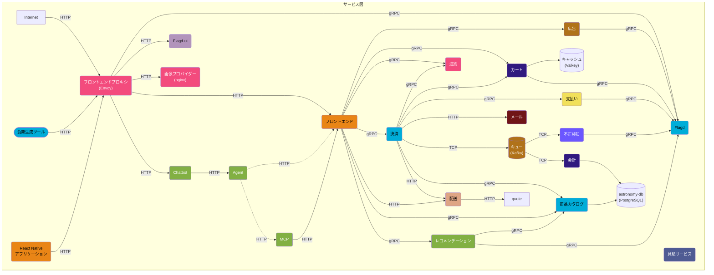
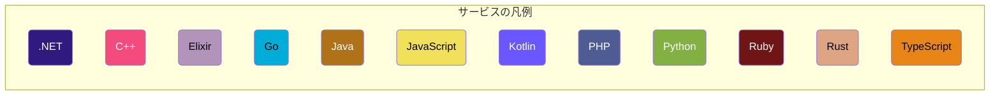
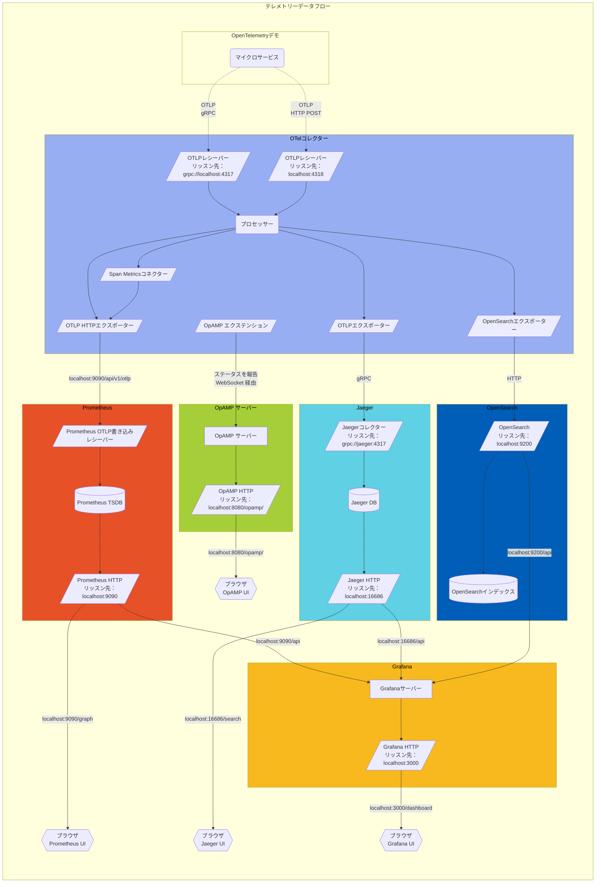

**OpenTelemetryデモ** は、異なるプログラミング言語で書かれた複数のマイクロサービスから構成されており、gRPCとHTTPを使って相互に通信を行います。
さらに、負荷生成ツールが含まれており、[k6](https://k6.io/)を使用して、ユーザートラフィックを模擬的に生成します。

```mermaid
graph TD
subgraph サービス図
accounting(会計):::dotnet
ad(広告):::java
agent(Agent):::python
cache[(キャッシュ<br/>&#40Valkey&#41)]
cart(カート):::dotnet
chatbot(Chatbot):::python
checkout(決済):::golang
currency(通貨):::cpp
email(メール):::ruby
flagd(Flagd):::golang
flagd-ui(Flagd-ui):::elixir
fraud-detection(不正検知):::kotlin
frontend(フロントエンド):::typescript
frontend-proxy(フロントエンドプロキシ <br/>&#40Envoy&#41):::cpp
image-provider(画像プロバイダー <br/>&#40nginx&#41):::cpp
load-generator([負荷生成ツール]):::golang
mcp(MCP):::python
payment(支払い):::javascript
product-catalog(商品カタログ):::golang
quoteservice(見積サービス):::php
recommendation(レコメンデーション):::python
shipping(配送):::rust
queue[(キュー<br/>&#40Kafka&#41)]:::java
react-native-app(React Native<br>アプリケーション):::typescript
postgresql[(astronomy-db<br/>&#40PostgreSQL&#41)]

chatbot -->|HTTP| agent
agent -.->|HTTP| frontend
agent -.->|HTTP| mcp

ad --->|gRPC| flagd

checkout -->|gRPC| currency
checkout -->|gRPC| cart
cart --> cache
cart --->|gRPC| flagd

checkout --->|gRPC| payment
checkout --->|HTTP| email
checkout -->|TCP| queue
checkout ---->|gRPC| product-catalog
checkout -->|HTTP| shipping
shipping -->|HTTP| quote

fraud-detection --->|gRPC| flagd

frontend -->|gRPC| ad
frontend ---->|gRPC| cart
frontend -->|gRPC| currency
frontend -->|gRPC| checkout
frontend -->|HTTP| shipping
frontend -->|gRPC| product-catalog
frontend --->|gRPC| recommendation

frontend-proxy -->|gRPC| flagd
frontend-proxy -->|HTTP| flagd-ui
frontend-proxy -->|HTTP| image-provider
frontend-proxy -->|HTTP| frontend
frontend-proxy -->|HTTP| chatbot

mcp -->|HTTP| frontend

payment --->|gRPC| flagd

queue -->|TCP| fraud-detection

recommendation -->|gRPC| product-catalog
recommendation ----->|gRPC| flagd

product-catalog --> postgresql

Internet -->|HTTP| frontend-proxy
load-generator -->|HTTP| frontend-proxy
react-native-app -->|HTTP| frontend-proxy
accounting --> postgresql
queue -->|TCP| accounting

end

classDef dotnet fill:#311a7f,color:white;
classDef cpp fill:#f34b7d,color:white;
classDef elixir fill:#b294bb,color:black;
classDef golang fill:#00add8,color:black;
classDef java fill:#b07219,color:white;
classDef javascript fill:#f1e05a,color:black;
classDef kotlin fill:#6b57ff,color:white;
classDef php fill:#4F5B93,color:white;
classDef python fill:#82b043,color:white;
classDef ruby fill:#701516,color:white;
classDef rust fill:#dea584,color:black;
classDef typescript fill:#e98516,color:black;
```

```mermaid
graph LR
subgraph サービスの凡例
  dotnetsvc(.NET):::dotnet
  cppsvc(C++):::cpp
  elixirsvc(Elixir):::elixir
  golangsvc(Go):::golang
  javasvc(Java):::java
  javascriptsvc(JavaScript):::javascript
  kotlinsvc(Kotlin):::kotlin
  phpsvc(PHP):::php
  pythonsvc(Python):::python
  rubysvc(Ruby):::ruby
  rustsvc(Rust):::rust
  typescriptsvc(TypeScript):::typescript
end

classDef dotnet fill:#311a7f,color:white;
classDef cpp fill:#f34b7d,color:white;
classDef elixir fill:#b294bb,color:black;
classDef golang fill:#00add8,color:black;
classDef java fill:#b07219,color:white;
classDef javascript fill:#f1e05a,color:black;
classDef kotlin fill:#6b57ff,color:white;
classDef php fill:#4F5B93,color:white;
classDef python fill:#82b043,color:white;
classDef ruby fill:#701516,color:white;
classDef rust fill:#dea584,color:black;
classDef typescript fill:#e98516,color:black;
```

デモアプリケーションの[ログ](/docs/demo/telemetry-features/log-coverage/)、[メトリクス](/docs/demo/telemetry-features/metric-coverage/) と[トレース](/docs/demo/telemetry-features/trace-coverage/) の計装の現状については、これらのリンクをご確認ください。

コレクターの設定は [otelcol-config.yml](https://github.com/open-telemetry/opentelemetry-demo/blob/main/src/otel-collector/otelcol-config.yml) で行われており、代替のエクスポーターをここで設定することができます。

オブザーバビリティスタックと合わせて実行する場合、Collector は [OpAMP エクステンション](https://github.com/open-telemetry/opentelemetry-collector-contrib/tree/main/extension/opampextension)を通じてデモの OpAMP サーバーにも接続し、ヘルス、バージョン、属性、および有効な設定を報告します。
OpAMP UI（<http://localhost:8080/opamp/>）を開き、Collector インスタンスを選択して報告されたステータスを確認してください。

```mermaid
graph TB
subgraph tdf[テレメトリーデータフロー]
   subgraph subgraph_padding [ ]
       style subgraph_padding fill:none,stroke:none;
       %% タイトルの重複を防ぐためのパディング
       subgraph od[OpenTelemetryデモ]
       ms(マイクロサービス)
       end

       ms -.->|"OTLP<br/>gRPC"| oc-grpc
       ms -.->|"OTLP<br/>HTTP POST"| oc-http

       subgraph oc[OTelコレクター]
           style oc fill:#97aef3,color:black;
           oc-grpc[/"OTLPレシーバー<br/>リッスン先：<br/>grpc://localhost:4317"/]
           oc-http[/"OTLPレシーバー<br/>リッスン先：<br/>localhost:4318<br/>"/]
           oc-proc(プロセッサー)
           oc-spanmetrics[/"Span Metricsコネクター"/]
           oc-prom[/"OTLP HTTPエクスポーター"/]
           oc-otlp[/"OTLPエクスポーター"/]
           oc-opensearch[/"OpenSearchエクスポーター"/]

           oc-grpc --> oc-proc
           oc-http --> oc-proc

           oc-proc --> oc-prom
           oc-proc --> oc-otlp
           oc-proc --> oc-opensearch
           oc-proc --> oc-spanmetrics
           oc-spanmetrics --> oc-prom

           oc-opamp[/"OpAMP エクステンション"/]

       end

       oc-prom -->|"localhost:9090/api/v1/otlp"| pr-sc
       oc-otlp -->|gRPC| ja-col
       oc-opensearch -->|HTTP| os-http

       subgraph op[OpAMP サーバー]
           style op fill:#a6ce39,color:black;
           op-srv["OpAMP サーバー"]
           op-http[/"OpAMP HTTP<br/>リッスン先：<br/>localhost:8080/opamp/"/]

           op-srv --> op-http
       end

       oc-opamp -->|"ステータスを報告<br/>WebSocket 経由"| op-srv

       op-b{{"ブラウザ<br/>OpAMP UI"}}
       op-http -->|"localhost:8080/opamp/"| op-b

       subgraph pr[Prometheus]
           style pr fill:#e75128,color:black;
           pr-sc[/"Prometheus OTLP書き込みレシーバー"/]
           pr-tsdb[(Prometheus TSDB)]
           pr-http[/"Prometheus HTTP<br/>リッスン先：<br/>localhost:9090"/]

           pr-sc --> pr-tsdb
           pr-tsdb --> pr-http
       end

       pr-b{{"ブラウザ<br/>Prometheus UI"}}
       pr-http ---->|"localhost:9090/graph"| pr-b

       subgraph ja[Jaeger]
           style ja fill:#60d0e4,color:black;
           ja-col[/"Jaegerコレクター<br/>リッスン先：<br/>grpc://jaeger:4317"/]
           ja-db[(Jaeger DB)]
           ja-http[/"Jaeger HTTP<br/>リッスン先：<br/>localhost:16686"/]

           ja-col --> ja-db
           ja-db --> ja-http
       end

       subgraph os[OpenSearch]
           style os fill:#005eb8,color:black;
           os-http[/"OpenSearch<br/>リッスン先：<br/>localhost:9200"/]
           os-db[(OpenSearchインデックス)]

           os-http ---> os-db
       end

       subgraph gr[Grafana]
           style gr fill:#f8b91e,color:black;
           gr-srv["Grafanaサーバー"]
           gr-http[/"Grafana HTTP<br/>リッスン先：<br/>localhost:3000"/]

           gr-srv --> gr-http
       end

       pr-http --> |"localhost:9090/api"| gr-srv
       ja-http --> |"localhost:16686/api"| gr-srv
       os-http --> |"localhost:9200/api"| gr-srv

       ja-b{{"ブラウザ<br/>Jaeger UI"}}
       ja-http ---->|"localhost:16686/search"| ja-b

       gr-b{{"ブラウザ<br/>Grafana UI"}}
       gr-http -->|"localhost:3000/dashboard"| gr-b
   end
end
```

Protocol Bufferの定義は /pb/ ディレクトリにあります。
