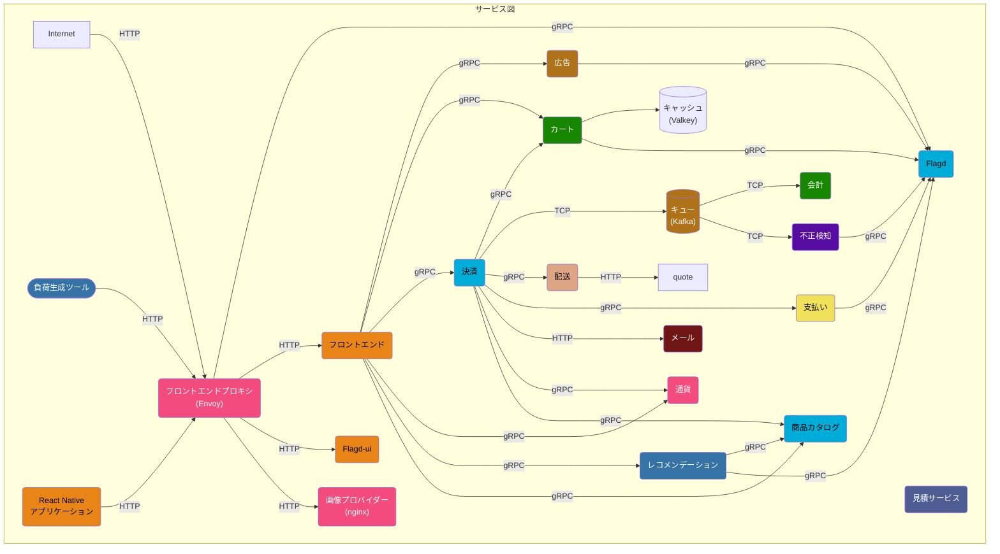

**OpenTelemetryデモ** は、異なるプログラミング言語で書かれた複数のマイクロサービスから構成されており、gRPCとHTTPを使って相互に通信を行います。
さらに、負荷生成ツールが含まれており、[Locust](https://locust.io/)というツールを使用して、ユーザートラフィックを模擬的に生成します。

デモアプリケーションの[メトリック](/docs/demo/telemetry-features/metric-coverage/) と [トレース](/docs/demo/telemetry-features/trace-coverage/) の計装の現状については、リンクをご確認ください。

コレクターの設定は [otelcol-config.yml](https://github.com/open-telemetry/opentelemetry-demo/blob/main/src/otel-collector/otelcol-config.yml) で行われており、代替のエクスポーターをここで設定することができます。

Protocol Bufferの定義は /pb/ ディレクトリにあります。
