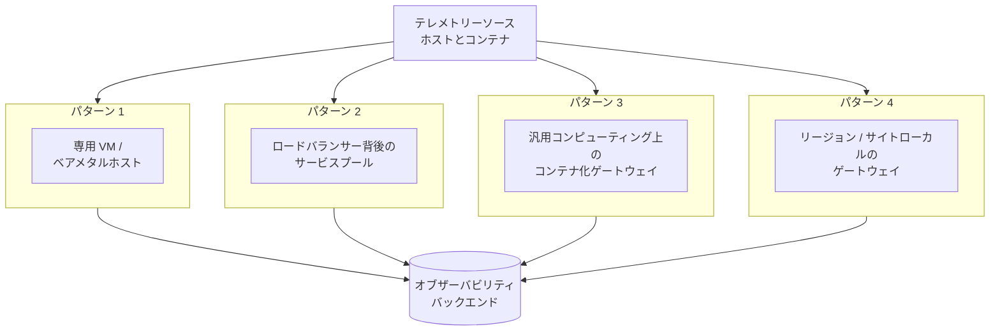
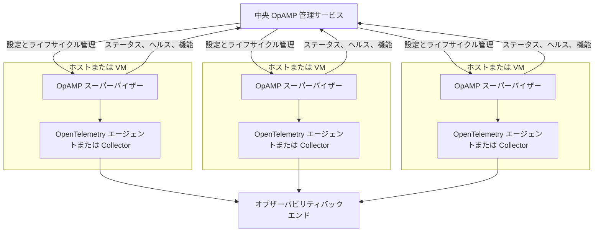
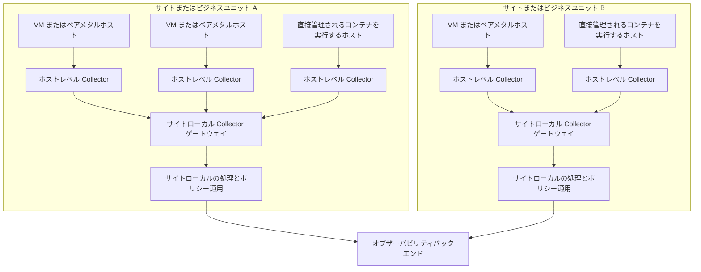

## 概要 {#summary}

このブループリントは、従来の仮想マシン（VM）、ベアメタル、およびオンプレミス環境で運用するプラットフォームエンジニアリングチームと SRE チームに向けた戦略的リファレンスの概要を示します。
これには、Kubernetes のようなオーケストレーターなしでオペレーティングシステム上にコンテナを直接実行するシナリオも含まれます。

このブループリントは、異種インフラストラクチャ、レガシープロセス、およびコンテナ化されたワークロード全体にわたって一貫したオブザーバビリティを確立しようとする際によく見られる摩擦に対処します。

このブループリントのパターンを実装することで、組織は次の成果を達成できると期待できます。

- 非 Kubernetes 環境で実行されるアプリケーションおよびサービスに対する、すぐに使える高品質なテレメトリー。直接管理されるコンテナを含みます。
- OpenTelemetry エージェントの一貫したライフサイクル管理と、SDK ベースの計装のための標準化されたブートストラップおよび設定パターン。
- VM、ベアメタル、オーケストレーターなしのコンテナなど、混合インフラストラクチャ全体にわたる統一されたオブザーバビリティ。
- テレメトリーシグナルの品質、データエンリッチメント、ルーティング、エクスポートパイプラインに対する改善されたガバナンス。
- 開発者およびオペレーターの手作業および認知的負荷の軽減。

## 背景 {#background}

多くの組織は、Kubernetes に加えて、または Kubernetes のかわりに、レガシーインフラストラクチャ、VM、ベアメタルサーバー、およびランタイムへの直接コンテナデプロイメントの混在環境を維持しています。
これらの環境は複雑であり、オーケストレーターが提供する自動化や標準化が欠けていることがよくあります。
これらのシナリオで一貫した高品質のオブザーバビリティを確保することは重要ですが、断片化されたツールや手動プロセスによって頻繁に妨げられています。

[Open Agent Management Protocol（OpAMP）](/docs/specs/opamp/) は、サポートされている場合に、多様なインフラストラクチャ全体で OpenTelemetry エージェントをリモートで管理、設定、監視するための標準化された方法を提供します。
本稿執筆時点では、OpAMP 仕様はベータ版であるため、組織は特定のソリューションに標準化する前に、実装の成熟度と運用サポートを評価する必要があります。
OpAMP がまだ適切でない場合でも、共有ライブラリ、事前構築済みイメージ、一元管理された設定アーティファクト、および既存のデプロイメントや構成管理ツールにより、SDK およびエージェントベースの計装に対して一貫したライフサイクル管理を提供できます。

## 一般的な課題 {#common-challenges}

非 Kubernetes 環境で運用する組織は、効果的なオブザーバビリティを妨げる一連の課題に通常直面します。
ビルトインの自動化、標準化、および集中管理がなければ、これらの環境では多様なインフラストラクチャとアプリケーションのランドスケープ全体にわたって一貫した高品質のテレメトリーを確保することが困難になりがちです。
これらのオブザーバビリティの課題の多くは、非 Kubernetes 環境に特有のものではありません。
しかし、非 Kubernetes 環境では、チームはロールアウト管理、サービスディスカバリ、メタデータエンリッチメント、および集中的なポリシー配布のためのビルトインのプラットフォームメカニズムが少ないことが多いです。

### 1. テレメトリーのデプロイメントと管理の自動化が限定的 {#1-limited-automation-for-telemetry-deployment-and-management}

VM、ベアメタル、および直接管理されるコンテナへの計装とエージェントのデプロイメントは、多くの場合手動またはスクリプトベースであり、継続的な設定を大規模に管理することは困難です。
この分散的でアドホックなアプローチでは、通常、オペレーターまたは開発者が各ホストまたはワークロードに個別に OpenTelemetry エージェントをインストール、設定、更新する必要があります。

これにより次の問題が生じます。

- **高い手作業負荷：** 新しいワークロードやホストには、繰り返しの、エラーが発生しやすい設定手順が必要です。
- **遅いロールアウトと更新サイクル：** 計装や設定の更新は遅く、フリート全体に伝搬させることが困難です。
- **運用リスク：** ロールバック、バージョン管理、ヘルスモニタリングを環境全体で一貫して実行することがより困難です。

この自動化のギャップは、課題 2 で説明する断片化の下地にもなります。
各ホストやワークロードが手動で設定されると、チームはエージェント、SDK、エクスポーターについて独自の選択を行う傾向があり、それらの整合性を取ることが困難になります。

### 2. 断片化した計装アプローチ {#2-fragmented-instrumentation-approaches}

課題 1 で説明した自動化の欠如に基づき、標準化されたデプロイメントと管理パターンの不在により、チームはホストベースおよびコンテナ化されたワークロードに対して異なる OpenTelemetry エージェント、SDK、またはエクスポーターを採用することになります。

これにより次の問題が生じます。

- **一貫性のないセマンティック規約：** テレメトリーシグナルに、`service.name`、`host.id`、`host.name`、`container.id`、`deployment.environment` などの標準的なリソース属性が欠けている場合があり、システム間の相関が困難になります。
- **計装の動作の不一致：** チームによって、サンプリング、伝搬、リソース検出、エクスポートのデフォルトが異なる場合があり、テレメトリー品質にばらつきが生じます。
- **手動設定のドリフト：** ホストベースおよびコンテナベースのエージェントは頻繁に手動設定を必要とし、ドリフトとエラーリスクの増加を招きます。

### 3. サイロ化されたデータ処理とエクスポート {#3-siloed-data-processing-and-export}

自動化のギャップ（課題 1）とそれに起因する断片化（課題 2）は、データパイプライン層で複合的に作用します。
データ収集とエクスポートパイプラインは、多くの場合、アプリケーション単位、ホスト単位、またはチーム単位で設定されます。
集中管理がない場合、個々のチームが各ワークロードや環境に対してテレメトリーエージェント、エクスポーター、データ処理ロジックを独自に設定する可能性があります。

これにより次の問題が生じます。

- **重複した作業：** チームが環境間でデータエンリッチメント、フィルタリング、ルーティングロジックを重複して実装する可能性があります。
- **一貫性のないポリシー適用：** リダクション、リトライ動作、バッチ処理、ルーティングポリシーがチーム間で異なる場合があります。
- **可視性の欠如：** 運用チームとガバナンスチームは、どのテレメトリーが収集され、どのように処理またはエクスポートされるかについて、統一的なコントロールを持てません。

## 一般的なガイドライン {#general-guidelines}

上記の課題に対処するために、組織は多様な環境全体にわたるオブザーバビリティの実践を合理化するよう設計された一連の戦略的ガイドラインを採用する必要があります。
これらのガイドラインは、計装の標準化、エージェント管理の自動化、および一貫したデータ品質の確保のための基盤を提供します。

### 1. エージェントのライフサイクルを一元管理しつつ、制御されたカスタマイズを許可する {#1-centrally-manage-agent-lifecycle-while-allowing-controlled-customization}

**対処する課題：** 1、2

OpAMP がサポートされ、運用上適切な場合に、システムサービスまたはサービスコンテナとして実行されている OpenTelemetry エージェントを一元管理するために OpAMP を使用します。

OpAMP 仕様は現在ベータ版であるため、組織は特定のソリューションに標準化する前に、自環境で利用可能な実装の成熟度とサポート可能性を評価する必要があります。
OpAMP がサポートされていないか、まだ適切でない場合、組織は構成管理ツール、ゴールデンイメージ、標準化されたデプロイメントアーティファクトなどの他の集中管理メカニズムを使用して、一貫したエージェントのデプロイメント、設定、ライフサイクル管理を維持する必要があります。

管理メカニズムに関係なく、プラットフォームチームはベースラインのエージェントディストリビューション、必須のプロセッサーとエクスポーター、セキュリティ設定、ヘルスレポート、およびデフォルトのリソース検出動作を管理する必要があります。

同時に、組織は環境固有またはワークロード固有のカスタマイズをどのように許可するかを明示的に定義する必要があります。
実用的なモデルは、**レイヤード設定アプローチ** を使用することです。

- **プラットフォーム所有のベースライン**。通常は**プラットフォームエンジニアリングチーム**が所有し、必須のデフォルト、セキュリティ制御、および組織全体のプロセッサー/エクスポーターを定義します。
- **環境オーバーレイ**。通常は**インフラストラクチャまたは環境オペレーター**が所有し、エンドポイント、テナンシー、デプロイメント環境、サイト固有のメタデータ、ネットワーク固有の設定などの差異を定義します。
- **ワークロードオーバーレイ**。通常は**アプリケーションチーム**がプラットフォーム定義のガードレール内で所有し、オプトインのレシーバー、追加のリソース属性、安全なチューニングパラメーターなど、承認されたバリエーションを定義します。

これにより、標準化と柔軟性の間に明確な境界が生まれます。
チームは、一元管理されていないワンオフのデプロイメントを作成することなく、設定の承認された部分を拡張できます。

このガイドラインを実装することで、組織は次の成果を達成できると期待できます。

- すべての環境にわたる自動化された一貫したテレメトリー設定。
- 手動エラーの削減と新しいワークロードのオンボーディングの簡素化。
- エージェント設定のより迅速で安全なアップグレードとロールバック。
- 中央のガバナンスを犠牲にすることなく、ローカルカスタマイズを行うための制御されたメカニズム。

### 2. OpenTelemetry Collector ゲートウェイレイヤーによるテレメトリー収集と処理の一元化 {#2-centralize-telemetry-collection-and-processing-through-an-opentelemetry-collector-gateway-layer}

**対処する課題：** 2、3

ホストおよび直接管理されるコンテナからのテレメトリーデータの集約ポイントとして、1 つ以上の [OpenTelemetry Collector ゲートウェイ](/docs/collector/deploy/gateway/)をデプロイします。
このコンテキストでの「一元化」は、必ずしも単一のグローバルデプロイメントを意味するわけではありません。
組織構造、ネットワーク境界、分離要件、トラフィックパターンに応じて、ゲートウェイレイヤーは、リージョン別、サイト別、環境別、クラウドアカウント別など、異なるレベルで実装でき、そのスコープ内で集中的なポリシー適用を提供します。

非 Kubernetes 環境では、これらのゲートウェイは、スケールと運用モデルに応じて、次のような複数のパターンでデプロイできます。

- 専用のゲートウェイ VM またはベアメタルホスト。
- ロードバランサーの背後にあるサービスプール。
- 汎用コンピューティング上で実行されるコンテナ化されたゲートウェイサービス。
- 分散環境向けのリージョンまたはサイトローカルのゲートウェイ。

以下の図は、ゲートウェイティアとその代替デプロイメントパターンを示しています。
各ボックスはゲートウェイの役割を実装するための個別の方法を表しています。
組織は通常、1 つのパターンを選択するか、サイト間でパターンを組み合わせます。

このガイドラインを実装することで、組織は次の成果を達成できると期待できます。

- データ処理、エンリッチメント、エクスポートパイプラインに対する統一的なコントロール。
- 簡素化されたガバナンスと、組織全体のポリシーのより容易な実装。
- ホストやアプリケーションから外部オブザーバビリティバックエンドへの直接接続の削減。これにより、ファイアウォールとネットワークポリシーの管理が簡素化されます。
- ホスト単位やアプリケーション単位のエクスポートトポロジよりも優れた耐障害性とスケーラビリティ。
- ローカルな収集と集中的なポリシー適用の明確な分離。

### 3. リソース帰属の標準化と再利用可能な計装ビルディングブロックの配布 {#3-standardize-resource-attribution-and-distribute-reusable-instrumentation-building-blocks}

**対処する課題：** 2

組織全体のリソース帰属に対するテレメトリー標準を定義し、すべてのワークロードに一貫して適用されるようにします。
これはドキュメントだけに頼るべきではなく、次のような再利用可能なビルディングブロックを通じて提供する必要があります。

- 事前構築済みエージェントイメージ。
- 該当する場合に、パッケージ化された言語エージェントおよび自動計装アーティファクト。
- 標準化された OpenTelemetry Collector バイナリまたはディストリビューション。
- SDK ベースの計装のための共有ライブラリまたはスターターパッケージ。
- 標準的な起動ラッパーまたは環境変数の規約。
- 一元管理された設定スニペットまたはテンプレート。

非 Kubernetes 環境の推奨リソースモデルは、[OpenTelemetry リソースセマンティック規約](/docs/specs/semconv/resource/)に準拠し、可能な限り自動リソース検出に依存する必要があります。
OpenTelemetry では、リソースはテレメトリーを生成したエンティティ（ホスト、VM、プロセス、コンテナ、サービスインスタンスなど）を識別します。
実際には、組織は、サポートされている場合に自動検出された属性を使用して、次のリソースドメイン間でテレメトリーを相関させることができるようにする必要があります。

- **[ホスト](/docs/specs/semconv/resource/host/)**
- **[デバイス](/docs/specs/semconv/resource/device/)**（該当する場合）
- **[プロセス](/docs/specs/semconv/resource/process/)**
- **[プロセスランタイム](/docs/specs/semconv/resource/process/#process-runtimes)**
- **[オペレーティングシステム](/docs/specs/semconv/resource/os/)**
- **[コンテナ](/docs/specs/semconv/resource/container/)**（該当する場合）
- **[サービスアイデンティティ](/docs/specs/semconv/resource/#service)**

対応するすべての属性を手動で維持するのではなく、組織はホスト、プロセス、ランタイム、OS、コンテナのメタデータについて既存の計装とリソース検出を優先し、共有設定またはブートストラップアーティファクトを使用してその検出を一貫して有効にしておく必要があります。

最も意図的な標準化が必要な領域は、通常、**サービスアイデンティティ** です。
組織は、サービステレメトリーが `service.name` などの属性や、関連する場合は `service.version`、`service.namespace`、`service.instance.id`、`deployment.environment` を含む適切な[サービスセマンティック規約](/docs/specs/semconv/registry/attributes/service/)を使用するようにする必要があります。

どのサービス属性を含めるべきかは、ワークロードのデプロイおよび識別方法によって異なります。
たとえば、`service.namespace` は組織またはプラットフォームの境界を超えてサービスを区別するのに役立つ場合があり、`service.instance.id` は同じサービスの複製されたインスタンスを区別するために必要な場合があります。

アプリケーションテレメトリーには、ホストおよびインフラストラクチャレベルのテレメトリーとの相関をサポートするのに十分なサービスおよびインフラストラクチャコンテキストを含める必要があります。
各リソースタイプに適用される識別属性については、セマンティック規約を情報源として使用します。

このガイドラインを実装することで、組織は次の成果を達成できると期待できます。

- システム間のテレメトリーデータの相関と検索性の向上。
- インフラストラクチャの種類に関係なく、より容易な分析とトラブルシューティング。
- すべてのチームが計装パターンを再発明する必要なく、一貫したメタデータ品質。
- 再利用可能でサポートされたビルディングブロックによる迅速な導入。

## 実装 {#implementation}

これらのガイドラインを実践に移すには、自動化、標準化されたツール、および集中管理の組み合わせが必要です。
以下の実装ステップは、組織が順番に計画して実行できるチェックリスト形式のアクションを含むロードマップ項目として記述されています。

### 1. ベースラインテレメトリー標準とレイヤード設定モデルの定義 {#1-define-a-baseline-telemetry-standard-and-layered-configuration-model}

**サポートするガイドライン：** 1、3

組織の最低限必要なテレメトリー標準を定義し、テレメトリー設定のどの部分が一元所有されるか、どの部分がローカルにカスタマイズ可能かを文書化します。
これには、ホストまたはサービスエージェント、該当する場合の言語エージェント、SDK ベースの計装、およびローカルの収集または転送に使用される OpenTelemetry Collector のサポートされた設定が含まれます。
OpAMP が使用される場合、このモデルに合わせて、一元管理されるエージェント設定が同じベースラインと承認されたオーバーレイに従うようにする必要があります。
これは大規模な一貫性の基盤です。

チェックリスト：

- すべてのワークロードが出力しなければならない必須のリソース属性とシグナル規約を定義する。
- エージェント、該当する場合の言語エージェント、SDK、および OpenTelemetry Collector を含む、サポートされるテレメトリーコンポーネントのベースライン設定を定義する。
- 各コンポーネントの役割に応じて、エクスポーター、認証、TLS、ヘルスレポート、デフォルトのプロセッサーを標準化する。
- 環境固有およびワークロード固有のカスタマイズに許可される拡張ポイントを定義する。
- 安全にロールアウトおよびロールバックできるように、すべてのベースラインおよびオーバーレイ設定をバージョン管理する。
- チームが変更できるものとできないものを把握できるように、所有権の境界を公開する。

ドキュメント：

- [OpAMP 仕様](/docs/specs/opamp/)
- [OpenTelemetry セマンティック規約](/docs/specs/semconv/)

### 2. エージェント向け OpAMP 管理プレーンの構築 {#2-stand-up-an-opamp-management-plane-for-agents}

**サポートするガイドライン：** 1

サポートされるエージェントに対して、エージェントの設定、ステータスレポート、ヘルスモニタリング、制御されたロールアウトを管理するための中央 OpAMP 管理機能を提供します。
このブループリントは管理パターンを推奨するものであり、特定のサーバー実装例を推奨するものではありません。
組織は自環境に適した本番対応ソリューションを使用する必要があります。

チェックリスト：

- 自環境で使用されるディストリビューションの機能（たとえば、アップストリームかベンダー固有か、OpAMP クライアントが組み込まれているか、[OpenTelemetry Collector 用 OpAMP スーパーバイザー](https://github.com/open-telemetry/opentelemetry-collector-contrib/tree/main/cmd/opampsupervisor)を使用しているか、OpAMP がコンパイル済みか別途パッケージされているか）と、一元管理したいコンポーネントに基づいて、OpAMP を通じて管理するエージェントまたは OpenTelemetry Collector デプロイメントを決定する。
- [Collector 管理ドキュメント](/docs/collector/management/#opamp)に従い、適切な認証、認可、トランスポートセキュリティを備えた本番対応の OpAMP サーバーまたは管理エンドポイントを構築または採用する。
- [OpAMP 仕様](/docs/specs/opamp/)で定義されているように、エージェントまたはスーパーバイザーが管理サービスに登録し、アイデンティティ、機能、ヘルス、有効な設定ステータスを報告するように設定する。
- 設定変更を段階的にロールアウトできるように、エージェントを開発、ステージング、本番、リージョン、環境などの論理グループに編成する。
- 設定更新がロールアウトグループ間でどのようにプロモーションされるか、失敗した変更がどのように検出されて元に戻されるかを定義する。
- フリートが制御下に保たれるように、管理プレーンの健全性、エージェントの接続性、更新ステータス、設定ドリフトを監視する。

OpAMP は、機能のスコープが異なる 2 つの方法で OpenTelemetry Collector と統合できます。

- **OpAMP スーパーバイザー** の使用 — Collector のライフサイクルを管理し、ステータス、ヘルス、機能のレポートに加えてリモート設定を適用する、別個のホストローカルプロセスです。
  これは最も機能が豊富な統合であり、OpAMP が設定とライフサイクル管理の主要メカニズムである場合に適しています。

- **Collector のビルトイン OpAMP エクステンション** の使用 — 管理サービスにステータス、ヘルス、機能をレポートする軽量な統合ですが、リモート設定の配信やライフサイクル管理は行いません。
  設定とライフサイクルが既に他のツール（たとえば、構成管理、ゴールデンイメージ、パッケージ化されたディストリビューション）によって処理されており、OpAMP が主にエージェントフリートの集中的なオブザーバビリティに使用される場合に適しています。

スーパーバイザーベースのデプロイメントでは、管理サービスがホストローカルのスーパーバイザーと通信し、スーパーバイザーがローカルのエージェントまたは Collector のライフサイクルと設定を管理します。
以下の図はスーパーバイザーパターンを示しています。
エクステンションのみのパターンは類似していますが、スーパーバイザーのボックスが削除され、管理サービスがステータスレポートのみで Collector と直接通信します。

ドキュメント：

- [OpAMP 仕様](/docs/specs/opamp/)
- [OpAMP 入門ガイド](/docs/collector/management/)
- [OpenTelemetry Collector の設定](/docs/collector/configuration/)

### 3. 標準化されたエージェントと SDK ブートストラップアーティファクトのパッケージングとデプロイ {#3-package-and-deploy-standardized-agents-and-sdk-bootstrap-artifacts}

**サポートするガイドライン：** 1、3

構成管理とイメージパッケージングを使用して、サポートされるテレメトリーコンポーネントをホストおよびコンテナ化されたワークロード全体に一貫してデリバリーします。
サポートされている場合は、SDK ベースの計装に[宣言的設定](/docs/specs/otel/configuration/#declarative-configuration)を優先します。
利用できない場合は、環境変数、起動オプション、または [SDK 固有の設定](/docs/languages/sdk-configuration/)パターンを標準化して、チームが最小限の手動セットアップで一貫したデフォルトを継承できるようにします。

一般的なパッケージングパターンには、ホストベースエージェント向けの標準システムサービスパッケージ、Collector またはエージェントデプロイメント向けの事前構築済みコンテナイメージ、スターターパッケージや起動ラッパーなどの共有 SDK ブートストラップアーティファクトが含まれます。
たとえば：

- ホストベースの Collector は、一元管理された設定ファイルと環境ファイルを持つ標準システムサービスとしてインストールできます。
- コンテナ化されたデプロイメントは、承認された Collector バイナリ、エクステンション、デフォルト設定を含む事前構築済みイメージを使用できます。
- SDK ベースの計装は、組織が承認したデフォルトを自動的に適用する共有の起動ラッパー、[言語エージェント](/docs/zero-code/)、またはスターターパッケージを通じて配布できます。

チェックリスト：

- ホストベースエージェントを標準システムサービスとしてパッケージ化する。
- コンテナ化されたデプロイメント向けに事前構築済みイメージまたはサービスコンテナ定義を提供する。
- サポートされる SDK 言語向けに共有ライブラリ、スターターパッケージ、またはブートストラップラッパーを公開する。
- サポートされている場合は宣言的 SDK 設定を優先し、それ以外の場合は環境間で環境変数、起動、設定ファイルの規約を標準化する。
- 新しいワークロードがデフォルトでベースライン設定を継承することを検証する。

ドキュメント：

- [OpenTelemetry Collector の設定](/docs/collector/configuration/)
- [OpenTelemetry 言語 SDK と API](/docs/languages/)
- [OpenTelemetry ゼロコード計装](/docs/zero-code/)
- [Java ゼロコード計装](/docs/zero-code/java/)
- [Java エージェントの設定](/docs/zero-code/java/agent/configuration/)

### 4. OpenTelemetry Collector ゲートウェイレイヤーのデプロイ {#4-deploy-an-opentelemetry-collector-gateway-layer}

**サポートするガイドライン：** 2

中央の処理およびエクスポートティアとして、1 つ以上の OpenTelemetry Collector ゲートウェイをデプロイします。
専用 VM、ロードバランサー背後のサービスプール、リージョンゲートウェイノードなど、環境に適したトポロジを選択します。

チェックリスト：

- 各環境のゲートウェイデプロイメントトポロジを選択する。
- ローカルエージェントがゲートウェイを検出して接続する方法を定義する。
- バッチ処理、メモリ保護、エンリッチメント、リトライ、ルーティングのためのプロセッサーを設定する。
- スケールが必要な場合、軽量なインジェストとより重い集中処理を分離する。
- ゲートウェイの高可用性とフェイルオーバー動作を定義する。
- オブザーバビリティバックエンドへのエンドツーエンドのルーティングを検証する。

非 Kubernetes 環境での一般的なパターンは、個々のホスト上でホストレベルの Collector を実行し、テレメトリーをサイトローカルまたはリージョンローカルの Collector ゲートウェイに転送することです。
そのゲートウェイレイヤーは水平スケーラブルで高可用性であるべきであり、クラウドネイティブなスケーリングパターンや非クラウドインフラストラクチャでの同等の高可用性セットアップなど、環境に適した負荷分散とフェイルオーバーメカニズムを使用する必要があります。

ドキュメント：

- [OpenTelemetry Collector のデプロイメントパターン](/docs/collector/deploy/)
- [OpenTelemetry Collector の設定](/docs/collector/configuration/)

### 5. リソース帰属と相関の標準の適用 {#5-enforce-resource-attribution-and-correlation-standards}

**サポートするガイドライン：** 1、3

すべてのテレメトリーに、インフラストラクチャとアプリケーションレイヤー間の相関に必要なメタデータが含まれるようにします。

チェックリスト：

- 検出および相関されるべきホスト、プロセス、ランタイム、オペレーティングシステム、コンテナのリソースを定義し、共有設定、ブートストラップアーティファクト、または一元管理されたテンプレートを通じて、それらの自動リソース検出を一貫して有効にする。
- たとえば SDK 設定、言語エージェント、起動ラッパー、またはサポートされている場合の自動リソース検出を通じて、アプリケーションテレメトリーに相関のための十分なインフラストラクチャコンテキスト（適切な場合に `host.id` や `host.name` など）が含まれるようにする。
- サポートされている場合はリソースディテクターを有効化して検証し、ホスト、OS、プロセス、ランタイム、コンテナのメタデータが自動的かつ一貫して入力されるようにし、必要に応じて一元定義された属性でディテクター出力を補完する。
- 広範なロールアウトの前に、ホストとアプリケーションからの代表的なテレメトリーをチェックして、出力されたテレメトリーを定義済みの属性標準に対して検証する。
- 新しいワークロードが期待される属性セットに対して検証できるように、デプロイメントパイプラインまたはデプロイメント後の検証ステップに適合性チェックを追加する。

このブループリントは、属性要件とそれらを一貫して出力するために必要なワークロードレベルの実践に焦点を当てています。
より詳細な集中的な適用と正規化のパターンはこのセクションの範囲外であり、別途取り扱われる場合があります。

ドキュメント：

- [OpenTelemetry セマンティック規約](/docs/specs/semconv/)
- [OpenTelemetry リソースセマンティック規約](/docs/specs/semconv/resource/)

### 6. ガバナンス、ポリシー適用、変更管理の一元化 {#6-centralize-governance-policy-enforcement-and-change-management}

**サポートするガイドライン：** 2、3

Collector ゲートウェイレイヤーと一元所有された設定を使用して、テレメトリーの処理、ルーティング、エクスポートに関する組織全体のルールを適用します。

チェックリスト：

- 承認されたエクスポーターとバックエンドのデスティネーションを定義する。
- リダクション、フィルタリング、エンリッチメント、ルーティングポリシーを一元化する。
- 標準的なリトライ、バッチ処理、サンプリングポリシーを定義する。
- デフォルト以外の動作が必要なワークロードのための例外プロセスを確立する。
- テレメトリーの品質とポリシー準拠を定期的にレビューする。

ドキュメント：

- [OpenTelemetry Collector の設定](/docs/collector/configuration/)
- [OpenTelemetry Collector のゲートウェイデプロイメント](/docs/collector/deploy/gateway/)

## リファレンスアーキテクチャ {#reference-architectures}

このブループリントで説明されたパターンは、次のエンドユーザーによって正常に実装されています。

_近日公開！_

このブループリントのアーキテクチャを実装しましたか？
[End User SIG](https://github.com/open-telemetry/sig-end-user/issues) の GitHub リポジトリでイシューを開いて、あなたの経験や記事へのリンクを共有してください。
