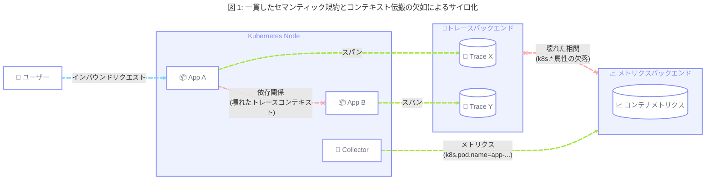
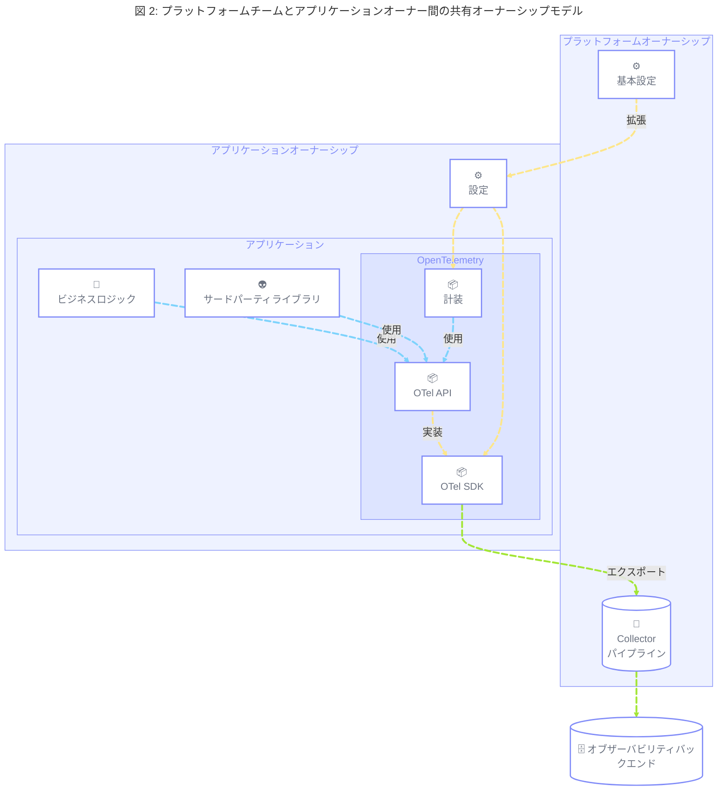
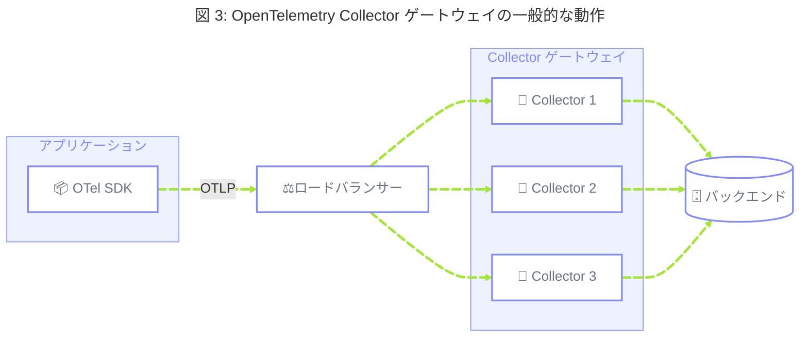
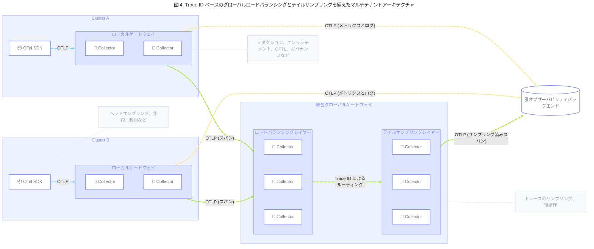

## 概要 {#summary}

このブループリントは、エンジニアリングチーム全体で OpenTelemetry のツールと標準の導入を容易にするために、プラットフォームエンジニアリングのプラクティスに従うことを目指す組織に向けた戦略的なガイダンスを提供します。
これには、SDK、計装ライブラリ、設定パターン、および Collector アーキテクチャの活用が含まれ、「as-a-service」として利用されるように設計されたセルフサーブツールと組み合わせた、集中管理型のテレメトリープラットフォームを提供します。

クラウドおよび Kubernetes 環境で運用し、高度に自律的なプロダクトチームが所有するワークロード全体で一貫性のある、スケーラブルかつ統制されたテレメトリープラットフォームを提供したいと考える組織を対象としており、以下の成果の達成を目指します。

- 一貫した SDK と計装の設定により、組織固有の標準をすべてのワークロードに導入しやすくし、プロダクトチームの認知負荷を軽減することで、タイムトゥバリューを改善します。
- まとまりのあるセマンティック規約により、クライアントサイドからインフラストラクチャまで、シグナル、アプリケーション、ドメイン間のテレメトリー相関を可能にし、手動または自動分析に活用できる高品質なテレメトリーを提供します。
- Collector 設定のスプロールを排除し、テレメトリーパイプラインの統合を通じて運用負荷を削減します。
- すべてのテレメトリーシグナルに対して、単一障害点を回避した、復元力があり、スケーラブルで信頼性の高い取り込みパイプラインを実現します。
- テレメトリー処理のストレージ、ネットワーク転送、コンピューティング要件を最小限に抑えることで、運用コストとカーボンエミッションを削減する、集中型のテレメトリーガバナンスとデータ最適化を実現します。
- アプリケーション計装やコレクションインフラストラクチャへの変更を最小限に抑えながら、データ移行やマルチベンダー戦略を可能にし、基盤となるオブザーバビリティバックエンドの変更からプロダクトチームを保護する、将来性のあるテレメトリーパイプラインを実現します。

## 背景 {#background}

組織がクラウドネイティブ標準やモダンなソフトウェアデリバリープラクティスの導入率を高めるにつれ、チームやビジネスユニットが高い自律性を持ち、システムの設計から本番環境でのソフトウェア運用まで、ソフトウェア開発ライフサイクル（SDLC）全体に対して責任を負う、フェデレーションモデルを採用することが多くなっています。

この「You build it, you run it」モデルはプロダクトデリバリーを強化するために設計されていますが、意図せずフラグメント化されたサービス管理プラクティスや、OpenTelemetry やモダンなオブザーバビリティツールの利点を活かせない、雑然としたオブザーバビリティ環境を生み出す可能性があります。
プロダクトチームはテレメトリー計装のような非機能要件（NFR）よりも機能開発を優先し、これらのタスクをデリバリー目標に対する負担と見なします。

この課題に対処するため、組織は認知負荷を軽減し複雑さを抽象化するクラウドネイティブなプラットフォームエンジニアリングモデルを広く採用しています。
オブザーバビリティをキュレーションされた内部[プラットフォームプロダクト][1]として扱うことで、高品質でコンテキストに富んだオブザーバビリティを最小限の摩擦で確保する舗装された道、すなわちゴールデンパスを提供しつつ、既製のテレメトリーでは捉えられないドメイン固有の概念の計装にチームが集中できるようにします。

## よくある課題 {#common-challenges}

このようなフェデレーション型の分散環境で運用する組織は、効果的なオブザーバビリティとクラウドネイティブの成熟度を妨げる、特有の課題に直面することが一般的です。

### 1. 一貫性のない設定と組織標準の低い導入率 {#challenge-1}

プロダクトチームが自律的に運用する環境では、共有されたコンピューティングレイヤーの下で運用しながらも、個々のアプリケーションやサービスのオブザーバビリティに対して異なる設定方法が共存する可能性があります。
これには、アプリケーション向けの OpenTelemetry SDK のセットアップ、計装パッケージやライブラリの設定、または依存先との間でオブザーバビリティコンテキストをどのように伝搬するかの決定が含まれます。

組織にはすべてのエンジニアが従うべきドキュメント化されたエンジニアリング標準がある場合がありますが、設定やコードレベルの変更を含む、これらの標準の実装を個々のチームによる手動作業に依存していることが多くあります。
これはチームによって後回しにされがちで、ソフトウェア設計プロセスの一部としてではなく、分散システム全体を包括的に考慮することなく特定のアプリケーションに焦点を当てた形で扱われます。



これにより、以下のような問題が生じます。

- **一貫性のない[セマンティック規約][2]：** テレメトリーに共通の[リソース][3]属性（たとえば `service.version`、`k8s.cluster.name`、`example.cost.center`）が欠けており、異なるシグナル、アプリケーション、システムレイヤー間の相関が壊れ、自動分析のためのオブザーバビリティデータの有用性が制限されます。
- **コンテキストのサイロ化：** 一貫した[コンテキスト伝搬][4]（たとえば W3C Trace Context）がすべての SDK に組み込まれていない場合、分散トレースはサービス境界で途切れ、バックエンドのパフォーマンス低下を顧客に影響するビジネスインパクトに結びつけることが不可能になります。
- **SDK バージョンのフラグメンテーション：** 本番環境で大きく異なるバージョンの OpenTelemetry SDK が実行されており、メンテナンスやセキュリティ上の懸念が生じます。
- **高い認知負荷：** 開発者は新しいサービスごとに SDK と計装パッケージを手動で設定する必要があり、作業負荷と設定ミスのリスクが増大します。
- **ベロシティの低下：** テレメトリー計装に関するエンジニアリング標準の変更、またはデータやプロトコルの移行といった基盤のオブザーバビリティバックエンドの変更は、摩擦を生み出し、テクノロジーの導入が手動での実装に阻まれることで、組織全体のベロシティを低下させます。

### 2. クラスター間の Collector 設定スプロール {#challenge-2}

OpenTelemetry の導入が拡大し、数十から数百の Kubernetes クラスターにデプロイする組織では、これらの環境全体で個々の OpenTelemetry Collector 設定を手動で管理することがメンテナンスの負担になります。
これは、異なる Collector デプロイメントが異なるチームによって管理されている組織では特に困難です。

これにより、以下のような問題が生じます。

- **設定のドリフト：** クラスターごとにパースルール、フィルタリングロジック、エンドポイント設定が異なり、予測不能なテレメトリーの動作を引き起こします。
- **関心の分離の欠如：** Collector の異なるレイヤーで行われるテレメトリー処理の種類（たとえば、どこで変換するか、どこでサンプリングするか）に明確な区別がなく、一貫性のないまたは不完全なデータにつながる可能性があります。
- **手動の作業負荷：** プラットフォームチームがスケーラブルなソリューションの構築ではなく、反復的な設定タスクや手動更新に過度の時間を費やします。
- **信頼性の低いロールアウト：** バージョン管理された監査可能なデプロイメントがない場合、フリート全体への修正や新しい設定の適用は非常にリスクが高く、エラーが発生しやすくなります。

### 3. オブザーバビリティデータの要件に最適化されていないデータパイプライン {#challenge-3}

一部のレガシー計装モデルでは、アプリケーションや計装エージェントがテレメトリーをテレメトリーバックエンドに直接エクスポートすることが多くあります。
このモデルでは、アプリケーションとバックエンドの間でテレメトリーを処理・変換する方法がなく、データ主権が低下します。
バックエンドがサードパーティベンダーや、パブリックトラフィックまたは認証を必要とするエンドポイントである場合、追加の複雑さも生じます。
数千のアプリケーション間でクレデンシャルを管理することは困難であり、単一のエクスポーターとパブリックエンドポイント間の散発的なネットワーク接続の問題がサービス中断を引き起こす可能性があります。

逆に、データパイプラインが集中化された環境では、テレメトリーデータのデータ要件が他の種類のデータの要件と混在することが多くあります。
これにより、コンテキストを考慮した変換や低レイテンシの処理ではなく、完全性（たとえば監査ログ、財務データレポート）に最適化されたソリューションにつながる可能性があります。
これにより、データの発行からアクション可能なインサイトまでの時間が増加し、信頼性の高い運用の維持に必要な即時性が損なわれます。

これにより、以下のような問題が生じます。

- **単一障害点：** 数百の個別アプリケーションからインターネットへの直接エグレスにより、中央ネットワークガバナンスとロードバランスされたエクスポートが失われます。
- **レイテンシと運用上の価値：** 最終的に、古いオブザーバビリティデータはオブザーバビリティデータがないのとほぼ同じです。
  過度に複雑なロギングパイプラインは大きな遅延を導入し、大規模インシデント時にリアルタイムの運用アラートを無用なものにします。
- **中央制御の欠如：** 設定が個々のアプリケーションに深く組み込まれている場合、プラットフォームチームはデータの再ルーティング、ベンダーの変更、グローバルネットワークポリシーの適用を容易に行えません。

> [!NOTE] Help wanted
>
> このブループリントのスコープは、低レイテンシで効率的なリソース利用に最適化されたパイプラインを提供するためにプラットフォームチームが直面する一般的な課題によって定義されています。
> 監査ログやビジネスレポートが必要なシナリオなど、完全性や耐久性の保証のバランスが重要な場合もあります。
> これらの課題はこのブループリントのスコープ外であり、別のブループリントで対象とされる可能性があります。
> コントリビュートに興味がある場合は、[ガイダンス][5]をご覧ください。

### 4. テレメトリーガバナンスの欠如と低い ROI {#challenge-4}

集中型のガバナンスとオブザーバビリティ標準の測定可能な導入がない場合、自律的なチームは大量の低価値データを生成し、シグナル対ノイズ比を低下させる可能性があります。
OpenTelemetry のシグナルは本来の目的で使用されないことが多く、プラットフォームチームにとってその本番運用がより困難になります（たとえば、特定のサービスのリクエスト数を算出するためだけに、数日から数週間にわたる個別ログの高速かつ正確なクエリを保証しなければならないなど）。
トラフィックが増加しテレメトリーの量が増えるにつれ、オブザーバビリティを担当するチームは環境全体でデータ品質を確保するスケーラブルな方法を持ちません。

これにより、以下のような問題が生じます。

- **帰属不能なデータ品質の問題：** 一貫したセマンティック規約が強制されていないため、プラットフォームチームはテレメトリーの費用やデータ品質を特定のビジネスユニットやエンジニアリングチームに関連付けられません。
- **非効率なデータ型：** 本来の目的で使用されていないシグナルに対して、生ログやその他のシグナルの重いストレージやインデクシングコストが発生し、オブザーバビリティデータから得られるインサイトの全体的な品質が低下します。
- **不要なコスト：** システムを信頼性高く運用するために必要なインサイトを必ずしも改善しないデータから、データストレージ、ネットワークエグレス、特定のバックエンドへの取り込みに関連するコストが増加します。
- **カーボンエミッション：** 低価値データの処理は、グリーンソフトウェア目標の達成に悪影響を及ぼす可能性があります。
  これには、オブザーバビリティデータの高速取得に必要なデバイス（たとえば SSD）に含まれるエンベデッドカーボンからのスコープ 3 エミッションが含まれます。
- **高い認知負荷：** 大量のデータは不要なコストだけでなく、ノイズも増加させ、ユーザーやエージェントが関連するテレメトリーを見つけるために低品質のデータをフィルタリングしなければなりません。

> [!NOTE] Help wanted
>
> マルチテナント環境では、厳格なコンプライアンス要件（GDPR、HIPAA、PCI）や、パイプラインレイヤー間の認証および暗号化などのセキュリティ上の懸念に対処することが多くあります。
> これらの課題はこのブループリントのスコープ外であり、別のブループリントで対象とされる可能性があります。
> コントリビュートに興味がある場合は、[ガイダンス][5]をご覧ください。

### 5. SDK とデータパイプラインのオブザーバビリティおよび運用効率の低さ {#challenge-5}

OpenTelemetry SDK と Collector を本番環境で運用する際の課題の一つは、テレメトリーデータのキューイング、リトライ、バッチ処理に関して適用されるデフォルト設定が、特定の環境に最適かどうか、また最適でない場合にそれをいつ特定するかということです。
OpenTelemetry の妥当なデフォルト値は、リソース利用のよりリーンなアプローチの実装や、より高い信頼性保証のいずれにも適していない場合があります。
これは使用中のアーキテクチャパターンに依存することがあります。
たとえば、ローカルクラスターエンドポイントへのエクスポートでは、パブリックインターネットエンドポイントよりもバッファリングが少なくて済む場合があります。

これにより、以下のような問題が生じます。

- **サイレントなデータドロップとエクスポート失敗：** データエクスポートがバックエンドまたは Collector へのエクスポートに失敗し、最終的にデータをドロップしますが、それらのエラーが監視やアラートの対象にならない場合があります。
- **不要なリソース利用：** オペレーターが SDK と Collector のリソースを過剰にプロビジョニングし、リソース利用率が増加し、パフォーマンスオーバーヘッドやコストに影響を与える可能性があります。

## 一般的なガイドライン {#general-guidelines}

### 1. SDK と計装パッケージの集中管理されたデフォルトの拡張可能な設定 {#guideline-1}

**対処する課題**: [1](#challenge-1)、[4](#challenge-4) |
**実装アクション**: [1](#action-1)、[2](#action-2)

オブザーバビリティツールを担当するチームには、[SDK][6] と[計装ライブラリ][7]のための基本的な既定の設定を提供するリソースセット（[アクション 1](#action-1) を参照）を維持することを推奨します。
目標は、Kubernetes クラスターにデプロイされたアプリケーションが、アプリケーションオーナーからの最小限の入力（たとえばアノテーションの追加や共有内部ライブラリの呼び出し程度）で基本レベルのテレメトリーを発行し、依存先との間でコンテキストを伝搬することです。

プラットフォームチームは、この基本設定が拡張可能であることを確保し、アプリケーションオーナーが SDK のさまざまな側面（たとえばバッファサイズ、エクスポーターのリトライ）や計装ライブラリを制御して、アプリケーション固有の要件を満たせるようにすべきです。

このガイドラインを実装することで、組織は以下の成果を期待できます。

- **まとまりのある組織標準：** 特定の組織標準（たとえばリソース属性、エクスポーターエンドポイントなど）がスタック全体に自動的に適用されます。
- **一貫したコンテキスト伝搬：** 互換性のあるプロパゲーター設定を使用して、サービス間で Trace Context が伝搬されます。
- **認知負荷の低減：** アプリケーションオーナーは、OpenTelemetry SDK のセットアップに関連するような低レベルの設定から自身を抽象化できます。
- **メンテナンスの容易さ：** オブザーバビリティにおけるエンジニアリング標準とベストプラクティスの導入に必要な労力が最小限に抑えられ、内部ツールのバージョンバンプによって新しい標準をロールアウトできます。

### 2. テレメトリー生成の共有オーナーシップを確立する {#guideline-2}

**対処する課題**: [4](#challenge-4)、[5](#challenge-5) |
**実装アクション**: [1](#action-1)、[2](#action-2)、[5](#action-5)

ガバナンスと自律性のバランスをとるため、このブループリントで説明する環境で運用するプラットフォームチームは、計装を「シフトレフト」し、アプリケーションオーナーが自身のアプリケーションが発行するテレメトリーの完全な制御とオーナーシップを持つことを確保すべきです。
[ガイドライン 1](#guideline-1) で述べたデフォルト設定は、テクニカル属性（たとえばクラスター、デプロイメント、Pod）と組織情報（たとえばチーム、ビジネスドメイン）を含め、データの出所が保証されるようにすべきです。
これにより、テレメトリーのソースと所有チームの特定が容易になります。

OpenTelemetry の[クライアント設計原則][8]は、デフォルトでは no-op 実装である API と、登録時にその API の実装を提供する SDK の間の明確な分離を確立しています。
これにより責任が明確に分離され、アプリケーションオーナーは OpenTelemetry API のみに依存して、既定の設定からすぐにテレメトリーを生成しつつ、汎用的には捉えられないドメイン固有のコンテキスト（たとえばビジネストランザクション、ユーザー ID）でテレメトリーを充実させることに注力できます。



このモデルは、実装の詳細を抽象化する OpenTelemetry の API 設計に依存しています。
実装の詳細を隠す以上の価値を提供しない限り、さまざまなシグナル API を直接使用し、それらを中心にさらなる抽象化を構築することは避けることを推奨します。
必要に応じて、SDK の機能（たとえば[メトリクスビュー][9]や[スパンプロセッサー][10]）を利用してアプリケーションレベルでテレメトリーを変換できます（[ガイドライン 4](#guideline-4) を参照）。

> [!NOTE] Help wanted
>
> [Weaver][11] は、組織固有のセマンティック規約レジストリの管理と、それらへの準拠の測定および検証を支援し、計装品質を設計段階から確保します。
> Weaver について詳しくは[このブログ記事][12]をご覧ください。
> セマンティック規約のガバナンスはこのブループリントのスコープ外であり、将来のブループリントで対象とされる可能性があります。
> コントリビュートに興味がある場合は、[ガイダンス][5]をご覧ください。

最終的に、アプリケーションオーナーは自身のアプリケーションが発行するテレメトリーデータ（手動および自動計装の両方）のオーナーであり続け、その品質と復元力に責任を持つべきです。
これには、対応する言語でプラットフォームチームが自動的に設定する [SDK テレメトリー][13]の監視とアラート、および特定のアプリケーションニーズに応じた設定の最適化が含まれます。
具体的には、テレメトリー量に応じて `BatchSpanProcessor` や `PeriodicMetricReader` のバッファサイズ、リトライキュー、カーディナリティ制限、タイムアウトなどの SDK コンポーネントをチューニングすることを意味します。

このガイドラインを実装することで、組織は以下の成果を期待できます。

- **ビジネス成果との相関：** アプリケーションが発行するテレメトリーには、ユーザーエクスペリエンスを技術コンポーネントやインフラストラクチャに相関させるために必要なドメインおよびビジネスロジックのコンテキストが含まれます。
- **明確なオーナーシップと責任：** データの出所が保証され、チームがテレメトリー品質を測定し、標準が大規模に導入されていることを確認できます。
- **テレメトリーシグナルの利用の改善：** アプリケーションオーナーが組織標準にガイドされながら OpenTelemetry シグナルにより精通するにつれ、OpenTelemetry API の最適な利用が向上します。
- **信頼性の高いテレメトリー生成：** 内部 SDK メトリクスの監視により、テレメトリーデータのキューイング、リトライ、バッチ処理に関する最適化に必要な情報がアプリケーションまたはプラットフォームオーナーに提供されます。

### 3. 集中管理された Collector ゲートウェイのセットを維持する {#guideline-3}

**対処する課題**: [2](#challenge-2)、[3](#challenge-3)、[4](#challenge-4) |
**実装アクション**: [1](#action-1)、[3](#action-3)、[5](#action-5)

この種の Kubernetes 環境では、テレメトリーが OpenTelemetry [Collector ゲートウェイ][14]としてデプロイされた集中レイヤーに自動的に取り込まれることを推奨します。
[ガイドライン 1](#guideline-1) の一環として提供される基本設定は、OTLP を使用してこのレイヤーにテレメトリーがエクスポートされることを確保すべきです。



マルチテナント環境では、さまざまなシナリオに対応するために複数の Collector ゲートウェイをチェーンする必要がある場合があります。
たとえば、クラスターごとのローカルゲートウェイとテイルサンプリング用のグローバルゲートウェイを持つマルチクラスター構成（[ガイドライン 4](#guideline-4) を参照）や、フェデレーションが進んだ環境で独立したチームが管理する名前空間スコープのゲートウェイがクラスター全体のゲートウェイにフィードする構成などです。

理想的には、基本 SDK 設定は、アプリケーション環境で利用可能な情報に基づいて、最適な Collector エンドポイントと必要なクレデンシャルを自動的に選択すべきです（たとえばロカリティベースのトラフィックルーティング、環境名に応じたサーバーアドレスの条件付き変更など）。

さらに、組織固有の条件に応じて、異なる OpenTelemetry シグナルに異なる非機能要件が付与される場合があります。
たとえば、安定したテレメトリー量とクリティカルなアラートでの使用から、メトリクスにはスパンよりも高い信頼性要件が割り当てられ、後者よりも前者に影響が出る前にデータをドロップすることが優先される場合があります。
これらの条件に対応するため、プラットフォームチームは以下のオプションを含むさまざまな選択肢を検討できます。

- **シグナルごとの分離されたゲートウェイ：** ログ、メトリクス、スパン用に別々のゲートウェイをデプロイします。
  分離されたデプロイメントにより、シグナルごとのコンピューティングリソース割り当てとキャパシティプランニングが簡素化されますが、共有プロセッサー設定をゲートウェイ間で複製する必要があります。
  これは外部テンプレートツール（たとえば Kapitan、Kustomize）や、複数の設定[ロケーション][61]を使用して相互にオーバーライドすることで管理できます。
  ただし、メンテナンスの負荷が増加する可能性があります。
- **単一ゲートウェイ上の複数メモリリミッター：** シグナルごとに異なる閾値を持つ、別々の [memory_limiter][15] 設定を定義します。
  これは、`memory_limiter` の前にある OTLP レシーバーが、テレメトリーが拒否された際に OTLP クライアント（たとえば SDK や他の Collector）にリトライ可能なエラーコードを返し、必要に応じてバックプレッシャーを適用することに依存しています。
  優先度の低いパイプラインには、より低いメモリリミッター閾値を設定してバックプレッシャーを早期に適用し、優先度の高いパイプラインにメモリの余裕を残すことができます。

プラットフォームエンジニアは、[内部 Collector テレメトリー][16]を活用してパイプラインが取り込み、処理、エクスポートするデータの信頼性を確保し、設定を最適化すべきです。
これには、`memory_limiter` や、`sending_queue` や `retry_on_failure` などの OTLP オプションのようなコンポーネントの設定が含まれます。
これらのメトリクスは、Collector ゲートウェイのデフォルトの CPU ベースのオートスケーリングを回避し、パイプラインのキュー深度やメモリ消費に基づいてフリートをスケーリングし、突発的なテレメトリースパイクに対応するために使用すべきです。

このガイドラインを実装することで、組織は以下の成果を期待できます。

- **オブザーバビリティデータ要件に最適化されたパイプライン：** OTLP エクスポーターとレシーバーの設定をロードバランスされた信頼性の高い Collector パイプラインと組み合わせることで、チームはシグナルごとに信頼性要件を満たすことができます。
- **コンピューティングリソースの効率的な利用：** 水平スケールされた集中型ゲートウェイは、異種のマルチテナント環境における、ノードごとの DaemonSet や Pod ごとの Sidecar よりもコンピューティングリソースを効率的に利用します。
  DaemonSet は通常、可変のノードサイズ（つまり単一ノードが 4 個または 40 個のアプリケーション Pod を提供する場合がある）と、時間とともに変動する Pod ごとのテレメトリー量に対応するために過剰にプロビジョニングする必要があります。
  ノードごとのフットプリントを小さく保つことは、チームが小さなノードへのワークロードのスケジュールに苦労することが多いため重要です。
  集中型ゲートウェイティアは独立してスケールし、テレメトリー総量に応じてサイジングされます。
- **統合された Collector 設定：** [アクション 3](#action-3) で説明するように、このモデルでは複数のレイヤーにわたる Collector 設定の統合デプロイメントが可能になり、メンテナンスの負荷を最小限に抑え、変更失敗のリスクを軽減します。

### 4. 異なるレイヤーでテレメトリーを効率的に集約、処理、サンプリングする {#guideline-4}

**対処する課題**: [3](#challenge-3)、[4](#challenge-4) |
**実装アクション**: [2](#action-2)、[4](#action-4)

アプリケーションレベルでは、OpenTelemetry のクライアント設計が計装 API とその SDK 実装を分離しています。
これにより、計装作者（アプリケーションやライブラリのオーナーを含む）は、メモリ内でどのように集約され、処理され、最終的にエクスポートされるかを定義する必要なく、API を使用して[メジャーメントを記録][17]し、[スパンを作成][18]し、[ログレコードを発行][19]できます。
この決定は、SDK セットアップの一環として[メーター][20]、[トレーサー][21]、[ロガー][22]プロバイダーが作成される時点まで延期できます。
これらの側面の設定は共有されるべきであり、プラットフォームチームが基本レイヤーの設定を提供し、アプリケーションオーナーが特定のユースケースに合わせてその設定を拡張します。

分散システムレベルでは、一貫した方法で最も価値のあるトレースを効率的に保存するために、さまざまな[トレースサンプリング][23]技術が使用できます。
これらの技術の紹介は[付録 1](#appendix-1) を参照してください。

トレースサンプリングが実装される場合、セマンティック規約の一貫した使用が重要になります。
メトリクスはテレメトリーの完全な（ただし集約された）ビューを提供し、[Exemplar][27] を使用して特定の操作の高粒度なトレーススパンに相関し、ログやその他のテレメトリーシグナル（たとえばプロファイル）にリンクできます。
標準的なセマンティック規約と一貫したリソース属性を使用することで、これらのシグナル間の相関も強化され、オペレーターは長期的で集約されたメトリクスストリームから高粒度でコンテキストに富んだトレースへと「ズームイン」できます。

以下の図は、テイルサンプリングのマルチクラスターシナリオにおいて、集約、処理、サンプリングが設定される可能性のあるさまざまなレイヤーの概要を示しています。



一般に、テレメトリーの処理はアプリケーションレイヤーにできるだけ近い場所で行い、コンピューティングと転送のコストを回避すべきです。
ただし、メンテナンスの容易化、標準の強制、[OTTL][28] による高度なフィルタリングや変換の実行、[リダクション][31]ルールによるパイプラインのセキュリティ確保（特定のバックエンドに機密情報が到達しないことを保証する）など、特定の状況では処理の決定を異なる Collector レイヤーに延期することが望ましい場合があります。

インテリジェントなサンプリング、異なるレイヤーでのメトリクス集約、ノイズの多いテレメトリーを削減するための集中型の変換やフィルタープロセッサーを組み合わせることで、このアーキテクチャはエンジニアリングチームの運用可視性を維持しながら、転送とコンピューティングのコストを削減できます。

このガイドラインを実装することで、組織は以下の成果を期待できます。

- **効率的なテレメトリー量：** OpenTelemetry シグナル、サンプリング、集約の最適な使用により、高粒度、コスト、オブザーバビリティ要件のバランスを取れるテレメトリー量を提供します。
- **コンピューティングリソースの効率的な利用：** 異なるレベルにデータ処理を配置することで、早期段階で集約またはフィルタリングできるデータに関連するデータ転送とコンピューティングリソースを制限します。
- **集中型のガバナンスとガードレール：** プラットフォームチームはデータ排出を制御する中央ポイントを持ち、組織標準に従わない、またはデータ量制限を遵守しないテレメトリーをフィルタリング、変換、リダクション、完全にブロックでき、不要なデータがバックエンドに送信されることから組織を保護します。

## 実装 {#implementation}

### 1. アプリケーションレベルの設定に OpenTelemetry Operator または内部共有パッケージを使用する {#action-1}

**実装するガイドライン：** [1](#guideline-1)

スコープ内の環境がサポートされている [Kubernetes バージョン][32]と[計装言語][33]にある場合、[自動計装][35]のための [Kubernetes 向け OpenTelemetry Operator][34] の使用を優先することを推奨します。
これには以下が含まれます。

- OpenTelemetry Operator のインストール。
- SDK と計装を設定するための関連する `Instrumentation` CR の作成。
- 個々の Pod または名前空間へのアノテーションの追加（名前空間内のすべての Pod を計装する場合）。

OpenTelemetry Operator のデプロイが不可能または互換性がない場合、OpenTelemetry SDK と計装ライブラリを容易に設定するためのビルドタイムリソースをアプリケーションオーナーに提供することを推奨します。
これは以下の 2 つの主要なモデルに従って実装できます。

- [ゼロコード計装][36]でサポートされている言語の場合、計装エージェントやライブラリのダウンロード、デフォルト設定の提供、およびこれらの設定を利用するための結果コンテナイメージのベース `CMD` の設定を行うベースコンテナイメージを提供することを推奨します。
- ゼロコード計装でサポートされていない言語の場合、OpenTelemetry SDK と計装ライブラリをプログラム的に設定し、ライブラリのユーザーが必要に応じてこの設定を拡張するためのフックを提供する、共有の[言語固有ライブラリ][37]を提供することを推奨します。

この非 Operator モデルでは、アプリケーションオーナーがこれらのベースコンテナイメージや共有ライブラリをコードベースで使用する責任を負います。
自動アタッチの計装よりも最初はより多くの作業が必要になる場合がありますが、プラットフォームチームが内部ライブラリのマイナーバージョンバンプにより段階的なアップグレードや設定変更を管理でき、アプリケーションオーナーからの追加のコード変更を必要としないメカニズムを提供します。

ベースコンテナイメージや内部ライブラリで集中管理された設定を管理する場合、かつ言語がサポートしている場合は、[宣言的設定][38]の使用を標準化することを推奨します。
現時点ではすべての言語で完全にサポートされているわけではありませんが、この YAML ベースの設定モデルは SDK と計装設定の一貫性を提供します。

### 2. 組織標準をデフォルトの拡張可能なアプリケーションレベル設定に含める {#action-2}

**実装するガイドライン：** [1](#guideline-1)、[2](#guideline-2)、[4](#guideline-4)

[アクション 1](#action-1) での設定提供方法に関係なく、プラットフォームチームはオファリングの一環として以下の最小基本設定を含めることを推奨します。

- **エクスポーター：** 最適な Collector（たとえば同じクラスター内のローカルゲートウェイ）にエクスポートするように設定された OTLP HTTP/protobuf（デフォルト）または OTLP gRPC。
  標準 Kubernetes Service で使用される OTLP gRPC の副作用の詳細は、[付録 2](#appendix-2) と[アクション 3](#action-3) を参照してください。
  - **注意：** バックエンドや SaaS のエンドポイントまたは API キーは、アプリケーションレベルの設定に含めるべきではありません。
    これらは Collector ゲートウェイで処理することを推奨します。
- **プロパゲーター：** 分散トレースがサービス境界で途切れないことを確保するための W3C Trace Context（`tracecontext`）。
  必要に応じて、レガシーフォーマットをセカンダリオプションとして含めます（Propagators API は設定された順序で優先します）。
- **リソースディテクター：** 手動入力なしで一貫性を達成するための、基盤インフラストラクチャ（たとえばクラウドプロバイダー、Kubernetes、OS、コンテナ）向けの自動ディテクター。
- **計装ライブラリ：** 最小限の計装ライブラリセットが既定で設定されていることを確保します。
  自動計装が使用されている場合、プラットフォームチームはデフォルトですべての計装ライブラリを有効にするべきではなく、環境にとって最も重要なものを慎重に選択し、クライアントおよびサーバー計装（たとえば gRPC、HTTP、メッセージング、データベース）を優先すべきです。
- **プロセッサー、リーダー、ビュー：** 使用中のバックエンドに固有の設定（たとえば集約テンポラリティ、エクスポート間隔、属性制限）または組織全体の標準（たとえばスパンやメトリクスの属性）。
  - **注意：** 言語実装に応じて、OTLP エクスポーターは HTTP `429`、`503`、またはオプションの `RetryInfo` 付き gRPC `UNAVAILABLE` などのリトライ可能なエラーを受信した際にリトライする場合があります。
    ただし、これらのエクスポーターは送信キューの点で Collector と同じ機能を持たず、成功しなかった場合にデータのバッチをドロップします。
    プラットフォームチームはこれらのバッファサイズの妥当なデフォルトを管理し、ローカル Collector（たとえばクラスターローカルのゲートウェイ）へのエクスポートを優先して、テレメトリーをアプリケーションプロセスからできるだけ高速かつ確実に移動させるべきです。
    アプリケーションオーナーは、利用可能な場合は [SDK テレメトリー][13]を監視し、適切に対応すべきです。

- **組織固有のリソース属性：** ルーティング、課金、オーナーシップに不可欠な標準規約。
  少なくとも以下を推奨します。
  - `service.name`：理想的には既存の環境変数や CI/CD ツールで注入されるラベルから抽出。
  - `service.version`：Blue/Green デプロイメントやプログレッシブロールアウト時のテレメトリーソース識別用。
  - `service.namespace` または `service.owner`：リソースオーナーシップ用。
  - `deployment.environment.name`（たとえば `production`、`staging`）。
  - アプリケーションデプロイメントテンプレート全体で標準化された Kubernetes [Downward API][39]（つまり `valueFrom.fieldRef.fieldPath`）を介して環境変数として注入されるその他の属性。

プラットフォームチームは、アプリケーションオーナーがこのデフォルト設定をオーバーライドおよび拡張する方法を提供する必要があります。
そのメカニズムは、[アクション 1](#action-1) で確立された OTel 設定の提供方法に依存します。
可能なオプションは[付録 3](#appendix-3) に記載されています。

### 3. Collector ゲートウェイのデプロイに OpenTelemetry Operator または Helm Charts を使用する {#action-3}

**実装するガイドライン：** [3](#guideline-3)

集中型ゲートウェイティアのデプロイには、[OpenTelemetry Operator][34] または公式 [OpenTelemetry Helm Charts][44] のいずれかを標準化すべきです。
両方とも GitOps ワークフローをサポートしていますが、エンタープライズワークロード向けには特定のアーキテクチャ上の考慮が必要です。

- **OpenTelemetry Operator：** アプリケーションの自動計装（[アクション 1](#action-1)）で Operator がすでに使用されている場合に最適です。
  ゲートウェイは `OpenTelemetryCollector` CR を作成し、`mode: deployment` または `mode: statefulset`（要件に応じて）を設定することでデプロイできます。
  Operator は Kubernetes のボイラープレートの多くを抽象化します。
  オートスケーリングの有効化に関するさらなるガイダンスは Operator の[ドキュメント][45]を参照してください。
- **公式 Helm Charts：** CRD に依存せず、ネイティブ Kubernetes マニフェスト（たとえば特定の `Ingress` 設定、`PodDisruptionBudgets`、複雑なアフィニティルール）を細かく制御したいインフラストラクチャチームに適したオプションです。

デプロイツールの選択に関係なく、ゲートウェイティアはクリティカルなポイントであり、オーナーは最初から復元力が設定されていることを確保すべきです。

- **[memory_limiter][15] の設定：** すべての Collector パイプラインで最初のプロセッサーとして設定すると、メモリ使用量が設定された閾値に達した際に Collector がデータをドロップしたりバックプレッシャーを適用したりすることで、大量テレメトリースパイク時の Out-of-Memory（OOM）クラッシュを防ぎます。
  [ガイドライン 3](#guideline-3) で述べたように、シグナルごとに異なる `memory_limiter` プロセッサーが必要になる場合があります。
- **[otlp][46] または [otlp_http][47] エクスポーターの設定：** データをドロップする前に一時的なバックエンド障害を処理するために、信頼性対リソース消費の期待に沿ったキューとリトライを設定します。
  特に、効率的なネットワーク転送とバックプレッシャー伝搬を可能にする `batch` や、キュー（永続的またはインメモリ）が満杯の場合に Collector がデータをドロップするかスペースが利用可能になるまで待機するかを制御する `block_on_overflow` などの `sending_queue` オプションを検討してください。
- **[file_storage][48] エクステンションの検討：** 長時間にわたるオブザーバビリティバックエンドのサービス中断時にデータをドロップすることがビジネスの機能にとって重大である場合、OTLP エクスポーターで [file_storage][48] エクステンションを使用して `sending_queue.storage` を設定することを検討してください。
  このエクステンションが設定されていると、バックエンドが利用不可であったりエクスポートをレート制限したりする場合に、Collector はデータをディスクにバッファし自動的にリトライするため、データ損失を防ぎます。
  `file_storage` エクステンションのデプロイに関する注意事項は[付録 4](#appendix-4) を参照してください。
- **gRPC ロードバランシング：** OTLP/gRPC は非常に効率的ですが、標準 Kubernetes サービスルーティングでは非効率になる場合があります。
  gRPC ロードバランシングの実装は[付録 2](#appendix-2) を参照するか、OTLP/HTTP（ほとんどの SDK のデフォルト）の使用を検討してください。
- **メモリと内部テレメトリーに基づくスケーリング：** Kubernetes Horizontal Pod Autoscaler（HPA）をカスタムメトリクスと組み合わせて利用します（[アクション 5](#action-5) を参照）。
  メモリ利用率、アクティブ接続数、パイプラインキュー深度に基づいてゲートウェイレプリカをスケーリングするようクラスターを設定します。
- **設定のコード管理：** Helm 値や Operator CR を集中 Git リポジトリに格納し、ArgoCD や Flux などのツールを使用してデプロイします。
  これにより監査証跡が提供され、段階的なロールアウトと即時ロールバックが可能になります。

### 4. 効率的なテレメトリー量のために Collector プロセッサーを設定する {#action-4}

**実装するガイドライン：** [4](#guideline-4)

インフラストラクチャコンテキストでテレメトリーをエンリッチし、低価値テレメトリーデータからの転送と取り込みコストを削減し、データが企業ネットワークを離れる前にコンプライアンスを強制するため、プラットフォームチームは Collector ゲートウェイのパイプラインで以下の処理ステップ（順序通り）を設定することを検討すべきです。

- [**k8s_attributes**][49] **プロセッサー：** 一部の Kubernetes リソースの詳細（Pod ID や名前空間名など）はアプリケーションレベルで付加できますが（[アクション 2](#action-2) を参照）、プラットフォームチームは管理外ワークロードに対して 100% のコンプライアンスを確保する必要があります。
  これには Downward API では利用できないフィールドが含まれます。
  受信接続の Pod IP に基づいて `k8s.deployment.name`、`k8s.statefulset.name` などの属性を抽出・付加するようにこのプロセッサーを設定します。
  `k8s_attributes` プロセッサーの使用時に考慮すべき詳細は[付録 5](#appendix-5) を参照してください。
- **データをフィルタリングおよび変換するプロセッサー：** Collector に送信される前に SDK レベルでこれらの設定を適用できなかったアプリケーションに対するフォールバック措置として、[attributes][50]、[filter][51]、[redaction][31]、[resource][52]、[transform][53] などのプロセッサーを使用してルールを定義します。
  - ルーティンエンドポイント（`/health`、`/metrics`、`/ready`）のシングルスパントレースやアクセスログ、またはアクション不要なデバッグログ（`level=DEBUG` または `level=TRACE`）のドロップ。
  - Kubernetes 環境では有用性が低い可能性のある特定のノイズの多い属性（たとえば `process.command_line`）の削除。
    これらの属性は CI/CD パイプラインに存在します。
  - その他、低価値でノイズの多いテレメトリーを削除するための処理。
- [**tail_sampling**][25] **プロセッサー：** 厳格な保持ポリシーを定義します。
  たとえば、エラーを含むトレースやレイテンシ閾値を超えるトレースは 100% 保持し、成功して通常のレスポンス時間のリクエストはわずかなベースライン（たとえば 5%）のみ保持します。
  [ガイドライン 4](#guideline-4) で文書化されているように、これには 2 層の Collector が必要で、最初のレイヤーでは [load_balancing][26] エクスポーターを使用して Trace ID に基づいて 2 番目のレイヤーにトレースをルーティングします。
  ロードバランシングエクスポートの詳細は[ドキュメント][26]を参照してください。

これは網羅的なリストではなく、OpenTelemetry Collector にはテレメトリーデータからより多くの価値を引き出すための多くの[プロセッサー][54]と[コネクター][55]があります。

### 5. 信頼性要件を確保するために SDK と Collector を監視する {#action-5}

**実装するガイドライン：** [2](#guideline-2)、[3](#guideline-3)

OpenTelemetry SDK と Collector は、運用中のコンポーネントの内部状態を記述する標準的なテレメトリーをエクスポートします。
アプリケーションオーナーとプラットフォームチームは、これらが確実に生成され、監視され、必要に応じて対処されることを確保すべきです。

テレメトリーがアプリケーションプロセスを離れる前に発生するデータ損失（たとえば SDK の内部キューが満杯になった場合）を特定し監視するために、以下を推奨します。

- 言語エコシステムでサポートされている場合（たとえば Java は `opentelemetry-sdk` 計装ライブラリ経由、Go は `sdk/metric` パッケージ経由）、SDK セルフメトリクスを有効にして内部キュー容量、ドロップされたスパン、エクスポーターのレイテンシを公開します。
  [OpenTelemetry SDK セマンティック規約][56]は SDK が生成すべきテレメトリーを定義していますが、サポートは言語によって異なります。
- 内部テレメトリーのネイティブ SDK メトリクスサポートがない言語でも、異なる方法で内部診断をサポートしている場合があります（たとえば .NET の `EventSource`、Java の `java.util.logging`、Node.js の `diag`）。
  ユーザーは特定の実装を参照して、特定のニーズと詳細度に合わせて設定すべきです。

集約と処理ティアの健全性を監視するために、プラットフォームチームは内部 [Collector テレメトリー][16]を積極的にキャプチャしてアラートを設定する必要があります。
以下の手順に従うことを推奨します。

- **OTLP 経由での内部テレメトリーのエクスポート：** `service.telemetry` ブロックを設定して、企業全体の標準に従い OTLP 経由でオブザーバビリティバックエンドに内部メトリクスを発行します。
  監視に加えて、これらのメトリクスはオートスケーリングの意思決定のデータソースとしても使用すべきです（[アクション 3](#action-3) を参照）。
  この OTLP 設定は Collector パイプラインで設定された OTLP エクスポーターとは別のものであることに注意してください。
- **監視とトラブルシューティング：** Collector ドキュメントの[監視][16]と[トラブルシューティング][57]のセクションに記載されているアドバイスに従い、個々のレプリカによってデータがドロップされる前にリソース枯渇とエクスポートの失敗を検出するために必要な高優先度アラートを作成します。

## リファレンス実装 {#reference-implementations}

- [Adobe: シンプルさを追求した大規模 OpenTelemetry パイプライン設計][58]
- [Mastodon: 小規模チームによる本番環境での OpenTelemetry Collector 運用][59]
- [Skyscanner: 24 の本番クラスターにまたがる OpenTelemetry Collector の管理][60]

## 付録 {#appendix}

### 1. 分散トレースサンプリング技術 {#appendix-1}

大まかに言うと、サンプリングは主に 2 つの異なるレイヤーで設定できます。

- **SDK：** SDK レベルで設定されたヘッドサンプリングは、サンプリングされないトレースがアプリケーションによって記録もエクスポートもされないため、コンピューティングリソースの効率的な利用を提供します。
  ただし、サンプリングの決定はスパン作成時に行う必要があり、通常は確率的サンプリングになるため、クリティカルなトレース（たとえばエラーを含むもの）を見逃す可能性があります。
- **Collector：** Collector は 2 つの主要なサンプリング技術を提供します。
  - [_確率的_][24]_サンプリング：_ 任意の Collector レイヤーで設定でき、同じトレースに対して同じアルゴリズムとシードが使用されている限り、Collector 間の調整は不要です。
  - [_テイル_][25]_サンプリング：_ 単一の Collector レプリカが決定を下す前に、特定のトレースのすべてのスパンをメモリに格納する必要があります。
    本番環境では単一レプリカのデプロイメントは推奨されないため、このモデルでは通常、Trace ID に基づいてスパンを[ロードバランス][26]する Collector のレイヤーと、サンプリングを実行するもう 1 つのレイヤーが必要です。

テイルサンプリングは運用と維持により多くのリソースを必要とします。
ただし、サービス運用にとって重要なトレースのみを効率的に保存できる、より豊富なサンプリングポリシーの定義方法を提供します。
たとえば、特定の閾値よりも長いレスポンス時間のトレースや、トレース内の任意のスパンでエラーが含まれるトレースなどです。

> [!NOTE] Help wanted
>
> 分散トレースサンプリングはそれ自体が複雑なトピックであり、すべての異なるレイヤーにわたるサンプリングアーキテクチャを設計するものです。
> これらの課題はこのブループリントのスコープ外であり、別のブループリントで対象とされる可能性があります。
> コントリビュートに興味がある場合は、[ガイダンス][5]をご覧ください。

### 2. gRPC ロードバランシング {#appendix-2}

gRPC は HTTP/2 に依存しており、単一の長寿命な TCP 接続上で多数のリクエストを多重化します。
標準 Kubernetes Service は `kube-proxy` を使用してレイヤー 4（TCP）で動作するため、個々の*リクエスト*ではなく*接続*をバランシングします。
SDK やローカル Collector またはアプリケーションが標準 Kubernetes Service 経由でゲートウェイに接続すると、1 つの TCP 接続を確立して無期限に保持します。
その結果、そのエージェントからのテレメトリーの 100% が単一のゲートウェイ Pod にストリーミングされます。

高スループット環境では、新しくスケールされた Pod がトラフィックを受信しないため、特定のゲートウェイレプリカにホットスポットが生じ、水平 Pod オートスケーリングが損なわれ、長寿命 Pod でのリソース枯渇のリスクが高まります。

テレメトリーを均等に分散するために、プラットフォームチームは以下の 3 つのパターンのいずれかを検討すべきです。

#### クライアントサイドロードバランシング {#client-side-load-balancing}

OTLP gRPC エクスポーターは、Kubernetes DNS を照会して利用可能なすべてのゲートウェイ Pod の IP を検出し、それらの間でリクエストをラウンドロビン方式で分散することで、クライアントサイドでロードバランシングを実行できます。

これを実現するには、DNS クエリが単一の仮想 IP ではなく Pod IP のリストを返すように、ゲートウェイティアを Headless Service でデプロイする必要があります。

- **OpenTelemetry Operator：** `statefulset` モードで `OpenTelemetryCollector` CR をデプロイすると、Operator は `{collector-name}-collector-headless.{namespace}.svc.cluster.local` という名前の Headless Service を自動的に生成します。
  `deployment` としてデプロイする場合は、`ClusterIP: None` の Headless Kubernetes Service を手動で作成する必要があります。
- **Helm Chart：** ゲートウェイデプロイ時に `service.clusterIP: None` を設定します。

送信側 OTLP エクスポーターは、DNS リゾルバーとラウンドロビンバランサーを使用するように設定する必要があります。
Collector 上で OTLP エクスポーターを設定する場合（たとえばローカル Collector からゲートウェイへ）：

- **`endpoint`** は `dns:///` で始まる必要があり、gRPC クライアントに継続的な DNS 解決を実行するよう指示します。
- **`balancer_name`** は `round_robin` に設定すべきです（`v0.105.0` 以降の Collector のデフォルト）。

特定のクライアント SDK は gRPC クライアントを異なる方法で設定する場合があります。
クライアントサイドの gRPC ロードバランシングを設定するには、個々のクライアント実装を参照してください。

#### レイヤー 7 プロキシ / サービスメッシュ {#layer-7-proxy-service-mesh}

このアプローチでは、HTTP/2 対応のレイヤー 7 プロキシが OTLP gRPC エクスポーターとゲートウェイティアの間に配置されます。
プロキシはレイヤー 7 で動作するため、HTTP/2 フレームを理解します。
単一の長寿命な TCP 接続を受け入れ、個々の gRPC リクエストを検査し、すべてのバックエンドゲートウェイ Pod に均等に分散します。

**実装方法：**

- **サービスメッシュ（たとえば Istio、Linkerd）：** クラスターがすでにサービスメッシュを実行している場合、gRPC ロードバランシングは自動的に処理されます。
  メッシュサイドカー（または同等のもの）がエッジエージェントからのエグレストラフィックを傍受し、ゲートウェイ Pod 間でバランスします。
- **スタンドアロンプロキシ（たとえば Envoy、NGINX）：** ゲートウェイティアの直前に Envoy または NGINX プロキシ（`grpc_pass` で設定）をデプロイします。
  エッジエージェントはプロキシの Kubernetes Service を指し、プロキシがゲートウェイへのトラフィックをバランスします。
- **Ingress Controller：** SDK やローカル Collector がクラスター外（またはクラスター間）からテレメトリーを送信している場合、Ingress Controller（たとえば NGINX Ingress、Traefik、AWS ALB）が gRPC と HTTP/2 バックエンドルーティングをサポートするように明示的に設定されていることを確認してください。

#### サーバーサイド接続リサイクル {#server-side-connection-recycling}

最後に、ゲートウェイの OTLP gRPC レシーバーは `keepalive.server_parameters.max_connection_age` を使用して、設定された期間後に長寿命接続を閉じるように設定できます。
接続がこの期間に達すると、サーバーは `GoAway` フレームを送信し、クライアントに再接続を強制します。
再接続時、標準 Kubernetes Service ルーティングがクライアントを利用可能なゲートウェイ Pod に再分散します。

このオプションはクライアント側の変更が不要で、ゲートウェイレシーバーの設定のみを更新します。

```yaml
receivers:
  otlp:
    protocols:
      grpc:
        keepalive:
          server_parameters:
            max_connection_age: 60s
            max_connection_age_grace: 10s
```

このアプローチはリクエストごとのバランシングほど正確ではなく（トラフィックは再接続時のみ再分散され、リクエストごとではない）、既存の接続が期限切れになるまで新しくスケールされた Pod はトラフィックを受信しません。
ただし、Headless Service、DNS リゾルバー、L7 プロキシが不要なため、最もシンプルなオプションです。

#### 推奨事項 {#recommendation}

組織がすでにサービスメッシュを運用している場合、L7 プロキシオプションは OpenTelemetry 側の設定が不要です。
サービスメッシュがなく、トラフィックが同一クラスター内に留まる場合は、クライアントサイドロードバランシングが最も正確な分散を提供します。
いずれも利用できない場合は、サーバーサイド接続リサイクルが最もシンプルな開始点です。
または、受信側バックエンドを制御できない場合（たとえばパブリックインターネット経由でルーティングされる接続）を含め、HTTP/1.1 または短寿命の HTTP/2 接続上で動作し同じピンニング動作の影響を受けない OTLP/HTTP の使用を検討してください（[アクション 2](#action-2) を参照）。

### 3. SDK 設定のオーバーライド {#appendix-3}

[アクション 1](#action-1) で OTel 設定を提供するために確立した方法に応じて、プラットフォームチームは開発者がベースラインをどのように継承し、どのように拡張できるかを正確にドキュメント化する必要があります。

- **OpenTelemetry Operator：** プラットフォームチームがクラスター内に中央の `Instrumentation` CR をプロビジョニングします。
  アプリケーションオーナーは Pod または名前空間のアノテーションを介してオプトインまたはオプトアウトできます。
  - _基本的なオーバーライド：_ アプリケーションオーナーは、標準の[環境変数][40]を Pod スペックに直接注入することで、特定のベースラインプロパティをオーバーライドできます。
    [コンプライアンスマトリクス][41]に、言語ごとの各種環境変数のサポート状況が詳述されています。
    さらに、一部の言語実装（たとえば [Java][42]）は、ライブラリ固有の環境変数を介した計装ライブラリの設定をサポートしています。
  - _複雑なオーバーライド：_ チームが `Instrumentation` CR 自体を変更する必要がある場合（たとえばカスタムサンプラーや特定の自動計装ライブラリの追加）、プラットフォームチームは Helm または Kustomize を介して CR を管理すべきです。
    これにより、プラットフォームはベーステンプレートを維持しつつ、アプリケーションオーナーがクラスターへのデプロイ前にマージされるローカルオーバーライドやバリューファイルを提供できます。
- **ベースコンテナイメージ：** 上記と同様に、チームはベースイメージで設定されたデフォルトを環境変数でオーバーライドすることで、特定の側面をオーバーライドできます。
- **内部ライブラリ：** 内部共有ライブラリは、ユーザーが必要に応じて標準の設定ブロックを渡すために必要なフックを提供すべきです。
  たとえば、JavaScript では Node SDK をセットアップするラッパーライブラリは、ユーザーが `resource` や `traceExporter` などの標準 [NodeSDKConfiguration][43] 設定を提供できるようにすべきです。
- **宣言的設定：** プラットフォームチームは、ファイルベース設定の環境変数補間機能を利用して、アプリケーションオーナーがベース YAML ファイルが読み取るローカル環境変数を設定できるようにするか、ファイルベース設定の標準が成熟するにつれて、設定のマージを使用して開発者が提供する `custom-otel.yaml` とプラットフォームの `base-otel.yaml` をブレンドできます。

### 4. `file_storage` エクステンションのデプロイに関する注意事項 {#appendix-4}

[file_storage][48] エクステンションと OTLP エクスポーターの `sending_queue.storage` を使用すると完全性の保証が向上しますが、ステートレスデプロイメントから離れ、ゲートウェイを `PersistentVolumeClaims` を持つ `StatefulSet` としてデプロイする必要があります。
OTLP エクスポーター設定と同様に、オペレーターはデータのドロップ（この場合、古くなった可能性のあるデータ）の重大さと、メンテナンスの負荷やサポートのコスト（たとえばディスク圧迫の管理、ボリュームのリサイジングなど）のトレードオフを検討する必要があります。

さらに、永続キューを有効にすると、ダウンストリームクライアントへのバックプレッシャーの伝搬が遅延します。
メモリ圧迫が発生する前にデータがディスクにバッファされるため、`memory_limiter` は早期のバックプレッシャーをトリガーしません。
永続キューが満杯になると、パイプラインがブロックされ、レシーバーがリトライ可能なエラー（たとえば `429`）をクライアントに返し、バックプレッシャーを通知します。

オペレーターは永続キューのサイズを適切に設定し、ディスク使用量を監視する必要があります。

### 5. `k8s_attributes` プロセッサーのデプロイに関する注意事項 {#appendix-5}

テレメトリーを発行する Pod とそれを処理する Collector の間にプロキシが配置されている場合、ゲートウェイがプロキシの IP ではなくアプリケーションの元の Pod IP を認識できるように、プロキシでパススルーモードが有効になっていることを確認してください。
または、OTel SDK の設定時に Downward API を介して利用可能なフィールド（たとえば `k8s.pod.uid`）をリソース属性として注入し、`k8s_attributes` の Pod アソシエーションルールを設定して、受信リソース属性と特定の Pod を照合します。

`k8s_attributes` プロセッサーを使用する場合、Collector が使用する `ServiceAccount` には、抽出される属性に対応する Kubernetes リソースに対する RBAC の `get`、`watch`、`list` 権限が付与されている必要があります。
たとえば、`k8s.deployment.name` と `k8s.deployment.uid` には `deployments` に対する権限が必要です。
これらのいずれかが不足すると、Collector は影響を受ける属性のエンリッチメントをサイレントにスキップします。

最後に、このプロセッサーをゲートウェイで実行すると、各 Collector のメモリ利用率が高くなり、クラスターサイズに応じてスケーリングされます。
`k8s_attributes` プロセッサーはクラスター内の Object に関連するメタデータをメモリに保持し、キャッシュする Object が多いほど Collector のメモリ消費が増加します。

ゲートウェイとして実行する場合、Collector の Deployment または StatefulSet の各 Pod はクラスター全体のすべてのメタデータを記憶する必要があります（DaemonSet として実行する場合は、Pod は自身のノードのメタデータのみを知る必要があります）。
コンポーネントドキュメントに[デプロイメントとスケーリングの考慮事項][62]の詳細が記載されています。

<!-- Link references -->

[1]: https://platformengineering.org/talks-library/platform-as-a-product
[2]: /docs/concepts/semantic-conventions/
[3]: /docs/concepts/resources/
[4]: /docs/concepts/context-propagation/
[5]: /docs/guidance/
[6]: /docs/languages/sdk-configuration/
[7]: /docs/concepts/instrumentation/libraries/
[8]: /docs/specs/otel/library-guidelines/#opentelemetry-client-generic-design
[9]: /docs/specs/otel/metrics/sdk/#view
[10]: /docs/specs/otel/trace/sdk/#span-processor
[11]: https://github.com/open-telemetry/weaver
[12]: /blog/2025/otel-weaver/
[13]: /docs/specs/semconv/otel/sdk-metrics/
[14]: /docs/collector/deploy/gateway/
[15]: https://github.com/open-telemetry/opentelemetry-collector/tree/main/processor/memorylimiterprocessor/README.md
[16]: /docs/collector/internal-telemetry/
[17]: /docs/specs/otel/metrics/#programming-model
[18]: /docs/specs/otel/trace/api/#span-creation
[19]: /docs/specs/otel/logs/api/#emit-a-logrecord
[20]: /docs/specs/otel/metrics/sdk/#meterprovider
[21]: /docs/specs/otel/trace/sdk/#tracer-provider
[22]: /docs/specs/otel/logs/sdk/#loggerprovider
[23]: /docs/concepts/sampling/
[24]: https://github.com/open-telemetry/opentelemetry-collector-contrib/tree/main/processor/probabilisticsamplerprocessor/README.md
[25]: https://github.com/open-telemetry/opentelemetry-collector-contrib/tree/main/processor/tailsamplingprocessor/README.md
[26]: https://github.com/open-telemetry/opentelemetry-collector-contrib/tree/main/exporter/loadbalancingexporter/README.md
[27]: /docs/specs/otel/metrics/sdk/#exemplar
[28]: https://github.com/open-telemetry/opentelemetry-collector-contrib/blob/main/pkg/ottl/README.md
[31]: https://github.com/open-telemetry/opentelemetry-collector-contrib/tree/main/processor/redactionprocessor/README.md
[32]: https://github.com/open-telemetry/opentelemetry-operator/blob/main/docs/getting-started/compatibility.md#compatibility-matrix
[33]: https://github.com/open-telemetry/opentelemetry-operator#opentelemetry-auto-instrumentation-injection
[34]: /docs/platforms/kubernetes/operator/
[35]: /docs/platforms/kubernetes/operator/automatic/
[36]: /docs/zero-code/
[37]: /docs/languages/
[38]: /docs/languages/sdk-configuration/declarative-configuration/
[39]: https://kubernetes.io/docs/concepts/workloads/pods/downward-api/
[40]: /docs/specs/otel/configuration/sdk-environment-variables/
[41]: https://github.com/open-telemetry/opentelemetry-specification/blob/main/spec-compliance-matrix.md#environment-variables
[42]: /docs/zero-code/java/agent/configuration/
[43]: https://github.com/open-telemetry/opentelemetry-js/blob/main/experimental/packages/opentelemetry-sdk-node/src/types.ts
[44]: /docs/platforms/kubernetes/helm/
[45]: /docs/platforms/kubernetes/operator/horizontal-pod-autoscaling/
[46]: https://github.com/open-telemetry/opentelemetry-collector/tree/main/exporter/otlpexporter/README.md
[47]: https://github.com/open-telemetry/opentelemetry-collector/blob/main/exporter/otlphttpexporter/README.md
[48]: https://github.com/open-telemetry/opentelemetry-collector-contrib/tree/main/extension/storage/filestorage/README.md
[49]: https://github.com/open-telemetry/opentelemetry-collector-contrib/tree/main/processor/k8sattributesprocessor/README.md
[50]: https://github.com/open-telemetry/opentelemetry-collector-contrib/tree/main/processor/attributesprocessor/README.md
[51]: https://github.com/open-telemetry/opentelemetry-collector-contrib/tree/main/processor/filterprocessor/README.md
[52]: https://github.com/open-telemetry/opentelemetry-collector-contrib/tree/main/processor/resourceprocessor/README.md
[53]: https://github.com/open-telemetry/opentelemetry-collector-contrib/tree/main/processor/transformprocessor/README.md
[54]: /docs/collector/components/processor/
[55]: /docs/collector/components/connector/
[56]: /docs/specs/semconv/otel/
[57]: /docs/collector/troubleshooting/
[58]: /docs/guidance/reference-implementations/adobe/
[59]: /docs/guidance/reference-implementations/mastodon/
[60]: /docs/guidance/reference-implementations/skyscanner/
[61]: /docs/collector/configuration/#location
[62]: https://github.com/open-telemetry/opentelemetry-collector-contrib/blob/main/processor/k8sattributesprocessor/README.md#production-deployment-guide
