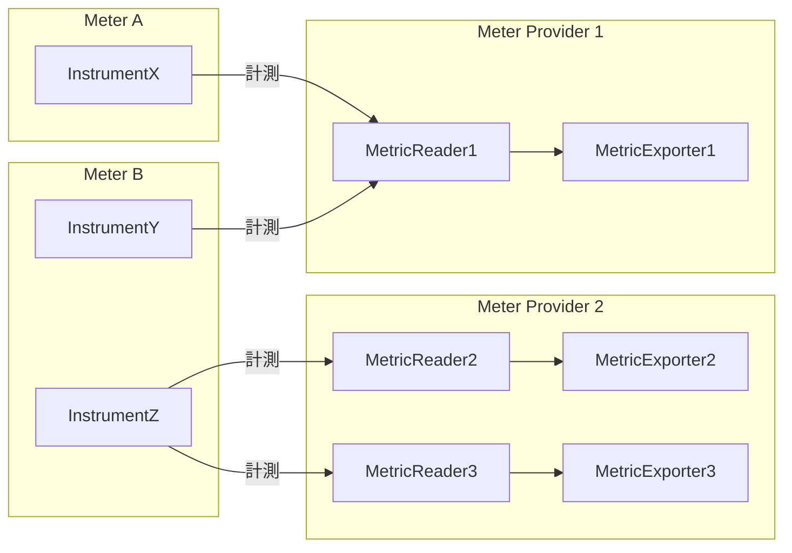
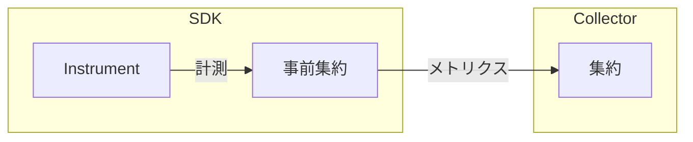
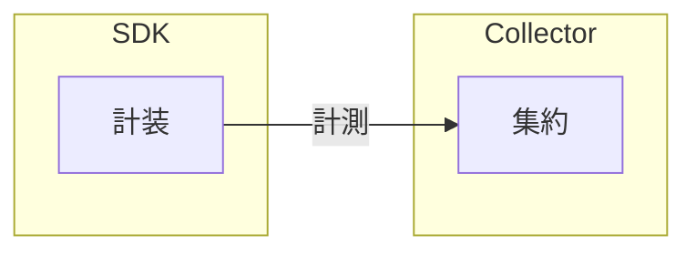

OpenTelemetry .NET のメトリクスを最大限に活用するために、以下のベストプラクティスに従ってください。

## パッケージバージョン {#package-version}

使用している .NET ランタイムのバージョンに関係なく、[System.Diagnostics.DiagnosticSource](https://www.nuget.org/packages/System.Diagnostics.DiagnosticSource/) パッケージの最新の安定バージョンに含まれる [System.Diagnostics.Metrics](https://learn.microsoft.com/dotnet/api/system.diagnostics.metrics) API を使用してください。

- OpenTelemetry .NET SDK の最新の安定バージョンを使用している場合、`System.Diagnostics.DiagnosticSource` パッケージのバージョンについて心配する必要はありません。
  パッケージの依存関係によってすでに管理されています。
- .NET ランタイムチームは、メジャーバージョンのバンプ時でも `System.Diagnostics.DiagnosticSource` の後方互換性に高い基準を維持しているため、互換性についての懸念はありません。
- `System.Diagnostics.Metrics` の詳細については、[.NET 公式ドキュメント](https://learn.microsoft.com/dotnet/core/diagnostics/compare-metric-apis#systemdiagnosticsmetrics)を参照してください。

## Metrics API {#metrics-api}

### Meter {#meter}

[`System.Diagnostics.Metrics.Meter`](https://learn.microsoft.com/dotnet/api/system.diagnostics.metrics.meter) を頻繁に作成することは避けてください。
`Meter` はかなりコストが高く、アプリケーション全体で再利用することを意図しています。
ほとんどのアプリケーションでは、static readonly フィールドとしてモデル化するか、依存性注入を通じてシングルトンとして扱えます。

[`Meter.Name`](https://learn.microsoft.com/dotnet/api/system.diagnostics.metrics.meter.name) には、ドットで区切った [UpperCamelCase](https://en.wikipedia.org/wiki/Camel_case) を使用してください。
多くの場合、完全修飾クラス名を使うのがよい選択です。
たとえば次のようになります。

```csharp
static readonly Meter MyMeter = new("MyCompany.MyProduct.MyLibrary", "1.0");
```

### 計装 {#instruments}

適切な計装タイプを理解し、選択してください。

> [!NOTE]
>
> .NET ランタイムは、[OpenTelemetry 仕様](/docs/specs/otel/metrics/api/#instrument)に基づいていくつかの計装タイプを提供しています。
> ユースケースに適した計装タイプを選択することは、正しいセマンティクスとパフォーマンスを確保するために重要です。
> 詳細については、補足ガイドラインの[計装の選択](/docs/specs/otel/metrics/supplementary-guidelines#instrument-selection)セクションを確認してください。

| OpenTelemetry 仕様                                                                     | .NET 計装タイプ                                                                                                             |
| -------------------------------------------------------------------------------------- | --------------------------------------------------------------------------------------------------------------------------- |
| [Asynchronous Counter](/docs/specs/otel/metrics/api/#asynchronous-counter)             | [`ObservableCounter<T>`](https://learn.microsoft.com/dotnet/api/system.diagnostics.metrics.observablecounter-1)             |
| [Asynchronous Gauge](/docs/specs/otel/metrics/api/#asynchronous-gauge)                 | [`ObservableGauge<T>`](https://learn.microsoft.com/dotnet/api/system.diagnostics.metrics.observablegauge-1)                 |
| [Asynchronous UpDownCounter](/docs/specs/otel/metrics/api/#asynchronous-updowncounter) | [`ObservableUpDownCounter<T>`](https://learn.microsoft.com/dotnet/api/system.diagnostics.metrics.observableupdowncounter-1) |
| [Counter](/docs/specs/otel/metrics/api/#counter)                                       | [`Counter<T>`](https://learn.microsoft.com/dotnet/api/system.diagnostics.metrics.counter-1)                                 |
| [Gauge](/docs/specs/otel/metrics/api/#gauge)                                           | [`Gauge<T>`](https://learn.microsoft.com/dotnet/api/system.diagnostics.metrics.gauge-1)                                     |
| [Histogram](/docs/specs/otel/metrics/api/#histogram)                                   | [`Histogram<T>`](https://learn.microsoft.com/dotnet/api/system.diagnostics.metrics.histogram-1)                             |
| [UpDownCounter](/docs/specs/otel/metrics/api/#updowncounter)                           | [`UpDownCounter<T>`](https://learn.microsoft.com/dotnet/api/system.diagnostics.metrics.updowncounter-1)                     |

計装（たとえば `Counter<T>`）を頻繁に作成することは避けてください。
計装はかなりコストが高く、アプリケーション全体で再利用することを意図しています。
ほとんどのアプリケーションでは、計装は static readonly フィールドとしてモデル化するか、依存性注入を通じてシングルトンとして扱えます。

無効な計装名の使用を避けてください。

> [!NOTE]
>
> OpenTelemetry は無効な名前を使用している計装からメトリクスを収集しません。
> 有効な構文については、[OpenTelemetry 仕様](/docs/specs/otel/metrics/api/#instrument-name-syntax)を参照してください。

計測の報告時にタグの順序を変更することは避けてください。
たとえば次のようになります。

> [!WARNING]
>
> 以下のコードの最後の行は、タグが同じ順序に従っていないため、パフォーマンスが悪くなります。

```csharp
counter.Add(2, new("name", "apple"), new("color", "red"));
counter.Add(3, new("name", "lime"), new("color", "green"));
counter.Add(5, new("name", "lemon"), new("color", "yellow"));
counter.Add(8, new("color", "yellow"), new("name", "lemon")); // パフォーマンスが悪い
```

最高のパフォーマンスを達成するために、`TagList` を適切に使用してください。
計装 API にタグを渡す方法は2つあります。

- 計装 API にタグを直接渡す方法。

  ```csharp
  counter.Add(100, new("Key1", "Value1"), new("Key2", "Value2"));
  ```

- [`TagList`](https://learn.microsoft.com/dotnet/api/system.diagnostics.taglist) を使用する方法。

  ```csharp
  var tags = new TagList
  {
      { "DimName1", "DimValue1" },
      { "DimName2", "DimValue2" },
      { "DimName3", "DimValue3" },
      { "DimName4", "DimValue4" },
  };

  counter.Add(100, tags);
  ```

一般的なルールとして、以下のようになります。

- タグが3つ以下の計測を報告する場合、計装 API にタグを直接渡してください。
- タグが4つから8つ（両端を含む）の計測を報告する場合、GC 圧力の回避が主要なパフォーマンス目標であれば、ヒープ割り当てを避けるために [`TagList`](https://learn.microsoft.com/dotnet/api/system.diagnostics.taglist?#remarks) を使用してください。
  メモリ割り当ての最適化よりも CPU 使用率の削減（たとえばレイテンシーの削減、バッテリーの節約など）を重視する高パフォーマンスコードの場合は、プロファイラーとストレステストを使用してどちらのアプローチが優れているかを判断してください。
- タグが8つを超える計測を報告する場合、2つのアプローチは非常に似た CPU パフォーマンスとヒープ割り当てを示します。
  可読性と保守性に優れている `TagList` が推奨されます。

> [!NOTE]
>
> タグが8つを超える計測を報告する場合、API はホットコードパスでメモリを割り当てます。
> タグの数を8以下に保つようにしてください。
> この数を超える場合は、[こちらに示すように](#metrics-enrichment)、一部のタグを Resource としてモデル化できないか確認してください。

## MeterProvider の管理 {#meterprovider-management}

`MeterProvider` インスタンスを頻繁に作成することは避けてください。
`MeterProvider` はかなりコストが高く、アプリケーション全体で再利用することを意図しています。
ほとんどのアプリケーションでは、プロセスごとに1つの `MeterProvider` インスタンスで十分です。
たとえば次のようになります。



`MeterProvider` インスタンスを自分で作成した場合は、そのライフサイクルを管理してください。

一般的なルールとして、以下のようになります。

- [依存性注入（DI）](https://learn.microsoft.com/dotnet/core/extensions/dependency-injection)を使用するアプリケーション（たとえば [ASP.NET Core](https://learn.microsoft.com/aspnet/core) や [.NET Worker](https://learn.microsoft.com/dotnet/core/extensions/workers)）を構築している場合、ほとんどのケースでは `MeterProvider` インスタンスを作成し、DI にそのライフサイクルを管理させるべきです。
  詳細については、[5分で始める OpenTelemetry .NET メトリクス - ASP.NET Core アプリケーション](/docs/languages/dotnet/metrics/getting-started-aspnetcore/)チュートリアルを参照してください。
- DI を使用しないアプリケーションを構築している場合は、`MeterProvider` インスタンスを作成し、ライフサイクルを明示的に管理してください。
  詳細については、[5分で始める OpenTelemetry .NET メトリクス - コンソールアプリケーション](/docs/languages/dotnet/metrics/getting-started-console/)チュートリアルを参照してください。
- アプリケーションの終了前に `MeterProvider` インスタンスを破棄し忘れると、適切なフラッシュが行われないためメトリクスが欠落する可能性があります。
- `MeterProvider` インスタンスを早期に破棄すると、それ以降の計測は収集されません。

## メモリ管理 {#memory-management}

OpenTelemetry では、[計測](/docs/specs/otel/metrics/api/#measurement)は Metrics API を通じて報告されます。
SDK は、良好なパフォーマンスと効率を達成するために、特定のアルゴリズムとメモリ管理戦略を使用してメトリクスを[集約](/docs/specs/otel/metrics/sdk/#aggregation)します。
以下は、OpenTelemetry .NET がメトリクスの集約ロジックを実装する際に従うルールです。

1. [**事前集約**](#pre-aggregation): 集約は SDK 内で行われます。
2. [**カーディナリティ制限**](#cardinality-limits): 集約ロジックは[カーディナリティ制限](/docs/specs/otel/metrics/sdk/#cardinality-limits)を遵守するため、カーディナリティの爆発が発生しても SDK が無制限のメモリを使用することはありません。
3. [**メモリの事前割り当て**](#memory-preallocation): 集約ロジックが使用するメモリは SDK の初期化時に割り当てられるため、SDK はオンザフライでメモリを割り当てる必要がありません。
   これは、ホットコードパスでガベージコレクションがトリガーされることを避けるためです。

### 例 {#example}

以下の例を考えてみましょう。

- 時間範囲 (T0, T1] の間:
  - value = 1, name = `apple`, color = `red`
  - value = 2, name = `lemon`, color = `yellow`
- 時間範囲 (T1, T2] の間:
  - 果物の受信なし
- 時間範囲 (T2, T3] の間:
  - value = 5, name = `apple`, color = `red`
  - value = 2, name = `apple`, color = `green`
  - value = 4, name = `lemon`, color = `yellow`
  - value = 2, name = `lemon`, color = `yellow`
  - value = 1, name = `lemon`, color = `yellow`
  - value = 3, name = `lemon`, color = `yellow`

[累積集約テンポラリティ](/docs/specs/otel/metrics/data-model/#temporality)を使用してメトリクスを集約しエクスポートした場合は次のようになります。

- (T0, T1]
  - 属性: {name = `apple`, color = `red`}, count: `1`
  - 属性: {verb = `lemon`, color = `yellow`}, count: `2`
- (T0, T2]
  - 属性: {name = `apple`, color = `red`}, count: `1`
  - 属性: {verb = `lemon`, color = `yellow`}, count: `2`
- (T0, T3]
  - 属性: {name = `apple`, color = `red`}, count: `6`
  - 属性: {name = `apple`, color = `green`}, count: `2`
  - 属性: {verb = `lemon`, color = `yellow`}, count: `12`

> [!NOTE] 累積テンポラリティを使用する同期計装では、これまでに記録されたすべての属性セットは、新しい計測が報告されていなくても、すべての収集サイクルでエクスポートされ続けます（上記の `(T0, T2]` の期間に示されているとおり）。
> **オブザーバブル（非同期）計装**（たとえば `ObservableGauge`、`ObservableCounter`）では、動作が異なります。
> 現在の収集サイクルでコールバックによって報告された属性セットのみがエクスポートされます。
> コールバックが特定の属性セットの報告を停止すると、その属性セットは以降のエクスポートから省略されます。
> つまり、ユーザーはコールバック内の状態を管理する責任があります。
> シリーズのエクスポートを停止するには、単にその報告を停止してください。

[デルタ集約テンポラリティ](/docs/specs/otel/metrics/data-model/#temporality)を使用してメトリクスを集約しエクスポートした場合は次のようになります。

- (T0, T1]
  - 属性: {name = `apple`, color = `red`}, count: `1`
  - 属性: {verb = `lemon`, color = `yellow`}, count: `2`
- (T1, T2]
  - 受信した計測がないため、データなし
- (T2, T3]
  - 属性: {name = `apple`, color = `red`}, count: `5`
  - 属性: {name = `apple`, color = `green`}, count: `2`
  - 属性: {verb = `lemon`, color = `yellow`}, count: `10`

### 事前集約 {#pre-aggregation}

[果物の例](#example)を取り上げると、`(T2, T3]` の間に6つの計測が報告されています。
個々の計測イベントをすべてエクスポートするかわりに、SDK はそれらを集約し、要約された結果のみをエクスポートします。
以下の図に示されるこのアプローチは、事前集約と呼ばれます。



事前集約にはいくつかの利点があります。

1. 計算量は変わりませんが、事前集約を使用することで送信されるデータ量を大幅に削減でき、全体的な効率が向上します。
2. 事前集約により、SDK の初期化時に[カーディナリティ制限](#cardinality-limits)を適用できるようになり、[メモリの事前割り当て](#memory-preallocation)と組み合わせることで、メトリクスデータ収集の動作がより予測可能になります（たとえば、サービス拒否攻撃を受けているサーバーでも一定量のメトリクスデータを生成し続け、大量の計測イベントでオブザーバビリティシステムを溢れさせることはありません）。

以下の図に示すように、事前集約を使用するかわりに生の計測イベントをエクスポートしたい場合があります。
OpenTelemetry は現時点ではこのシナリオをサポートしていません。
興味がある方は、この[機能リクエスト](https://github.com/open-telemetry/opentelemetry-specification/issues/617)に返信してディスカッションに参加してください。



### カーディナリティ制限 {#cardinality-limits}

属性のユニークな組み合わせの数をカーディナリティと呼びます。
[果物の例](#example)を取り上げると、名前として apple/lemon のみ、色として red/yellow/green のみが存在するとわかっている場合、カーディナリティは6であると言えます。
りんごとレモンの数に関係なく、以下の表を使用して名前と色に基づく果物の合計数を常にまとめることができます。

| 名前  | 色     | カウント |
| ----- | ------ | -------- |
| apple | red    | 6        |
| apple | yellow | 0        |
| apple | green  | 2        |
| lemon | red    | 0        |
| lemon | yellow | 12       |
| lemon | green  | 0        |

つまり、トラフィックパターンに関係なく、これらのメトリクスを収集して送信するために必要なストレージとネットワークの量がわかります。

実際のアプリケーションでは、カーディナリティは非常に高くなる場合があります。
長時間稼働するサービスがあり、7つの属性でメトリクスを収集し、各属性が30の異なる値を持つ場合を想像してください。
最終的に、21,870,000,000 のすべての組み合わせの完全なセットを記憶しなければならなくなる可能性があります。
このカーディナリティの爆発は、メトリクス分野でよく知られた課題です。
たとえば、オブザーバビリティシステムで驚くほど高いコストを引き起こしたり、ハッカーがサービス拒否攻撃に悪用したりする可能性があります。

[カーディナリティ制限](/docs/specs/otel/metrics/sdk/#cardinality-limits)は、悪意のある攻撃や開発者のコーディングミスによって過度のカーディナリティが発生した場合でも、メトリクス収集システムが予測可能で信頼性の高い動作をするためのスロットリングメカニズムです。

OpenTelemetry では、メトリクスごとのデフォルトのカーディナリティ制限が `2000` に設定されています。
この制限は、[View API](/docs/specs/otel/metrics/sdk/#view) と `MetricStreamConfiguration.CardinalityLimit` 設定を使用して、個々のメトリクスレベルで構成できます。

`1.10.0` 以降、メトリクスがカーディナリティ制限に達すると、独立して集約できない新しい計測は[オーバーフロー属性](/docs/specs/otel/metrics/sdk/#overflow-attribute)を使用して自動的に集約されます。

> [!NOTE]
>
> SDK バージョン `1.6.0` から `1.9.0` では、オーバーフロー属性は環境変数 `OTEL_DOTNET_EXPERIMENTAL_METRICS_EMIT_OVERFLOW_ATTRIBUTE=true` を設定することで有効にできる実験的な機能でした。

`1.10.0` 以降、[デルタ集約テンポラリティ](/docs/specs/otel/metrics/data-model/#temporality)を使用している場合、SDK が未使用のメトリクスポイントを回収するため、より小さなカーディナリティ制限を選択できます。

> [!NOTE]
>
> SDK バージョン `1.7.0` から `1.9.0` では、メトリクスポイントの回収は環境変数 `OTEL_DOTNET_EXPERIMENTAL_METRICS_RECLAIM_UNUSED_METRIC_POINTS=true` を設定することで有効にできる実験的な機能でした。

### メモリの事前割り当て {#memory-preallocation}

OpenTelemetry .NET SDK は、ホットコードパスでのメモリ割り当てを避けることを目指しています。
これを [Metrics API の適切な使用](#metrics-api)と組み合わせることで、ホットコードパスでのヒープ割り当てを避けることができます。

ホットコードパスでのメモリ割り当てを計測し、Metrics API と SDK の使用中にヒープ割り当てを理想的には回避すべきです。
特に、メトリクスを使用してアプリケーションのパフォーマンスを計測する場合は重要です（たとえば、通常10ミリ秒かかる操作の計測中に[ガベージコレクション](https://learn.microsoft.com/dotnet/standard/garbage-collection/)で2秒費やしたくはないでしょう）。

## メトリクスの相関 {#metrics-correlation}

> [!WARNING] **メトリクスの属性として `TraceId` と `SpanId` を使用することは避けてください。**
>
> トレースコンテキスト（`TraceId`、`SpanId`）をメトリクスの属性に含めることは、メトリクスとトレースを相関させる直感的な方法に思えるかもしれませんが、このアプローチは効果がなく、メトリクスを実質的に使用不能にする可能性があります。
> トレースコンテキストを属性として含めると、各ユニークなトレースコンテキストが新しい属性の組み合わせになるため、カーディナリティの爆発が発生します。
> これにより、メトリクスが[カーディナリティ制限](#cardinality-limits)に急速に到達し、計測がオーバーフローバケットに折りたたまれて、達成しようとしていた相関情報が失われる結果になります。

<!-- markdownlint-disable-next-line MD028 -->

> [!TIP] **メトリクスとトレースの相関にはエグゼンプラーを使用してください。**
>
> [エグゼンプラー](/docs/specs/otel/metrics/sdk/#exemplar)は、特定の計測をサンプリングしトレースコンテキストを付与することで、メトリクスと[トレース](/docs/languages/dotnet/traces/)を相関させるメカニズムを提供します。
> このアプローチは、計測のサブセットに対してトレースの相関を可能にしながら、メトリクスのカーディナリティを維持します。
> 詳細については、[エグゼンプラー](/docs/languages/dotnet/metrics/exemplars/)チュートリアルを確認してください。

## メトリクスの強化 {#metrics-enrichment}

メトリクスが収集されるとき、通常は[時系列データベース](https://en.wikipedia.org/wiki/Time_series_database)に格納されます。
ストレージと消費の観点から、メトリクスは多次元にできます。
[果物の例](#example)を取り上げると、「name」と「color」の2つの次元があります。
基本的なシナリオでは、すべての次元を [Metrics API](#metrics-api) の呼び出し時に報告できますが、より複雑なシナリオでは、次元はさまざまなソースから提供されます。

- [Metrics API](#metrics-api) を通じて報告される[計測](/docs/specs/otel/metrics/api/#measurement)。
- 計装の作成時に提供される追加のタグ。
  たとえば、[`Meter.CreateCounter<T>(name, unit, description, tags)`](https://learn.microsoft.com/dotnet/api/system.diagnostics.metrics.meter.createcounter) オーバーロードなど。
- Meter の作成時に提供される追加のタグ。
  たとえば、[`Meter(name, version, tags, scope)`](https://learn.microsoft.com/dotnet/api/system.diagnostics.metrics.meter.-ctor) オーバーロードなど。
- `MeterProvider` レベルで構成される[リソース](/docs/specs/otel/resource/sdk)。
- エクスポーターまたは Collector によって提供される追加の属性。
  たとえば、Prometheus の[ジョブとインスタンス](https://prometheus.io/docs/concepts/jobs_instances/)など。

> [!NOTE]
>
> [OpenTelemetry 仕様](/docs/specs/otel/metrics/api/#instrument)がサポートしていないため、計装レベルのタグサポートは OpenTelemetry .NET ではまだ実装されていません。

一般的なルールとして、以下のようになります。

- 次元がプロセスのライフタイム全体を通じて静的な場合（たとえばマシンの名前、データセンター）:
  - その次元がすべてのメトリクスに適用される場合は、Resource としてモデル化するか、可能であれば Collector にこれらの次元を追加させるのがさらによいでしょう（たとえば、同じデータセンターで稼働する Collector はデータセンターの名前を知っているべきであり、各サービスインスタンスがデータセンター名を報告することに依存・信頼するべきではありません）。
  - その次元がメトリクスのサブセットに適用される場合（たとえばクライアントライブラリのバージョン）は、Meter レベルのタグとしてモデル化してください。
- 次元の値が動的な場合は、[Metrics API](#metrics-api) を通じて報告してください。

> [!NOTE]
>
> `MeasurementProcessor` という新しいコンセプトの追加に関する議論がありました。
> これは、次元を計測に動的に追加・削除できるようにするものです。
> このアイデアは、複雑さとパフォーマンスへの影響のため支持を得られませんでした。
> 詳細については、この[プルリクエスト](https://github.com/open-telemetry/opentelemetry-specification/pull/1938)を参照してください。

## メトリクスの欠落につながる一般的な問題 {#common-issues-that-lead-to-missing-metrics}

- 計装の作成に使用した `Meter` が `MeterProvider` に追加されていません。
  必要なメトリクスの処理を有効にするには、`AddMeter` メソッドを使用してください。
