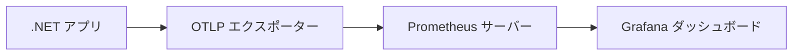

このガイドでは、OpenTelemetry メトリクスを Prometheus にエクスポートし、Grafana で可視化する方法を紹介します。

## 前提条件 {#prerequisites}

- コンピューターに [.NET SDK](https://dotnet.microsoft.com/download) がインストールされていること
- [Prometheus](https://prometheus.io/download/) がダウンロードされていること（インストール手順は後述します）
- [Grafana](https://grafana.com/docs/grafana/latest/installation/) がダウンロードされていること（インストール手順は後述します）

## OTLP エクスポート付きの .NET アプリケーションの作成 {#creating-a-net-application-with-otlp-export}

まず、メトリクス収集の基本を理解するために、[コンソールで始める](/docs/languages/dotnet/metrics/getting-started-console/)ガイドに従ってください。

新しいコンソールアプリケーションを作成します。

```shell
dotnet new console --output getting-started-prometheus-grafana
cd getting-started-prometheus-grafana
```

OpenTelemetry OTLP エクスポーターパッケージをインストールします。

```shell
dotnet add package OpenTelemetry.Exporter.OpenTelemetryProtocol
```

`Program.cs` ファイルを以下のコードで更新します。

```csharp
using System;
using System.Diagnostics.Metrics;
using System.Threading;
using OpenTelemetry;
using OpenTelemetry.Exporter;
using OpenTelemetry.Metrics;

// メーターを定義する
var myMeter = new Meter("MyCompany.MyProduct.MyLibrary", "1.0");

// カウンター計装を作成する
var myFruitCounter = myMeter.CreateCounter<long>("MyFruitCounter");

// OTLP エクスポート付きで OpenTelemetry MeterProvider を設定する
var meterProvider = Sdk.CreateMeterProviderBuilder()
    .AddMeter("MyCompany.MyProduct.MyLibrary")
    .AddOtlpExporter((exporterOptions, metricReaderOptions) =>
    {
        exporterOptions.Endpoint = new Uri("http://localhost:9090/api/v1/otlp/v1/metrics");
        exporterOptions.Protocol = OtlpExportProtocol.HttpProtobuf;
        metricReaderOptions.PeriodicExportingMetricReaderOptions.ExportIntervalMilliseconds = 1000;
    })
    .Build();

Console.WriteLine("Press any key to exit");

// ユーザーがキーを押すまでメトリクスを生成し続ける
while (!Console.KeyAvailable)
{
    myFruitCounter.Add(1, new("name", "apple"), new("color", "red"));
    myFruitCounter.Add(2, new("name", "lemon"), new("color", "yellow"));
    myFruitCounter.Add(1, new("name", "lemon"), new("color", "yellow"));
    myFruitCounter.Add(2, new("name", "apple"), new("color", "green"));
    myFruitCounter.Add(5, new("name", "apple"), new("color", "red"));
    myFruitCounter.Add(4, new("name", "lemon"), new("color", "yellow"));

    Thread.Sleep(300);
}

// アプリケーション終了前にメータープロバイダーを破棄する。
// これにより、残りのメトリクスがフラッシュされ、メトリクスパイプラインがシャットダウンされる。
meterProvider.Dispose();
```

このアプリケーションを実行すると、`http://localhost:9090/api/v1/otlp/v1/metrics` で Prometheus にメトリクスをエクスポートしようとします。
まだ Prometheus をセットアップしていないため、最初は失敗します。
次のステップで Prometheus をセットアップします。

## Prometheus のセットアップ {#setting-up-prometheus}

Prometheus はメトリクスのスクレイプと保存が可能な、オープンソースの監視およびアラートシステムです。

### Prometheus のインストールと実行 {#installing-and-running-prometheus}

1. [公式サイト](https://prometheus.io/download/)から Prometheus をダウンロードします
2. マシン上の任意の場所に展開します
3. OTLP レシーバーを有効にして Prometheus を実行します。

```shell
./prometheus --web.enable-otlp-receiver
```

> [!NOTE]
>
> `--web.enable-otlp-receiver` フラグを指定すると、Prometheus が OpenTelemetry Protocol（OTLP）を通じてメトリクスを受信できるようになります。

### Prometheus でのメトリクスの確認 {#viewing-metrics-in-prometheus}

1. .NET アプリケーションを実行します（Prometheus へのメトリクスのエクスポートが成功するはずです）
2. ウェブブラウザーを開き、[http://localhost:9090/graph](http://localhost:9090/graph) に移動します
3. 式バーに `MyFruitCounter_total` と入力し、Execute をクリックします

フルーツ名と色の組み合わせごとに、カウンター値が増加するグラフが表示されるはずです。

## Grafana のセットアップ {#setting-up-grafana}

Grafana は基本的な Prometheus UI よりも強力な可視化機能を提供します。

### Grafana のインストールと実行 {#installing-and-running-grafana}

1. [公式の手順](https://grafana.com/docs/grafana/latest/installation/)に従って Grafana をインストールします
2. Grafana サーバーを起動します（コマンドは OS によって異なります）
3. ブラウザーで [http://localhost:3000](http://localhost:3000) に移動します
4. デフォルトの認証情報（ユーザー名: `admin`、パスワード: `admin`）でログインし、プロンプトが表示されたら新しいパスワードを設定します

### データソースとしての Prometheus の設定 {#configuring-prometheus-as-a-data-source}

1. Grafana で左サイドバーの Configuration（歯車）アイコンにホバーし、「Data sources」をクリックします
2. 「Add data source」をクリックします
3. 「Prometheus」を選択します
4. URL を `http://localhost:9090` に設定します
5. 下部の「Save & Test」をクリックします

### ダッシュボードの作成 {#creating-a-dashboard}

1. 左サイドバーの「+」アイコンをクリックし、「Dashboard」を選択します
2. 「Add new panel」をクリックします
3. クエリエディターで `rate(MyFruitCounter_total[5m])` のような PromQL クエリを入力すると、過去5分間の毎秒の増加率が表示されます
4. 「Apply」をクリックしてダッシュボードにパネルを追加します
5. 右上の保存アイコンをクリックしてダッシュボードを保存します

## メトリクスフローの理解 {#understanding-the-metrics-flow}



1. .NET アプリケーションが OpenTelemetry の計装を使用してメトリクスを収集します
2. OTLP エクスポーターが OTLP プロトコルを使用してこれらのメトリクスを Prometheus に送信します
3. Prometheus がメトリクスを時系列データベースに保存します
4. Grafana が Prometheus にクエリを実行し、ダッシュボードでメトリクスを可視化します

## さらに学ぶ {#learn-more}

- [Prometheus ドキュメント](https://prometheus.io/docs/introduction/overview/)
- [Grafana ドキュメント](https://grafana.com/docs/grafana/latest/)
- [PromQL チートシート](https://promlabs.com/promql-cheat-sheet/)
- [OpenTelemetry Protocol（OTLP）仕様](/docs/specs/otel/protocol/otlp/)
