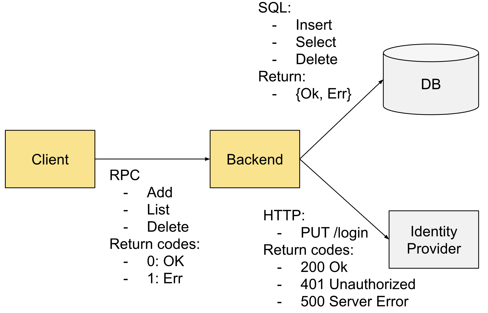

[OBI のメトリクス](../metrics/) のカーディナリティは、計装される環境のサイズと複雑さに大きく依存するため、シンプルかつ正確な公式を提供する方法はありません。

このドキュメントでは、デフォルトの OBI インストールで生成される可能性のあるメトリクスのカーディナリティの概算を提供しようとします。
各メトリクスファミリーは選択的に有効化または無効化できるため、OBI が生成可能な各種のメトリクスごとにいくつかのセクションに分かれています。

単純化のため、以下の公式は単一クラスターを想定しています。
複数のクラスターがある場合は、それぞれのクラスターのカーディナリティを掛け合わせる必要があります。

## 用語 {#terminology}

続ける前に、曖昧であったり解釈の余地がある用語を明確にしておきます。

- **インスタンス**: 計装対象の各単位です。アプリケーションレベルのメトリクスでは、サービスインスタンスやクライアントインスタンスがこれに当たります。Kubernetes では Pod がこれに当たります。1 つのアプリケーションインスタンスが複数のプロセスで実行される場合もあります。ネットワークレベルのメトリクスでは、各インスタンスは特定のホスト内のすべてのネットワークフローを計装する OBI インスタンスです。
- **インスタンスオーナー**: Kubernetes では、ほとんどのインスタンス（Pod）にはオーナーリソースがあります。カーディナリティを抑制するために、インスタンスではなくオーナーに関するデータを報告したい場合があります。インスタンスオーナーの例は Deployment、DaemonSet、ReplicaSet、StatefulSet ですが、Pod にオーナーがない場合（スタンドアロンの Pod）、その Pod 自体がオーナーとして報告されます。
- **URL パス**: クライアントが送信し、サーバーが受信する URL リクエストの生のパスです。たとえば `/clients/348579843/command/833` のような形式です。
- **URL ルート**: URL リクエストの集約されたパスで、カーディナリティを抑制するために意味的にグループ化されます。これは通常、一部の Web フレームワークが HTTP リクエストをコードで定義する方法を模倣します。たとえば `/clients/{clientId}/command/{command_num}` のような形式です。
- **操作**: 要求された機能を表します。
  - HTTP: `GET` などのすべての HTTP 動詞に URL ルートを続けたもの
  - gRPC: サービスのパス
  - SQL: `SELECT`、`UPDATE` などの SQL コマンドに対象テーブルを続けたもの
  - Kafka: Produce/Fetch
- **サーバー**: HTTP または gRPC リクエストを受信して処理する任意のインスタンスです。サーバーはクライアントにもなり得ます。
- **クライアント**: HTTP、gRPC、データベース、または MQ のリクエストを送信する任意のインスタンスです。クライアントはサーバーにもなり得ます。
- **サービス**: Kubernetes のコンテキストでは、共通のホスト名とポートを介してアクセスされる一群のサーバーが提供する機能です。
- **エンドポイント**: サービス、サーバー、またはクライアントを識別する IP またはホスト名とポートです。
- **戻りコード**: 各サービス呼び出しによって返され、実行結果に関するメタ情報を表します。HTTP では HTTP ステータスコードであり、他のプロトコルでは通常 0（成功）または 1（エラー）です。

## アプリケーションレベルのメトリクス {#application-level-metrics}

アプリケーションレベルのメトリクスでは、カーディナリティに影響する要因が複数あり、それらが線形に関連しているわけではないため、単純な乗算の公式を当てはめることはできません。

たとえば、HTTP ルートの数とサーバーアドレスの数はどちらもカーディナリティを増加させますが、すべてのサーバーインスタンスが同じ HTTP ルートを受け付けるわけではないため、単純に掛け合わせることはできません。

次の公式は非常におおまかな上限を示すことができますが、[我々の測定](#case-study-cardinality-of-opentelemetry-demo) では、実際のカーディナリティは計算値よりも 2 桁低い結果でした。
このため、事前にカーディナリティを計算しようとするのではなく、測定指向のアプローチを推奨します。

ただし、全体のカーディナリティに影響する可能性のある要因は次のとおりです。

- **Instances**: 計装されているエンティティの数。サービスとクライアントの両方を含みます。
- **MetricNames**: アプリケーションレベルのメトリクス名の数。OBI が計装するアプリケーションのタイプに応じて変わります。報告される各メトリクスについて 1 つカウントします。
- クライアント側メトリクス（OBI が他のアプリケーションへリクエストを行うアプリケーションを計装する場合）:
  - `http.client.request.duration`
  - `http.client.request.body.size`
  - `rpc.client.duration`
  - `sql.client.duration`
  - `redis.client.duration`
  - `messaging.publish.duration`
  - `messaging.process.duration`
- サーバー側メトリクス（OBI が他のアプリケーションからのリクエストをディスパッチするアプリケーションを計装する場合）:
  - `http.server.request.duration`
  - `http.server.request.body.size`
  - `rpc.server.duration`
- **HistogramBuckets** は、すべてのアプリケーションレベルのメトリクスがヒストグラムであるため、各メトリクスに対して考慮し、乗算する必要があります。バケットは OBI で設定可能ですが、デフォルトの数は duration メトリクスで 15 個、body size メトリクスで 11 個に、さらに 2 つのメトリクス（ヒストグラムの sum と count）が加わります。
- **Operations** は呼び出された機能と同等です。HTTP サービスでは HTTP メソッドと HTTP ルートをグループ化したものであり、RPC では RPC メソッド名です。
- **Endpoints** はサーバーアドレスとポートの数です。
- **ReturnCodes** は操作の取り得る結果の数です。通常、gRPC では Ok/Err、または HTTP ステータスコードです。

### 計算例 {#example-calculation}

提示したカーディナリティの公式の被乗数は重複する場合があります。
たとえば、計装されたクライアントアプリケーションが `/foo` と `/bar` の HTTP リクエストを送信し、サービス A と B の両方に接続する場合、次のようになります。

- Operations: 2
- Endpoints: 2

`Operations * Endpoints` の積はカーディナリティを 4 倍にします。
しかし、`/foo` ルートがサービス A 専用で、`/bar` ルートがサービス B 専用である場合、実際のカーディナリティ乗数は 2 だけになります。

カーディナリティを計算する際は、楽観的な値と悲観的な値の両方を設定してください。

次の例は、サンプルシステムのカーディナリティを計算する方法を示します。
クライアントとバックエンドの両方が OBI によって計装されています。
他のコンポーネントは外部です。



悲観的な計算は次のようになります。

```text
#Instances * #MetricNames * #HistoBuckets * #Operations * #Endpoints * #ReturnCodes =
= 2 * 5 * 177/3 * 37/3 =2771
```

参照とした数値:

- 2 インスタンス（クライアントとバックエンド）
- 役割とプロトコルに応じた 5 種類のメトリクス:
  - クライアント
    - `rpc.client.duration`
  - RPC サーバーとしてのバックエンド
    - `rpc.server.duration`
  - SQL と HTTP クライアントとしてのバックエンド
    - `http.client.request.duration`
    - `http.client.request.body.size`
    - `sql.client.duration`
- 17 個のヒストグラムメトリクス（ほとんどのメトリクスが duration ベースであるため）
- 7 つの操作: RPC Add/List/Delete、HTTP PUT、SQL Insert/Select/Delete
- 3 つのエンドポイント: バックエンド、Identity プロバイダー、DB
- 7 つの戻りコード: RPC OK/Err、HTTP 200/401/500、SQL OK/Err

カーディナリティが 163 を超えないように見えるかもしれません。
しかし一部の乗数はシステム全体には適用されないため、この数値は現実的でも正確でもありません。
たとえば、SQL メソッドは RPC や HTTP メトリクスとは掛け合わせないはずです。

このシンプルなシナリオでは、手動でカウントすると最大カーディナリティが 396 になり、これは当初の 2771 よりはるかに少ない値です。

| #   | インスタンス | メトリクス                      | エンドポイント | 操作       | コード |
| --- | ------------ | ------------------------------- | -------------- | ---------- | ------ |
| 1   | クライアント | `rpc.client.duration`           | バックエンド   | Add        | OK     |
| 2   | クライアント | `rpc.client.duration`           | バックエンド   | Add        | Err    |
| 3   | クライアント | `rpc.client.duration`           | バックエンド   | List       | OK     |
| 4   | クライアント | `rpc.client.duration`           | バックエンド   | List       | Err    |
| 5   | クライアント | `rpc.client.duration`           | バックエンド   | Delete     | OK     |
| 6   | クライアント | `rpc.client.duration`           | バックエンド   | Delete     | Err    |
| 7   | バックエンド | `rpc.server.duration`           |                | Add        | OK     |
| 8   | バックエンド | `rpc.server.duration`           |                | Add        | Err    |
| 9   | バックエンド | `rpc.server.duration`           |                | List       | OK     |
| 10  | バックエンド | `rpc.server.duration`           |                | List       | Err    |
| 11  | バックエンド | `rpc.server.duration`           |                | Delete     | OK     |
| 12  | バックエンド | `rpc.server.duration`           |                | Delete     | Err    |
| 13  | バックエンド | `http.client.request.duration`  | Identity Prov  | PUT /login | 200    |
| 14  | バックエンド | `http.client.request.duration`  | Identity Prov  | PUT /login | 401    |
| 15  | バックエンド | `http.client.request.duration`  | Identity Prov  | PUT /login | 500    |
| 16  | バックエンド | `http.client.request.body.size` | Identity Prov  | PUT /login | 200    |
| 17  | バックエンド | `http.client.request.body.size` | Identity Prov  | PUT /login | 401    |
| 18  | バックエンド | `http.client.request.body.size` | Identity Prov  | PUT /login | 500    |
| 19  | バックエンド | `sql.client.duration`           | DB             | Insert     | OK     |
| 20  | バックエンド | `sql.client.duration`           | DB             | Insert     | Err    |
| 21  | バックエンド | `sql.client.duration`           | DB             | Select     | OK     |
| 22  | バックエンド | `sql.client.duration`           | DB             | Select     | Err    |
| 23  | バックエンド | `sql.client.duration`           | DB             | Delete     | OK     |
| 24  | バックエンド | `sql.client.duration`           | DB             | Delete     | Err    |

簡潔さのために、ヒストグラムバケットはカウントしていません。
次にメトリクスインスタンスをヒストグラムバケット、それにヒストグラムの `_count` と `_sum` で乗算します。

- 3 個の body-size メトリクスインスタンス × 13 = 39
- 21 個の duration メトリクスインスタンス × 17 = 357

合計のカーディナリティ: **396**

上記の例は、カーディナリティへの影響を計算する公式を 1 つ提供することの難しさを示しています。
すべての情報が既知である非常にシンプルな例では、正確なカーディナリティをカウントできました。
アプリケーションとその相互接続についてほとんど、あるいはまったく情報がない大規模な Kubernetes クラスターでは、この演習は不可能でしょう。

## ネットワークレベルのメトリクス {#network-level-metrics}

OBI が提供するカウンターは `obi.network.flow.bytes` 1 つだけなので、ネットワークレベルのメトリクスはアプリケーションレベルのメトリクスより計算が簡単です。
ただし、カーディナリティはアプリケーション同士がどれだけ相互接続されているかにも依存します。

`obi.network.flow.bytes` のデフォルト属性は次のとおりです。

- Direction（リクエスト/レスポンス）
- Kubernetes における送信元と送信先のエンドポイントオーナー: `k8s_src_owner_name`、`k8s_dst_owner_name`、`k8s_src_owner_type`、`k8s_dst_owner_type`、`k8s_src_namespace`、`k8s_dst_namespace`
- `k8s_cluster_name`: 各クラスターで一意。他のメトリクスと同様、単一クラスターを想定しています。

簡略化された悲観的な公式は次のようになります。

```text
#Directions * #SourceOwners * #DestinationOwners
```

ここではすべての送信元オーナーがすべての送信先オーナーに接続されていると仮定しました。
接続係数を適用するほうが現実的です。
たとえば 100 個の Deployment/DaemonSet/StatefulSet を持つクラスターで、各オーナーが平均 2 つの他のオーナーに接続されている場合、カーディナリティは次のようになります。

2 directions × 100 SourceOwners × 2 Destination Owners = **400**

## サービスグラフメトリクス {#service-graph-metrics}

サービスグラフメトリクスは、HTTP、RPC、SQL、Redis、Kafka など、アプリケーションメトリクスで計装可能なインスタンスに対して生成されます。
ネットワークメトリクスはプロトコルに関係なく、ネットワークトラフィックを持つ任意のインスタンスに対して生成されます。

サービスグラフメトリクスは次のメトリクスを生成します。

- `traces_service_graph_request_client`: 15 バケットのヒストグラム
- `traces_service_graph_request_server`: 15 バケットのヒストグラム
- `traces_service_graph_request_failed_total`: カウンター
- `traces_service_graph_request_total`: カウンター

各メトリクスには次の属性もあります。

- `source`: obi
- `client` と `client_namespace`
- `server` と `server_namespace`

計算はネットワークメトリクスと類似していますが、カーディナリティはより高くなります。

- 単一のカウンターメトリクスではなく、全体で 36 のカーディナリティを持つメトリクス/ヒストグラムのセット（2 つの 15+2 ヒストグラム + 2 つのカウンター）を報告します。
- インスタンスのオーナー（たとえば Deployment）で集約するのではなく、クライアントはリクエストを送信するインスタンスであり、サーバーは通常単一のサービスインスタンス経由でアクセスされるため、オーナーとなる場合があります。

## スパンメトリクス {#span-metrics}

- `traces_spanmetrics_latency`: 15 + 2 バケットのヒストグラム
- `traces_spanmetrics_calls_total`: カウンター
- `traces_spanmetrics_size_total`: カウンター
- `traces_spanmetrics_response_size_total`: カウンター

各メトリクスにカーディナリティを追加する可能性のある属性は次のとおりです。

- Service/ServiceNamespace/Instance ID
- スパンの種類: Client/Server/Internal
- スパン名: 通常、操作の名前であり、カーディナリティが高くなる可能性があります
- 戻りコード

最大カーディナリティはおおまかに次のように計算できます。

```text
19 metric buckets * 3 span kinds * #Instances * #Operations * #ReturnCodes
```

[前述のアプリケーションメトリクスの計算例](#example-calculation) で示したとおり、HTTP の戻りコードの大きな数は HTTP サービスにのみ掛かる、あるいは一部のインスタンスグループは総ルートのサブセットしか持たないといった仮定を置きました。

## ケーススタディ: OpenTelemetry デモのカーディナリティ {#case-study-cardinality-of-opentelemetry-demo}

このセクションでは、3 ノードのローカルクラスターにデプロイされた [OpenTelemetry Demo](/docs/demo/architecture/) のカーディナリティを計算します。
サンプルアプリケーションにバンドルされている OpenTelemetry の計装はすべて無効化し、OBI をデプロイして計装を行いました。

### アプリケーションレベルメトリクスの測定 {#measure-application-level-metrics}

計装対象のほとんどのインスタンスはクライアントでありサービスでもあるため、より正確にするために公式の `#instances` 引数を無視します。

```text
#MetricNames * (#HistoBuckets+2) * #Operations * #Endpoints * #ReturnCodes
```

最終的なカーディナリティに対して属性が非線形に与える影響を最小化するため、メトリクスのタイプごと（HTTP、gRPC、Kafka）に別々にカーディナリティの数値を計算します。

**HTTP メトリクス:**

- 4 メトリクス: クライアント、サーバー、リクエストサイズ、時間
- 平均 15 個のヒストグラムバケット
- 既知の操作: 75。実行中の OTel デモから PromQL クエリ `group by (http_request_method, http_route)({__name__=~"http_.*"})` で測定
- 26 エンドポイント。実行中の OTel デモから PromQL クエリ `group by (server_address, server_port)({__name__=~"http_.*"})` で測定
- 6 個のレスポンスステータスコード: 200、301、308、403、408、504。実行中の OTel デモから抽出

HTTP メトリクスの最大計算上限値は次のとおりです。

```text
4 x 15 x 75 x 26 x 6 =~ 702,000
```

これは、アプリケーションレベルのメトリクスに対して公式がいかに効果的でないかを示しています。
既知のすべてのアプリケーションメトリクスタイプを含めても、測定値はずっと低くなります。

`count({__name__=~"http_.*|rpc_.*|sql_.*|redis_.*|messaging_.*"})` **→ 9,600**

### ネットワークレベルメトリクスの測定 {#measure-network-level-metrics}

ネットワークレベルメトリクスについて、2 方向（リクエスト/レスポンス）と、21 個の Deployment がすべての 21 個の Deployment に情報を要求すると仮定すると、次のカーディナリティの数値が得られます。

2×21×21 = 882

アーキテクチャを知っていれば、アーキテクチャ図の矢印のみをカウントし、それらが双方向であると仮定することで、より低い見積もりが得られます。

2x29 = 58

ネットワークメトリクスは、OpenTelemetry デモの接続、その他の内部クラスターの接続、計装トラフィックを測定するため、実際のカーディナリティはより高くなります。

`count(obi_network_flow_bytes_total)` **→ 330**

OpenTelemetry デモに属する部分をよりよく把握するために、次のクエリで名前空間間のトラフィックをグループ化できます。

```text
count(obi_network_flow_bytes_total) by (k8s_src_namespace, k8s_dst_namespace)
```

これは次の情報を返します。

| k8s_src_namespace | k8s_dst_namespace | count |
| ----------------- | ----------------- | ----- |
| default           | default           | 156   |
| kube-system       | default           | 47    |
| default           | kube-system       | 47    |
|                   | default           | 14    |
| default           |                   | 14    |
|                   | kube-system       | 13    |
| kube-system       |                   | 13    |
|                   | gmp-system        | 3     |
| gmp-system        |                   | 3     |
| default           | gmp-system        | 1     |
| gmp-system        | default           | 1     |

OpenTelemetry デモのコンポーネント間トラフィックに対して生成されるネットワークメトリクスの数は 156 です。
`default` 名前空間は送信元と送信先の両方になっています。
`kube-system`、`gmp-system`、または名前空間なしの他のトラフィックもあり、これらは外部接続、テレメトリー、Kubernetes 管理に属します。

### サービスグラフメトリクスの測定 {#measure-service-graph-metrics}

ネットワークメトリクスはサービスグラフの構築によく使用されますが、実際のサービスグラフメトリクスは異なる形をしています。

- 単一のカウンターメトリクスではなく、2 つのカウンターメトリクスと 16+2 バケットのヒストグラムメトリクス 2 つがあります。
- サービスグラフメトリクスは、通常、内部 Kubernetes トラフィックや、アプリケーションレベルで計装されていないインスタンスからのトラフィックを無視します。

測定値は次のとおりです。

`count({__name__=~".*service_graph.*"})` **→ 2300**

### スパンメトリクスの測定 {#measure-span-metrics}

アプリケーションレベルメトリクスの計算では、関連するパラメーターの数が多いため、解析的な数値を得ることが難しいことを示しました。
PromQL で測定することで、カーディナリティの正確な測定値を得ることができます。

`count({__name__=~".*spanmetrics.*"})` **→ 3900**
