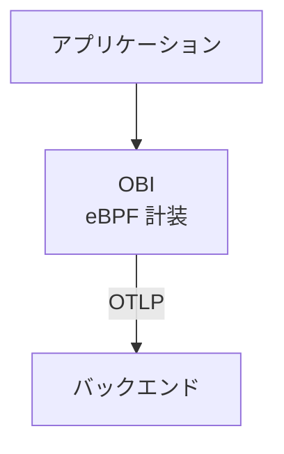
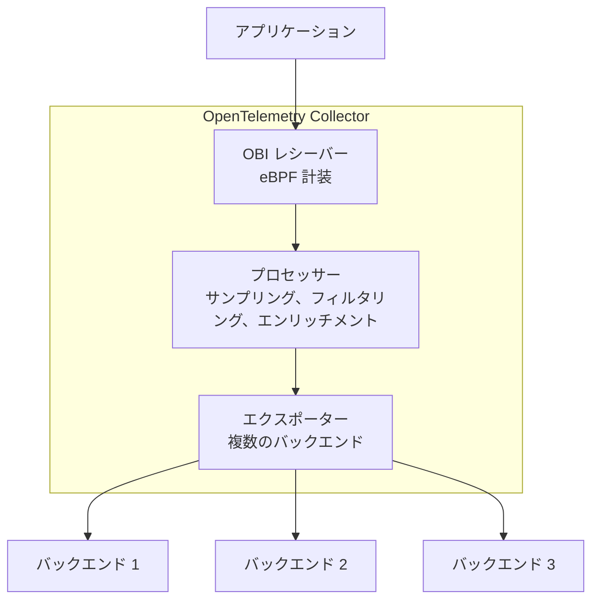

v0.5.0 以降、OBI は [OpenTelemetry Collector](/docs/collector) 内でレシーバーコンポーネントとして動作できます。
この統合により、OBI のゼロコード eBPF 計装の利点を享受しながら、Collector の強力な処理パイプラインを活用できます。

## 概要 {#overview}

OBI を Collector のレシーバーとして実行すると、両方のツールの強みを組み合わせられます。

**OBI から得られるもの**:

- eBPF を使用したゼロコード計装
- 自動サービスディスカバリー
- 低オーバーヘッドのオブザーバビリティ

**OpenTelemetry Collector から得られるもの**:

- 統合されたテレメトリーパイプライン
- 豊富なプロセッサー（サンプリング、フィルタリング、変換）
- 複数のエクスポーター（バックエンド、フォーマット）
- 一元化された設定

## Collector レシーバーモードを使うべき場合 {#when-to-use-collector-receiver-mode}

### 適したユースケース {#good-use-cases}

- **一元的な処理**: すべてのテレメトリーを統合されたパイプライン経由で流したい場合
- **複雑な処理**: Collector が提供する高度なサンプリング、フィルタリング、エンリッチメントが必要な場合
- **複数のバックエンド**: 複数のオブザーバビリティプラットフォームにデータを送信する場合
- **コンプライアンス要件**: データのリダクションや PII 除去のためのテレメトリー処理が必要な場合
- **デプロイの簡素化**: OBI と Collector を別プロセスで動かすのではなく、単一のバイナリで済ませたい場合

### スタンドアロン OBI を使うべき場合 {#when-to-use-standalone-obi-instead}

- **シンプルなデプロイ**: 単一バックエンドへ直接エクスポートするだけで十分な場合
- **エッジ環境**: フル機能の Collector を動かすにはリソースが厳しすぎる場合
- **テスト / 開発**: Collector の設定なしで素早くセットアップしたい場合

## アーキテクチャの比較 {#architecture-comparison}

### スタンドアロン OBI {#standalone-obi}



### Collector レシーバーとしての OBI {#obi-as-collector-receiver}



## 設定 {#configuration}

### OBI レシーバーを含むカスタム Collector のビルド {#build-a-custom-collector-with-obi-receiver}

OBI を Collector のレシーバーとして使うには、OBI レシーバーコンポーネントを含むカスタム Collector バイナリをビルドする必要があります。
これは [OpenTelemetry Collector Builder（OCB）](/docs/collector/extend/ocb/) を使用して行います。OCB は、指定したコンポーネントを含むカスタム Collector バイナリを生成するツールです。
OCB をインストールしていない場合は、[インストール手順](/docs/collector/extend/ocb/#install-the-opentelemetry-collector-builder)を参照してください。

**要件:**

- [Go](https://go.dev) 1.25 以降
- [OCB](/docs/collector/extend/ocb/) がインストールされ、`PATH` から利用できること
- [OpenTelemetry eBPF Instrumentation](https://github.com/open-telemetry/opentelemetry-ebpf-instrumentation) リポジトリの v0.6.0 以降をローカルにチェックアウト
- [Docker](https://docs.docker.com/get-started/get-docker/)（eBPF ファイル生成用）、または C コンパイラ、clang、eBPF ヘッダー

**ビルド手順:**

1. ローカルの OBI ソースディレクトリで eBPF ファイルを生成します。

   ```shell
   cd /path/to/obi
   make docker-generate
   # またはビルドツールがローカルにインストールされている場合:
   # make generate
   ```

   このステップは `ocb` でビルドする前に完了している必要があります。
   OBI レシーバーが必要とする eBPF 型バインディングが生成されます。

2. `builder-config.yaml` を作成します。

   ```yaml
   dist:
     name: otelcol-obi
     description: OpenTelemetry Collector with OBI receiver
     output_path: ./dist

   exporters:
     - gomod: go.opentelemetry.io/collector/exporter/debugexporter v0.142.0
     - gomod: go.opentelemetry.io/collector/exporter/otlpexporter v0.142.0

   processors:
     - gomod: go.opentelemetry.io/collector/processor/batchprocessor v0.142.0

   receivers:
     - gomod: go.opentelemetry.io/obi v0.6.0
       import: go.opentelemetry.io/obi/collector

   providers:
     - gomod: go.opentelemetry.io/collector/confmap/provider/envprovider v1.18.0
     - gomod: go.opentelemetry.io/collector/confmap/provider/fileprovider v1.18.0
     - gomod: go.opentelemetry.io/collector/confmap/provider/httpprovider v1.18.0
     - gomod: go.opentelemetry.io/collector/confmap/provider/httpsprovider v1.18.0
     - gomod: go.opentelemetry.io/collector/confmap/provider/yamlprovider v1.18.0

   replaces:
     - go.opentelemetry.io/obi => /path/to/obi
   ```

   `/path/to/obi` は実際の OBI ソースディレクトリのパスに置き換えてください。
   `replaces:` セクションは、公開モジュールリポジトリからフェッチするかわりにローカルの OBI ソースを使うよう `ocb` に指示します。公開されている OBI モジュールには生成された BPF コードが含まれていないため、これが必要です。

   **バージョン選定**: コンポーネントごとにバージョンを指定する必要があります。
   上記の例では OBI v0.6.0 と互換性が確認されているバージョンを使用しています。
   別の OBI バージョンを使用している場合や、より新しいコンポーネントバージョンを使用したい場合は、OBI リポジトリの `go.mod` ファイルを確認して、依存している Collector コンポーネントのバージョンを特定し、それに合わせて builder の設定を更新してください。

3. カスタム Collector をビルドします。

   ```shell
   ocb --config builder-config.yaml
   ```

   コンパイルされたバイナリは `./dist/otelcol-obi` に配置されます。

### OBI レシーバーを使用した Collector の設定 {#collector-configuration-with-obi-receiver}

OBI レシーバーを含む OpenTelemetry Collector の設定を作成します。

```yaml
# collector-config.yaml
receivers:
  # eBPF 計装用の OBI レシーバー
  obi:
    # ポート 9999 で計装対象の HTTP トラフィックを待ち受ける
    open_port: '9999'

    # ネットワークおよびアプリケーション機能のメトリクス収集を有効化
    meter_provider:
      features: [network, application]

    # オプション: サービスディスカバリーの設定
    # discovery:
    #   poll_interval: 30s

processors:
  # 効率化のためにテレメトリーをバッチ化
  batch:
    timeout: 1s
    send_batch_size: 1024

exporters:
  # デバッグ用にトレースをローカル出力
  debug:
    verbosity: detailed

  # 汎用 OTLP バックエンドへエクスポート
  otlp:
    endpoint: https://backend.example.com:4317
    headers:
      api-key: ${env:OTLP_API_KEY}

service:
  pipelines:
    # OBI 計装を使用したトレースパイプライン
    traces:
      receivers: [obi]
      processors: [batch]
      exporters: [debug, otlp]

    # メトリクスパイプライン
    metrics:
      receivers: [obi]
      processors: [batch]
      exporters: [debug, otlp]
```

### Collector の実行 {#run-the-collector}

```shell
sudo ./otelcol-obi --config collector-config.yaml
```

OBI が eBPF でプロセスを計装するには昇格された権限が必要です。
Collector は `sudo` で実行するか、次のための適切な Linux ケーパビリティ（CAP_SYS_ADMIN、CAP_DAC_READ_SEARCH、CAP_NET_RAW、CAP_SYS_PTRACE、CAP_PERFMON、CAP_BPF）を持っている必要があります。

- 実行中のプロセスに eBPF プローブをアタッチする
- プロセスメモリやシステム情報にアクセスする
- eBPF プログラム用のメモリロックを設定する
- ネットワークおよびアプリケーションのテレメトリーを取得する

これらの権限がない場合、OBI はプロセスを計装できず、起動に失敗します。

## 機能比較: レシーバーモード vs スタンドアロン {#feature-comparison-receiver-mode-vs-standalone}

| 機能                         | スタンドアロン OBI  | OBI レシーバー            |
| ---------------------------- | ------------------- | ------------------------- |
| eBPF 計装                    | ✅ あり             | ✅ あり                   |
| サービスディスカバリー       | ✅ あり             | ✅ あり                   |
| トレース収集                 | ✅ あり             | ✅ あり                   |
| メトリクス収集               | ✅ あり             | ✅ あり                   |
| JSON ログのエンリッチメント  | ✅ あり             | ✅ あり                   |
| OTLP への直接エクスポート    | ✅ あり             | ❌ なし（Collector 経由） |
| Collector プロセッサー       | ❌ なし             | ✅ あり                   |
| 複数のエクスポーター         | ⚠️ 制限あり         | ✅ フルサポート           |
| トレースのテイルサンプリング | ❌ なし             | ✅ あり                   |
| データ変換                   | ⚠️ 基本的なもののみ | ✅ 高度                   |
| リソースのオーバーヘッド     | 低い                | 中程度                    |
| 設定の複雑さ                 | シンプル            | より複雑                  |
| 単一バイナリのデプロイ       | ✅ あり             | ✅ あり                   |

## 高度な設定 {#advanced-configurations}

### Kubernetes DaemonSet による複数 Namespace へのデプロイ {#multi-namespace-kubernetes-daemonset-deployment}

各ノードに OBI レシーバー付き Collector をデプロイするには、まずカスタム Collector バイナリをコンテナイメージにパッケージ化する必要があります。

1. `Dockerfile` を作成します。

   ```dockerfile
   FROM alpine:latest

   # 必要なツールをインストール
   RUN apk --no-cache add ca-certificates

   # OCB でビルドしたカスタム Collector バイナリをコピー
   COPY dist/otelcol-obi /otelcol-obi

   # 実行可能にする
   RUN chmod +x /otelcol-obi

   ENTRYPOINT ["/otelcol-obi"]
   ```

2. イメージをビルドして push します。

   ```shell
   docker build -t my-registry/otelcol-obi:v0.6.0 .
   docker push my-registry/otelcol-obi:v0.6.0
   ```

3. DaemonSet をデプロイします。

   ```yaml
   # otel-collector-daemonset.yaml
   apiVersion: apps/v1
   kind: DaemonSet
   metadata:
     name: otel-collector-obi
     namespace: monitoring
   spec:
     selector:
       matchLabels:
         app: otel-collector-obi
     template:
       metadata:
         labels:
           app: otel-collector-obi
       spec:
         hostNetwork: true
         hostPID: true
         containers:
           - name: otel-collector
             image: my-registry/otelcol-obi:v0.6.0
             args:
               - --config=/conf/collector-config.yaml
             securityContext:
               privileged: true
               capabilities:
                 add:
                   - SYS_ADMIN
                   - SYS_PTRACE
                   - NET_RAW
                   - DAC_READ_SEARCH
                   - PERFMON
                   - BPF
                   - CHECKPOINT_RESTORE
             volumeMounts:
               - name: config
                 mountPath: /conf
               - name: sys
                 mountPath: /sys
                 readOnly: true
               - name: proc
                 mountPath: /host/proc
                 readOnly: true
             resources:
               limits:
                 memory: 1Gi
                 cpu: '1'
               requests:
                 memory: 512Mi
                 cpu: 500m
         volumes:
           - name: config
             configMap:
               name: otel-collector-config
           - name: sys
             hostPath:
               path: /sys
           - name: proc
             hostPath:
               path: /proc
   ```

### 機密データのフィルタリング {#filtering-sensitive-data}

この設定を使うには、`builder-config.yaml` に `attributes` プロセッサーと `filter` プロセッサーを追加する必要があります。

```yaml
processors:
  - gomod:
      github.com/open-telemetry/opentelemetry-collector-contrib/processor/attributesprocessor
      v0.142.0
  - gomod:
      github.com/open-telemetry/opentelemetry-collector-contrib/processor/filterprocessor
      v0.142.0
```

その上で、Collector のプロセッサーを使ってエクスポート前に PII を除去します。

```yaml
receivers:
  obi:
    discovery:
      poll_interval: 30s

processors:
  batch:
    timeout: 1s
    send_batch_size: 1024

  # 機密属性をリダクト
  attributes:
    actions:
      - key: http.url
        action: delete
      - key: user.email
        action: delete
      - key: credit_card
        pattern: \d{4}[- ]?\d{4}[- ]?\d{4}[- ]?\d{4}
        action: hash

  # 機密操作のスパンを除去
  filter:
    traces:
      span:
        - attributes["operation"] == "process_payment"
        - attributes["internal"] == true

exporters:
  debug:
    verbosity: detailed

  # OTLP バックエンドへエクスポート
  otlp:
    endpoint: backend.example.com:4317

service:
  pipelines:
    traces:
      receivers: [obi]
      processors: [attributes, filter, batch]
      exporters: [debug, otlp]
```

### テイルベースサンプリング {#tail-based-sampling}

Collector を使ってインテリジェントなサンプリングを実装できます。
この例では contrib の `tail_sampling` プロセッサーが必要です。`builder-config.yaml` に追加します。

```yaml
processors:
  - gomod:
      github.com/open-telemetry/opentelemetry-collector-contrib/processor/tailsamplingprocessor
      v0.142.0
```

設定例:

```yaml
receivers:
  obi:
    open_port: '9999'

processors:
  batch:
    timeout: 1s
    send_batch_size: 1024

  # テイルベースサンプラーは以下を保持する:
  # - エラーを含むすべてのトレース
  # - 遅いトレース（1 秒超）
  # - 成功した高速トレースの 5%
  tail_sampling:
    policies:
      - name: errors
        type: status_code
        status_code:
          status_codes: [ERROR]
      - name: slow_traces
        type: latency
        latency:
          threshold_ms: 1000
      - name: sample_success
        type: probabilistic
        probabilistic:
          sampling_percentage: 5

exporters:
  debug:
    verbosity: detailed

  otlp:
    endpoint: backend.example.com:4317

service:
  pipelines:
    traces:
      receivers: [obi]
      processors: [tail_sampling, batch]
      exporters: [debug, otlp]
```

## パフォーマンスの考慮事項 {#performance-considerations}

### リソース使用量 {#resource-usage}

OBI を Collector レシーバーとして使用する場合のリソース使用量は、次の要因によって大きく変動します。

- **テレメトリー量**: 計装対象のサービス数とリクエストレート
- **パイプラインの複雑さ**: 設定されているプロセッサーの数と種類
- **エクスポーター設定**: バッチサイズ、キューの深さ、バックエンドの数
- **サービスディスカバリーの範囲**: 監視されるプロセス数

スタンドアロン OBI と同様、eBPF 計装のオーバーヘッドは最小限です。
Collector のパイプラインは設定に応じて追加のリソースを必要とします。

**推奨事項**:

- まず [Kubernetes デプロイ例](#multi-namespace-kubernetes-daemonset-deployment) のリソース上限から始め、実測した使用量に応じて調整する
- [Collector のセルフモニタリング](#optimization-tips)を有効にして、実際のリソース消費量を追跡する
- [パフォーマンスチューニングのオプション](/docs/zero-code/obi/configure/tune-performance/) を使って OBI の eBPF コンポーネントを最適化する
- 本番環境でメモリと CPU 使用量を監視し、それに応じてリソースの requests / limits を調整する

### 最適化のヒント {#optimization-tips}

1. **バッチプロセッサーを使用する**: エクスポートのオーバーヘッドを削減するため、常にバッチプロセッサーを含めます
2. **パイプラインのプロセッサーを絞る**: プロセッサーごとにレイテンシーと CPU 使用量が増加します

3. **バッファリングを設定する**: 大量のトラフィックがある環境ではキューサイズを調整します。

   ```yaml
   exporters:
     otlp:
       sending_queue:
         enabled: true
         num_consumers: 10
         queue_size: 5000
   ```

4. **Collector のメトリクスを監視する**: Collector のセルフモニタリングを有効化します。

   ```yaml
   service:
     telemetry:
       metrics:
         address: :8888
   ```

## 制限事項 {#limitations}

- **単一ノードのみ**: OBI レシーバーはローカル（Collector と同じノード）のプロセスのみを計装します
- **特権アクセスが必要**: Collector は eBPF ケーパビリティ付きで実行する必要があります
- **Linux のみ**: eBPF は Linux 固有であり、Windows および macOS はサポートされません
- **Collector の再起動**: OBI 設定の変更には Collector の再起動が必要です

## トラブルシューティング {#troubleshooting}

### ビルドの問題 {#build-issues}

#### エラー: "API incompatibility" または unknown revision エラー {#error-api-incompatibility-or-unknown-revision-errors}

ビルド時に API 非互換エラーや "unknown revision" エラーが発生した場合は、次を試してください。

1. OBI のソースディレクトリが最新であることを確認します。

   ```shell
   cd /path/to/obi
   git pull origin main  # または使用しているブランチ
   ```

2. Collector コンポーネントのバージョン pin が builder の設定で指定されていないこと、または OBI の `go.mod` で定義されているバージョンと一致していることを確認します。

3. OBI の `go.mod` ファイルを確認し、依存している Collector コンポーネントのバージョンを特定します。

   ```shell
   grep "go.opentelemetry.io/collector" go.mod
   ```

   そして、他のコンポーネントについても同じバージョンを `builder-config.yaml` に追加します。

### 実行時の問題 {#runtime-issues}

#### エラー: "Required system capabilities not present" または "operation not permitted" {#error-required-system-capabilities-not-present-or-operation-not-permitted}

OBI を実行するには昇格された権限が必要です。次の 2 つの選択肢があります。

##### 選択肢 1: sudo で実行する（最もシンプル） {#option-1-run-with-sudo-simplest}

```shell
sudo ./otelcol-obi --config collector-config.yaml
```

##### 選択肢 2: バイナリにケーパビリティを付与する（よりセキュア） {#option-2-grant-capabilities-to-the-binary-more-secure}

`setcap` を使って必要なケーパビリティのみを付与します。

```shell
sudo setcap cap_sys_admin,cap_sys_ptrace,cap_dac_read_search,cap_net_raw,cap_perfmon,cap_bpf,cap_checkpoint_restore=ep ./otelcol-obi
```

その後、sudo なしで実行します。

```shell
./otelcol-obi --config collector-config.yaml
```

ケーパビリティが設定されたことを確認します。

```shell
getcap ./otelcol-obi
```

**Kubernetes の場合:**

Pod のセキュリティコンテキストに必要な Linux ケーパビリティが含まれていることを確認します。

```yaml
securityContext:
  capabilities:
    add:
      - SYS_ADMIN
      - SYS_PTRACE
      - BPF
      - NET_RAW
      - CHECKPOINT_RESTORE
      - DAC_READ_SEARCH
      - PERFMON
```

#### エラー: "failed to create OBI receiver: permission denied" {#error-failed-to-create-obi-receiver-permission-denied}

これは Collector に必要なケーパビリティがないことを意味します。
上記のとおり `sudo` か適切な Kubernetes セキュリティコンテキストで実行していることを確認してください。

#### 計装したアプリケーションからテレメトリーが届かない {#no-telemetry-from-instrumented-apps}

1. OBI レシーバーの設定を確認します。

   ```yaml
   receivers:
     obi:
       discovery:
         poll_interval: 30s
       instrument:
         - exe_path: /path/to/app # パスが正しいか確認する
   ```

2. Collector のログでサービスディスカバリーを確認します。

   ```shell
   grep "discovered service" collector.log
   ```

3. [bpftool](https://github.com/libbpf/bpftool) を使って eBPF プログラムがロードされていることを確認します。

   ```shell
   # Collector コンテナ内で
   bpftool prog show
   ```

#### メモリ使用量が多い {#high-memory-usage}

**原因**: テレメトリー量が大きい、または計装対象のプロセス数が多い

**対処方法**:

1. **適切なバッチサイズを設定**してエクスポートのオーバーヘッドを削減します。

   ```yaml
   processors:
     batch:
       timeout: 200ms
       send_batch_size: 512
       send_batch_max_size: 1024
   ```

2. **計装対象を絞り込む**ことで、OBI が計装するサービスを限定します。

   ```yaml
   receivers:
     obi:
       instrument:
         targets:
           - service_name: 'web-app'
           - service_name: 'api-service'
   ```

   これによりすべてのプロセスを計装するのではなく特定のサービスのみを計装するため、テレメトリー量が削減されます。

## スタンドアロン OBI からの移行 {#migration-from-standalone-obi}

### ステップ 1: カスタム Collector のビルド {#step-1-build-custom-collector}

[設定](#configuration)セクションの手順に従って、OBI レシーバー付き Collector をビルドします。

### ステップ 2: OBI 設定の変換 {#step-2-convert-obi-config}

スタンドアロン OBI の設定を Collector の形式にマッピングします。

**スタンドアロン OBI**:

```yaml
# obi-config.yaml
otel_traces_export:
  endpoint: http://backend:4318

open_port: 8080
```

**OBI レシーバー付き Collector**:

```yaml
# collector-config.yaml
receivers:
  obi:
    instrument:
      - open_port: 8080

exporters:
  otlp:
    endpoint: backend:4317

service:
  pipelines:
    traces:
      receivers: [obi]
      processors: [batch]
      exporters: [otlp]
```

### ステップ 3: デプロイと検証 {#step-3-deploy-and-verify}

1. スタンドアロン OBI を停止する
2. OBI レシーバー付き Collector を起動する
3. バックエンドでテレメトリーの流れを確認する

## 次のステップ {#whats-next}

- データ変換のための [Collector のプロセッサー](https://github.com/open-telemetry/opentelemetry-collector-contrib/tree/main/processor)を探索する
- [Collector のデプロイパターン](/docs/collector/deploy)について学ぶ
- トレースの[サンプリング戦略](/docs/zero-code/obi/configure/sample-traces/)を設定する
- サービスを自動計装するため [サービスディスカバリー](/docs/zero-code/obi/configure/service-discovery/) をセットアップする
