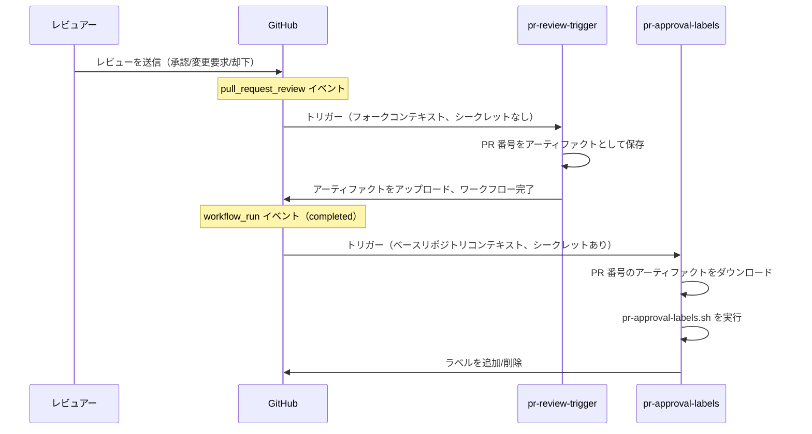
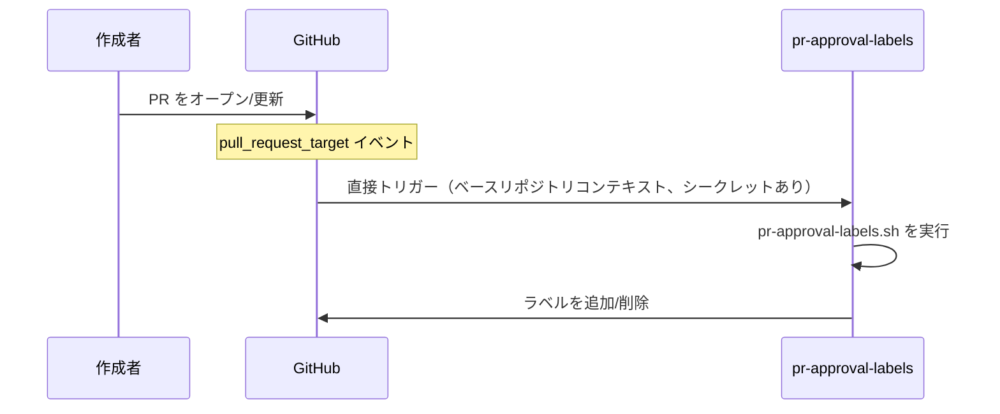
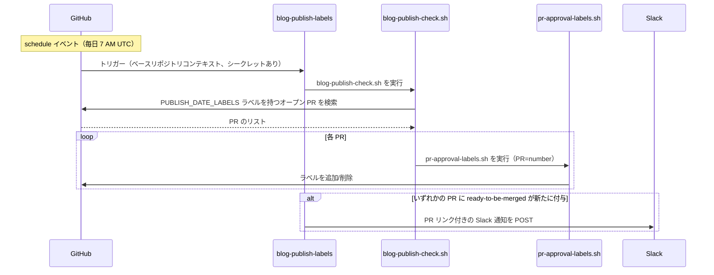

ワークフローと（ほとんどの）ヘルパースクリプトについては、[.github][] 配下の `workflow` フォルダと `scripts` フォルダを参照してください。

## PR 承認ラベル {#pr-approval-labels}

以下のワークフローが連携し、プルリクエストの承認関連ラベルを自動的に管理します。

| ワークフローファイル               | トリガー                              | 権限                                            |
| ---------------------------------- | ------------------------------------- | ----------------------------------------------- |
| [`pr-review-trigger.yml`][trigger] | `pull_request_review`                 | 最小限（シークレットなし）                      |
| [`pr-approval-labels.yml`][labels] | `pull_request_target`, `workflow_run` | ラベル編集と org/team 読み取り用の App トークン |
| [`blog-publish-labels.yml`][blog]  | `schedule`（毎日 7 AM UTC）           | App トークン + `SLACK_WEBHOOK_URL` シークレット |

[trigger]: https://github.com/open-telemetry/opentelemetry.io/blob/main/.github/workflows/pr-review-trigger.yml
[labels]: https://github.com/open-telemetry/opentelemetry.io/blob/main/.github/workflows/label-manager.yml
[blog]: https://github.com/open-telemetry/opentelemetry.io/blob/main/.github/workflows/blog-publish-labels.yml

### 管理されるラベル {#labels-managed}

- **`missing:docs-approval`** — [`docs-approvers`][docs-approvers] チームからの承認が保留中の場合に追加され、docs-approver が承認すると削除されます。
- **`missing:sig-approval`** — SIG チームからの承認が保留中の場合に追加されます（変更されたファイルと [`.github/component-owners.yml`][owners] によって決定されます）。
  SIG メンバーが承認するか、SIG コンポーネントが変更されていない場合に削除されます。
- **`ready-to-be-merged`** — 必要な承認がすべて揃った場合に追加され、そうでない場合は削除されます。
  [`PUBLISH_DATE_LABELS`](#publish-date-gating)（現在: `blog`）のいずれかのラベルを持つ PR では、変更されたファイル内の公開日にも基づいてゲートされます。

[docs-approvers]: https://github.com/orgs/open-telemetry/teams/docs-approvers
[owners]: https://github.com/open-telemetry/opentelemetry.io/blob/main/.github/component-owners.yml

### 公開日ゲーティング {#publish-date-gating}

スクリプトは変更されたファイルごとに `date:` で始まる行（通常は Markdown コンテンツのフロントマター）をスキャンします。
未来の日付が見つかった場合、その日付が到来する（UTC）まで `ready-to-be-merged` ラベルは付与されません。
これにより、コンテンツが予定された公開日前にマージされることを防ぎます。

このチェックは、各ワークフロー YAML で設定される `PUBLISH_DATE_LABELS` 環境変数にリストされたラベルを持つ PR に適用されます（現在: `blog`）。
ラベルを追加すると、他の PR タイプにもチェックが拡張されます。

PR に異なる日付を持つ複数のファイルが含まれる場合、ラベルは最も遅い日付に基づいてゲートされます。
つまり、マージ前にすべてのコンテンツが準備完了している必要があります。

#### スクリプトの動作モード {#script-operating-modes}

[`pr-approval-labels.sh`][script] スクリプトは、単一の PR を処理します（`PR` 環境変数で設定）。
PR イベント時に `pr-approval-labels.yml` から呼び出されるほか、バッチモードでは [`blog-publish-check.sh`][batch-script] から呼び出されます。

[script]: https://github.com/open-telemetry/opentelemetry.io/blob/main/.github/scripts/pr-approval-labels.sh
[batch-script]: https://github.com/open-telemetry/opentelemetry.io/blob/248cc6f/.github/scripts/blog-publish-check.sh

[`blog-publish-check.sh`][batch-script] スクリプトはバッチ反復を処理します。
`PUBLISH_DATE_LABELS` ラベルを持つすべてのオープン PR を検索し、それぞれに対して `pr-approval-labels.sh` を呼び出します。
[`blog-publish-labels.yml`](#blog-publish-labels) の `schedule` トリガー（毎日 7 AM UTC）で使用されるため、夜間に公開日が到来した PR は、新しいコミットなしで自動的に `ready-to-be-merged` を受け取ります。

### なぜ 2 つのワークフローなのか {#why-two-workflows}

GitHub の `pull_request_review` イベントには `_target` バリアントがありません。
つまり、**フォーク PR** のレビューによってトリガーされたワークフローはフォークのコンテキストで実行され、ベースリポジトリのシークレットにアクセスできません。

この制限を回避するために、[`workflow_run` チェインパターン](https://docs.github.com/en/actions/writing-workflows/choosing-when-your-workflow-runs/events-that-trigger-workflows#workflow_run)を使用します。

1. **`pr-review-trigger`** はすべてのレビュー送信/却下時に実行されます。
   PR 番号をアーティファクトとして保存して終了します。シークレットは不要です。
2. **`pr-approval-labels`** は `workflow_run`（トリガーワークフローの完了時）によってトリガーされます。
   ベースリポジトリのコンテキストで GitHub App トークンへのフルアクセスを持って実行され、アーティファクトをダウンロードしてラベルを更新します。

コンテンツの変更（`opened`、`reopened`、`synchronize`）については、`pr-approval-labels` ワークフローは `pull_request_target` を介して直接トリガーされます。





### セキュリティモデル {#security-model}

- **`pr-review-trigger`**: 意図的に最小限 — シークレットなし、特権パーミッションなし。
  コメントは承認に影響しないため、`review.state == "commented"` を無視します。
- **`pr-approval-labels`**: GitHub App トークン（`OTELBOT_DOCS_APP_ID` / `OTELBOT_DOCS_PRIVATE_KEY`）で実行され、org/team メンバーシップの読み取りと PR ラベルの編集の権限を持ちます。
  `pull_request_target` と `workflow_run` を使用して、常に信頼されたベースリポジトリのコンテキストで実行されます。
- **`blog-publish-labels`**: GitHub App トークンと `SLACK_WEBHOOK_URL` シークレットを使用してスケジュールで実行されます。
  常に信頼されたベースリポジトリのコンテキストで実行されます（スケジュールイベントにはフォークバリアントがありません）。

## Blog 公開ラベル {#blog-publish-labels}

[`blog-publish-labels.yml`][blog] ワークフローは毎日 7 AM UTC に実行されます。
[`blog-publish-check.sh`][batch-script] を実行し、`blog` ラベルを持つすべてのオープン PR を反復して、それぞれに対して `pr-approval-labels.sh` を呼び出します。
いずれかの PR に `ready-to-be-merged` が新たに適用された場合、Slack 通知が送信されます。
`workflow_dispatch` を介して手動でトリガーし、`force_notify` 入力でテスト用の Slack 通知を送信することもできます。
`force_notify` が `true` の場合、ラベリングステップは完全にスキップされ（ドライラン）、テスト用の Slack ペイロードのみが送信されます。

| ワークフローファイル              | トリガー                                                                            | 必要なシークレット                              |
| --------------------------------- | ----------------------------------------------------------------------------------- | ----------------------------------------------- |
| [`blog-publish-labels.yml`][blog] | `schedule`（毎日 7 AM UTC）、`workflow_dispatch`（`force_notify` による手動テスト） | `OTELBOT_DOCS_PRIVATE_KEY`, `SLACK_WEBHOOK_URL` |

Slack 通知は、そのラン中にラベルが「なし」から「あり」に遷移した場合にのみ発火します。
すでにラベルが付いた PR に対する日次の繰り返し実行では再通知されません。
ワークフローを手動でトリガーする際は、`force_notify` を `true` に設定すると、1 回限りのテスト通知が送信されます（ラベルは適用されません）。
これにより、Slack のフォーマットを確認できます。

### Slack webhook のセットアップ {#slack-webhook-setup}

このワークフローは **Slack Workflow Builder の webhook トリガー**を使用しており、エンジニア以外のメンバーがワークフローコードに触れることなくメッセージフォーマットを管理できます。

**webhook の作成:**

1. Slack で: **Tools → Workflow Builder → New Workflow → Start from scratch**
2. トリガーを選択: **Webhook**
3. 変数を 1 つ宣言 — 名前: `pr_list`、型: **Text**
4. ステップを追加: **Send a message** で目的のチャンネルに送信、本文は以下のとおり:

   ```text
   :newspaper: *Blog posts ready to publish*

   The following PRs have reached their publish date and all required
   approvals — they are ready to be merged:

   {{pr_list}}

   Have a great day! :sunny:
   ```

   次に **Add button** をクリックして以下を設定:
   - **Label**: `Review and merge`
   - **Color**: Primary（緑）
   - **Action**: Open a link
   - **URL**:
     `https://github.com/open-telemetry/opentelemetry.io/issues?q=is%3Apr+state%3Aopen+label%3Ablog+label%3Aready-to-be-merged`

5. ワークフローを **Publish** して webhook URL をコピー
6. リポジトリに追加: **Settings → Secrets and variables → Actions → New
   repository secret**、名前: `SLACK_WEBHOOK_URL`

**ワークフローが送信するペイロード:**

```json
{
  "pr_list": "• #123: Add blog post: OTel 1.0 — https://github.com/.../pull/123\n• #456: Announce: new SIG — https://github.com/.../pull/456"
}
```

各 PR はタイトルと URL を持つ箇条書きの行です。
Slack はむき出しの URL を自動的にリンクします。
同じ日にラベルが付いた複数の PR は、1 つのメッセージにまとめられます。
PR の数に関係なく、1 回の webhook 呼び出しです。



## PR fix ディレクティブ {#pr-fix-directives}

[`pr-actions.yml`][pr-actions] ワークフローは、コントリビューターが PR にコメントすることで選択した `fix` スクリプトを実行できるようにします。

- **`/fix`** は `npm run fix` を実行します。
- **`/fix:<name>`** は `npm run fix:<name>` を実行します（例: `/fix:format`）。
- **`/fix:all`** はコマンドのセマンティクスが変更されたため `/fix` にマッピングされます（[#9291][]）。
- **`/fix:ALL`** は `fix:all` にマッピングされ、メンテナーが `fix:all` を実行できるようにします。

ディレクティブはコメントの最初の行でなければなりません。
それ以降の行は無視されるため、その後に説明を追加できます。
ワークフロー自体は本文が `/fix` で始まるコメントでトリガーされます（そのため、たとえば `/fixup` はパイプラインに入り無効なディレクティブのフィードバックを受けますが、スペースで始まるコメントや `/fix` が後の行にのみあるコメントはワークフローをトリガーしません）。

[#9291]: https://github.com/open-telemetry/opentelemetry.io/pull/9291

4 段階のパイプラインとして実行されます。

1. **`ack`**（信頼済み）: ディレクティブを受信するとすぐに、ディレクティブコメントとランへのリンクを含む 🔄 進行中コメントを返信します。
2. **`generate-patch`**（非信頼）: PR ブランチをチェックアウトし、fix コマンドを実行し、リンク refcache をプルーニングし、パッチアーティファクト（`site.patch`）をアップロードします（最大 1024 KB）。
3. **`apply-patch`**（信頼済み）: [`reusable-apply-patch.yml`][] ワークフローを呼び出します。
   これはデフォルトブランチから解決され、PR からは解決されません。
   GitHub App トークンでパッチを適用し、PR ブランチにコミットをプッシュします。
   コマンドが変更を生成しなかった場合はスキップされます。
4. **`report`**（信頼済み）: 可能な場合は確認応答を最終結果に置き換えます。
   クローズされた PR など、確認応答が存在しない場合は新しい結果コメントを投稿します。
   各ディレクティブは通常、ディレクティブとそれを生成したランにリンクする単一のコメントにマッピングされます。
   これは、無効なディレクティブ（`/fixup` や `/fix please` など）、no-op のラン、パッチ生成前に発生した失敗など、ワークフローをトリガーするすべてのディレクティブをカバーします。

ディレクティブはオープンな PR（ドラフト PR を含む）に対してのみ実行されます。
クローズまたはマージされた PR では fix コマンドは実行されず、report ジョブがその理由を説明します。
PR の状態はトリガーペイロードから取得されるため、fix 自体にランナーは消費されません。

パイプラインは、bot アプリの資格情報が存在する正規の `open-telemetry` リポジトリでのみ実行されます。
フォーク PR は正常に動作します — `issue_comment` イベントはベースリポジトリで発火します — が、ワークフローはフォーク内ではスキップされます。

ディレクティブは最新優先のセマンティクスに従います。
PR での新しい `/fix` コメントは、その PR の実行中のランをキャンセルします（キャンセルされたランは ⚠️ 結果を報告します）。
同じブランチでの同時 fix ランは意味がないためです — ブランチが移動した後、2 番目のプッシュは失敗します。

ディレクティブパーサーは [scripts/gh/pr-fix/][] にあり、パッチ生成は [npm-script-patch][] アクションで、確認応答と結果コメントは [scripts/gh/patch-report/][] で構成されます。
すべて `npm run test:local-tools` でユニットテストされています。

[pr-actions]: https://github.com/open-telemetry/opentelemetry.io/blob/main/.github/workflows/pr-actions.yml
[`reusable-apply-patch.yml`]: https://github.com/open-telemetry/opentelemetry.io/blob/main/.github/workflows/reusable-apply-patch.yml
[npm-script-patch]: https://github.com/open-telemetry/opentelemetry.io/tree/main/.github/actions/npm-script-patch
[scripts/gh/pr-fix/]: https://github.com/open-telemetry/opentelemetry.io/tree/main/scripts/gh/pr-fix
[scripts/gh/patch-report/]: https://github.com/open-telemetry/opentelemetry.io/tree/main/scripts/gh/patch-report

## ハウスキーピング {#housekeeping}

[`housekeeping.yml`][housekeeping] ワークフローは、承認済みの fix コマンド — デフォルトでは [`fix-and-test:all`](/site/build/npm-scripts/)、または手動ディスパッチ（メンテナー限定）で指定された npm スクリプト — を毎日 21:37 UTC に実行し、他の日次自動化ジョブの約 12 時間後に、変更を PR として公開します。
これは再利用可能なパッチアクションの 2 番目の呼び出し元であり、[#6592][] の動機となったスケジュールメンテナンスフローです。

3 段階のパイプラインとして実行されます。

1. **`generate-patch`**: [npm-script-patch][] アクションを介してハウスキーピングコマンドを実行し、変更をパッチアーティファクトとしてアップロードします。
   `/fix` パイプラインとは異なり、ラン全体が信頼済みです。
   スケジュールおよびディスパッチトリガーはデフォルトブランチのコードのみを実行します。
   コマンドの失敗はジョブを失敗させますが、生成されたすべての fix は、PR 本文に部分的な結果の警告付きで公開されます。
2. **`publish-patch`**: [`reusable-patch-pr.yml`][] ワークフロー（PR コンテキストを持たない呼び出し元のための [`reusable-apply-patch.yml`][] の姉妹）を呼び出します。
   毎回の実行時に `main` から再作成される安定した `otelbot/housekeeping` ブランチにパッチを強制プッシュし、まだオープンな PR がない場合は PR をオープンします。
   そのため、ハウスキーピング PR は一度に最大 1 つで、常に最新の結果を持ちます。
   手動または `/fix` を介してブランチにプッシュされたコミットは次のランで上書きされるため、コミットをプッシュした場合は PR を速やかにマージしてください。
   コマンドが変更を生成しなかった場合はスキップされ、オープンなハウスキーピング PR はそのままになります。
   古い承認がコミットプッシュ時に却下される場合、ハウスキーピング PR で自動マージを有効にしても安全です。
   強制プッシュをまたいでも、必須レビューがマシンおよびインターネット由来のコンテンツに対するコントロールとして残ります。
3. **`report-failure`**: [ワークフロー失敗レポート](#workflow-failure-reporting)を介して、失敗時にトラッキングイシューを作成します。
   fix が公開された場合、イシューはハウスキーピング PR にリンクします。

> [!NOTE]
>
> [`refcache-refresh.yml`][] ワークフローも毎日実行され `refcache.json` を変更するため、マージ順序によっては 2 つのボット PR が競合する可能性があります。
> 両方のブランチが毎回の実行時に `main` から同期するため、競合は自然に解消されます。
> refcache-refresh を再利用可能なパッチアクションに移行することで、設計上このような競合を排除することが [プロジェクト計画][project plan]で追跡されています。

[#6592]: https://github.com/open-telemetry/opentelemetry.io/issues/6592
[housekeeping]: https://github.com/open-telemetry/opentelemetry.io/blob/main/.github/workflows/housekeeping.yml
[project plan]: https://github.com/open-telemetry/opentelemetry.io/blob/main/projects/2026/pr-fix-reusable-actions.plan.md
[`refcache-refresh.yml`]: https://github.com/open-telemetry/opentelemetry.io/blob/main/.github/workflows/refcache-refresh.yml
[`reusable-patch-pr.yml`]: https://github.com/open-telemetry/opentelemetry.io/blob/main/.github/workflows/reusable-patch-pr.yml

## ロケールの自動マージ {#locale-auto-merge}

[locale-auto-merge.yml][] ワークフローは、ロケールのメンテナーが `/auto-merge`（または `/auto-merge:enable` / `/auto-merge:disable`）コメントディレクティブを通じてロケールのみの PR で [GitHub の自動マージ][GitHub auto-merge]を有効にできるようにします。
配置ルールについてはヘルパーの [README][locale-auto-merge-script] を参照してください。
DOCS ボットとして実行され、ブランチ保護下の「準備完了時にマージ」スイッチを切り替えるのに必要な権限を持ちます。
CODEOWNERS と必須チェックがハードマージゲートとして残ります。

薄いワークフローは [scripts/gh/locale-auto-merge/][locale-auto-merge-script] のテスト可能なヘルパーに委譲し、動作前に 2 つのガードを適用します。
変更されたすべてのファイルがロケール所有であること、およびコメント投稿者が PR が触れるすべてのロケールの `docs-<loc>-maintainers` チームのメンバーであることです。
ヘルパーの適格性と認可ルール（およびローカルでのドライラン方法）はその [README][locale-auto-merge-script] に文書化されています。
ユニットテストと統合テストは `npm run test:local-tools` で実行されます。
コントリビューター向けの使用方法は[ローカリゼーションガイド][localization-auto-merge]にあります。

[GitHub auto-merge]: https://docs.github.com/en/pull-requests/collaborating-with-pull-requests/incorporating-changes-from-a-pull-request/automatically-merging-a-pull-request
[locale-auto-merge.yml]: https://github.com/open-telemetry/opentelemetry.io/blob/main/.github/workflows/locale-auto-merge.yml
[locale-auto-merge-script]: https://github.com/open-telemetry/opentelemetry.io/tree/main/scripts/gh/locale-auto-merge
[localization-auto-merge]: /docs/contributing/localization/

## Spec インテグレーションブランチ {#spec-integration-branches}

2 つのスケジュールワークフローが上流の spec リポジトリの未リリースの変更を追跡し、ドラフト PR（「インテグレーションブランチ」）を次の開発バージョンに合わせて最新に保ちます。

| ワークフローファイル                      | 上流リポジトリ                | ブランチスラッグ |
| ----------------------------------------- | ----------------------------- | ---------------- |
| [update-spec-integration-branch.yml][]    | `opentelemetry-specification` | `spec`           |
| [update-semconv-integration-branch.yml][] | `semantic-conventions`        | `semconv`        |

[update-spec-integration-branch.yml]: https://github.com/open-telemetry/opentelemetry.io/blob/main/.github/workflows/specs-integration.yml
[update-semconv-integration-branch.yml]: https://github.com/open-telemetry/opentelemetry.io/blob/main/.github/workflows/specs-integration.yml

両方のワークフローは「次のバージョン + ブランチを選択する」ステップを共有の Node ヘルパー [scripts/gh/specs/pick-branch/cli.mjs][] に委譲します。
このヘルパーは:

- 既存の `otelbot/<slug>-integration-vX.Y.Z-dev` ブランチがあり、バージョンがまだリリースされていない場合はそれを再利用します。
  それ以外の場合は、最新のリリースタグのマイナーバージョンをバンプします。
- `VERSION` と `BRANCH` を `$GITHUB_ENV` に書き込み、下流のステップで使用できるようにします。
- 古いインテグレーションブランチが複数あるなどの問題を検出した場合、トラッキングイシューをオープンします（ラベル `<slug>-integration-warning`、重複排除済み）。

[scripts/gh/specs/pick-branch/cli.mjs]: https://github.com/open-telemetry/opentelemetry.io/tree/main/scripts/gh/specs/pick-branch

### 実行モード {#run-modes}

ヘルパーはドライランと書き込みモードを自動的に選択し、`[mode]` バナーを出力してその選択を説明します。

| コンテキスト       | デフォルト動作 | オーバーライド        |
| ------------------ | -------------- | --------------------- |
| GitHub Actions     | 書き込み       | `--dry-run` を渡す    |
| ローカル（その他） | ドライラン     | `--no-dry-run` を渡す |

ローカルでは、ドライランでもすべての読み取り専用の `git`/`gh` コマンドは実行されます（そのためイシュー重複排除チェックは実行されます）が、書き込みはスキップされます。
`--no-dry-run` を使用すると、ヘルパーはローカルの `gh` 資格情報を使用します。
`GITHUB_ENV` が未設定の場合、`VERSION`/`BRANCH` は標準出力にのみ出力されます。
試してみましょう:

```sh
node scripts/gh/specs/pick-branch/cli.mjs --spec=otel
node scripts/gh/specs/pick-branch/cli.mjs --spec=semconv --no-dry-run
node scripts/gh/specs/pick-branch/cli.mjs --help
```

純粋なロジックと CLI 引数のパースは `index.mjs` にあり、同じフォルダ内の `*.test.mjs` ファイルでカバーされています（`npm run test:local-tools` で実行）。

## ワークフロー失敗レポート {#workflow-failure-reporting}

[`reusable-report-failure.yml`][report-failure] は、呼び出し元のワークフローが失敗した場合にトラッキングイシューをオープン（または既存のイシューにコメント）します。
接続方法、オプションの入力、呼び出し元コンテキストの動作はワークフローファイルヘッダーに文書化されています。
イシューロジックは [scripts/gh/report-failure/][report-failure-script] にあります（`npm run test:local-tools`）。

[report-failure]: https://github.com/open-telemetry/opentelemetry.io/blob/main/.github/workflows/reusable-report-failure.yml
[report-failure-script]: https://github.com/open-telemetry/opentelemetry.io/tree/main/scripts/gh/report-failure

## その他のワークフロー {#other-workflows}

リポジトリには他にもいくつかのワークフローがあります。

| ワークフロー               | 目的                                                                                              |
| -------------------------- | ------------------------------------------------------------------------------------------------- |
| `check-links.yml`          | htmltest を使用したシャードリンクチェックと、ノンブロッキングの [Lychee][lychee-pilot] パイロット |
| `check-text.yml`           | textlint の用語チェック                                                                           |
| `check-i18n.yml`           | ローカリゼーションのフロントマター検証                                                            |
| `check-spelling.yml`       | スペルチェック                                                                                    |
| `test.yml`                 | テスト（`test:base` を除く）                                                                      |
| `auto-update-registry.yml` | レジストリパッケージバージョンの自動更新                                                          |
| `auto-update-versions.yml` | OTel コンポーネントバージョンの自動更新                                                           |
| `build-dev.yml`            | 開発ビルドとプレビュー                                                                            |
| `lint-scripts.yml`         | `.github/scripts/` の ShellCheck リンティング                                                     |
| `label-manager.yml`        | PR ラベル（コンポーネントラベルと承認フロー）                                                     |
| `component-owners.yml`     | コンポーネント所有権に基づくレビュアーの割り当て                                                  |

<!-- prettier-ignore-start -->
[lychee-pilot]: /site/build/npm-scripts/#notes
[.github]: https://github.com/open-telemetry/opentelemetry.io/tree/main/.github
<!-- prettier-ignore-end -->
