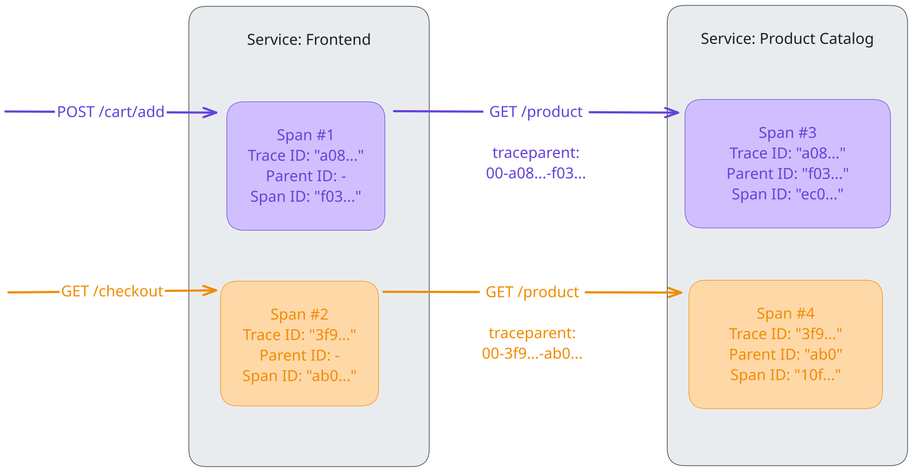

컨텍스트 전파를 통해 [시그널](../signals/)([트레이스](../signals/traces/),
[메트릭](../signals/metrics/), [로그](../signals/logs/))은 생성된 위치와
관계없이 서로 연관 지을 수 있다. 컨텍스트 전파는 트레이싱에만 국한되지는 않지만,
[트레이스](../signals/traces/)가 프로세스와 네트워크 경계를 넘어 임의로 분산된
서비스 전반에 걸쳐 시스템의 인과 관계 정보를 구성할 수 있도록 한다.

컨텍스트 전파를 이해하려면 컨텍스트와 전파라는 두 가지 개념을 이해해야 한다.

## 컨텍스트 {#context}

컨텍스트는 데이터를 주고받는 서비스 또는
[실행 단위](/docs/specs/otel/glossary/#execution-unit)가 한 시그널을 다른
시그널과 연관 짓는 데 필요한 정보를 담고 있는 객체이다.

서비스 A가 서비스 B를 호출하면, 서비스 A는 컨텍스트에 트레이스 ID와 스팬 ID를
포함한다. 서비스 B는 이 값을 사용하여 동일한 트레이스에 속하는 새 스팬을
생성하고, 서비스 A의 스팬을 부모로 설정한다. 이를 통해 서비스 경계를 넘어 요청의
전체 흐름을 추적할 수 있다.

## 전파 {#propagation}

전파는 서비스와 프로세스 사이에서 컨텍스트를 전달하는 메커니즘이다. 컨텍스트
객체를 직렬화하거나 역직렬화하고, 한 서비스에서 다른 서비스로 전파할 관련 정보를
제공한다.

전파는 일반적으로 계측 라이브러리에서 처리하므로 사용자가 이를 직접 신경 쓸
필요는 없다. 컨텍스트를 수동으로 전파해야 하는 경우에는
[전파자(Propagators) API](/docs/specs/otel/context/api-propagators/)를 사용할 수
있다.

오픈텔레메트리(OpenTelemetry)는 여러 공식 전파자를 유지 관리한다. 기본 전파자는
[W3C TraceContext](https://www.w3.org/TR/trace-context/) 명세에 정의된 헤더를
사용한다.

## 예제 {#example}

`POST /cart/add`, `GET /checkout/` 등 다양한 HTTP 엔드포인트를 제공하는
`Frontend` 서비스는 사용자가 장바구니에 추가하려는 상품이나 결제 대상 상품의
상세 정보를 받기 위해 HTTP 엔드포인트 `GET /product`를 통해 다운스트림 서비스인
`Product Catalog`를 호출한다. `Frontend`에서 들어오는 요청의 맥락에서
`Product Catalog` 서비스의 동작을 이해하기 위해, W3C TraceContext 명세에 정의된
`traceparent` 헤더를 사용하여 컨텍스트(여기서는 트레이스 ID와 "부모 ID"로
사용되는 스팬 ID)를 전파한다. 즉, ID는 다음과 같이 헤더의 필드에 포함된다.

```text
<version>-<trace-id>-<parent-id>-<trace-flags>
```

예를 들면 다음과 같다.

```text
00-a0892f3577b34da6a3ce929d0e0e4736-f03067aa0ba902b7-01
```

### 트레이스 {#traces}

앞서 설명한 것처럼, 컨텍스트 전파를 통해 트레이스는 서비스 간의 인과 관계 정보를
구성할 수 있다. 이 예제에서는 `traceparent` 헤더에서 원격 컨텍스트를 추출하고
로컬 컨텍스트에 주입하여 트레이스 ID와 부모 ID를 설정함으로써, `Product Catalog`
서비스의 HTTP 엔드포인트 `GET /product`에 대한 두 호출을 `Frontend` 서비스의
업스트림 호출과 연관 지을 수 있다. 이를 통해
[Jaeger](https://jaegertracing.io)와 같은 [백엔드](/ecosystem/vendors)에서 두
요청을 하나의 트레이스에 속한 스팬으로 볼 수 있다.



### 로그 {#logs}

오픈텔레메트리 SDK는 로그를 트레이스와 자동으로 연관 지을 수 있다. 즉, 로그
레코드에 컨텍스트(트레이스 ID, 스팬 ID)를 주입할 수 있다. 이를 통해 로그가 속한
트레이스와 스팬의 맥락에서 로그를 볼 수 있을 뿐만 아니라, 서비스 또는 실행
단위의 경계를 넘어 서로 연관된 로그를 함께 볼 수 있다.

### 메트릭 {#metrics}

메트릭의 경우, 컨텍스트 전파를 통해 해당 컨텍스트 내의 측정값을 집계할 수 있다.
예를 들어, 모든 `GET /product` 요청의 응답 시간만 확인하는 대신,
`POST /cart/add > GET /product`와 `GET /checkout > GET /product` 조합에 대한
메트릭도 얻을 수 있다.

| 이름                            | 초당 호출 수 | 평균 응답 시간 |
| ------------------------------- | ------------ | -------------- |
| `* > GET /product`              | 370          | 300ms          |
| `POST /cart/add > GET /product` | 330          | 130ms          |
| `GET /checkout > GET /product`  | 40           | 1703ms         |

## 사용자 정의 컨텍스트 전파 {#custom-context-propagation}

대부분의 사용 사례에서는 컨텍스트 전파를 처리하는
[계측 라이브러리 또는 라이브러리에 내장된 계측 기능](/docs/concepts/instrumentation/libraries/)을
찾을 수 있다. 이러한 지원이 없어 직접 구현해야 하는 경우도 있다. 이를 위해서는
앞서 언급한 전파자 API를 활용해야 한다.

- 보내는 쪽에서는 컨텍스트를 캐리어(carrier), 예를 들어 HTTP 요청의 헤더에
  [주입한다](/docs/specs/otel/context/api-propagators/#inject). 그 외의 경우에는
  요청의 메타데이터를 저장할 수 있는 위치를 찾아야 한다.
- 받는 쪽에서는 캐리어에서 컨텍스트를
  [추출한다](/docs/specs/otel/context/api-propagators/#extract). 마찬가지로
  HTTP의 경우에는 헤더에서 가져온다. 그 외의 경우에는 보내는 쪽에서 컨텍스트를
  저장하기로 선택한 위치를 사용한다.

메타데이터 전용 필드가 없는 프로토콜에서도 컨텍스트를 전파할 수 있지만, 받는
쪽에서 데이터를 처리하기 전에 반드시 컨텍스트를 추출하고 제거해야 하며, 그렇지
않으면 정의되지 않은 동작이 발생할 수 있다는 점에 유의한다.

다음 언어에서는 사용자 정의 컨텍스트 전파에 대한 단계별 튜토리얼을 제공한다.

- [Erlang](/docs/languages/erlang/propagation/#manual-context-propagation)
- [JavaScript](/docs/languages/js/propagation/#manual-context-propagation)
- [PHP](/docs/languages/php/propagation/#manual-context-propagation)
- [Python](/docs/languages/python/propagation/#manual-context-propagation)

## 보안 모범 사례 {#security-best-practices}

전파는 서비스 경계를 넘어 데이터를 주고받는 과정이므로 보안에 영향을 미칠 수
있다.

### 외부 서비스 {#external-services}

서비스가 외부 서비스(직접 소유하지 않거나 신뢰하지 않는 서비스)와 상호 작용할
때는 다음 사항을 고려한다.

- **수신 컨텍스트**: 외부에서 컨텍스트를 받아들일 때는 주의해야 한다. 악의적인
  행위자는 위조된 트레이스 헤더를 보내 트레이싱 데이터를 조작하거나 컨텍스트
  파싱의 취약점을 악용할 수 있다. 신뢰할 수 없는 출처에서 들어오는 컨텍스트를
  무시하거나 안전하게 정제하는 방안을 고려한다.
- **송신 컨텍스트**: 외부 서비스에 전파하는 정보에 주의해야 한다. 내부 트레이스
  ID, 스팬 ID 또는 배기지 항목은 내부 아키텍처나 비즈니스 로직에 관한 민감한
  정보를 노출할 수 있다. 외부 또는 공개 엔드포인트에 컨텍스트를 보내지 않도록
  전파자를 설정하는 방안을 고려한다.

### 배기지 {#baggage}

[배기지](../signals/baggage/)를 사용하면 임의의 키-값 쌍을 전파할 수 있다. 이
데이터는 서비스 경계를 넘어 전파되며 로그에 기록되거나 신뢰할 수 없는 다운스트림
서비스로 전송될 수 있으므로, 배기지에 민감한 정보(사용자 인증 정보, API 키 또는
개인 식별 정보 등)를 넣지 않는다.

## 언어별 SDK 지원 {#support-in-language-sdks}

오픈텔레메트리 API 및 SDK의 각 언어별 구현에서 제공하는 컨텍스트 전파 지원에
대한 자세한 내용은 해당 문서에서 확인할 수 있다.

- [C++](/docs/languages/cpp/instrumentation/#context-propagation)
- .NET
- [Erlang](/docs/languages/erlang/propagation/)
- [Go](/docs/languages/go/instrumentation/#propagators-and-context)
- [Java](/docs/languages/java/api/#context-api)
- [JavaScript](/docs/languages/js/propagation/)
- [PHP](/docs/languages/php/propagation/)
- [Python](/docs/languages/python/propagation/)
- [Ruby](/docs/languages/ruby/instrumentation/#context-propagation)
- Rust
- Swift

> [!IMPORTANT] 기여 요청
>
> .NET, Rust, Swift에는 컨텍스트 전파에 대한 언어별 문서가 아직 없습니다. 이 언어 중
> 하나를 알고 있고 도움을 주고 싶다면,
> [기여 방법을 참고해주세요](/docs/contributing/)!

## 명세 {#specification}

컨텍스트 전파에 대해 더 알아보려면 [컨텍스트 명세](/docs/specs/otel/context/)를
참고한다.
