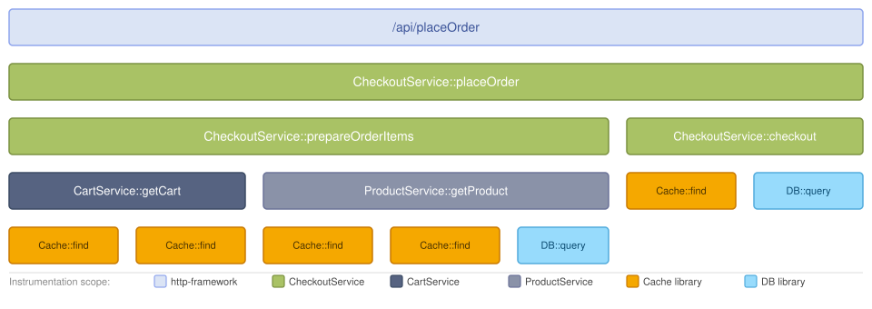

[계측 범위(instrumentation scope)](/docs/specs/otel/common/instrumentation-scope/)는
발생한 텔레메트리가 연결되는 소프트웨어의 논리적 단위이다. 모듈, 패키지,
클래스, 라이브러리 또는 프레임워크를 나타낼 수 있으며, 개발자가 텔레메트리의
출처를 서로 구분하기 위해 선택한 의미 있는 경계라면 무엇이든 될 수 있다.

## 계측 범위를 정의하는 방법 {#how-a-scope-is-defined}

계측 범위는 `(name, version, schema_url, attributes)` 튜플로 식별되며,
`version`, `schema_url`, `attributes`는 선택 사항이다. `name`은 소프트웨어의
논리적 단위를 고유하게 식별해야 한다. 예를 들어, 라이브러리, 클래스 또는 모듈의
정규화된 이름을 사용할 수 있다.

프로바이더에서 트레이서, 미터 또는 로거를 가져올 때 계측 범위를 지정한다. 이후
해당 인스턴스에서 생성되는 모든 스팬, 메트릭, 로그 레코드에는 해당 계측 범위가
태그로 지정된다.

- **라이브러리와 프레임워크의 경우**: 라이브러리의 정규화된 이름과 버전을 계측
  범위로 사용한다. 오픈텔레메트리(OpenTelemetry) 지원이 내장되어 있지 않은
  라이브러리를 위한 계측 라이브러리를 작성하는 경우, 계측 라이브러리 자체의
  이름과 버전을 사용한다.
- **애플리케이션 코드의 경우**: 일반적으로 `CheckoutService`와 같은 클래스나
  모듈의 이름을 사용한다.

## 계측 범위가 중요한 이유 {#why-scopes-matter}

옵저버빌리티(observability) 백엔드에서는 계측 범위별로 텔레메트리를 필터링하고,
그룹화하고, 비교할 수 있다. 이를 통해 어떤 라이브러리 버전이 지연을 유발하는지
파악하거나, 특정 모듈의 시그널만 분리해서 살펴보거나, 동일한 컴포넌트의 버전별
동작을 비교할 수 있다.

## 트레이스 내의 계측 범위 {#scopes-in-a-trace}

다음 다이어그램은 서로 다른 여섯 개의 계측 범위에서 생성된 스팬으로 이루어진 
트레이스를 보여주며, 각 계측 범위는 색상과 범례로 구분된다.

- `http-framework` 계측 범위는 루트 스팬인 `/api/placeOrder`를 생성한다.
- `CheckoutService` 계측 범위는 `CheckoutService::placeOrder`,
  `CheckoutService::prepareOrderItems`, `CheckoutService::checkout`을 생성한다.
  세 스팬 모두 `CheckoutService`라는 이름으로 가져온 동일한 트레이서
  인스턴스에서 생성되므로 같은 계측 범위를 공유한다.
- `CartService`와 `ProductService` 계측 범위는 각각 해당 애플리케이션
  컴포넌트에서 스팬을 생성한다.
- `Cache library`와 `DB library` 계측 범위는 라이브러리 코드에서 스팬을
  생성하며, 이 스팬들은 라이브러리 이름과 버전별로 그룹화된다.

