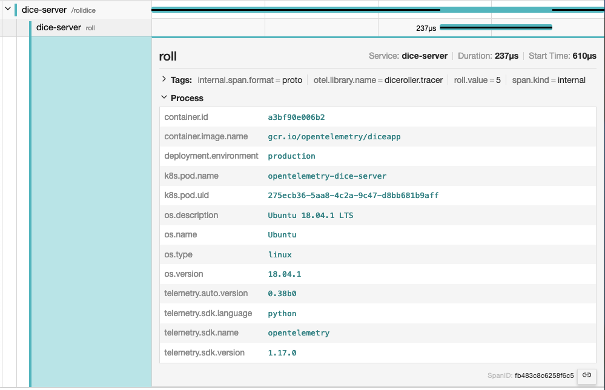

## 소개 {#introduction}

{}

[Jaeger](https://www.jaegertracing.io/)를 옵저버빌리티(observability) 백엔드로
사용하는 경우, 리소스 속성은 **Process** 탭에서 확인할 수 있다.



리소스는 초기화 과정에서 `TracerProvider`나 `MetricProvider`가 생성될 때
등록되며, 한 번 연결된 후에는 변경할 수 없다. 이렇게 리소스를 지정하면 해당
프로바이더의 `Tracer`나 `Meter`에서 생성되는 모든 스팬과 메트릭에 해당 리소스가
연결된다.

## SDK가 기본값을 제공하는 시맨틱 속성 {#semantic-attributes-with-sdk-provided-default-value}

오픈텔레메트리(OpenTelemetry) SDK는 여러 속성을 제공한다. 그중 하나인
`service.name`은 서비스의 논리적 이름을 나타낸다. SDK는 기본적으로 이 속성에
`unknown_service` 값을 할당하므로, 코드나 `OTEL_SERVICE_NAME` 환경 변수를 통해
명시적으로 설정하는 것이 좋다.

또한 SDK는 자신을 식별하기 위해 `telemetry.sdk.name`, `telemetry.sdk.language`,
`telemetry.sdk.version` 리소스 속성도 제공한다.

## 리소스 감지기 {#resource-detectors}

대부분의 언어별 SDK는 환경에서 리소스 정보를 자동으로 감지할 수 있는 리소스
감지기를 제공한다. 일반적인 리소스 감지기는 다음과 같다.

- [운영 체제](/docs/specs/semconv/resource/os/)
- [호스트](/docs/specs/semconv/resource/host/)
- [프로세스 및 프로세스 런타임](/docs/specs/semconv/resource/process/)
- [컨테이너](/docs/specs/semconv/resource/container/)
- [쿠버네티스](/docs/specs/semconv/resource/k8s/)
- [클라우드 프로바이더별 속성](/docs/specs/semconv/resource/#cloud-provider-specific-attributes)
- [기타](/docs/specs/semconv/resource/)

## 사용자 정의 리소스 {#custom-resources}

사용자 정의 리소스 속성도 제공할 수 있다. 코드에서 직접 제공하거나
`OTEL_RESOURCE_ATTRIBUTES` 환경 변수에 값을 설정하면 된다. 해당하는 시맨틱
컨벤션이 있다면
[리소스 속성에 대한 시맨틱 컨벤션](/docs/specs/semconv/resource)을 사용한다.
예를 들어, `deployment.environment.name`을 사용하여
[배포 환경](/docs/specs/semconv/resource/deployment-environment/)의 이름을
제공할 수 있다.

```shell
env OTEL_RESOURCE_ATTRIBUTES=deployment.environment.name=production yourApp
```
