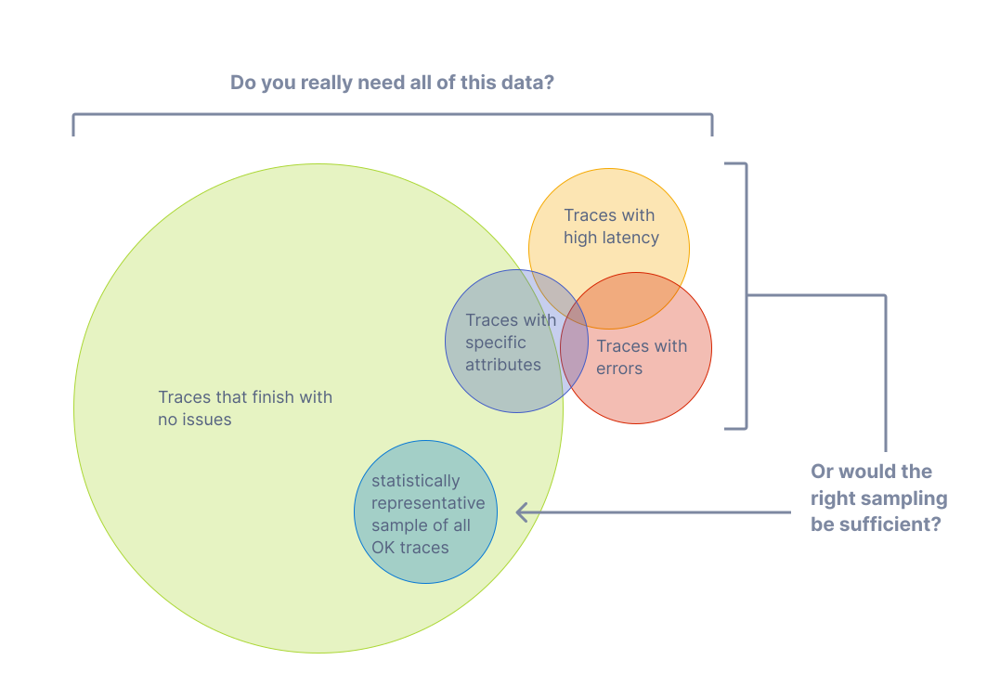
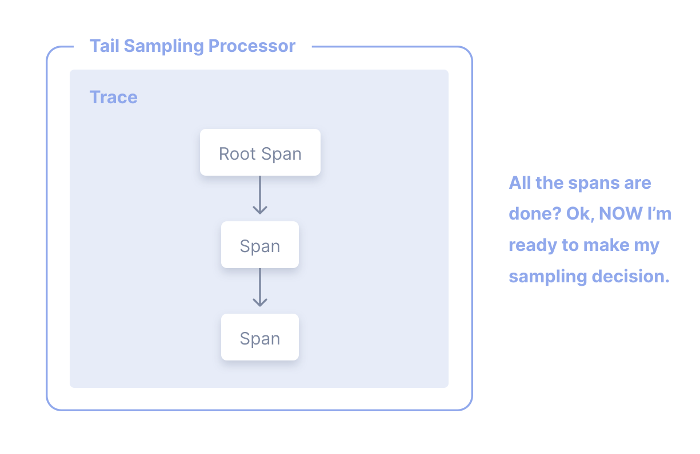

[트레이스](/docs/concepts/signals/traces)를 사용하면 분산 시스템에서 요청이 한
서비스에서 다른 서비스로 이동하는 과정을 관찰할 수 있다. 트레이싱은 시스템의
전반적인 분석과 심층 분석 모두에 매우 유용하다.

하지만 대부분의 요청이 오류 없이 허용 가능한 지연 시간 내에 성공적으로 완료된다면, 모든
트레이스를 수집할 필요는 없다. 적절한 샘플링만으로도 애플리케이션과 시스템의
상태를 충분히 파악할 수 있다.

## 용어 {#terminology}

샘플링을 논의할 때는 일관된 용어를 사용하는 것이 중요하다. 트레이스나 스팬은
"샘플링됨" 또는 "샘플링되지 않음"으로 구분한다.

- **샘플링됨**: 트레이스나 스팬을 처리하고 내보낸다. 샘플러가 전체 데이터를 대표하는
  표본으로 선택했으므로 "샘플링됨"으로 간주한다.
- **샘플링되지 않음**: 트레이스나 스팬을 처리하거나 내보내지 않는다. 샘플러가
  선택하지 않았으므로 "샘플링되지 않음"으로 간주한다.

때로는 이러한 용어의 정의를 혼동하기도 한다. 누군가 "데이터를 샘플링하여
제외한다(sampling out data)"고 말하거나, 처리하거나 내보내지 않은 데이터를
"샘플링됨"으로 간주하는 경우가 있다. 이는 잘못된 표현이다.

## 샘플링을 사용하는 이유 {#why-sampling}

샘플링은 가시성을 잃지 않으면서 옵저버빌리티(observability) 비용을 줄이는 가장
효과적인 방법 중 하나이다. 데이터 필터링이나 집계처럼 비용을 낮추는 다른 방법도
있지만, 이러한 방법은 애플리케이션이나 시스템 동작을 심층 분석할 때 중요한
대표성이라는 개념을 따르지 않는다.

대표성은 작은 집단이 큰 집단을 정확하게 대표할 수 있다는 원리이다. 또한 대표성은
수학적으로 검증할 수 있으므로, 작은 데이터 표본이 더 큰 집단을 정확하게
대표한다는 사실을 높은 신뢰도로 확신할 수 있다.

또한 생성하는 데이터가 많을수록 대표성 있는 표본을 얻는 데 실제로 필요한
데이터는 더 적어진다. 대용량 시스템에서는 1% 이하의 샘플링 비율로 나머지 99%의
데이터를 매우 정확하게 대표하는 경우가 흔하다.

### 샘플링을 고려할 때 {#when-to-sample}

다음 조건 중 하나라도 해당한다면 샘플링을 고려한다.

- 초당 1,000개 이상의 트레이스를 생성한다.
- 대부분의 트레이스 데이터가 정상적인 트래픽을 나타내며 데이터의 변화가 적다.
- 오류나 높은 지연 시간처럼 일반적으로 문제를 나타내는 공통 기준이 있다.
- 오류와 지연 시간 외에도 관련 데이터를 판단하는 데 사용할 수 있는 도메인별
  기준이 있다.
- 데이터를 샘플링할지 버릴지 결정하는 공통 규칙을 정의할 수 있다.
- 서비스들을 구분하여 트래픽이 많은 서비스와 적은 서비스에 서로 다른 샘플링을
  적용할 수 있다.
- 만일의 상황에 대비해 샘플링되지 않은 데이터를 저비용 스토리지 시스템으로
  라우팅할 수 있다.

마지막으로 전체 예산을 고려한다. 옵저버빌리티 예산은 제한적이지만 효과적인
샘플링을 위해 시간을 투자할 수 있다면, 일반적으로 샘플링을 도입할 가치가 있다.

### 샘플링을 피해야 할 때 {#when-not-to-sample}

샘플링이 적합하지 않을 수도 있다. 다음 조건 중 하나라도 해당한다면 샘플링을
피하는 것이 좋을 수 있다.

- 생성하는 데이터가 매우 적다(초당 작은 트레이스 수십 개 이하).
- 옵저버빌리티 데이터를 집계된 형태로만 사용하므로 미리 집계할 수 있다.
- 규제 등으로 인해 데이터를 버릴 수 없으며, 샘플링되지 않은 데이터를 저비용
  스토리지로 라우팅할 수도 없다.

마지막으로 샘플링에 수반되는 다음 세 가지 비용을 고려한다.

1. 테일 샘플링 프록시처럼 데이터를 효과적으로 샘플링하는 데 필요한 직접적인
   컴퓨팅 비용.
2. 애플리케이션, 시스템, 데이터가 늘어남에 따라 효과적인 샘플링 방식을 유지하는
   데 필요한 간접적인 엔지니어링 비용.
3. 비효율적인 샘플링 기법으로 중요한 정보를 놓쳐 발생하는 간접적인 기회비용.

샘플링은 옵저버빌리티 비용을 줄이는 데 효과적이지만, 제대로 수행하지 않으면
예상치 못한 다른 비용이 발생할 수 있다. 옵저버빌리티 백엔드, 데이터의 특성,
효과적인 샘플링을 위한 노력에 따라 벤더 서비스에 더 투자하거나
자체 호스팅 시 컴퓨팅 자원을 늘리는 등 옵저버빌리티에 더 많은 자원을 할당하는 편이
오히려 저렴할 수 있다.

## 헤드 샘플링 {#head-sampling}

헤드 샘플링(head sampling)은 가능한 한 이른 시점에 샘플링 여부를 결정하는
기법이다. 트레이스 전체를 살펴보지 않은 상태에서
스팬이나 트레이스를 샘플링할지 버릴지 결정한다

예를 들어, 가장 일반적인 헤드 샘플링 방식은
[일관된 확률 샘플링(Consistent Probability Sampling)](/docs/specs/otel/trace/tracestate-probability-sampling/#consistent-sampling-decision)이다.
결정적 샘플링(Deterministic Sampling)이라고도 한다. 이 경우 트레이스 ID와 원하는
트레이스 샘플링 비율을 기준으로 샘플링 여부를 결정한다. 이를 통해 전체
트레이스의 5%와 같은 일정한 비율로 스팬 누락 없이 트레이스 전체가 샘플링되도록
보장한다.

헤드 샘플링의 장점은 다음과 같다.

- 이해하기 쉽다.
- 설정하기 쉽다.
- 효율적이다.
- 트레이스 수집 파이프라인의 어느 지점에서든 수행할 수 있다.

헤드 샘플링의 주요 단점은 트레이스 전체의 데이터를 바탕으로 샘플링 여부를 결정할
수 없다는 것이다. 예를 들어, 헤드 샘플링만으로는 오류가 포함된 모든 트레이스가
샘플링되도록 보장할 수 없다. 이러한 상황을 비롯한 여러 경우에는 테일 샘플링이
필요하다.

## 테일 샘플링 {#tail-sampling}

테일 샘플링(tail sampling)은 트레이스 내의 모든 스팬 또는 대부분의 스팬을
고려하여 트레이스의 샘플링 여부를 결정하는 방식이다. 테일 샘플링을 사용하면
트레이스의 여러 부분에서 도출한 특정 기준에 따라 트레이스를 샘플링할 수 있으며,
이는 헤드 샘플링에서는 제공하지 않는 선택지이다.

테일 샘플링의 활용 예시는 다음과 같다.

- 오류가 포함된 트레이스를 항상 샘플링한다.
- 전체 지연 시간을 기준으로 트레이스를 샘플링한다.
- 트레이스 내 하나 이상의 스팬에 특정 속성이 있는지 또는 그 값이 무엇인지에 따라
  트레이스를 샘플링한다. 예를 들어, 새로 배포된 서비스에서 시작된 트레이스를 더
  많이 샘플링한다.
- 트래픽이 적은 서비스에서만 발생한 트레이스인지, 트래픽이 많은 서비스가 포함된
  트레이스인지 등의 기준에 따라 서로 다른 샘플링 비율을 적용한다.

이처럼 테일 샘플링을 사용하면 데이터를 훨씬 더 정교하게 샘플링할 수 있다.
텔레메트리 샘플링이 필요한 대규모 시스템에서는 데이터 양과 데이터의 유용성
사이에 균형을 맞추기 위해 거의 항상 테일 샘플링이 필요하다.

현재 테일 샘플링에는 세 가지 주요 단점이 있다.

1. 테일 샘플링은 구현하기 어려울 수 있다. 사용할 수 있는 샘플링 기법에 따라 초기 설정
   이후에도 지속적인 조정이 필요할 수 있다. 시스템의 변화에 맞춰 샘플링 전략도
   조정해야 한다. 크고 복잡한 분산 시스템에서는 샘플링 전략을
   구현하는 규칙 역시 규모가 크고 복잡해질 수 있다.
2. 테일 샘플링은 운영하기 어려울 수 있다. 테일 샘플링을 구현하는 컴포넌트는
   대량의 데이터를 수신하고 저장할 수 있는 상태 유지 시스템이어야 한다. 트래픽
   패턴에 따라 자원을 서로 다르게 사용하는 컴퓨팅 노드가 수십 개에서 수백 개까지
   필요할 수 있다. 또한 테일 샘플러가 수신하는 데이터 양을 감당하지 못하면,
   연산량이 더 적은 샘플링 기법으로 전환해야 할 수도 있다. 따라서 테일 샘플링
   컴포넌트가 올바른 샘플링 결정을 내리는 데 필요한 자원을 확보하고 있는지
   모니터링하는 것이 매우 중요하다.
3. 현재 테일 샘플러는 벤더 고유의 기술인 경우가 많다. 유료 벤더 서비스를 통해
   옵저버빌리티를 확보하고 있다면, 사용할 수 있는 가장 효과적인 테일 샘플링
   옵션이 해당 벤더가 제공하는 것으로 제한될 수 있다.

마지막으로 일부 시스템에서는 테일 샘플링과 헤드 샘플링을 함께 사용할 수 있다.
예를 들어, 매우 많은 트레이스 데이터를 생성하는 서비스들에서는 먼저 헤드
샘플링으로 트레이스의 일부만 샘플링하고, 이후 텔레메트리 파이프라인에서 백엔드로
내보내기 전에 테일 샘플링을 통해 더 정교한 샘플링 결정을 내릴 수 있다. 이는
텔레메트리 파이프라인의 과부하를 방지하기 위해 자주 사용하는 방식이다.

## 지원 {#support}

### 컬렉터 {#collector}

오픈텔레메트리(OpenTelemetry) 컬렉터에는 다음 샘플링 프로세서가 포함되어 있다.

- [확률적 샘플링 프로세서](https://github.com/open-telemetry/opentelemetry-collector-contrib/tree/main/processor/probabilisticsamplerprocessor)
- [테일 샘플링 프로세서](https://github.com/open-telemetry/opentelemetry-collector-contrib/tree/main/processor/tailsamplingprocessor)

### 언어별 SDK {#language-sdks}

오픈텔레메트리 API 및 SDK의 각 언어별 구현체가 제공하는 샘플링 지원은 해당
문서에서 확인할 수 있다.

{}

### 벤더 {#vendors}

많은 [벤더](/ecosystem/vendors)가 헤드 샘플링, 테일 샘플링 및 정교한 샘플링
요구를 지원하는 기타 기능을 포함한 종합적인 샘플링 솔루션을 제공한다. 이러한
솔루션은 해당 벤더의 백엔드에 맞게 최적화되어 있을 수도 있다. 벤더에
텔레메트리를 전송하고 있다면 해당 벤더의 샘플링 솔루션 사용을 고려한다.
