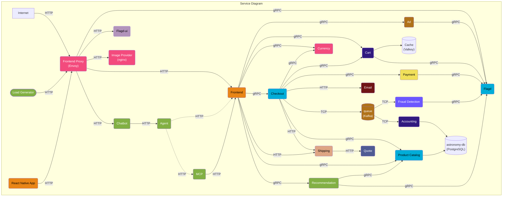
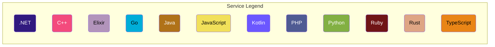
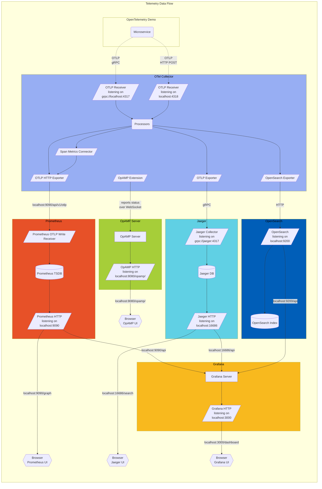

**오픈텔레메트리(OpenTelemetry) 데모** 는 서로 간에 gRPC 및 HTTP로 통신하는
다양한 프로그래밍 언어로 작성된 마이크로서비스와 [Locust](https://locust.io/)를
사용해 사용자 트래픽을 모방하는 부하 생성기(Load Generator)로 구성된다.

데모 애플리케이션의 [로그](/docs/demo/telemetry-features/log-coverage/),
[메트릭](/docs/demo/telemetry-features/metric-coverage/) 및
[트레이스](/docs/demo/telemetry-features/trace-coverage/) 계측에 대한 현황은
다음 링크를 참고한다.

컬렉터는
[otelcol-config.yml](https://github.com/open-telemetry/opentelemetry-demo/blob/main/src/otel-collector/otelcol-config.yml)에서
구성하며, 해당 파일에서 대체 익스포터도 구성할 수 있다.

옵저버빌리티(Observability) 스택과 함께 실행하면 컬렉터는
[OpAMP 확장](https://github.com/open-telemetry/opentelemetry-collector-contrib/tree/main/extension/opampextension)을
통해 데모의 OpAMP 서버에도 연결하고 상태, 버전, 속성 및 실제 적용된 구성을
보고한다. <http://localhost:8080/opamp/>에서 OpAMP UI를 열고 컬렉터 인스턴스를
선택하면 보고된 상태를 확인할 수 있다.

`/pb/` 디렉터리에서 **프로토콜 버퍼 정의(Protocol Buffer Definitions)** 를
확인할 수 있다.
