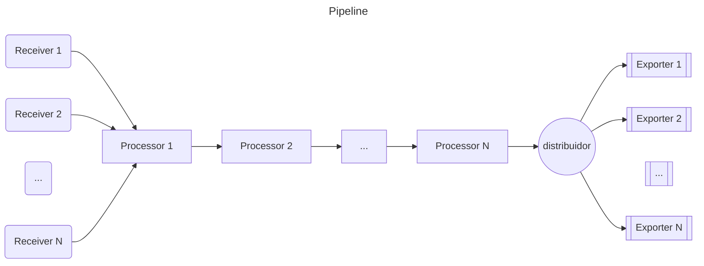
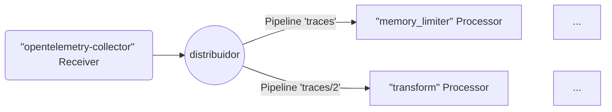
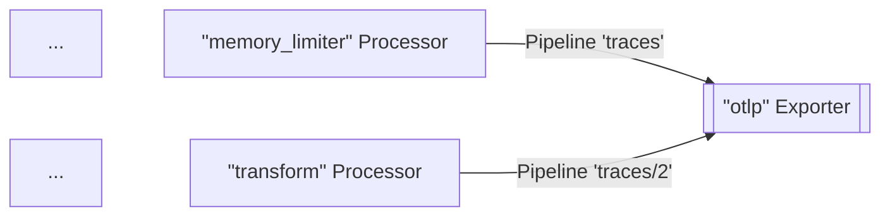
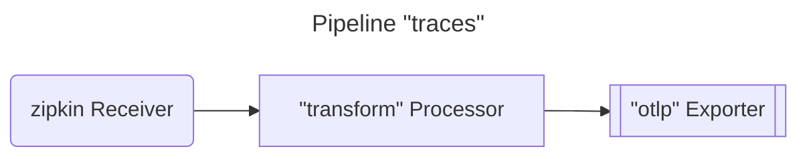
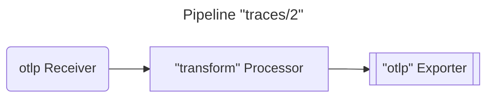
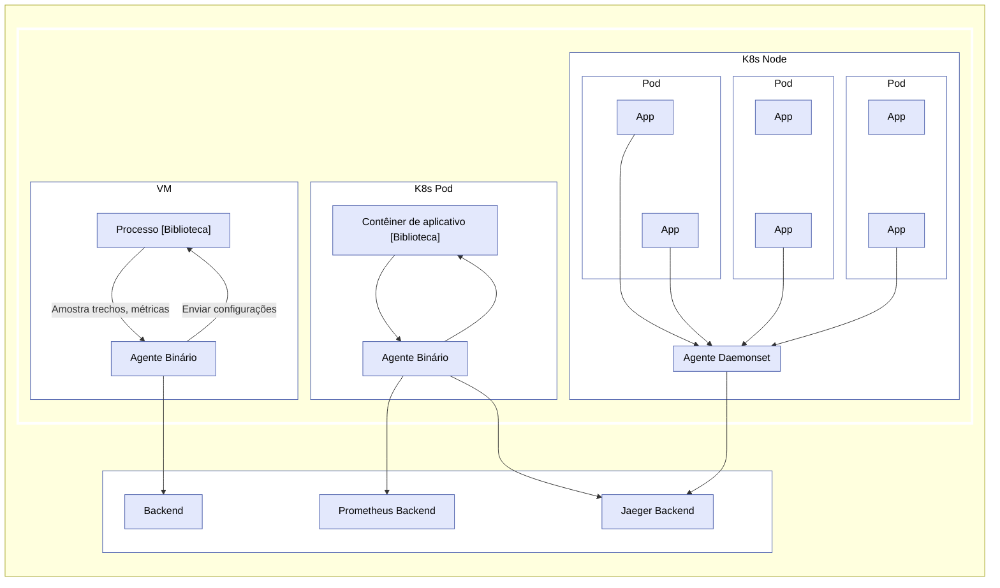
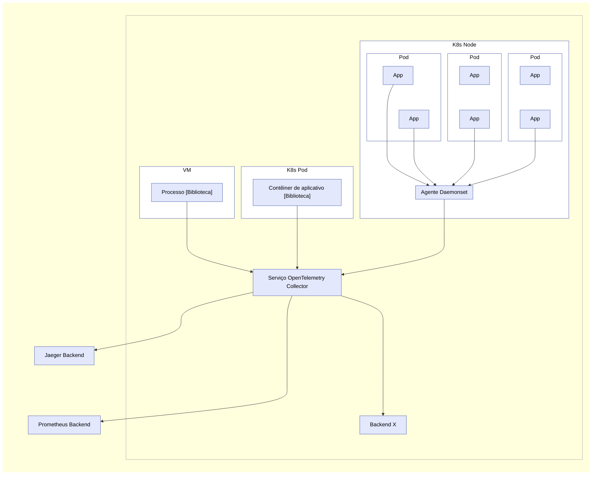

O OpenTelemetry Collector é um arquivo executável que pode receber telemetria,
processá-la e exportá-la para múltiplos destinos, como _backends_ de
observabilidade.

O Collector suporta vários protocolos populares de código aberto para receber e
enviar dados de telemetria, e oferece uma arquitetura extensível para adicionar
mais protocolos.

O recebimento, processamento e exportação de dados são feitos usando
[_pipelines_](#pipelines). Você pode configurar o Collector para ter um ou mais
pipelines.

Cada pipeline inclui o seguinte:

- Um conjunto de [_receivers_](#receivers) que coletam os dados.
- Uma série de [_processors_](#processors) opcionais que recebem os dados dos
  _receivers_ e os processam.
- Um conjunto de [_exporters_](#exporters) que recebem os dados dos _processors_
  e os enviam para fora do Collector.

O mesmo _receiver_ pode ser incluído em múltiplos _pipelines_, e múltiplos
_pipelines_ podem incluir o mesmo _exporter_.

## Pipelines

Um _pipeline_ define um caminho que os dados seguem no Collector: desde a
recepção, passando pelo processamento (ou modificação), até a exportação.

Os _pipelines_ podem operar em três tipos de dados de telemetria: rastros,
métricas e logs. O tipo de dado é uma propriedade do _pipeline_ definida por sua
configuração. Os _receivers_, _processors_ e _exporters_ utilizados em um
_pipeline_ devem suportar o tipo de dado específico, caso contrário a exceção
`pipeline.ErrSignalNotSupported` é reportada quando a configuração é carregada.

O diagrama a seguir representa um _pipeline_ típico:



Os _pipelines_ podem ter um ou mais _receivers_. Os dados de todos os
_receivers_ são enviados para o primeiro _processor_, que processa os dados e os
repassa para o próximo _processor_. Um _processor_ também pode descartar os
dados caso esteja realizando amostragem ou filtragem. Esse processo continua até
que o último _processor_ do _pipeline_ envie os dados para os _exporters_. Cada
_exporter_ recebe uma cópia de cada elemento de dado. O último _processor_ usa
um `fanoutconsumer` para enviar os dados para múltiplos _exporters_.

O _pipeline_ é construído durante a inicialização do Collector com base na
definição do _pipeline_ na configuração.

Uma configuração típica de _pipeline_ se parece com isso:

```yaml
service:
  pipelines: # seção que pode conter várias subseções, uma por tubulação
    traces: # tipo do _pipeline_
      receivers: [otlp, zipkin]
      processors: [memory_limiter]
      exporters: [otlp, zipkin]
```

O exemplo anterior define um _pipeline_ para o tipo de dado de telemetria
rastro, que inclui dois _receivers_, um _processor_ e dois _exporters_. O
_receiver_ com dois _receivers_, um _processor_ e dois _exporters_.

### Receivers

Os _receivers_ normalmente escutam em uma porta de rede e recebem dados de
telemetria. Eles também podem obter dados ativamente, como _scrapers_.
Normalmente um _receiver_ é configurado para enviar os dados recebidos para um
pipeline. No entanto, também é possível configurar o mesmo _receiver_ para
enviar os mesmos dados recebidos para múltiplos pipelines. Isso pode ser feito
listando o mesmo _receiver_ na chave `receivers` de vários pipelines:

```yaml
receivers:
  otlp:
    protocols:
      grpc:
        endpoint: localhost:4317

service:
  pipelines:
    traces: # o _pipeline_ do tipo "traces"
      receivers: [otlp]
      processors: [memory_limiter]
      exporters: [otlp]
    traces/2: # outro _pipeline_ do tipo "traces"
      receivers: [otlp]
      processors: [transform]
      exporters: [otlp]
```

No exemplo acima, o _receiver_ `otlp` enviará os mesmos dados para o _pipeline_
`traces` e para o _pipeline_ `traces/2`.

> A configuração usa nomes de chaves compostas na forma `type[/name]`.

Quando o Collector carrega essa configuração, o resultado se parece com este
diagrama (parte dos _processors_ e _exporters_ foram omitidos por brevidade):



> [!ATENÇÃO]
>
> Quando o mesmo _receiver_ é referenciado em mais de um pipeline, o Collector
> cria apenas uma instância do _receiver_ em tempo de execução, que envia os
> dados para um distribuidor. O distribuidor, por sua vez, envia os dados para o
> primeiro _processor_ de cada pipeline. A propagação dos dados do _receiver_
> para o distribuidor e depois para os _processors_ é realizada por meio de uma
> chamada de função síncrona. Isso significa que, se um _processor_ bloquear a
> chamada, os outros pipelines associados a esse _receiver_ serão bloqueados de
> receber os mesmos dados, e o próprio _receiver_ para de processar e encaminhar
> os dados recebidos.

### Exporters

Os _exporters_ normalmente encaminham os dados que recebem para um destino na
rede, mas também podem enviar os dados para outros lugares. Por exemplo, o
_exporter_ `debug` escreve os dados de telemetria no destino de log.

A configuração permite múltiplos _exporters_ do mesmo tipo, no mesmo _pipeline_.
Por exemplo, você pode ter dois _exporters_ `otlp` definidos, cada um enviando
para um _endpoint_ OTLP diferente:

```yaml
exporters:
  otlp/1:
    endpoint: example.com:4317
  otlp/2:
    endpoint: localhost:14317
```

Um _exporter_ normalmente recebe dados de um _pipeline_. No entanto, você pode
configurar múltiplos _pipelines_ para enviar dados para o mesmo _exporter_:

```yaml
exporters:
  otlp:
    protocols:
      grpc:
        endpoint: localhost:14250

service:
  pipelines:
    traces: # o _pipeline_ do tipo "traces"
      receivers: [zipkin]
      processors: [memory_limiter]
      exporters: [otlp]
    traces/2: # outro _pipeline_ do tipo "traces"
      receivers: [otlp]
      processors: [transform]
      exporters: [otlp]
```

No exemplo acima, o _exporter_ `otlp` recebe dados do _pipeline_ `traces` e do
_pipeline_ `traces/2`. Quando o Collector carrega essa configuração, o resultado
se parece com este diagrama (parte dos _processors_ e _receivers_ foram omitidos
por brevidade):



### Processors

Um _pipeline_ pode conter _processors_ conectados em sequência. O primeiro
_processor_ recebe os dados de um ou mais _receivers_ configurados para o
_pipeline_, e o último _processor_ envia os dados para um ou mais _exporters_
configurados para o _pipeline_. Todos os _processors_ entre o primeiro e o
último recebem os dados de apenas um _processor_ anterior e enviam dados para
apenas um _processor_ sucessor.

Os _processors_ podem transformar os dados antes de encaminhá-los, como
adicionar ou remover atributos de trecho. Podem também descartar os dados ao
decidir não encaminhá-los (por exemplo, o _processor_ `probabilisticsampler`).
Ou podem gerar novos dados.

O mesmo nome do _processor_ pode ser referenciado na chave `processors` de
múltiplos _pipelines_. Nesse caso, a mesma configuração é usada para cada um
desses _processors_, mas cada _pipeline_ sempre obtém sua própria instância do
_processor_. Cada um desses _processors_ tem seu próprio estado, e os
_processors_ nunca são compartilhados entre _pipelines_. Por exemplo, se o
_processor_ `transform` for usado em vários _pipelines_, cada _pipeline_ terá
seu próprio _processor_ transform, mas cada _processor_ transform é configurado
exatamente da mesma forma se referenciarem a mesma chave na configuração. Veja a
seguinte configuração:

```yaml
processors:
  transform:
    error_mode: ignore
    trace_statements:
      - set(resource.attributes["namespace"],
        resource.attributes["k8s.namespace.name"])
      - delete_key(resource.attributes, "k8s.namespace.name")

service:
  pipelines:
    traces: # o _pipeline_ do tipo "traces"
      receivers: [zipkin]
      processors: [transform]
      exporters: [otlp]
    traces/2: # outro _pipeline_ do tipo "traces"
      receivers: [otlp]
      processors: [transform]
      exporters: [otlp]
```

Quando o Collector carrega essa configuração, o resultado se parece com este
diagrama:





Observe que cada _processor_ `transform` é uma instância independente, embora
sejam configurados da mesma forma com um `send_batch_size` de `10000`.

> O mesmo nome do _processor_ não deve ser referenciado mais de uma vez na chave
> `processors` de um único pipeline.

## Executando como agente {#running-as-an-agent}

Em uma VM/container típica, as aplicações do usuário estão sendo executadas em
alguns processos/pods com uma biblioteca OpenTelemetry. Anteriormente, a
biblioteca fazia todo o registro, coleta, amostragem e agregação de rastros,
métricas e logs e, em seguida, exportava os dados para outros _backends_ de
armazenamento persistente através dos _exporters_ da biblioteca, ou os exibia em
zpages locais. Esse padrão tem várias desvantagens, por exemplo:

1. Para cada biblioteca OpenTelemetry, os _exporters_ e zpages precisam ser
   reimplementados em linguagens nativas.
2. Em algumas linguagens de programação (por exemplo, Ruby ou PHP), é difícil
   fazer a agregação de estatísticas em processo.
3. Para habilitar a exportação de trechos, estatísticas ou métricas do
   OpenTelemetry, os usuários da aplicação precisam adicionar manualmente os
   _exporters_ da biblioteca e reimplantar seus binários. Isso é especialmente
   difícil quando um incidente ocorreu e os usuários querem usar o OpenTelemetry
   para investigar o problema imediatamente.
4. Os usuários da aplicação precisam assumir a responsabilidade de configurar e
   inicializar os _exporters_. Essas tarefas são suscetíveis a erros (por
   exemplo, configurar credenciais incorretas ou recursos monitorados), e os
   usuários podem relutar em "poluir" seu código com OpenTelemetry.

Para resolver os problemas acima, você pode executar o OpenTelemetry Collector
como um agente. O agente é executado como um _daemon_ na VM/container e pode ser
implantado independentemente da biblioteca. Uma vez implantado e em execução, o
agente deve ser capaz de recuperar rastros, métricas e logs da biblioteca e
exportá-los para outros _backends_. Também podemos dar ao agente a capacidade de
enviar configurações (como a probabilidade de amostragem) para a biblioteca.
Para as linguagens que não conseguem fazer a agregação de estatísticas em
processo, elas podem enviar medições brutas e deixar o agente fazer a agregação.



> Para desenvolvedores e mantenedores de outras bibliotecas: adicionando
> _receivers_ específicos, você pode configurar um agente para aceitar rastros,
> métricas e logs de outras bibliotecas de rastreamento/monitoramento, como
> Zipkin, Prometheus, etc. Consulte [_Receivers_](#receivers) para mais
> detalhes.

## Executando como _gateway_ {#running-as-a-gateway}

O OpenTelemetry Collector pode ser executado como uma instância de _gateway_ e
receber trechos e métricas exportados por um ou mais agentes ou bibliotecas, ou
por tarefas/agentes que emitem em um dos protocolos suportados. O Collector é
configurado para enviar dados para os _exporter(s)_ configurados. A figura a
seguir resume a arquitetura de implantação:



O OpenTelemetry Collector também pode ser implantado em outras configurações,
como receber dados de outros agentes ou clientes em um dos formatos suportados
pelos seus _receivers_.
