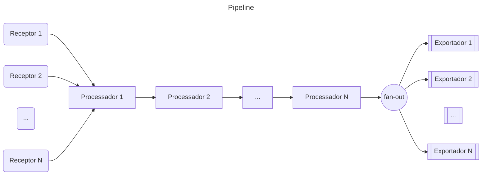
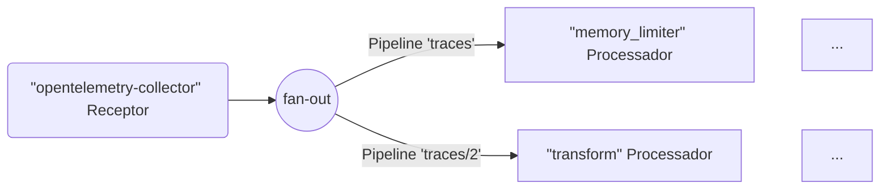
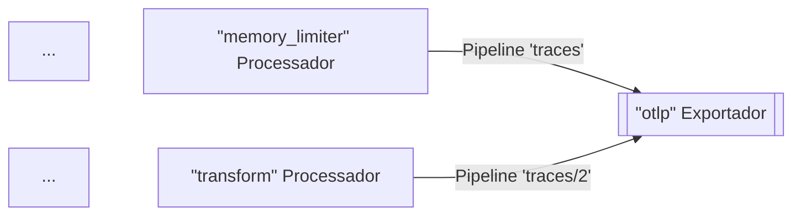
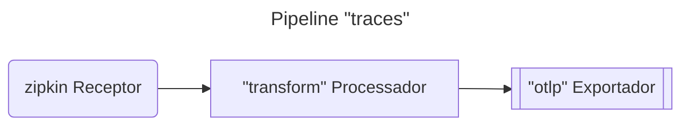
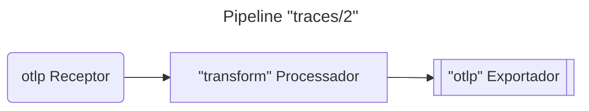
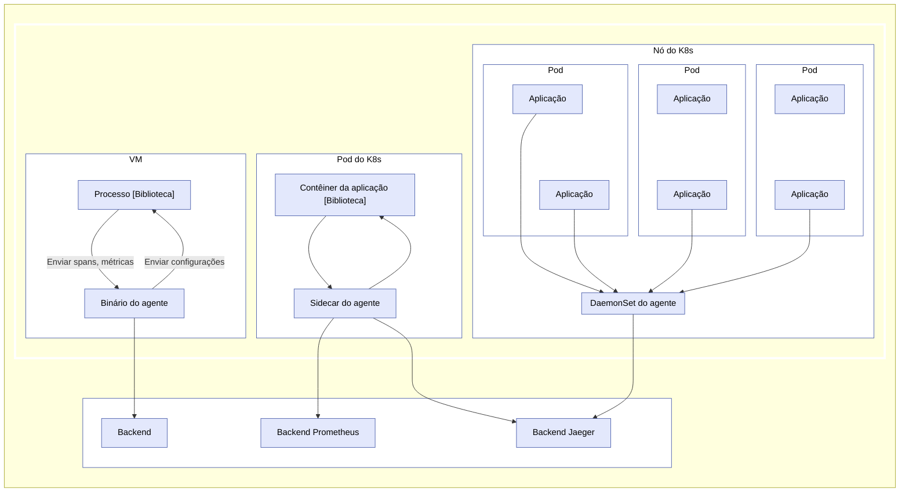
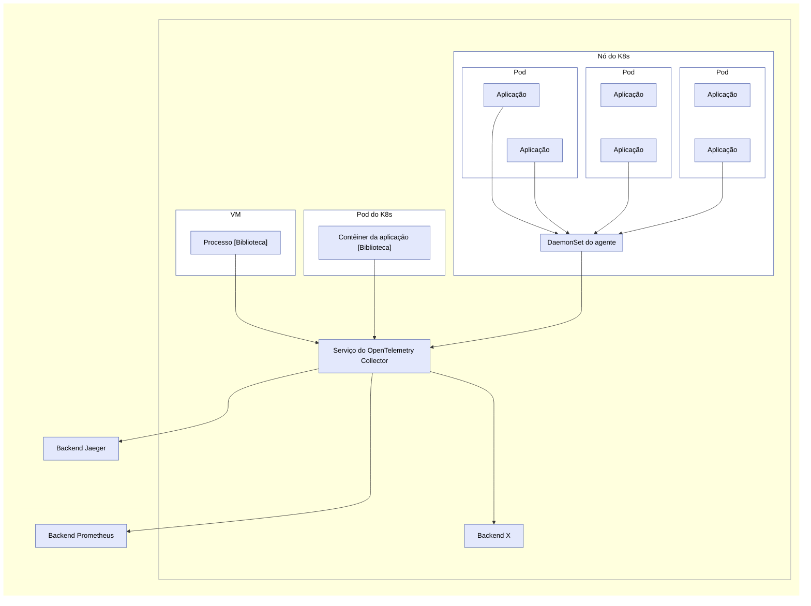

O OpenTelemetry Collector é um arquivo executável que pode receber telemetria,
processá-la e exportá-la para vários destinos, como _backends_ de
observabilidade.

O Collector oferece suporte a vários protocolos populares de código aberto para
receber e enviar dados, além de oferecer uma arquitetura extensível para
adicionar mais protocolos.

O recebimento, o processamento e a exportação de dados são feitos usando
[pipelines](#pipelines). Você pode configurar o Collector com um ou mais
pipelines.

Cada pipeline inclui:

- Um conjunto de [receptores](#receivers) que coletam os dados.
- Uma série de [processadores](#processors) opcionais que recebem os dados dos
  receptores e os processam.
- Um conjunto de [exportadores](#exporters) que recebem os dados dos
  processadores e os enviam para fora do Collector.

O mesmo receptor pode ser incluído em vários pipelines, e vários pipelines podem
incluir o mesmo exportador.

## Pipelines {#pipelines}

Um pipeline define o caminho seguido pelos dados no Collector: do recebimento ao
processamento (ou modificação) e, por fim, à exportação.

Os pipelines podem operar com três tipos de dados de telemetria: rastros,
métricas e logs. O tipo de dados é uma propriedade do pipeline definida pela sua
configuração. Os receptores, processadores e exportadores usados em um pipeline
devem oferecer suporte ao tipo de dados específico; caso contrário, a exceção
`pipeline.ErrSignalNotSupported` será informada quando a configuração for
carregada.

O diagrama a seguir representa um pipeline típico:


```mermaid
---
title: Pipeline
---
flowchart LR
  R1(Receptor 1) --> P1[Processador 1]
  R2(Receptor 2) --> P1
  RM(...) ~~~ P1
  RN(Receptor N) --> P1
  P1 --> P2[Processador 2]
  P2 --> PM[...]
  PM --> PN[Processador N]
  PN --> FO((fan-out))
  FO --> E1[[Exportador 1]]
  FO --> E2[[Exportador 2]]
  FO ~~~ EM[[...]]
  FO --> EN[[Exportador N]]
```

Os pipelines podem ter um ou mais receptores. Os dados de todos os receptores
são enviados ao primeiro processador, que os processa e os envia ao próximo
processador. Um processador também pode descartar dados ao fazer amostragem ou
filtragem. Esse processo continua até que o último processador envie os dados
aos exportadores. Cada exportador recebe uma cópia de cada elemento de dados. O
último processador usa um `fanoutconsumer` para enviar os dados a vários
exportadores.

O pipeline é construído durante a inicialização do Collector com base na
definição do pipeline na configuração.

Uma configuração de pipeline normalmente se parece com isto:

```yaml
service:
  pipelines: # section that can contain multiple subsections, one per pipeline
    traces: # type of the pipeline
      receivers: [otlp, zipkin]
      processors: [memory_limiter]
      exporters: [otlp, zipkin]
```

O exemplo anterior define um pipeline para o tipo de telemetria de rastros, com
dois receptores, um processador e dois exportadores.

### Receptores {#receivers}

Os receptores normalmente escutam uma porta de rede e recebem dados de
telemetria. Eles também podem obter dados ativamente, como no caso de
_scrapers_. Em geral, um receptor é configurado para enviar os dados recebidos
para um pipeline. No entanto, também é possível configurar o mesmo receptor para
enviar os mesmos dados a vários pipelines. Isso pode ser feito listando o mesmo
receptor na chave `receivers` de vários pipelines:

```yaml
receivers:
  otlp:
    protocols:
      grpc:
        endpoint: localhost:4317

service:
  pipelines:
    traces: # a pipeline of “traces” type
      receivers: [otlp]
      processors: [memory_limiter]
      exporters: [otlp]
    traces/2: # another pipeline of “traces” type
      receivers: [otlp]
      processors: [transform]
      exporters: [otlp]
```

No exemplo acima, o receptor `otlp` envia os mesmos dados aos pipelines `traces`
e `traces/2`.

> A configuração usa nomes de chave compostos no formato `type[/name]`.

Quando o Collector carrega essa configuração, o resultado se parece com o
diagrama a seguir (parte dos processadores e exportadores foi omitida para
facilitar a leitura):


```mermaid
flowchart LR
  R1("`#quot;opentelemetry-collector#quot; Receptor`") --> FO((fan-out))
  FO -->|Pipeline 'traces'| P1["`#quot;memory_limiter#quot; Processador`"]
  FO -->|Pipeline 'traces/2'| P2["`#quot;transform#quot; Processador`"]
  P1 ~~~ M1[...]
  P2 ~~~ M2[...]
```

> [!WARNING]
>
> Quando o mesmo receptor é referenciado em mais de um pipeline, o Collector
> cria apenas uma instância do receptor em tempo de execução, que envia os dados
> a um consumidor _fan-out_. Por sua vez, o consumidor _fan-out_ envia os dados
> ao primeiro processador de cada pipeline. A propagação dos dados do receptor
> ao consumidor _fan-out_ e, depois, aos processadores é concluída por meio de
> uma chamada de função síncrona. Isso significa que, se um processador bloquear
> a chamada, os outros pipelines conectados a esse receptor ficam impedidos de
> receber os mesmos dados, e o próprio receptor deixa de processar e encaminhar
> novos dados.

### Exportadores {#exporters}

Os exportadores normalmente encaminham os dados recebidos para um destino na
rede, mas também podem enviá-los para outros lugares. Por exemplo, o exportador
`debug` grava a telemetria no destino de log.

A configuração permite vários exportadores do mesmo tipo, inclusive no mesmo
pipeline. Por exemplo, você pode definir dois exportadores `otlp`, cada um
enviando para um endpoint OTLP diferente:

```yaml
exporters:
  otlp/1:
    endpoint: example.com:4317
  otlp/2:
    endpoint: localhost:14317
```

Normalmente, um exportador recebe dados de um pipeline. No entanto, você pode
configurar vários pipelines para enviar dados ao mesmo exportador:

```yaml
exporters:
  otlp:
    protocols:
      grpc:
        endpoint: localhost:14250

service:
  pipelines:
    traces: # a pipeline of “traces” type
      receivers: [zipkin]
      processors: [memory_limiter]
      exporters: [otlp]
    traces/2: # another pipeline of “traces” type
      receivers: [otlp]
      processors: [transform]
      exporters: [otlp]
```

No exemplo acima, o exportador `otlp` recebe dados do pipeline `traces` e do
pipeline `traces/2`. Quando o Collector carrega essa configuração, o resultado
se parece com o diagrama a seguir (parte dos receptores e processadores foi
omitida para facilitar a leitura):


```mermaid
flowchart LR
  M1[...] ~~~ P1["`#quot;memory_limiter#quot; Processador`"]
  M2[...] ~~~ P2["`#quot;transform#quot; Processador`"]
  P1 -->|Pipeline 'traces'|E1[["`#quot;otlp#quot; Exportador`"]]
  P2 -->|Pipeline 'traces/2'|E1
```

### Processadores {#processors}

Um pipeline pode conter processadores conectados sequencialmente. O primeiro
processador recebe dados de um ou mais receptores configurados para o pipeline,
e o último processador envia os dados a um ou mais exportadores configurados
para o pipeline. Todos os processadores entre o primeiro e o último recebem
dados de apenas um processador anterior e enviam dados a apenas um processador
seguinte.

Os processadores podem transformar os dados antes de encaminhá-los, por exemplo,
adicionando ou removendo atributos de spans. Eles também podem descartar dados
ao decidir não encaminhá-los (por exemplo, o processador
`probabilisticsampler`). Além disso, podem gerar novos dados.

O mesmo nome de processador pode ser referenciado na chave `processors` de
vários pipelines. Nesse caso, a mesma configuração é usada para cada um desses
processadores, mas cada pipeline sempre recebe sua própria instância. Cada
processador tem seu próprio estado, e os processadores nunca são compartilhados
entre pipelines. Por exemplo, se o processador `transform` for usado em vários
pipelines, cada pipeline terá sua própria instância do processador, mas todas as
instâncias serão configuradas exatamente da mesma forma quando referenciam a
mesma chave. Veja a configuração a seguir:

```yaml
processors:
  transform:
    error_mode: ignore
    trace_statements:
      - set(resource.attributes["namespace"],
        resource.attributes["k8s.namespace.name"])
      - delete_key(resource.attributes, "k8s.namespace.name")

service:
  pipelines:
    traces: # a pipeline of “traces” type
      receivers: [zipkin]
      processors: [transform]
      exporters: [otlp]
    traces/2: # another pipeline of “traces” type
      receivers: [otlp]
      processors: [transform]
      exporters: [otlp]
```

Quando o Collector carrega essa configuração, o resultado se parece com os
diagramas a seguir:


```mermaid
---
title: Pipeline "traces"
---
flowchart LR
  R1("`zipkin Receptor`") --> P1["`#quot;transform#quot; Processador`"]
  P1 --> E1[["`#quot;otlp#quot; Exportador`"]]
```


```mermaid
---
title: Pipeline "traces/2"
---
flowchart LR
  R1("`otlp Receptor`") --> P1["`#quot;transform#quot; Processador`"]
  P1 --> E1[["`#quot;otlp#quot; Exportador`"]]
```

Observe que cada processador `transform` é uma instância independente, embora
esteja configurado da mesma forma, com um `send_batch_size` de `10000`.

> O mesmo nome de processador não deve ser referenciado várias vezes na chave
> `processors` de um único pipeline.

## Executando como agente {#running-as-an-agent}

Em uma VM ou contêiner típico, os aplicativos do usuário são executados em
processos ou pods com uma biblioteca do OpenTelemetry. Antes, a biblioteca fazia
todo o registro, coleta, amostragem e agregação de rastros, métricas e logs, e
então exportava esses dados para _backends_ de armazenamento persistente por
meio dos exportadores da biblioteca ou os exibia em _zpages_. Esse padrão tem
várias desvantagens, por exemplo:

1. Para cada biblioteca do OpenTelemetry, exportadores e _zpages_ precisam ser
   reimplementados nas linguagens nativas.
2. Em algumas linguagens (por exemplo, Ruby ou PHP), é difícil fazer a agregação
   de estatísticas no processo.
3. Para habilitar a exportação de spans, estatísticas ou métricas do
   OpenTelemetry, os usuários da aplicação precisam adicionar manualmente
   exportadores da biblioteca e reimplantar seus binários. Isso é especialmente
   difícil quando ocorreu um incidente e os usuários querem investigar o
   problema imediatamente.
4. Os usuários da aplicação precisam assumir a responsabilidade de configurar e
   inicializar os exportadores. Essas tarefas são propensas a erros (por
   exemplo, ao configurar credenciais ou recursos monitorados incorretos), e os
   usuários podem não querer "poluir" seu código com o OpenTelemetry.

Para resolver esses problemas, você pode executar o OpenTelemetry Collector como
um agente. O agente é executado como um daemon na VM ou no contêiner e pode ser
implantado independentemente da biblioteca. Depois que o agente estiver em
execução, ele poderá recuperar rastros, métricas e logs da biblioteca e
exportá-los para outros _backends_. Também podemos dar ao agente a capacidade de
enviar configurações (como a probabilidade de amostragem) à biblioteca. Para as
linguagens que não conseguem agregar estatísticas no processo, elas podem enviar
medições brutas e deixar que o agente faça a agregação.


```mermaid
flowchart LR
  subgraph S1 ["#nbsp;"]
      subgraph S2 ["#nbsp;"]
        subgraph VM [VM]
            PR["Processo [Biblioteca]"] -->|Enviar spans, métricas| AB[Binário do agente]
            AB -->|Enviar configurações| PR
        end
        subgraph K8s-pod [Pod do K8s]
            AC["Contêiner da aplicação [Biblioteca]"] --> AS[Sidecar do agente]
            AS --> AC
        end
        subgraph K8s-node [Nó do K8s]
            subgraph Pod1 [Pod]
                APP1[Aplicação] ~~~ APP2[Aplicação]
            end
            subgraph Pod2 [Pod]
                APP3[Aplicação] ~~~ APP4[Aplicação]
            end
            subgraph Pod3 [Pod]
                APP5[Aplicação] ~~~ APP6[Aplicação]
            end
            subgraph AD [DaemonSet do agente]
            end
            APP1 --> AD
            APP2 --> AD
            APP4 --> AD
            APP6 --> AD
        end
      end
      subgraph Backends ["#nbsp;"]
          AB --> BE[Backend]
          AS --> PRM[Backend Prometheus]
          AS --> JA[Backend Jaeger]
          AD --> JA
      end
  end

class S2 noLines;
class VM,K8s-pod,K8s-node,Pod1,Pod2,Pod3,Backends withLines;
class PR,AB,AC,AS,APP1,APP2,APP3,APP4,APP5,APP6,AD,BE,PRM,JA nodeStyle
classDef noLines stroke:#fff,stroke-width:4px,color:#000000;
classDef withLines fill:#fff,stroke:#4f62ad,color:#000000;
classDef nodeStyle fill:#e3e8fc,stroke:#4f62ad,color:#000000;
```

> Para desenvolvedores e mantenedores de outras bibliotecas: ao adicionar
> receptores específicos, você pode configurar um agente para aceitar rastros,
> métricas e logs de outras bibliotecas de rastreamento e monitoramento, como
> Zipkin e Prometheus. Consulte [Receptores](#receivers) para obter detalhes.

## Executando como gateway {#running-as-a-gateway}

O OpenTelemetry Collector pode ser executado como uma instância de gateway,
recebendo spans e métricas exportados por um ou mais agentes ou bibliotecas, ou
por tarefas e agentes que emitam dados em um dos protocolos compatíveis. O
Collector é configurado para enviar os dados aos exportadores configurados. A
figura a seguir resume essa arquitetura de implantação:


```mermaid
flowchart LR
  subgraph S1 ["#nbsp;"]
      subgraph S2 ["#nbsp;"]
        subgraph S3 ["#nbsp;"]
          subgraph VM [VM]
              PR["Processo [Biblioteca]"]
          end
          subgraph K8s-pod [Pod do K8s]
              AC["Contêiner da aplicação [Biblioteca]"]
          end
          subgraph K8s-node [Nó do K8s]
              subgraph Pod1 [Pod]
                  APP1[Aplicação] ~~~ APP2[Aplicação]
              end
              subgraph Pod2 [Pod]
                  APP3[Aplicação] ~~~ APP4[Aplicação]
              end
              subgraph Pod3 [Pod]
                  APP5[Aplicação] ~~~ APP6[Aplicação]
              end
              subgraph AD [DaemonSet do agente]
              end
              APP1 --> AD
              APP2 --> AD
              APP4 --> AD
              APP6 --> AD
          end
        end
        subgraph S4 ["#nbsp;"]
            PR --> OTEL["Serviço do OpenTelemetry Collector"]
            AC --> OTEL
            AD --> OTEL
            OTEL ---> BE[Backend X]
        end
      end
      subgraph S5 ["#nbsp;"]
        subgraph S6 ["#nbsp;"]
            JA[Backend Jaeger]
        end
        subgraph S7 ["#nbsp;"]
            PRM[Backend Prometheus]
        end
      end
      JA ~~~ PRM
      OTEL --> JA
      OTEL --> PRM
  end

class S1,S3,S4,S5,S6,S7,S8 noLines;
class VM,K8s-pod,K8s-node,Pod1,Pod2,Pod3 withLines;
class S2 lightLines
class PR,AC,APP1,APP2,APP3,APP4,APP5,APP6,AD,OTEL,BE,JA,PRM nodeStyle
classDef noLines stroke-width:0px,color:#000000;
classDef withLines fill:#fff,stroke:#4f62ad,color:#000000;
classDef lightLines stroke:#acaeb0,color:#000000;
classDef nodeStyle fill:#e3e8fc,stroke:#4f62ad,color:#000000;
```

O OpenTelemetry Collector também pode ser implantado em outras configurações,
como receber dados de outros agentes ou clientes em um dos formatos compatíveis
com seus receptores.
