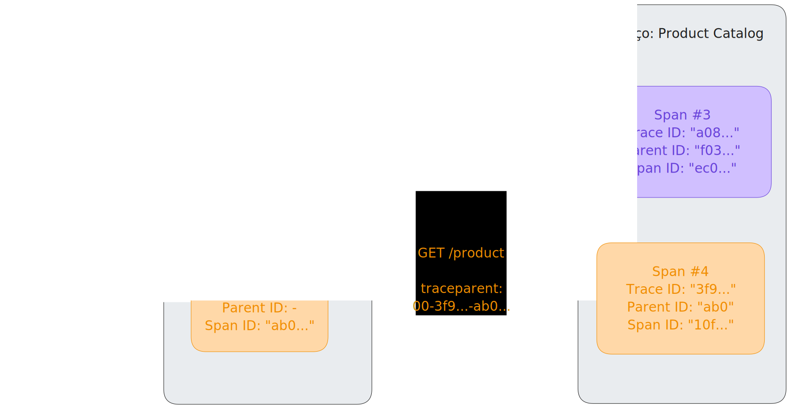

Com a propagação de contexto, [sinais](../signals/)
([rastros](../signals/traces), [métricas](../signals/metrics) e
[logs](../signals/logs)) podem ser correlacionados entre si, independentemente
de onde são gerados. Embora não se limite ao rastreamento, a propagação de
contexto permite que os [rastros](../signals/traces/) criem informações causais
sobre um sistema através de serviços que estão arbitrariamente distribuídos
através de limites de processos e redes.

Para compreender a propagação de contexto, você precisa entender dois conceitos
distintos: contexto e propagação.

## Contexto {#context}

O contexto é um objeto que contém as informações necessárias para que o serviço
emissor e receptor, ou
[unidade de execução](/docs/specs/otel/glossary/#execution-unit), correlacionem
um sinal com outro.

Quando o serviço A chama o serviço B, um ID de rastro (_trace ID_) e um ID de
trecho (_span ID_) são incluídos como parte do contexto. O serviço B utiliza
estes valores para criar um novo trecho que pertence ao mesmo rastro, definindo
o trecho do serviço A como seu pai. Isso torna possível acompanhar todo o fluxo
de uma requisição através dos limites dos serviços.

## Propagação {#propagation}

Propagação é o mecanismo que move o contexto entre serviços e processos. Ele
serializa ou desserializa o objeto de contexto e fornece as informações
relevantes a serem propagadas de um serviço para outro.

A propagação geralmente é gerenciada por bibliotecas de instrumentação e é
transparente para o usuário. Caso precise propagar o contexto manualmente, você
pode usar a [API de Propagadores](/docs/specs/otel/context/api-propagators/).

O OpenTelemetry mantém vários propagadores oficiais. O propagador padrão utiliza
os cabeçalhos definidos na especificação
[W3C TraceContext](https://www.w3.org/TR/trace-context/).

## Exemplo {#example}

Um serviço chamado `Frontend`, que fornece diferentes rotas HTTP, como
`POST /cart/add` e `GET /checkout/`, acessa um serviço chamado `Product Catalog` (Catálogo de Produto)
através de uma rota HTTP `GET /product` para receber detalhes sobre os produtos
que um usuário deseja adicionar ao carrinho ou que fazem parte do _checkout_.
Para entender as atividades no serviço `Product Catalog` dentro do contexto das
requisições vindas do `Frontend`, o contexto (neste caso: _Trace ID_ e _Span ID_
como _"Parent ID"_) é propagado utilizando o cabeçalho `traceparent`, conforme
definido na especificação W3C TraceContext. Isso significa que os IDs são
incorporados nos campos do cabeçalho:

```text
<version>-<trace-id>-<parent-id>-<trace-flags>
```

Por exemplo:

```text
00-a0892f3577b34da6a3ce929d0e0e4736-f03067aa0ba902b7-01
```

### Rastros {#traces}

Como mencionado, a propagação de contexto permite que os rastros construam
informações causais entre serviços. Neste exemplo, as duas chamadas para a rota
HTTP `GET /product` do serviço `Product Catalog` podem ser correlacionadas com
suas chamadas no serviço `Frontend` através da extração do contexto remoto do cabeçalho
`traceparent` e sua injeção no contexto local para definir o ID de rastro
(_trace ID_) e o ID de pai (_parent ID_). Com isso, é possível em um
[_backend_](/ecosystem/vendors) como [Jaeger](https://www.jaegertracing.io/) ver
duas requisições como trechos de um mesmo rastro.



### Logs {#logs}

Os SDKs do OpenTelemetry são capazes de correlacionar automaticamente logs com
rastros. Isso significa que o contexto (ID de rastro, ID de trecho) pode ser
injetado em um registro de log. Isso não apenas permite que você veja os logs no
contexto do rastro e do trecho ao qual pertencem, mas também possibilita ver os
logs que pertencem juntos através dos limites de serviços ou unidades de
execução.

### Métricas {#metrics}

No caso de métricas, a propagação de contexto permite que você agregue medições
naquele contexto. Por exemplo, em vez de apenas olhar para o tempo de resposta
de todas as requisições `GET /product`, você também pode obter métricas para
combinações de `POST /cart/add > GET /product` e `GET /checkout < GET /product`.

| Nome                            | Chamadas por Segundo | Tempo Médio de Resposta |
| ------------------------------- | -------------------- | ----------------------- |
| `* > GET /product`              | 370                  | 300ms                   |
| `POST /card/add > GET /product` | 330                  | 130ms                   |
| `GET /checkout > GET /product`  | 40                   | 1703ms                  |

## Propagação de contexto personalizada {#custom-context-propagation}

Para a maioria dos casos de uso, você encontrará
[bibliotecas de instrumentação ou instrumentação nativa de bibliotecas](/docs/concepts/instrumentation/libraries/)
que lidam com a propagação de contexto para você. Em alguns casos, este suporte
não está disponível e você desejará criar esse suporte por conta própria. Para
isso, você precisa aproveitar a API de Propagadores mencionada anteriormente:

- No lado do emissor, o contexto é
  [injetado](/docs/specs/otel/context/api-propagators/#inject) no transportador
  (_carrier_), por exemplo, nos cabeçalhos de uma requisição HTTP. Em outros
  casos, você precisa encontrar um local onde possa armazenar metadados para sua
  requisição.
- No lado do receptor, o contexto é
  [extraído](/docs/specs/otel/context/api-propagators/#extract) do
  transportador. Novamente, no caso de HTTP, isso é recuperado dos cabeçalhos.
  Em outros casos, você escolhe o local selecionado no lado emissor para
  armazenar o contexto.

Note que é possível propagar o contexto em protocolos que não possuem um campo
dedicado para metadados, mas você deve garantir que no lado receptor eles sejam
extraídos e removidos antes que os dados sejam processados, caso contrário você
poderá criar um comportamento indefinido.

Para as seguintes linguagens, existe um tutorial passo a passo para propagação
de contexto personalizada:

- [Erlang](/docs/languages/erlang/propagation/#manual-context-propagation)
- [JavaScript](/docs/languages/js/propagation/#manual-context-propagation)
- [PHP](/docs/languages/php/propagation/#manual-context-propagation)
- [Python](/docs/languages/python/propagation/#manual-context-propagation)

## Melhores práticas de segurança {#security-best-practices}

A propagação envolve o envio e recebimento de dados através de limites de
serviço, o que pode ter implicações de segurança.

### Serviços externos {#external-services}

Quando seu serviço interage com serviços externos (serviços que você não possui
ou não confia), considere o seguinte:

- **Contexto de entrada**: Tenha cautela ao aceitar contexto de fontes externas.
  Atores maliciosos podem enviar cabeçalhos de rastreamento forjados para
  manipular seus dados de rastreamento ou potencialmente explorar
  vulnerabilidades na análise de contexto. Você pode querer ignorar ou sanitizar
  o contexto de entrada de fontes não confiáveis.
- **Contexto de saída**: Tenha cuidado com o que você propaga para serviços
  externos. IDs de rastros internos, IDs de trechos ou itens de bagagem podem
  revelar informações sensíveis sobre sua arquitetura interna ou lógica de
  negócios. Você pode querer configurar seus propagadores para não enviar
  contexto para rotas externas ou públicas.

### Bagagem {#baggage}

[Bagagem](../signals/baggage/) permite propagar pares arbitrários de
chave-valor. Como esses dados são propagados através de limites de serviço,
evite colocar informações sensíveis (como credenciais de usuário, chaves de API
ou informações pessoais identificáveis) na bagagem, pois elas podem ser
registradas ou enviadas para serviços _downstream_ não confiáveis.

## Suporte nos SDKs de Linguagem {#support-in-language-sdks}

Para as implementações individuais específicas de linguagem da API & SDK do
OpenTelemetry, você encontrará detalhes sobre o suporte à propagação de contexto
nas respectivas páginas de documentação:

- [C++](/docs/languages/cpp/instrumentation/#context-propagation)
- .NET
- [Erlang](/docs/languages/erlang/propagation/)
- [Go](/docs/languages/go/instrumentation/#propagators-and-context)
- [Java](/docs/languages/java/api/#context-api)
- [JavaScript](/docs/languages/js/propagation/)
- [PHP](/docs/languages/php/propagation/)
- [Python](/docs/languages/python/propagation/)
- [Ruby](/docs/languages/ruby/instrumentation/#context-propagation)
- Rust
- Swift

{}

Para as linguagens .NET, Rust e Swift, a documentação específica da linguagem
para propagação de contexto está ausente. Se você conhece alguma dessas
linguagens e possui interesse em ajudar,
[saiba como você pode contribuir](/docs/contributing/)!

{}

## Especificação {#specification}

Para saber mais sobre a Propagação de Contexto, consulte a
[Especificação de Contexto](/docs/specs/otel/context/).
