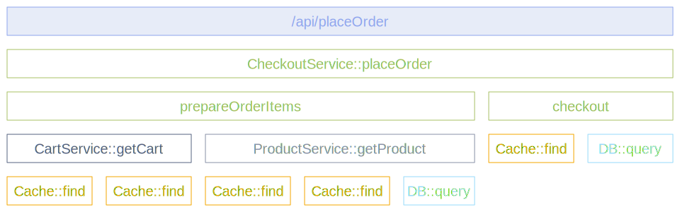

O [escopo de instrumentação](/docs/specs/otel/common/instrumentation-scope/)
representa uma unidade lógica dentro do código da aplicação com a qual a
telemetria emitida pode ser associada.

Os desenvolvedores podem decidir o que denota um escopo de instrumentação
razoável. Por exemplo, é possível selecionar um módulo, um pacote ou uma classe
como o escopo de instrumentação. No caso de uma biblioteca ou um _framework_,
uma abordagem comum é utilizar como escopo um identificador que seja exclusivo
para aquela biblioteca ou _framework_, como seu respectivo nome e versão. Caso a
biblioteca em si não possua instrumentação OpenTelemetry incorporada, e uma
biblioteca de instrumentação esteja sendo utilizada em seu lugar, utilize a
combinação do nome e a versão da biblioteca de instrumentação como o escopo de
instrumentação.

O escopo de instrumentação é definido por uma combinação do par entre nome e
versão quando uma instância do _tracer_, _meter_ ou _logger_ são obtidos de um
_provider_. Cada registro de trecho, métrica ou log criados por esta instância
serão então associados ao escopo de instrumentação fornecido.

No seu backend de observabilidade, a utilização de escopos permite que os dados
de telemetria sejam analisados de maneira agrupada, por exemplo, para ver quais
de seus usuários estão utilizando quais versões de uma biblioteca e qual a
performance destas versões, ou até mesmo para identificar um determinado
problema em um módulo específico da sua aplicação.

O diagrama a seguir ilustra um rastro com múltiplos escopos de instrumentação.
Os diferentes escopos são representados por diferentes cores:

- No topo, o trecho `/api/placeOrder` é criado através do _framework_ do
  servidor HTTP.
- Os trechos em verde (`CheckoutService::placeOrder`, `prepareOrderItems` e
  `checkout`) são códigos da aplicação, agrupados através da classe
  `CheckoutService`.
- Os trechos em `CartService::getCart` e `ProductService::getProduct` também são
  códigos da aplicação, agrupados através das classes `CartService` e
  `ProductService`.
- Os trechos em laranja (`Cache::find`) e azul claro (`DB::query`) são códigos
  de biblioteca, agrupados através dos respectivos nomes e versões de cada.

