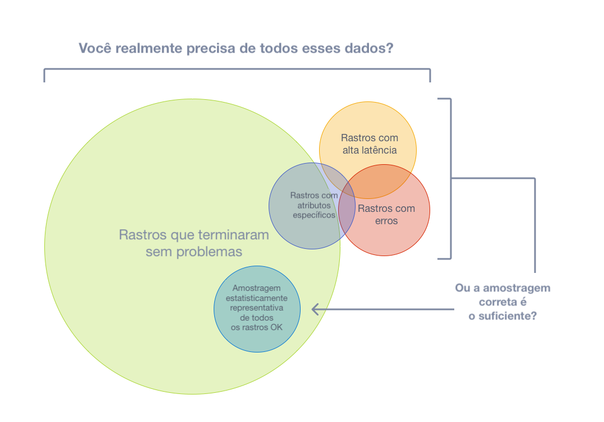
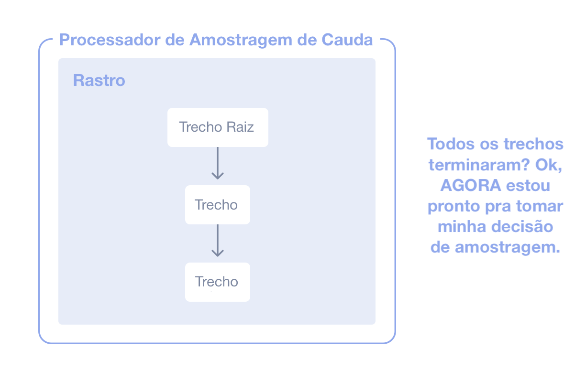

Com [rastros](/docs/concepts/signals/traces), você pode observar as requisições
à medida que se movem de um serviço para outro em um sistema distribuído.
Rastreamento é muito útil tanto para análises de alto nível quanto para análises
aprofundadas de sistemas.

Contudo, se a grande maioria das suas requisições é bem-sucedida e termina com
uma latência aceitável e sem erros, você não precisa de 100% dos seus rastros
para observar de forma significativa suas aplicações e sistemas. Você só precisa
da amostragem correta.

## Terminologia {#terminology}

É importante usar uma terminologia consistente ao discutir amostragem. Um rastro
ou trecho é considerado "amostrado" (_sampled_) ou "não amostrado" (_not
sampled_):

- **Amostrado**: Um rastro ou trecho é processado e exportado. Por ter sido
  escolhido pelo amostrador (_sampler_) como representativo do conjunto de
  dados, ele é considerado "amostrado".
- **Não amostrado**: Um rastro ou trecho não é processado ou exportado. Por não
  ter sido escolhido pelo amostrador, ele é considerado "não amostrado".

Às vezes, as definições desses termos se confundem. Você pode encontrar alguém
dizendo que está "amostrando dados" ou que os dados não processados ou
exportados são considerados "amostrados". Essas afirmações estão incorretas.

## Por que usar amostragem? {#why-sampling}

A amostragem é uma das formas mais eficazes de reduzir os custos de
observabilidade sem perder visibilidade. Embora existam outras maneiras de
reduzir custos, como filtrar ou agregar dados, esses outros métodos não aderem
ao conceito de representatividade, que é crucial ao realizar análises
aprofundadas do comportamento de aplicações ou sistemas.

Representatividade é o princípio de que um grupo menor pode representar com
precisão um grupo maior. Além disso, a representatividade pode ser verificada
matematicamente, o que significa que você pode ter alta confiança de que uma
amostra menor de dados representa com precisão o grupo maior.

Além disso, quanto mais dados você gera, menos dados você realmente precisa para
ter uma amostra representativa. Para sistemas de alto volume, é muito comum que
uma taxa de amostragem de 1% ou menos represente com bastante precisão os outros
99% dos dados.

### Quando usar amostragem {#when-to-sample}

Considere usar amostragem se você atender a qualquer um dos seguintes critérios:

- Você gera 1.000 ou mais rastros por segundo.
- A maior parte dos seus rastros representa tráfego saudável com pouca variação
  nos dados.
- Você tem alguns critérios comuns, como erros ou alta latência, que geralmente
  significam que algo está errado.
- Você tem critérios específicos de domínio que você pode usar para determinar
  dados relevantes além de erros e latência.
- Você consegue descrever algumas regras comuns que determinam se o dado deve
  ser amostrado ou descartado.
- Você consegue diferenciar seus serviços, para que serviços de alto e baixo
  volume sejam amostrados de forma diferente.
- Você tem a capacidade de rotear dados não amostrados (para cenários de "por
  via das dúvidas") para sistemas de armazenamento de baixo custo.

Por fim, considere seu orçamento em geral. Se você tem um orçamento limitado
para observabilidade, mas pode dedicar tempo para realizar uma amostragem
eficaz, então a amostragem geralmente vale a pena.

### Quando não usar amostragem {#when-not-to-sample}

A amostragem pode não servir para você. Você talvez queira evitar a amostragem
se atender a qualquer um dos seguintes critérios:

- Você gera poucos dados (dezenas de pequenos rastros por segundo ou menos).
- Você só usa dados de observabilidade de forma agregada, portanto, pode
  pré-agregar os dados.
- Você está limitado por outros fatores, como por exemplo, regulamentações que
  proíbem descartar dados (e não pode rotear dados não amostrados para
  armazenamento de baixo custo).

Por fim, considere os seguintes três custos associados à amostragem:

1. O custo direto de computação para amostrar dados de forma eficaz, como um
   _proxy_ de amostragem pela cauda.
2. O custo indireto de engenharia para manter metodologias de amostragem
   eficazes à medida que mais aplicações, sistemas e dados são envolvidos.
3. O custo indireto de oportunidade de perder informações críticas com técnicas
   de amostragem ineficazes.

A amostragem, embora eficaz na redução dos custos de observabilidade, pode
introduzir outros custos inesperados se não for realizada corretamente. Poderia
ser mais barato alocar mais recursos para observabilidade, seja através de um
fornecedor ou com recursos computacionais em hospedagem própria, dependendo do
seu _backend_ de observabilidade, da natureza dos seus dados e das suas
tentativas de realizar amostragem de forma eficaz.

## Amostragem pela Cabeça {#head-sampling}

A amostragem pela cabeça (_head sampling_) é uma técnica de amostragem usada
para tomar uma decisão de amostragem o mais cedo possível. A decisão de amostrar
ou descartar um trecho ou um rastro não é feita inspecionando o rastro como um
todo.

Por exemplo, a forma mais comum de amostragem pela cabeça é a
[Amostragem de Probabilidade Consistente](/docs/specs/otel/trace/tracestate-probability-sampling-experimental/#consistent-probability-sampling).
Isso também é conhecido como Amostragem Determinística. Neste caso, uma decisão
de amostragem é tomada com base no ID do rastro e na porcentagem desejada de
rastros a serem amostrados. Isso garante que rastros inteiros sejam amostrados -
sem trechos faltantes - a uma taxa consistente, como 5% de todos os rastros.

As vantagens da amostragem pela cabeça são:

- Fácil de entender
- Fácil de configurar
- Eficiente
- Pode ser feita em qualquer ponto do _pipeline_ de coleta de rastros

A principal desvantagem da amostragem pela cabeça é que não é possível tomar uma
decisão de amostragem com base nos dados do rastro inteiro. Por exemplo, você
não pode garantir que todos os rastros com um erro sejam amostrados apenas com a
amostragem pela cabeça. Para essa situação e muitas outras, você precisa da
amostragem pela cauda.

## Amostragem pela Cauda {#tail-sampling}

A amostragem pela cauda (_tail sampling_) é onde a decisão de amostrar um rastro
acontece considerando todos ou a maioria dos trechos dentro do rastro. A
Amostragem de Cauda oferece a opção de amostrar seus rastros com base em
critérios específicos derivados de diferentes partes de um rastro, o que não é
uma opção com a Amostragem pela Cabeça.

Alguns exemplos de como você pode usar a Amostragem pela Cauda incluem:

- Sempre amostrar rastros que contenham um erro
- Amostrar rastros com base na latência geral
- Amostrar rastros com base na presença ou valor de atributos específicos em um
  ou mais trechos de um rastro; por exemplo, amostrar mais rastros originados de
  um serviço recém-implantado
- Aplicar diferentes taxas de amostragem a rastros com base em certos critérios,
  como quando os rastros vêm apenas de serviços de baixo volume versus rastros
  de serviços de alto volume.

Como você pode ver, a amostragem pela cauda permite um grau muito maior de
sofisticação na forma como você amostra os dados. Para sistemas maiores que
devem amostrar telemetria, é quase sempre necessário usar a Amostragem pela
Cauda para equilibrar o volume de dados com a utilidade desses dados.

Existem três principais desvantagens na amostragem pela cauda atualmente:

1. A amostragem pela cauda pode ser difícil de implementar. Dependendo dos tipos
   de técnicas de amostragem a sua disposição, nem sempre é uma decisão do tipo
   "configurar e esquecer". À medida que seus sistemas mudam, suas estratégias
   de amostragem também mudarão. Para um sistema distribuído grande e
   sofisticado, as regras que implementam estratégias de amostragem também podem
   ser grandes e sofisticadas.
2. A amostragem pela cauda pode ser difícil de operar. O(s) componente(s) que
   implementam a amostragem pela cauda devem ser sistemas com estado que podem
   aceitar e armazenar uma grande quantidade de dados. Dependendo dos padrões de
   tráfego, isso pode exigir dezenas ou até centenas de nós de computação que
   utilizam recursos de maneira diferente. Além disso, um amostrador pela cauda
   pode precisar "recorrer" a técnicas de amostragem menos intensivas
   computacionalmente se não conseguir acompanhar o volume de dados que está
   recebendo. Por conta desses fatores, é crucial monitorar os componentes de
   amostragem pela cauda para garantir que eles tenham os recursos necessários
   para tomar as decisões corretas de amostragem.
3. Atualmente, os amostradores pela cauda frequentemente acabam sendo
   tecnologias específicas de fornecedores. Se você está usando um fornecedor
   pago para Observabilidade, as opções mais eficazes de amostragem pela cauda
   disponíveis para você podem ser limitadas ao que o fornecedor oferece.

Por fim, para alguns sistemas, a amostragem pela cauda pode ser usada em
conjunto com a Amostragem pela Cabeça. Por exemplo, um conjunto de serviços que
produz um volume extremamente alto de dados de rastreamento pode primeiro usar a
amostragem pela cabeça para amostrar apenas uma pequena porcentagem dos rastros
e, posteriormente, no _pipeline_ de telemetria usar a amostragem pela cauda para
tomar decisões de amostragem mais sofisticadas antes de exportar para um
_backend_. Isso é frequentemente feito com o intuito de proteger o _pipeline_ de
telemetria contra sobrecarga.

## Suporte {#support}

### Collector

O OpenTelemetry Collector inclui os seguintes processadores de amostragem:

- [Processador de Amostragem Probabilística](https://github.com/open-telemetry/opentelemetry-collector-contrib/tree/main/processor/probabilisticsamplerprocessor)
- [Processador de Amostragem pela Cauda](https://github.com/open-telemetry/opentelemetry-collector-contrib/tree/main/processor/tailsamplingprocessor)

### SDKs de Linguagens de programação {#language-sdks}

Para as implementações específicas de cada linguagem da API e SDK do
OpenTelemetry, você vai encontrar suporte para amostragem nas respectivas
páginas de documentação:

{}

### Fornecedores {#vendors}

Muitos [fornecedores](/ecosystem/vendors) oferecem soluções abrangentes de
amostragem que incorporam amostragem pela cabeça, amostragem pela cauda e outros
recursos que podem atender a necessidades sofisticadas de amostragem. Essas
soluções também podem ser otimizadas especificamente para o _backend_ do
fornecedor. Se você está enviando telemetria para um fornecedor, considere usar
as soluções de amostragem deles.
