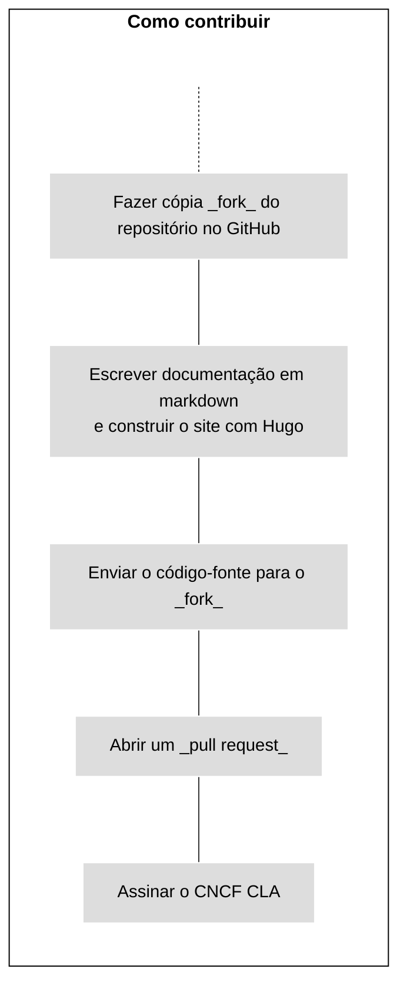
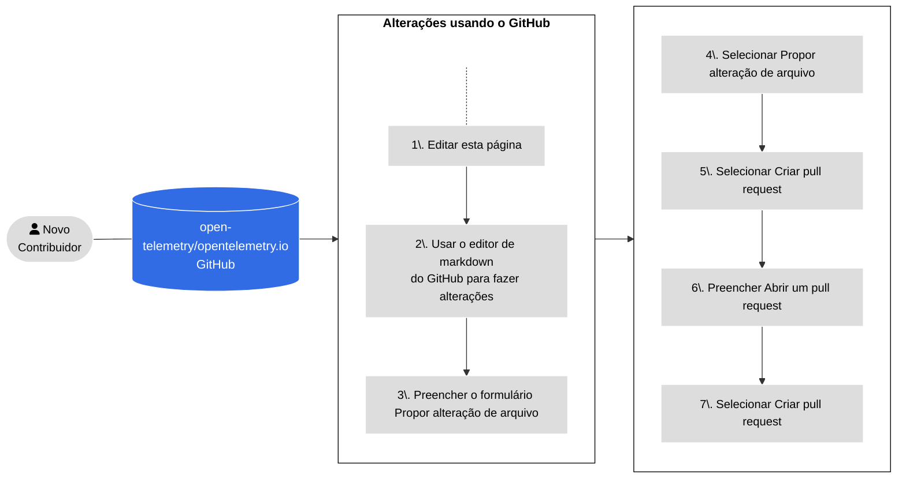
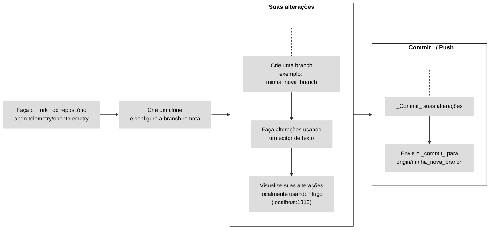
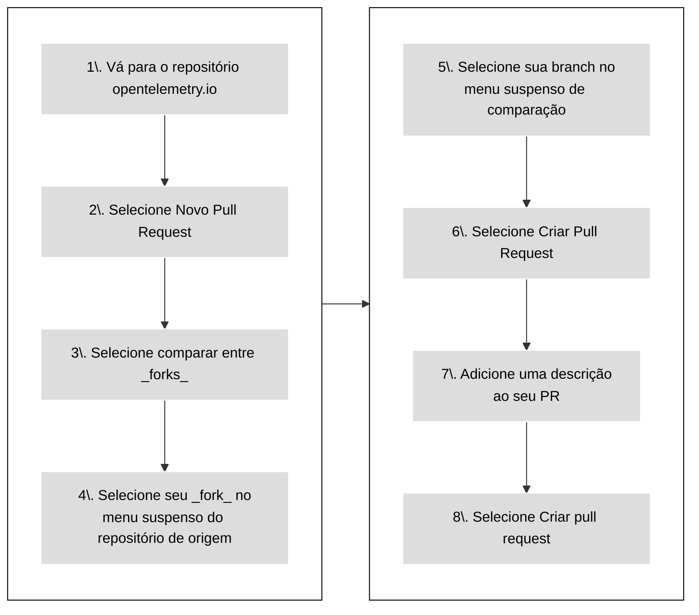

Para contribuir com novos conteúdos ou melhorar a documentação existente,
submeta um [pull request][PR] (PR):

- Se sua alteração for pequena ou você não estiver familiarizado com o [Git],
  veja [Usando o GitHub](#changes-using-github) para aprender como editar uma
  página.
- Caso contrário, consulte [Trabalhando localmente](#fork-the-repo) para
  aprender como fazer alterações no seu próprio ambiente de desenvolvimento
  local.

{}

Todos os contribuidores são obrigados a [assinar um Contrato de Licença de
Contribuidor (CLA)][CLA] antes que as alterações possam ser revisadas e
mescladas.

[CLA]: ../prerequisites/#cla

{}

{}

Defina o status do seu _pull request_ como **Rascunho** (_Draft_) para informar
aos mantenedores que o conteúdo ainda não está pronto para revisão. Os
mantenedores ainda podem comentar ou fazer revisões de alto nível, mas não
revisarão o conteúdo completamente até que você remova o status de rascunho.

{}

A figura a seguir ilustra como contribuir com nova documentação.



_Figura 1. Contribuindo com novo conteúdo._

## Usando o GitHub {#changes-using-github}

### Editar e enviar alterações pelo navegador {#page-edit-from-browser}

Se você tem menos experiência com fluxos de trabalho do Git, aqui está um método
mais fácil de preparar e abrir um novo _pull request_ (PR). A Figura 2 descreve
os passos, e os detalhes seguem abaixo.



_Figura 2. Etapas para abrir um PR usando o GitHub._

1. Na página onde você vê o problema, selecione a opção **Editar esta página**
   no painel de navegação à direita.

1. Se você não for membro do projeto, o GitHub oferece a opção de criar um
   _fork_ do repositório. Selecione **Fazer _fork_ deste repositório**.

1. Faça suas alterações no editor do GitHub.

1. Preencha o formulário **Propor alteração de arquivo**.

1. Selecione **Propor alteração de arquivo**.

1. Selecione **Criar _pull request_**.

1. A tela **Abrir um _pull request_** aparece. Sua descrição ajuda os revisores
   a entenderem sua alteração.

1. Selecione **Criar _pull request_**.

Antes de mesclar um _pull request_, os membros da comunidade OpenTelemetry
revisam e aprovam.

Se um revisor pedir para você fazer alterações:

1. Vá para a aba **Arquivos alterados**.
1. Selecione o ícone de lápis (editar) em qualquer arquivo alterado pelo _pull
   request_.
1. Faça as alterações solicitadas. Se houver uma sugestão de código, aplique-a.
1. _Commit_ as alterações.

Quando sua revisão estiver completa, um revisor mescla seu PR e suas alterações
ficam disponíveis alguns minutos depois.

### Corrigindo falhas na verificação do PR {#fixing-prs-in-github}

Depois de enviar um PR, o GitHub executa algumas verificações de compilação.
Certas falhas de verificação, como problemas de formatação, podem ser corrigidas
automaticamente.

Adicione o seguinte comentário ao seu PR:

```text
/fix:all
```

Isso fará com que o bot OpenTelemetry tente corrigir os problemas de compilação.
Ou você pode emitir um dos seguintes comandos de correção para resolver uma
falha específica:

```text
fix:dict
fix:expired
fix:filenames
fix:format
fix:htmltest-config
fix:i18n
fix:markdown
fix:refcache
fix:submodule
fix:text
```

{}

Você também pode executar os comandos `fix` localmente. Para a lista completa de
comandos de correção, execute `npm run -s '_list:fix:*'`.

{}

## Trabalhando localmente {#fork-the-repo}

Se você tem mais experiência com Git, ou se suas alterações são maiores do que
algumas linhas, trabalhe a partir de um _fork_ local.

Certifique-se de que você tenha [`git` instalado][`git` installed] no seu
computador. Você também pode usar uma interface de usuário para o Git.

A Figura 3 mostra os passos a seguir quando você trabalha a partir de um _fork_
local. Os detalhes de cada etapa seguem abaixo.



\_Figura 3. Trabalhando a partir de um fork local para fazer suas alterações.\_

### Faça o _fork_ do repositório {#fork-the-repository}

1. Navegue até o repositório
   [`opentelemetry.io`](https://github.com/open-telemetry/opentelemetry.io/).
1. Selecione **Fork**.

### Clone e defina o repositório de origem (_upstream_) {#clone-and-set-upstream}

1. Em uma janela de terminal, clone seu _fork_ e instale as dependências:

   ```shell
   git clone git@github.com:<seu_nome_de_usuario_no_github>/opentelemetry.io.git
   cd opentelemetry.io
   npm install
   ```

1. Defina o repositório `open-telemetry/opentelemetry.io` como o remoto
   `upstream`:

   ```shell
   git remote add upstream https://github.com/open-telemetry/opentelemetry.io.git
   ```

1. Confirme seus repositórios `origin` e `upstream`:

   ```shell
   git remote -v
   ```

   A saída é semelhante a:

   ```none
   origin	git@github.com:<seu_nome_de_usuario_no_github>/opentelemetry.io.git (fetch)
   origin	git@github.com:<seu_nome_de_usuario_no_github>/opentelemetry.io.git (push)
   upstream	https://github.com/open-telemetry/opentelemetry.io.git (fetch)
   upstream	https://github.com/open-telemetry/opentelemetry.io.git (push)
   ```

1. Obtenha commits do `origin/main` do seu _fork_ e `upstream/main` do
   repositório `open-telemetry/opentelemetry.io`:

   ```shell
   git fetch origin
   git fetch upstream
   ```

   Isso garante que seu repositório local esteja atualizado antes de você
   começar a fazer alterações. Envie alterações do _upstream_ para o _origin_
   regularmente para manter seu _fork_ sincronizado com o _upstream_.

### Crie uma _branch_ (ramificação) {#create-a-branch}

1. Crie uma nova _branch_. Este exemplo assume que a _branch_ base é
   `upstream/main`:

   ```shell
   git checkout -b <minha_nova_branch> upstream/main
   ```

1. Faça suas alterações usando um editor de código ou texto.

A qualquer momento, use o comando `git status` para ver quais arquivos você
alterou.

### _Commit_ suas alterações {#commit-your-changes}

Quando você estiver pronto para enviar um _pull request_, confirme suas
alterações.

1. No seu repositório local, verifique quais arquivos você precisa confirmar:

   ```shell
   git status
   ```

   A saída é semelhante a:

   ```none
   On branch <minha_nova_branch>
   Your branch is up to date with 'origin/<minha_nova_branch>'.

   Changes not staged for _commit_:
   (use "git add <file>..." to update what will be _committed_)
   (use "git checkout -- <file>..." to discard changes in working directory)

   modified:   content/en/docs/file-you-are-editing.md

   no changes added to _commit_ (use "git add" and/or "git commit -a")
   ```

1. Adicione os arquivos listados em **Alterações não preparadas para _commit_**
   (_Changes not staged for commit_) ao _commit_:

   ```shell
   git add <nome_do_seu_arquivo>
   ```

   Repita isso para cada arquivo.

1. Depois de adicionar todos os arquivos, crie um _commit_:

   ```shell
   git commit -m "Sua mensagem de _commit_"
   ```

1. Envie sua _branch_ local e seu novo _commit_ para seu _fork_ remoto:

   ```shell
   git push origin <minha_nova_branch>
   ```

1. Assim que as alterações forem enviadas, o GitHub avisará que você pode criar
   um PR.

### Abre um novo PR {#open-a-pr}

A Figura 4 mostra os passos para abrir um PR do seu _fork_ para
[opentelemetry.io](https://github.com/open-telemetry/opentelemetry.io).



_Figura 4. Etapas para abrir um PR do seu fork para_
[opentelemetry.io](https://github.com/open-telemetry/opentelemetry.io).

1. Em um navegador da web, vá para o repositório
   [`opentelemetry.io`](https://github.com/open-telemetry/opentelemetry.io).
1. Selecione **Novo _Pull Request_**.
1. Selecione **comparar entre _forks_**.
1. No menu suspenso **repositório de origem**, selecione seu _fork_.
1. No menu suspenso **comparar**, selecione sua _branch_.
1. Selecione **Criar _Pull Request_**.
1. Adicione uma descrição para o seu _pull request_:
   - **Título** (50 caracteres ou menos): Resuma a intenção da alteração.
   - **Descrição**: Descreva a alteração em mais detalhes.
     - Se houver uma _issue_ relacionada no GitHub, inclua `Fixes #12345` ou
       `Closes #12345` na descrição para que a automação do GitHub feche a
       _issue_ mencionada após o _merge_ do PR. Se houver outros PRs
       relacionados, vincule-os também.
     - Se você quiser aconselhamento sobre algo específico, inclua na descrição
       quaisquer perguntas que você gostaria que os revisores levassem em conta
       durante a revisão.

1. Selecione o botão **Criar _pull request_**.

Seu _pull request_ está disponível em
[_Pull requests_](https://github.com/open-telemetry/opentelemetry.io/pulls).

Após a abertura de um PR, o GitHub executa testes automatizados e tenta
implantar uma prévia usando [Netlify](https://www.netlify.com/).

- Se a compilação do Netlify falhar, selecione **Detalhes** (_Details_) para
  mais informações.
- Se a compilação do Netlify for bem-sucedida, selecione **Detalhes** para abrir
  uma versão do site OpenTelemetry com suas alterações aplicadas. É assim que os
  revisores verificam suas alterações.

Outras verificações também podem falhar. Veja a
[lista de todas as verificações de PR](../pr-checks).

### Corrija problemas {#fix-issues}

Antes de enviar uma alteração para o repositório, execute o seguinte comando e
(i) resolva quaisquer problemas relatados, (ii) _commit_ quaisquer arquivos
alterados pelo script:

```sh
npm run test-and-fix
```

Para testar e corrigir separadamente todos os problemas com seus arquivos,
execute:

```sh
npm run test    # Verifica, mas não atualiza nenhum arquivo
npm run fix:all # Pode atualizar arquivos
```

Para listar os scripts NPM disponíveis, execute `npm run`. Veja
[verificações de PR](../pr-checks) para mais informações sobre verificações de
_pull request_ e como corrigir erros automaticamente.

### Visualize suas alterações {#preview-locally}

Visualize suas alterações localmente antes de enviá-las ou abrir um _pull
request_. Uma prévia permite que você detecte erros de compilação ou problemas
de formatação do Markdown.

Para construir e disponibilizar o site localmente com o Hugo, execute o seguinte
comando:

```shell
npm run serve
```

Navegue até <http://localhost:1313> em seu navegador da web para ver a prévia
local. O Hugo monitora as alterações e reconstrói o site conforme necessário.

Para parar a instância local do Hugo, volte ao terminal e digite `Ctrl+C`, ou
feche a janela do terminal.

### Implantações de site e prévias de PR {#site-deploys-and-pr-previews}

Se você enviar um PR, o Netlify criará uma [prévia de
implantação][deploy preview] para que você possa revisar suas alterações. Assim
que ocorrer o _merge_ do seu PR, o Netlify implanta o site atualizado no
servidor de produção.

> **Nota**: As prévias de PR incluem _páginas de rascunho_, mas as compilações
> de produção não.

Para ver logs de implantação e mais, visite o [dashboard][] do projeto - login
no Netlify é necessário.

### Diretrizes de PR {#pr-guidelines}

Antes que um PR seja mesclado, às vezes são necessárias algumas iterações de
revisão e edição. Para nos ajudar e a si mesmo a tornar esse processo o mais
fácil possível, pedimos que você adira ao seguinte:

- Se o seu PR não for uma correção rápida, **trabalhe a partir de um _fork_**:
  Clique no botão
  [_Fork_](https://github.com/open-telemetry/opentelemetry.io/fork) na parte
  superior do repositório e clone o _fork_ localmente. Quando estiver pronto,
  envie um PR para o repositório upstream.
- **Não trabalhe a partir da branch `main`** do seu _fork_, mas crie uma
  _branch_ específica para o PR.
- Certifique-se de que os mantenedores estão
  [autorizados a aplicar alterações ao seu _pull request_](https://docs.github.com/en/pull-requests/collaborating-with-pull-requests/working-with-forks/allowing-changes-to-a-pull-request-branch-created-from-a-fork).

### Alterações dos revisores {#changes-from-reviewers}

Às vezes, os revisores fazem _commits_ no seu _pull request_. Antes de fazer
qualquer outra alteração, obtenha esses _commits_.

1. Obtenha _commits_ do seu _fork_ remoto e faça o _rebase_ em sua _branch_ de
   trabalho:

   ```shell
   git fetch origin
   git rebase origin/<seu-nome-da-branch>
   ```

1. Após o _rebase_, execute um _force-push_ contendo as novas alterações para
   seu _fork_:

   ```shell
   git push --force-with-lease origin <seu-nome-da-branch>
   ```

Você também pode resolver conflitos de _merge_ (mesclar) pela interface do
GitHub.

### Conflitos de merge e rebase {#merge-conflicts-and-rebasing}

Se outro colaborador fizer _commits_ no mesmo arquivo em outro PR, isso pode
criar um conflito de _merge_. Você deve resolver todos os conflitos de _merge_
em seu PR.

1. Atualize seu _fork_ e faça _rebase_ em sua branch local:

   ```shell
   git fetch origin
   git rebase origin/<seu-nome-da-branch>
   ```

   Em seguida, execute um _force-push_ contendo as alterações para seu _fork_:

   ```shell
   git push --force-with-lease origin <seu-nome-da-branch>
   ```

1. Obtenha alterações do `upstream/main` do repositório
   `open-telemetry/opentelemetry.io` e faça _rebase_ de sua _branch_:

   ```shell
   git fetch upstream
   git rebase upstream/main
   ```

1. Inspecione os resultados do _rebase_:

   ```shell
   git status
   ```

   Isso resulta em vários arquivos marcados como conflitantes.

1. Abra cada arquivo em conflito e procure os marcadores de conflito: `>>>`,
   `<<<`, e `===`. Resolva o conflito e exclua o marcador de conflito.

   Para mais informações, veja
   [Como os conflitos são apresentados](https://git-scm.com/docs/git-merge#_how_conflicts_are_presented).

1. Adicione os arquivos ao conjunto de alterações:

   ```shell
   git add <nome_do_arquivo>
   ```

1. Continue o _rebase_:

   ```shell
   git rebase --continue
   ```

1. Repita as etapas 2 a 5 conforme necessário.

   Após aplicar todos os _commits_, o comando `git status` mostra que o _rebase_
   está completo.

1. Execute um _force-push_ da _branch_ para seu _fork_:

   ```shell
   git push --force-with-lease origin <seu-nome-da-branch>
   ```

   O _pull request_ não mostra mais conflitos.

### Requisitos de _merge_ {#merge-requirements}

O _merge_ dos _pull requests_ ocorrem quando são cumpridos os seguintes
critérios:

- Todas as revisões por aprovadores, mantenedores, membros do comitê técnico ou
  especialistas no assunto têm o status "Aprovado".
- Nenhuma conversa não resolvida.
- Aprovado por pelo menos um aprovador.
- Sem falhas nas verificações de PR.
- A _branch_ do PR está atualizada com a _branch_ base.
- As alterações na página do doc [não abrangem
  localidades][do not span locales].

[do not span locales]: ../localization/#prs-should-not-span-locales

> **Importante**
>
> Não se preocupe muito com as falhas nas verificações de PR. Os membros da
> comunidade ajudarão você a corrigi-las, fornecendo instruções sobre como
> corrigi-las ou corrigindo-as em seu nome.

[dashboard]: https://app.netlify.com/sites/opentelemetry/overview
[deploy preview]:
  https://www.netlify.com/blog/2016/07/20/introducing-deploy-previews-in-netlify/
[Git]: https://docs.github.com/en/get-started/using-git/about-git
[`git` installed]: https://git-scm.com/book/en/v2/Getting-Started-Installing-Git
[PR]: https://docs.github.com/en/pull-requests
