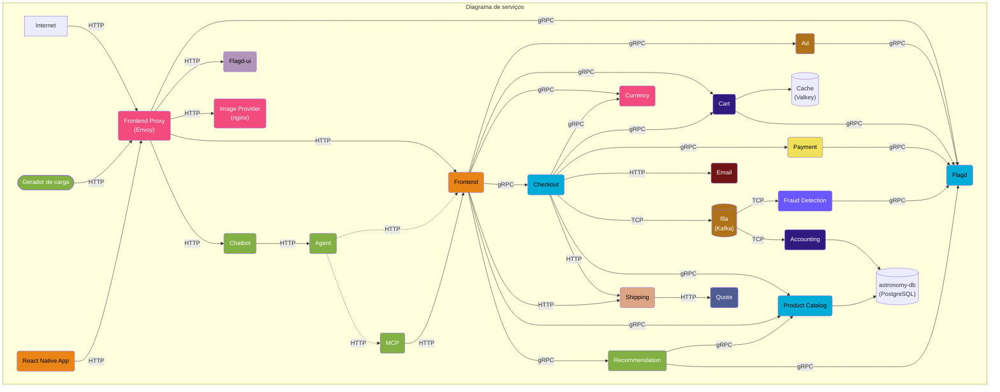
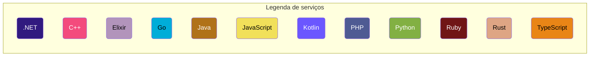
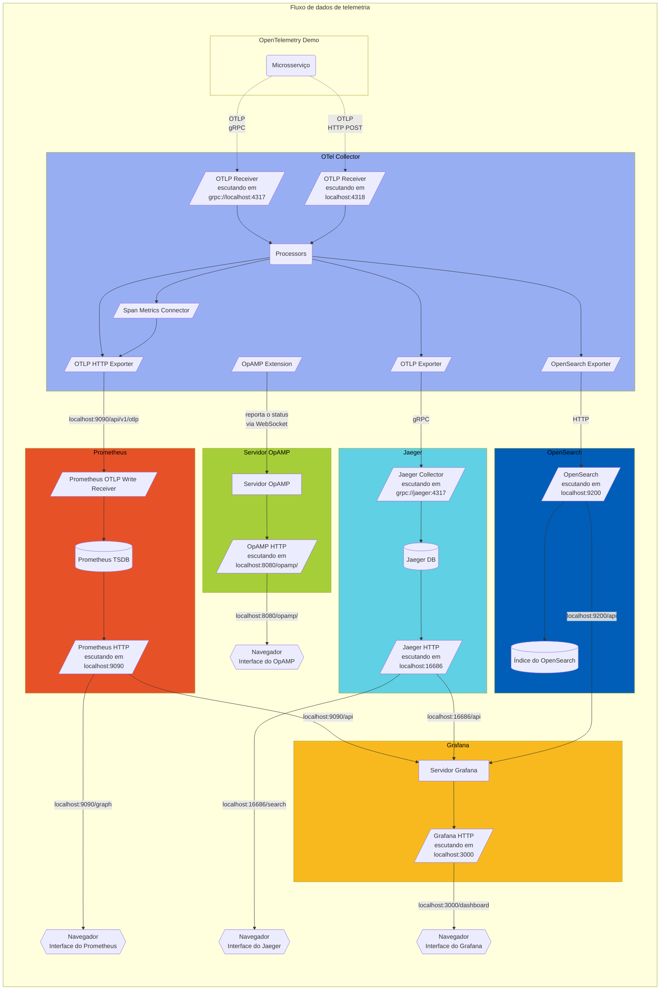

O **OpenTelemetry Demo** é composto por microsserviços escritos em diferentes
linguagens de programação que se comunicam entre si via gRPC e HTTP, além de um
gerador de carga que usa o [Locust](https://locust.io/) para simular tráfego de
usuários.

Acesse estes links para ver o estado atual da instrumentação de
[logs](/docs/demo/telemetry-features/log-coverage/),
[métricas](/docs/demo/telemetry-features/metric-coverage/) e
[traces](/docs/demo/telemetry-features/trace-coverage/) das aplicações do demo.

O Collector é configurado no arquivo
[otelcol-config.yml](https://github.com/open-telemetry/opentelemetry-demo/blob/main/src/otel-collector/otelcol-config.yml),
onde exporters alternativos podem ser configurados.

Ao executar com a pilha de observabilidade, o Collector também se conecta ao
servidor OpAMP do demo por meio da
[extensão OpAMP](https://github.com/open-telemetry/opentelemetry-collector-contrib/tree/main/extension/opampextension)
e reporta sua integridade, versão, atributos e configuração efetiva. Abra a
interface do OpAMP em <http://localhost:8080/opamp/> e selecione a instância do
Collector para ver o status reportado.

As **definições de Protocol Buffers** estão no diretório `/pb/`.
