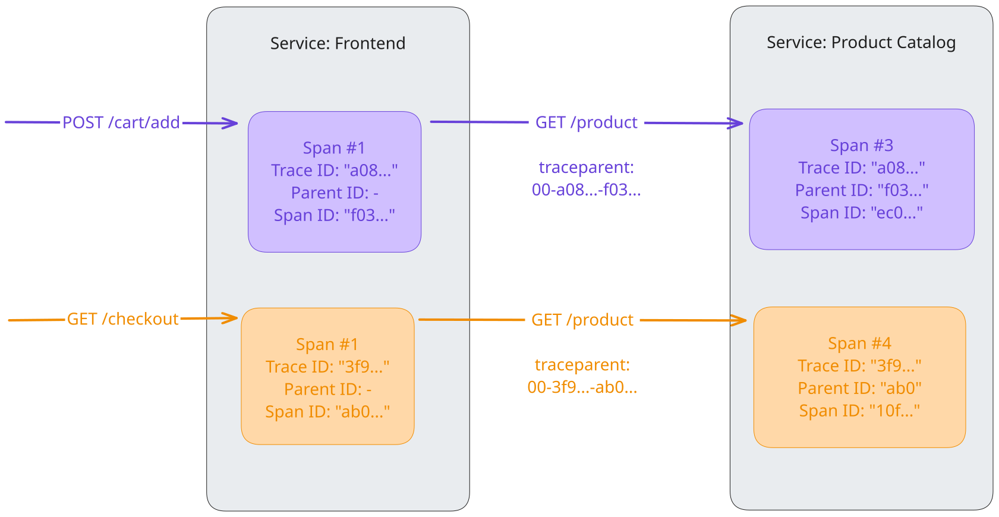

Cu propagarea contextului, [semnalele](../signals/)
([urmele](../signals/traces/), [metricile](../signals/metrics/), și
[log-urile](../signals/logs/)) pot fi corelate între ele, indiferent de unde
sunt generate. Deși nu se limitează la urmărire, propagarea contextului permite
[urmelor](../signals/traces/) să construiască informații uzuale despre un sistem
prin intermediul unor servicii distribuite arbitrar peste limitele proceselor și
rețelelor.

Pentru a înțelege propagarea contextului, ai nevoie să înțelegi două concepte
separate: contextul și propagarea.

## Context

Contextul este un obiect care conține informațiile necesare serviciului de
trimitere și de primire sau a
[unității de execuție](/docs/specs/otel/glossary/#execution-unit), pentru a
corela un semnal cu altul.

Când Serviciul A apelează Serviciul B, Serviciul A include un ID de urmărire și
un ID de interval ca parte a contextului. Serviciul B utilizează aceste valori
pentru a crea un nou interval care aparține aceleiași urmăriri, setând
intervalul din Serviciul A ca părinte al său. Acest lucru face posibilă
urmărirea fluxului complet al unei solicitări peste limitele serviciilor.

## Propagare

Propagarea este mecanismul care mută contextul între servicii și procese. Acesta
serializează și deserializează obiectul context și oferă informațiile relevante
ce vor fi propagate de la un serviciu la altul.

Propagarea este gestionată de obicei de librăriile de instrumentare și este
transparentă pentru utilizator. În situația în care ai nevoie să propagi manual
contextul, poți utilizata
[API-ul Propagators](/docs/specs/otel/context/api-propagators/).

OpenTelemetry întreține mai mulți propagatori oficiali. Propagatorul implicit
utilizează anteturile specificate de specificația
[W3C TraceContext](https://www.w3.org/TR/trace-context/).

## Exemplu

Un serviciu numit „Frontend”, care pune la dispoziție diferite puncte finale
HTTP, precum „POST /cart/add” și „GET /checkout/”, accesează un serviciu din
aval, „Product Catalog”, prin intermediul unui punct final HTTP „GET /product”,
pentru a primi detalii despre produsele pe care un utilizator dorește să le
adauge în coș sau care fac parte din procesul de finalizare a comenzii. Pentru a
înțelege activitățile din serviciul „Product Catalog” în contextul solicitărilor
provenite de la „Frontend”, contextul (aici: ID-ul de urmărire și ID-ul de
interval ca „ID părinte”) este propagat folosind antetul „traceparent”, așa cum
este definit în specificația W3C TraceContext. Aceasta înseamnă că ID-urile sunt
încorporate în câmpurile antetului:

```text
<version>-<trace-id>-<parent-id>-<trace-flags>
```

De example:

```text
00-a0892f3577b34da6a3ce929d0e0e4736-f03067aa0ba902b7-01
```

### Urme

După cum s-a menționat, propagarea contextului permite urmelor să construiască
informații cauzale între servicii. În acest exemplu, cele două apeluri către
punctul final HTTP `GET /product` al serviciului `Product Catalog` pot fi
corelate cu apelurile lor din amonte din serviciul `Frontend`, prin extragerea
contextului la distanță din antetul `traceparent` și injectarea acestuia în
contextul local pentru a seta ID-ul urmei și ID-ul părintelui. Astfel, într-un
[backend](/ecosystem/vendors) precum [Jaeger](https://jaegertracing.io) este
posibil să se vadă cele două cereri ca segmente ale unei singure urme.



### Jurnale

SDK-urile OpenTelemetry pot corela automat jurnalele cu trasele. Acest lucru
înseamnă că pot insera informații de context (ID-ul urmei, ID-ul intervalului)
într-o înregistrare de jurnal. Acest lucru nu numai că îți permite să
vizualizezi jurnalele în contextul urmei și al intervalului cărora le aparțin,
dar îți permite, de asemenea, să vizualizezi jurnalele care fac parte din
același context, chiar și dincolo de limitele serviciilor sau ale unităților de
execuție.

### Metrici

În cazul metricilor, propagarea contextului îți permite să agregi măsurătorile
din acel context. De exemplu, în loc să analizezi doar timpul de răspuns al
tuturor cererilor `GET /product`, poți obține, de asemenea, metrici pentru
combinațiile `POST /cart/add > GET /product` și `GET /checkout < GET /product`.

| Nume                            | Apeluri pe secundă | Timp mediu de răspuns |
| ------------------------------- | ------------------ | --------------------- |
| `* > GET /product`              | 370                | 300 ms                |
| `POST /card/add > GET /product` | 330                | 130 ms                |
| `GET /checkout > GET /product`  | 40                 | 1703 ms               |

## Propagarea contextului personalizat

În majoritatea cazurilor de utilizare, vei găsi
[biblioteci de instrumentare sau instrumentarea bibliotecilor native](/docs/concepts/instrumentation/libraries/)
care se ocupă de propagarea contextului în locul tău. În unele cazuri, un astfel
de suport nu este disponibil și dorești să creezi acest suport singur. Pentru a
face acest lucru, trebuie să utilizezi API-ul Propagators menționat anterior:

- Din partea expeditorului, contextul este
  [injectat](/docs/specs/otel/context/api-propagators/#inject) în purtător, de
  exemplu, în anteturile unei cereri HTTP. În alte cazuri, trebuie să găsești un
  loc în care să puteți stoca metadatele pentru cererea ta.
- La primire, contextul este
  [extras](/docs/specs/otel/context/api-propagators/#extract) din purtător. Din
  nou, în cazul HTTP, acesta este preluat din antete. În alte cazuri, alegi
  locul pe care l-ai selectat la expeditor pentru a salva contextul.

Reține că este posibilă propagarea contextului în protocoale care nu dispun de
un câmp dedicat pentru metadate, dar trebuie să te asiguri că, la recepție,
acestea sunt extrase și eliminate înainte ca datele să fie procesate; în caz
contrar, poți genera un comportament nedefinit.

Pentru următoarele limbaje există un tutorial pas-cu-pas pentru propagarea
personalizată a contextului:

- [Erlang](/docs/languages/erlang/propagation/#manual-context-propagation)
- [JavaScript](/docs/languages/js/propagation/#manual-context-propagation)
- [PHP](/docs/languages/php/propagation/#manual-context-propagation)
- [Python](/docs/languages/python/propagation/#manual-context-propagation)

## Cele mai bune practici în materie de securitate

Propagarea implică trimiterea și primirea de date dincolo de limitele
serviciilor, ceea ce poate avea implicații asupra securității.

### Servicii externe

Atunci când serviciul tău interacționează cu servicii externe (servicii pe care
nu le deții sau în care nu ai încredere), ia în considerare următoarele:

- **Contextul primit**: Fii precaut atunci când accepți context din surse
  externe . Actorii malițioși ar putea trimite antete de urmărire falsificate
  pentru a manipula datele de urmărire sau pentru a exploata eventual
  vulnerabilități în procesul de analiză a contextului. S-ar putea să dorești să
  ignori sau să sanitizezi contextul primit din surse străine.
- **Contextul trimis**: Fii atent la ceea ce transmiți către serviciile externe.
  ID-urile interne de urmărire, ID-urile de interval sau elementele de bagaj ar
  putea dezvălui informații sensibile despre arhitectura internă sau logica de
  afaceri. S-ar putea să dorești să configurezi propagatoarele astfel încât să
  nu trimită context către puncte finale externe sau publice.

### Bagaj

[Bagajul](../signals/baggage/) vă permite să transmiteți perechi cheie-valoare
arbitrare. Deoarece aceste date sunt transmise dincolo de limitele serviciului,
evită să incluzi informații sensibile (cum ar fi datele de autentificare ale
utilizatorilor, cheile API sau informațiile de identificare personală) în Bagaj,
deoarece acestea ar putea fi înregistrate sau trimise către servicii din aval
care nu sunt de încredere.

## Suport în SDK-urile de limbaj

Pentru implementările specifice fiecărui limbaj ale API-ului și SDK-ului
OpenTelemetry, vei găsi detalii privind suportul pentru propagarea contextului
în paginile de documentație corespunzătoare:

- [C++](/docs/languages/cpp/instrumentation/#context-propagation)
- .NET
- [Erlang](/docs/languages/erlang/propagation/)
- [Go](/docs/languages/go/instrumentation/#propagators-and-context)
- [Java](/docs/languages/java/api/#context-api)
- [JavaScript](/docs/languages/js/propagation/)
- [PHP](/docs/languages/php/propagation/)
- [Python](/docs/languages/python/propagation/)
- [Ruby](/docs/languages/ruby/instrumentation/#context-propagation)
- Rust
- Swift

> [!IMPORTANT] Se caută ajutor
>
> Pentru limbajele .NET, Rust și Swift, lipsește documentația specifică fiecărui
> limbaj referitoare la propagarea contextului. Dacă ai cunoștințe în vreunul
> dintre aceste limbaje și ești interesat să ne ajuți,
> [află cum poți contribui](/docs/contributing/)!

## Specificații

Pentru mai multe informații despre propagarea contextului, consultați
[Specificația contextului](/docs/specs/otel/context/).
