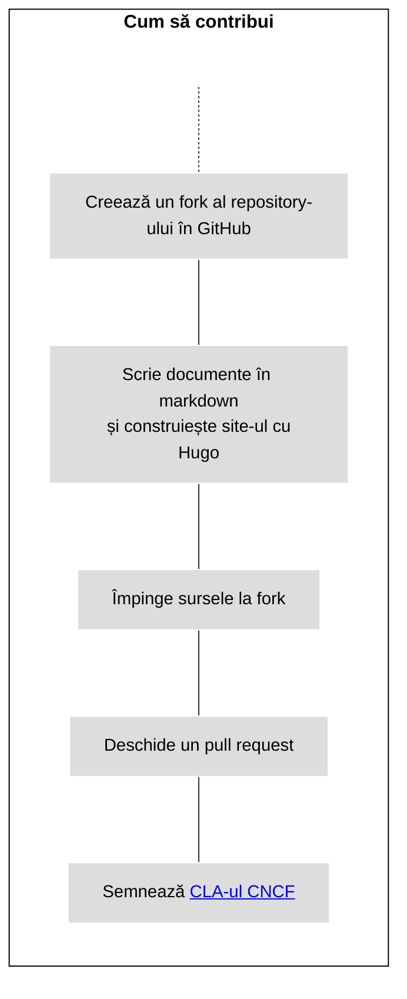
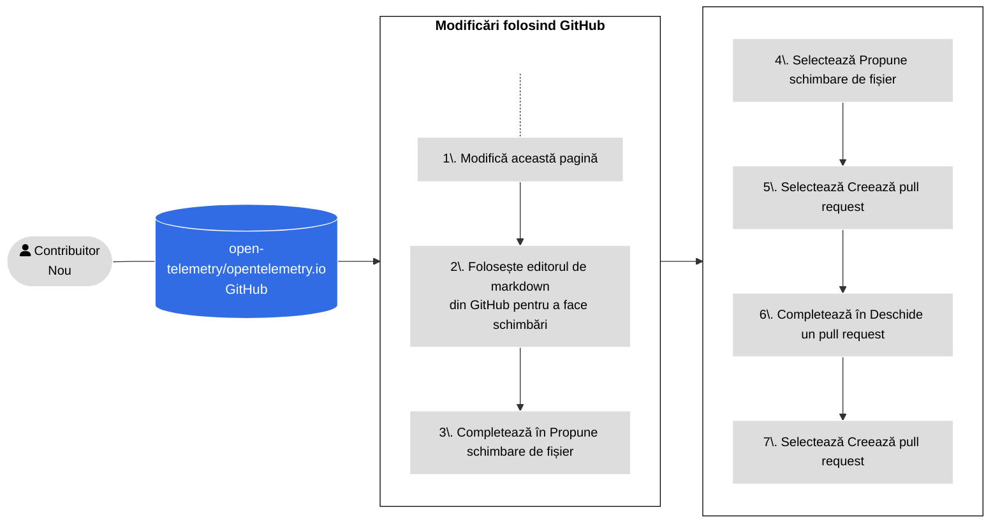
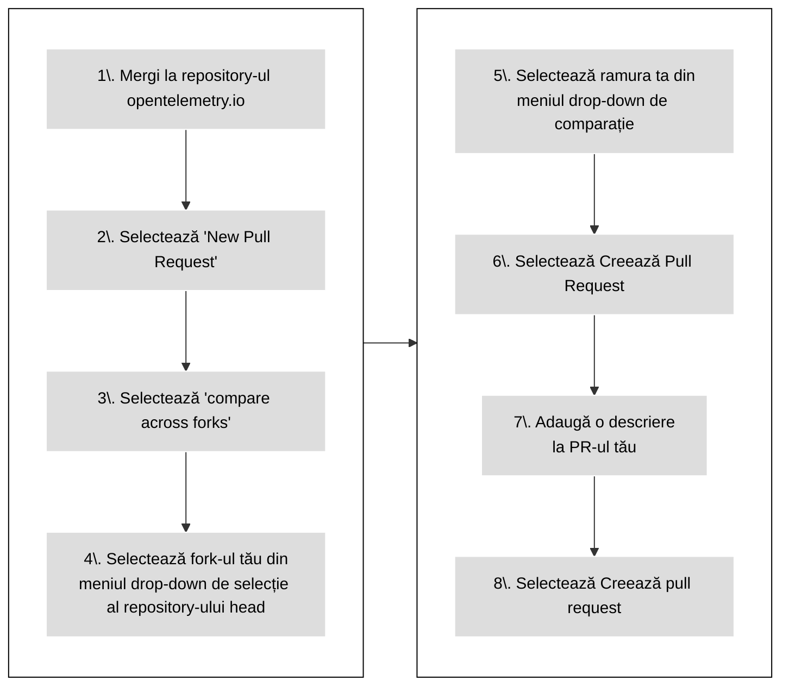

Pentru a contribui cu o nouă documentație sau pentru îmbunătățirea uneia
existente, trimite un [pull request][PR] (PR)

- Dacă schimbarea ta este mică, sau ești nefamiliarizat cu [Git][], vezi cum se
  [Folosește GitHub](#changes-using-github) pentru a învăța cum să editezi o
  pagină.
- Altfel, vezi cum se [Lucreză de pe un fork local](#fork-the-repo) pentru a
  învăța cum să faci schimbări în mediul tău local de dezvoltare.

## Politica de contribuție folosind IA generativă {#using-ai}

> [!WARNING] **Contribuitori noi** atenție!
>
> Dacă ești un [contribuitor nou][first-time contributor], te rugăm să ții cont
> de următoarele:
>
> Primele 3 contribuții către repository-ul nostru trebuie în principal să fie
> scrise de oameni, fiind permisă doar o asistență minoră din partea
> inteligenței artificiale.
> ([AIL1](https://danielmiessler.com/blog/ai-influence-level-ail)). Asta
> înseamnă că tot codul tău ar trebui scris de mână, dar IA-ul ar putea ajuta cu
> completări de cod, formatare, linting și urmărirea bunelor practici.
> Descrierea PR-ului tău trebuie fie în întregime scrisă de un om, fără vreo
> implicare din partea IA-ului (AIL0).
>
> Bineînțeles, poți folosi unelte de IA pentru a adresa întrebări și pentru a
> învăța despre repository-ul nostru, proiectul nostru, cum să contribui și multe
> altele.
>
> Am implementat această cerință pentru a te ajuta să înveți în timp ce
> contribui și pentru a ajuta administratorii și aprobatorii să-și protejeze
> timpul și capacitatea de lucru, care reprezintă o resursă limitată.
>
> Administratorii pot face o excepție, când contribuția ta este "drive-by" și
> poate fi adăugată fără prea mult efort adițional din partea lor.

IA generativă este permisă, dar **tu ești responsabil** pentru **revizuirea și
_validarea_** întregului conținut generat de IA &mdash; Dacă nu-l înțelegi, nu-l
trimite!

Pentru detalii, vezi [Politica de contribuție folosind IA
generativă][Generative AI Contribution Policy].

[first-time contributor]: ../#first-time-contributing
[Generative AI Contribution Policy]:
  https://github.com/open-telemetry/community/blob/main/policies/genai.md

## Cum să contribui {#how-to-contribute}

Figura următoare ilustrează cum să contribui cu documentație nouă.



_Figura 1. Contribuții cu conținut nou._

> [!TIP]
>
> Setează statusul pull request-ului tău la **Draft** pentru a înștiința
> administratorii că respectivul conținut nu este încă gata pentru revizuire.
> Administratorii pot în continuare să lase comentarii sau revizuiri, deși nu
> vor revizui conținutul în întregime până când nu elimini statutul de draft.

## Utilizarea GitHub {#changes-using-github}

### Modifică și trimite schimbări din browser-ul tău {#page-edit-from-browser}

Dacă nu ești foarte experimentat cu fluxurile de lucru cu Git, aici se regăsește
o metodă mai ușoară de pregătire și deschidere a unui nou pull request (PR).
Figura 2 ilustrează pașii și detaliile urmează.



_Figura 2. Pașii pentru deschiderea unui PR folosind GitHub._

1. Pe pagina unde vezi issue-ul, selectează opțiunea **Editează această pagină**
   din panoul de navigare din partea dreaptă.

1. Dacă nu ești un membru al proiectului, GitHub oferă opțiunea de creare a unui
   fork al repository-ului. Selectează **Fork this repository**.

1. Efectuează schimbările în editorul din GitHub.

1. Completează formularul **Propune schimbare de fișier**.

1. Selectează **Propune schimbare de fișier**.

1. Selectează **Creează pull request**.

1. Va apărea ecranul **Deschide un pull request**. Descrierea ta îi ajută pe cei
   ce revizuiesc să înțeleagă schimbările tale.

1. Selectează **Creează pull request**.

Înainte de a îmbina un pull request, membrii comunității OpenTelemetry îl
revizuiesc și-l aprobă.

Dacă un revizuitor solicită să faci modificări:

1. Du-te la tab-ul **Fișiere schimbate**.
1. Selectează iconița creion (de editare) în oricare fișier schimbat din pull
   request.
1. Aplică schimbările cerute. Dacă există o sugestie de cod, aplic-o.
1. Trimite schimbările.

Când revizuirea este completă, un revizuitor va adăuga schimbările din PR-ul
tău, care se vor putea vedea câteva minute mai târziu.

### Rezolvarea problemelor semnalate de verificările PR-ului {#fixing-prs-in-github}

După ce ai trimis un PR, GitHub rulează niște verificări ale build-ului. Anumite
verificări ce eșuează, precum probleme de formatare, pot fi rezolvate automat.

Adaugă următorul comentariu în PR-ul tău:

```text
/fix
```

Acesta va declanșa ca bot-ul OpenTelemetry să încerce să rezolve problemele de
build. Bot-ul răspunde cu un comentariu despre progres care face referire la
comanda de rezolvare, apoi actualizează același comentariu cu rezultatul -
fiecare comandă de rezolvare pe care o emiți primește propriul comentariu de la
bot. Sau poți emite una dintre următoarele comenzi de rezolvare pentru a trata o
problemă specifică:

```text
/fix:code-excerpts
/fix:dict
/fix:expired
/fix:filenames
/fix:format
/fix:i18n
/fix:l10n
/fix:markdown
/fix:refcache
/fix:submodule
/fix:text
```

Comanda de rezolvare trebuie să fie prima linie a comentariului tău; poți adăuga
text explicativ în liniile ce urmează. Emiterea unei noi comenzi de rezolvare în
timp ce una rulează deja o anulează pe cea ce rulează astfel că cea mai recentă
comandă câștigă; atunci când se poate, comentariul bot-ului asociat acțiunii
anulate este actualizat pentru a indica anularea.

> [!TIP] Pro tip
>
> Poți de asemenea să rulezi comenzi `fix` local. Pentru lista completă de
> comenzi de rezolvare, rulează `npm run -s '_list:fix:*'`.

## Dezvoltare pe mediul local {#fork-the-repo}

Dacă ești mai experimentat cu Git sau dacă schimbările tale sunt mai mari decât
câteva linii, lucrează de pe un fork local.

Asigură-te că ai [`git` instalat][`git` installed] pe calculatorul tău. Poți de
asemenea să folosești o interfață pentru Git.

Figura 3 arată pașii de urmat atunci când lucrezi de pe un fork local. Detaliile
pentru fiecare pas urmează.


_Figura 3. Lucrul de pe un fork local pentru a aplica modificările._

### Fă un fork al repository-ului

1. Navighează la repository-ul
   [`opentelemetry.io`](https://github.com/open-telemetry/opentelemetry.io/).
1. Selectează **Fork**.

### Clonează și setează upstream-ul

1. Într-o fereastră de terminal, clonează fork-ul tău și instalează dependențele
   necesare:

   ```shell
   git clone git@github.com:<utilizatorul_tau_github>/opentelemetry.io.git
   cd opentelemetry.io
   npm install
   ```

1. Setează repository-ul `open-telemetry/opentelemetry.io` ca `upstream`-ul
   remote:

   ```shell
   git remote add upstream https://github.com/open-telemetry/opentelemetry.io.git
   ```

1. Confirmă repertoriile pentru `origin` și `upstream`:

   ```shell
   git remote -v
   ```

   Rezultatul este similar cu:

   ```none
   origin	git@github.com:<utilizatorul_tau_github>/opentelemetry.io.git (fetch)
   origin	git@github.com:<utilizatorul_tau_github>/opentelemetry.io.git (push)
   upstream	https://github.com/open-telemetry/opentelemetry.io.git (fetch)
   upstream	https://github.com/open-telemetry/opentelemetry.io.git (push)
   ```

1. Preia commit-uri de pe ramura `origin/main` a fork-ului și de pe
   `upstream/main` al `open-telemetry/opentelemetry.io`:

   ```shell
   git fetch origin
   git fetch upstream
   ```

   Acest lucru te asigură că repository-ul tău local este la zi înainte să începi
   să faci modificări. Împinge schimbările de pe upstream la origin regulat
   pentru a păstra fork-ul sincronizat cu upstream-ul

### Creează o ramură

1. Creează o ramură. Acest exemplu presupune că ramura de bază este
   `upstream/main`:

   ```shell
   git checkout -b <ramura_mea_noua> upstream/main
   ```

1. Fă schimbările tale folosind un editor de cod sau text.

În orice moment, folosește comanda `git status` pentru a vedea ce fișiere ai
modificat.

### Trimite schimbările tale

Când ești gata să trimiți un pull request, urcă schimbările tale.

1. În repository-ul tău local, verifică ce fișiere trebuie să urci:

   ```shell
   git status
   ```

   Rezultatul este similar cu:

   ```none
   On branch <ramura_mea_noua>
   Your branch is up to date with 'origin/<ramura_mea_noua>'.

   Changes not staged for commit:
   (use "git add <file>..." to update what will be committed)
   (use "git checkout -- <file>..." to discard changes in working directory)

   modified:   content/en/docs/file-you-are-editing.md

   no changes added to commit (use "git add" and/or "git commit -a")
   ```

1. Adaugă fișierele listate sub **Changes not staged for commit** la setul de
   schimbări:

   ```shell
   git add <your_file_name>
   ```

   Repetă asta pentru fiecare fișier.

1. După ce ai adăugat toate fișierele, creează un commit:

   ```shell
   git commit -m "Mesajul tău de commit"
   ```

1. Împinge ramura ta locală cu commit-ul nou la fork-ul tău:

   ```shell
   git push origin <ramura_mea_noua>
   ```

1. Odată ce schimbările sunt trimise, GitHub te înștiințează că poți crea un PR.

### Deschide un PR nou {#open-a-pr}

Figura 4 arată pașii pentru a deschide un PR din fork-ul tău pe
[opentelemetry.io](https://github.com/open-telemetry/opentelemetry.io).



_Figura 4. Pașii pentru a deschide un PR din fork-ul tău la_
[opentelemetry.io](https://github.com/open-telemetry/opentelemetry.io).

1. Într-un browser web, navighează la repository-ul
   [`opentelemetry.io`](https://github.com/open-telemetry/opentelemetry.io).
1. Selectează **New Pull Request**.
1. Selectează **compare across forks**.
1. Din meniul drop-down pentru **repository-ul head** , selectează fork-ul tău.
1. Din meniul drop-down **compare**, selectează ramura ta.
1. Selectează **Creează Pull Request**.
1. Adaugă o descriere pentru pull request-ul tău:
   - **Title** (50 de caractere sau mai puțin): Creează un rezumat al intenției
     schimbărilor.
   - **Description**: Descrie schimbările în detaliu.
     - Dacă există un GitHub issue de care se leagă, include `Fixes #12345` sau
       `Closes #12345` în descriere astfel ca automatizările din GitHub să
       închidă issue-ul menționat după ce PR-ul a fost unit. Dacă există și alte
       PR-uri conexe, menționează‑le și pe acelea.
     - Dacă dorești sfaturi despre ceva specific, include în descriere orice
       întrebare la care ai vrea ca revizuitorii să se gândească.

1. Selectează butonul **Creează pull request**.

Pull request-ul tău este disponibil în secțiunea
[Pull requests](https://github.com/open-telemetry/opentelemetry.io/pulls).

După deschiderea unui PR, GitHub rulează teste automate and încearcă să lanseze
o previzualizare folosind [Netlify](https://www.netlify.com/).

- Dacă build-ul de Netlify eșuează, selectează **Details** pentru mai multe
  informații.
- Dacă build-ul de Netlify reușește, selectează **Details** pentru a deschide o
  versiune intermediară a website-ului OpenTelemetry cu schimbările tale
  aplicate. Așa verifică revizuitorii schimbările tale.

Și alte verificări pot eșua. Vezi
[lista cu toate verificările de PR](../pr-checks).

### Rezolvă problemele {#fix-issues}

Înainte să trimiți o schimbare la repertoriu, rulează următoarea comandă și (i)
remediază orice problemă semnalată, (ii) trimite orice fișier schimbat de către
script:

```sh
npm run test-and-fix
```

Pentru a testa și repara separat toate problemele din fișierele tale, rulează:

```sh
npm run test # Checks but does not update any files
npm run fix  # May update files
```

Pentru a lista toate script-urile NPM disponibile, rulează `npm run`. Vezi
[PR checks](../pr-checks) pentru mai multe informații despre verificările de
pull request și cum să repari erorile automat.

### Vizualizează schimbările tale {#preview-locally}

Vizualizează schimbările local înainte să le trimiți sau să deschizi un pull
request. O previzualizare îți permite să identifici erorile de build sau de
formatare Markdown.

Pentru a construi și servi site-ul pe mediul local folosind Hugo, rulează
următoarea comandă:

```shell
npm run serve
```

Navighează la <http://localhost:1313> în browser-ul tău web pentru a vedea
versiunea locală. Hugo monitorizează modificările și reconstruiește site-ul după
caz.

Pentru a opri instanța locală de Hugo, mergi înapoi în terminal și tastează
`Ctrl+C`, sau închide fereastra de terminal.

### Lansări ale site-ului și previzualizări din PR {#site-deploys-and-pr-previews}

Dacă trimiți un PR, Netlify [lansează o previzualizare][deploy preview] astfel
că poți revizui schimbările tale. Odată ce schimbările din PR-ul sunt trimise,
Netlify lansează versiunea actualizată a site-ului pe server-ul de producție.

> **Notă**: Previzualizările din PR includ _pagini draft_, dar build-urile de
> producție nu.

Pentru a vedea log-uri despre deploy și mai multe, vizitează [panoul][dashboard]
proiectului -- Necesită un login pe Netlify.

### Îndrumări pentru PR {#pr-guidelines}

Înainte ca schimbările dintr-un PR să fie integrate, uneori este necesar să se
treacă prin câteva iterații de revizuire-și-editare. Pentru a face acest proces
cât mai facil pentru noi cât și pentru tine, te rugăm să aderi la următoarele:

- Dacă PR-ul tău nu este un fix rapid, atunci **lucrează de pe un fork**: Apasă
  butonul [Fork](https://github.com/open-telemetry/opentelemetry.io/fork) din
  antetul repository-ului și clonează fork-ul local. Când ești gata, trimite un PR
  către repository-ul upstream.
- **Nu lucra pe ramura `main`** a fork-ului tău, creează o ramură specifică
  pentru PR.
- Asigură-te că administratorii
  [au dreptul să modifice schimbările din pull request-ul tău](https://docs.github.com/en/pull-requests/collaborating-with-pull-requests/working-with-forks/allowing-changes-to-a-pull-request-branch-created-from-a-fork).

### Schimbări de la revizuitori {#changes-from-reviewers}

Uneori revizuitorii trimit schimbări la pull request-ul tău. Înainte de a face
orice altă schimbare, preia acele schimbări.

1. Preia schimbări de pe fork-ul tău remote și aplică un rebase pe ramura ta de
   lucru:

   ```shell
   git fetch origin
   git rebase origin/<ramura-ta>
   ```

1. După rebase, trimite schimbările noi către fork-ul tău folosind force-push:

   ```shell
   git push --force-with-lease origin <ramura-ta>
   ```

Poți de asemenea să rezolvi din interfața GitHub conflictele datorate integrării
schimbărilor .

### Conflictele datorate integrării schimbărilor și rebase {#merge-conflicts-and-rebasing}

Dacă alt contribuitor trimite schimbări la același fișier în alt PR, poate
genera un conflict de integrare a schimbărilor. Trebuie să rezolvi toate aceste
conflicte în PR-ul tău.

1. Actualizează fork-ul tău și integrează schimbările în ramura ta locală
   folosind rebase:

   ```shell
   git fetch origin
   git rebase origin/<ramura-ta>
   ```

   Apoi trimite schimbările la fork-ul tău folosind force-push:

   ```shell
   git push --force-with-lease origin <ramura-ta>
   ```

1. Preia schimbările de pe ramura `upstream/main` a repository-ului
   `open-telemetry/opentelemetry.io` și integrează-le în ramura ta folosind
   rebase:

   ```shell
   git fetch upstream
   git rebase upstream/main
   ```

1. Inspectează rezultatele după rebase:

   ```shell
   git status
   ```

   Acest lucru duce la o serie de fișiere marcate ca fiind în conflict.

1. Deschide fiecare fișier în conflict și caută marcajele de conflict: `>>>`,
   `<<<`, și `===`. Rezolvă conflictele și apoi șterge marcajul de conflict.

   Pentru mai multe informații, vezi
   [Cum sunt prezentate conflictele](https://git-scm.com/docs/git-merge#_how_conflicts_are_presented).

1. Adaugă fișierele în setul de schimbări:

   ```shell
   git add <numele-fișierului>
   ```

1. Continuă rebase-ul:

   ```shell
   git rebase --continue
   ```

1. Repetă pașii 2 până la 5 după caz.

   După aplicarea tuturor schimbărilor, comanda `git status` arată că procesul
   de rebase este complet.

1. Trimite schimbările din ramura ta către fork-ul tău folosind force-push:

   ```shell
   git push --force-with-lease origin <ramura-ta>
   ```

   Pull request-ul nu va mai arăta vreun conflict.

### Cerințe pentru integrarea schimbărilor {#merge-requirements}

Schimbările din pull request sunt integrate atunci când sunt conforme cu
următoarele criterii:

- Toate revizuirile făcute de aprobatori, administratori, membri ai comitetului
  tehnic sau experți au statusul "Approved".
- Nici o conversație nerezolvată.
- Să fie aprobat de către cel puțin un aprobator.
- Nici o verificare de PR care să eșueze.
- Ramura PR-ului este la zi cu ramura de bază.
- Schimbările paginilor de documentație [nu acoperă
  traducerile][do not span locales].

[do not span locales]: ../localization/#prs-should-not-span-locales

> **Important**
>
> Nu te îngrijora prea mult despre verificările de PR care eșuează. Membrii
> comunității te vor ajuta să le rezolvi, fie oferindu-ți instrucțiuni despre
> cum să le repari, fie reparându-le pentru tine.

[dashboard]: https://app.netlify.com/sites/opentelemetry/overview
[deploy preview]:
  https://www.netlify.com/blog/2016/07/20/introducing-deploy-previews-in-netlify/
[Git]: https://docs.github.com/en/get-started/using-git/about-git
[`git` installed]: https://git-scm.com/book/en/v2/Getting-Started-Installing-Git
[PR]: https://docs.github.com/en/pull-requests
