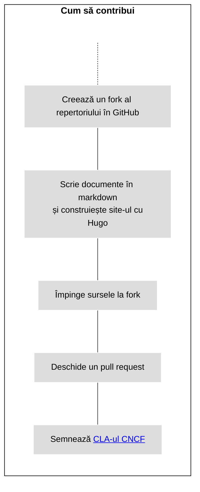
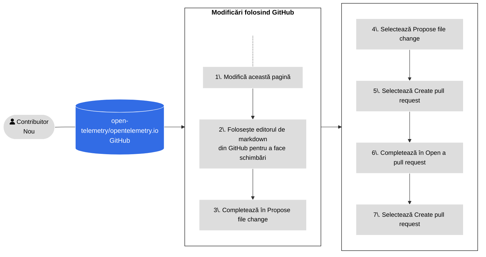
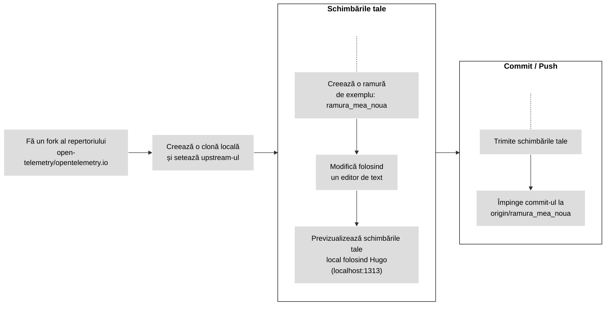
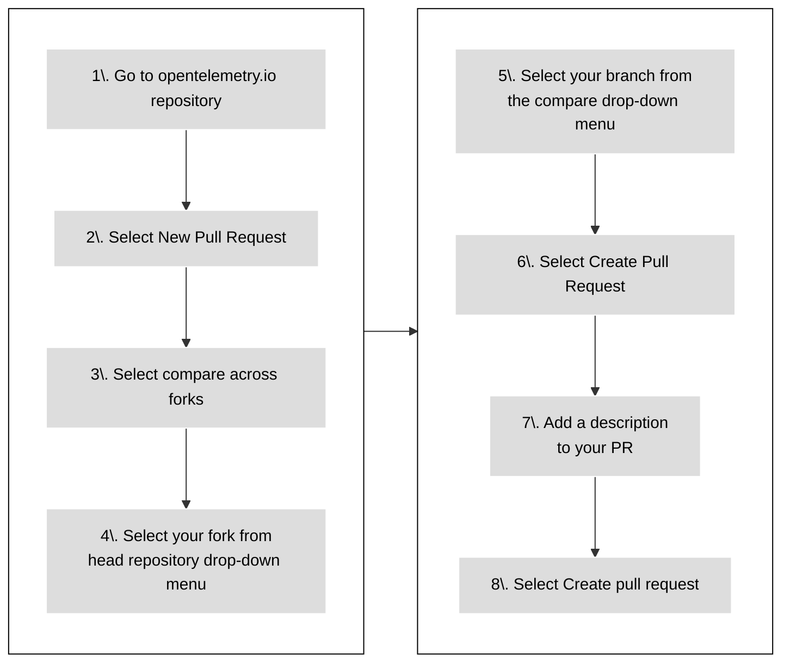

Pentru a contribui cu conținut sau să îmbunătățești documentația existentă,
trimite un [pull request][PR] (PR)

- Dacă schimbarea ta este mică, sau ești nefamiliarizat cu [Git][], vezi cum se
  [Folosește GitHub](#changes-using-github) pentru a învăța cum să editezi o
  pagină.
- Altfel, vezi cum se [Lucreză de pe un fork local](#fork-the-repo) pentru a
  învăța cum să faci schimbări în mediul tău local de dezvoltare.

## Generative AI contribution policy {#using-ai}

> [!WARNING] **Contribuitori noi** țineți cont!
>
> Dacă ești un [contribuitor nou][first-time contributor], te rog ia aminte:
>
> Primele 3 contribuții către repertoriul nostru trebuie în principal să fie
> scrise de oameni, permisă doar o asistență minoră din partea inteligenței
> artificiale. ([AIL1](https://danielmiessler.com/blog/ai-influence-level-ail)).
> Asta înseamnă că tot codul tău ar trebui scris de mână, dar IA-ul ar putea
> ajuta cu completări de cod, formatare, linting și urmărirea bunelor practici.
> Descrierea PR-ului tău trebuie fie în întregime scrisă de un om, fără vreo
> implicare din partea IA-ului (AIL0).
>
> Bineînțeles, poți folosi unelte de IA pentru a adresa întrebări și pentru a
> învăța despre repertoriul nostru, proiectul nostru, cum să contribui și multe
> altele.
>
> Am pus în aplicare această cerință pentru a te ajuta să înveți în timp ce
> contribui și pentru a ajuta întreținătorii și aprobatorii să-și protejeze
> timpul și capacitatea de lucru, care sunt o resursă limitată.
>
> Întreținătorii pot face o excepție, dacă este clar faptul că ce ai contribuit
> este "drive-by" și poate fi adăugat fără prea mult efort adițional din partea
> lor.

IA-ul generativ este permis, dar **tu ești responsabil** for **revizuirea și
_validarea_** întregului conținut generat de IA &mdash; Dacă nu-l înțelegi, nu-l
trimite!

Pentru detalii, vezi [Politica de contribuție folosind IA
generativ][Generative AI Contribution Policy].

[first-time contributor]: ../#first-time-contributing
[Generative AI Contribution Policy]:
  https://github.com/open-telemetry/community/blob/main/policies/genai.md

## Cum să contribui

Figura următoare ilustrează cum să contribui cu documentație nouă.



_Figura 1. Contribuții cu conținut nou._

> [!TIP]
>
> Setează statusul pull request-ului tău la **Draft** pentru a înștiința
> întreținătorii că respectivul conținut nu este încă gata pentru revizuire.
> Întreținătorii pot în continuare să lase comentarii sau revizuiri, deși nu vor
> revizui conținutul în întregime până când nu eliminați statutul de draft.

## Utilizarea GitHub {#changes-using-github}

### Modifică și trimite schimbări din browser-ul tău {#page-edit-from-browser}

Dacă nu ești foarte experimentat cu fluxurile de lucru cu Git, aici se regăsește
o metodă mai ușoară de pregătire și deschidere a unui nou pull request (PR).
Figura 2 ilustrează pașii și detaliile urmează.



_Figura 2. Pașii pentru deschiderea unui PR folosind GitHub._

1. Pe pagina unde vezi issue-ul, selectează opțiunea **Edit this page** din
   panoul de navigare din partea dreaptă.

2. Dacă nu ești un membru al proiectului, GitHub oferă opțiunea de creare a unui
   fork al repetoriului. Selectează **Fork this repository**.

3. Efectuează schimbările în editorul din GitHub.

4. Completează formularul **Propose file change**.

5. Selectează **Propose file change**.

6. Selectează **Create pull request**.

7. Va apărea ecranul **Open a pull request**. Descrierea ta îi ajută pe cei ce
   revizuiesc să înțeleagă schimbările tale

8. Selectează **Create pull request**.

Înainte de a îmbina un pull request, membrii comunității OpenTelemetry îl
revizuiesc și-l aprobă

Dacă un recenzent solicită să faci modificări:

1. Du-te la tab-ul **Files changed**.
2. Selectează iconița creion (de editare) în oricare fișier schimbat din pull
   request.
3. Aplică schimbările cerute. Dacă există o sugestie de cod, aplic-o.
4. Trimite schimbările.

Când revizuirea este completă, un recenzent va adăuga schimbările din PR-ul tău,
care se vor putea vedea câteva minute mai târziu.

### Rezolvarea problemelor semnalate de verificările PR-ului {#fixing-prs-in-github}

După ce ai trimis un PR, GitHub rulează niște verificări ale build-ului. Anumite
verificări ce eșuează, precum probleme de formatare, pot fi rezolvate automat.

Add the following comment to your PR: Adaugă următorul comentariu în PR-ul tău

```text
/fix
```

Acesta va declanșa ca bot-ul OpenTelemetry să încerce să rezolve problemele de
build. Bot-ul răspunde cu un comentariu despre progres care face referire la
comandata de rezolvare, apoi actualizează același comentariu cu rezultatul -
altfel că fiecare comandă de rezolvare pe care o emiți primește propriul
comentariu de la bot. Sau poți emite una dintre următoarele comenzi de rezolvare
pentru a trata o problemă specifică:

```text
/fix:code-excerpts
/fix:dict
/fix:expired
/fix:filenames
/fix:format
/fix:i18n
/fix:l10n
/fix:markdown
/fix:refcache
/fix:submodule
/fix:text
```

Comanda de rezolvare trebuie să fie prima line a comentariului tău; poți adăuga
text explicativ în liniile ce urmează. Emiterea unei noi comenzi de rezolvare în
timp ce una rulează deja o anulează pe cea ce rulează astfel că cea mai recentă
comandă câștigă; atunci când se poate, comentariul bot-ului asociat acțiunii
anulate este actualizat pentru a nota despre anulare.

> [!TIP] Pro tip
>
> Poți de asemenea să rulezi comenzi `fix` local. Pentru lista completă the
> comenzi de rezolvare, rulează `npm run -s '_list:fix:*'`.

## Dezvoltare pe mediul local {#fork-the-repo}

Dacă ești mai experimentat cu Git sau dacă schimbările tale sunt mai mare decât
câteva linii, lucrează de pe un fork local.

Asigură-te că ai [`git` instalat][`git` installed] pe calculatorul tău. Poți de
asemenea să folosești o interfață pentru Git.

Figura 3 arată pașii de urmat atunci când lucrezi de pe un fork local. Detaliile
pentru fiecare pas urmează.



_Figura 3. Lucrul de pe un fork local pentru a face schimbările tale._

### Fă un fork al repertoriului

1. Navighează la repertoriul
   [`opentelemetry.io`](https://github.com/open-telemetry/opentelemetry.io/).
2. Selectează **Fork**.

### Clonează și setează upstream-ul

1. Într-o fereastră de terminal, clonează fork-ul tău și instalează dependințele
   necesare:

   ```shell
   git clone git@github.com:<utilizatorul_tau_github>/opentelemetry.io.git
   cd opentelemetry.io
   npm install
   ```

2. Setează repertoriul `open-telemetry/opentelemetry.io` ca `upstream`-ul
   remote:

   ```shell
   git remote add upstream https://github.com/open-telemetry/opentelemetry.io.git
   ```

3. Confirmă repertoriile pentru `origin` și `upstream`:

   ```shell
   git remote -v
   ```

   Rezultatul este similar cu:

   ```none
   origin	git@github.com:<utilizatorul_tau_github>/opentelemetry.io.git (fetch)
   origin	git@github.com:<utilizatorul_tau_github>/opentelemetry.io.git (push)
   upstream	https://github.com/open-telemetry/opentelemetry.io.git (fetch)
   upstream	https://github.com/open-telemetry/opentelemetry.io.git (push)
   ```

4. Preia commit-uri de pe ramura `origin/main` a fork-ului și de pe
   `upstream/main` al `open-telemetry/opentelemetry.io`:

   ```shell
   git fetch origin
   git fetch upstream
   ```

   Acest lucru te asigură că repertoriul tău local este la zi înainte să începi
   să faci modificări. Împinge schimbările de pe upstream la origin regulat
   pentru a păstra fork-ul sincronizat cu upstream-ul

### Creează o ramură

1. Creează o ramură. Acest exemplu presupune că ramura de bază este
   `upstream/main`:

   ```shell
   git checkout -b <ramura_mea_noua> upstream/main
   ```

2. Fă schimbările tale folosind un editor de cod sau text.

La orice moment, folosește comanda `git status` pentru a vedea ce fișiere ai
modificat.

### Trimite schimbările tale

Când ești gata să trimiți un pull request, urcă schimbările tale.

1. În repertoriul tău local, verifică ce fișiere trebuie să urci:

   ```shell
   git status
   ```

   Rezultatul este similar cu:

   ```none
   On branch <ramura_mea_noua>
   Your branch is up to date with 'origin/<ramura_mea_noua>'.

   Changes not staged for commit:
   (use "git add <file>..." to update what will be committed)
   (use "git checkout -- <file>..." to discard changes in working directory)

   modified:   content/en/docs/file-you-are-editing.md

   no changes added to commit (use "git add" and/or "git commit -a")
   ```

2. Adaugă fișierele listate sub **Changes not staged for commit** la setul de
   schimbări:

   ```shell
   git add <your_file_name>
   ```

   Repetă asta pentru fiecare fișier.

3. După ce ai adăugat toate fișierele, creează un commit:

   ```shell
   git commit -m "Mesajul tău de commit"
   ```

4. Împinge ramura ta locală cu commit-ul nou la fork-ul tău:

   ```shell
   git push origin <ramura_mea_noua>
   ```

5. Odată ce schimbările sunt trimise, GitHub te înștiințează că poți creea un
   PR.

### Open a new PR {#open-a-pr}

Figure 4 shows the steps to open a PR from your fork to
[opentelemetry.io](https://github.com/open-telemetry/opentelemetry.io).



_Figure 4. Steps to open a PR from your fork to_
[opentelemetry.io](https://github.com/open-telemetry/opentelemetry.io).

1. In a web browser, go to the
   [`opentelemetry.io`](https://github.com/open-telemetry/opentelemetry.io)
   repository.
1. Select **New Pull Request**.
1. Select **compare across forks**.
1. From the **head repository** drop-down menu, select your fork.
1. From the **compare** drop-down menu, select your branch.
1. Select **Create Pull Request**.
1. Add a description for your pull request:
   - **Title** (50 characters or less): Summarize the intent of the change.
   - **Description**: Describe the change in more detail.
     - If there is a related GitHub issue, include `Fixes #12345` or
       `Closes #12345` in the description so that GitHub's automation closes the
       mentioned issue after merging the PR. If there are other related PRs,
       link those as well.
     - If you want advice on something specific, include any questions you'd
       like reviewers to think about in your description.

1. Select the **Create pull request** button.

Your pull request is available in
[Pull requests](https://github.com/open-telemetry/opentelemetry.io/pulls).

After opening a PR, GitHub runs automated tests and tries to deploy a preview
using [Netlify](https://www.netlify.com/).

- If the Netlify build fails, select **Details** for more information.
- If the Netlify build succeeds, select **Details** to open a staged version of
  the OpenTelemetry website with your changes applied. This is how reviewers
  check your changes.

Other checks might also fail. See the [list of all PR checks](../pr-checks).

### Fix issues {#fix-issues}

Before submitting a change to the repository, run the following command and (i)
address any reported issues, (ii) commit any files changed by the script:

```sh
npm run test-and-fix
```

To separately test and fix all issues with your files, run:

```sh
npm run test # Checks but does not update any files
npm run fix  # May update files
```

To list available NPM scripts, run `npm run`. See [PR checks](../pr-checks) for
more information on pull request checks and how to fix errors automatically.

### Preview your changes {#preview-locally}

Preview your changes locally before pushing them or opening a pull request. A
preview lets you catch build errors or Markdown formatting problems.

To build and serve the site locally with Hugo, run the following command:

```shell
npm run serve
```

Navigate to <http://localhost:1313> in your web browser to see the local
preview. Hugo watches for changes and rebuilds the site as needed.

To stop the local Hugo instance, go back to the terminal and type `Ctrl+C`, or
close the terminal window.

### Site deploys and PR previews

If you submit a PR, Netlify creates a [deploy preview][] so that you can review
your changes. Once your PR is merged, Netlify deploys the updated site to the
production server.

> **Note**: PR previews include _draft pages_, but production builds do not.

To see deploy logs and more, visit the project's [dashboard][] -- Netlify login
required.

### PR guidelines

Before a PR gets merged, it sometimes requires a few iterations of
review-and-edit. To help us and yourself make this process as easy as possible,
we ask that you adhere to the following:

- If your PR isn't a quick fix, then **work from a fork**: Click the
  [Fork](https://github.com/open-telemetry/opentelemetry.io/fork) button at the
  top of the repository and clone the fork locally. When you are ready, raise a
  PR with the upstream repository.
- **Do not work from the `main`** branch of your fork, but create a PR-specific
  branch.
- Ensure that maintainers are
  [allowed to apply changes to your pull request](https://docs.github.com/en/pull-requests/collaborating-with-pull-requests/working-with-forks/allowing-changes-to-a-pull-request-branch-created-from-a-fork).

### Changes from reviewers

Sometimes reviewers commit to your pull request. Before making any other
changes, fetch those commits.

1. Fetch commits from your remote fork and rebase your working branch:

   ```shell
   git fetch origin
   git rebase origin/<your-branch-name>
   ```

1. After rebasing, force-push new changes to your fork:

   ```shell
   git push --force-with-lease origin <your-branch-name>
   ```

You can also solve merge conflicts from the GitHub UI.

### Merge conflicts and rebasing

If another contributor commits changes to the same file in another PR, it can
create a merge conflict. You must resolve all merge conflicts in your PR.

1. Update your fork and rebase your local branch:

   ```shell
   git fetch origin
   git rebase origin/<your-branch-name>
   ```

   Then force-push the changes to your fork:

   ```shell
   git push --force-with-lease origin <your-branch-name>
   ```

1. Fetch changes from `open-telemetry/opentelemetry.io`'s `upstream/main` and
   rebase your branch:

   ```shell
   git fetch upstream
   git rebase upstream/main
   ```

1. Inspect the results of the rebase:

   ```shell
   git status
   ```

   This results in a number of files marked as conflicted.

1. Open each conflicted file and look for the conflict markers: `>>>`, `<<<`,
   and `===`. Resolve the conflict and delete the conflict marker.

   For more information, see
   [How conflicts are presented](https://git-scm.com/docs/git-merge#_how_conflicts_are_presented).

1. Add the files to the changeset:

   ```shell
   git add <filename>
   ```

1. Continue the rebase:

   ```shell
   git rebase --continue
   ```

1. Repeat steps 2 to 5 as needed.

   After applying all commits, the `git status` command shows that the rebase is
   complete.

1. Force-push the branch to your fork:

   ```shell
   git push --force-with-lease origin <your-branch-name>
   ```

   The pull request no longer shows any conflicts.

### Merge requirements

Pull requests are merged when they comply with the following criteria:

- All reviews by approvers, maintainers, technical committee members, or subject
  matter experts have the status "Approved".
- No unresolved conversations.
- Approved by at least one approver.
- No failing PR checks.
- PR branch is up-to-date with the base branch.
- Doc page changes [do not span locales][].

[do not span locales]: ../localization/#prs-should-not-span-locales

> **Important**
>
> Do not worry too much about failing PR checks. Community members will help you
> to get them fixed, by either providing you with instructions how to fix them
> or by fixing them on your behalf.

[dashboard]: https://app.netlify.com/sites/opentelemetry/overview
[deploy preview]:
  https://www.netlify.com/blog/2016/07/20/introducing-deploy-previews-in-netlify/
[Git]: https://docs.github.com/en/get-started/using-git/about-git
[`git` installed]: https://git-scm.com/book/en/v2/Getting-Started-Installing-Git
[PR]: https://docs.github.com/en/pull-requests
