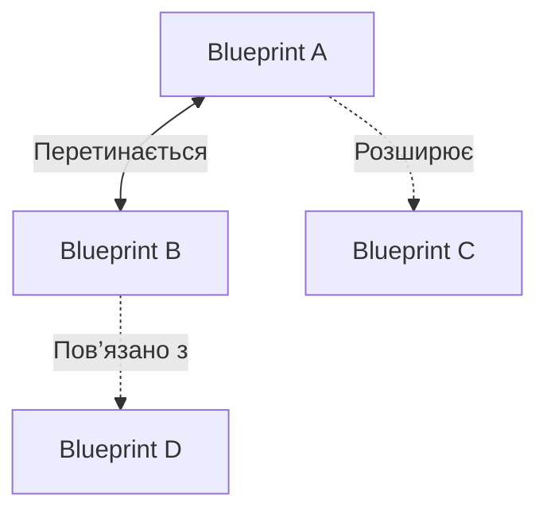
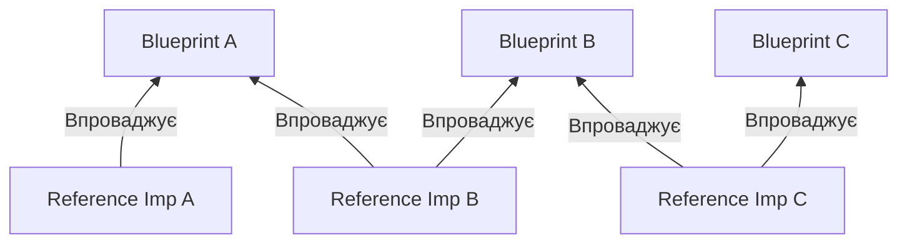

Користувачам, які впроваджують OpenTelemetry, нерідко доводиться на певному етапі задаватися питанням: _«Чому все це так складно?»_. Повне впровадження зазвичай вимагає розуміння різних способів налаштування SDK, розгортання декількох Колекторів, конвеєрів даних, бібліотек інструментування, реєстрів семантичних домовленостей, API для ручного інструментування різними мовами програмування та багатьох інших складових.

Ці складові також не працюють ізольовано. Вони повинні добре взаємодіяти як частина консолідованого рішення для опису програмних систем організації за допомогою стандартної високоякісної телеметрії. Якщо цього не зробити, існує ризик зіткнутися саме з тією проблемою, яку OpenTelemetry покликана вирішити: розрізнена телеметрія з різними семантичними домовленостями, що використовуються у всьому стеку, відсутність контексту між сервісами та сигналами, надмірно великі обсяги даних... Загалом, телеметрія низької якості — це протилежність того, що нам потрібно.

По мірі розвитку та стабілізації проєкту, а також з ростом числа користувачів, які впроваджують OpenTelemetry у великих виробничих середовищах, ми постійно чули один і той самий відгук: користувачі хочуть мати чіткий, конкретний спосіб "впровадження OpenTelemetry" (що саме це означає — залишається на розсуд кожного), як рекомендовано проєктом та його підтримувачами. Проєкти хочуть слідувати набору кроків для налаштування компонентів, які _їм_ потрібні для вирішення _їхніх_ завдань спостережуваності у _найпростіший_ спосіб, і не більше.

Ви говорили, і ми слухали. Ми раді представити нову ініціативу, яку очолює End User SIG у співпраці з Developer Experience SIG — [Схеми та еталонні реалізації][2].

## Джерело складності та потреба у схемах {#the-source-of-complexity-and-the-need-for-blueprints}

Повернемося до того першого питання: _«Чому все це так складно?»_. Використовуючи терміни, описані Фредом Бруксом у його статті [_No Silver Bullet—Essence and Accident in Software Engineering_][3], написаній ще в 1986 році, складність впровадження OTel має два аспекти: _суттєву_ та, частіше за все, _випадкову_.

### Суттєва складність {#essential-complexity}

Суттєва частина складності OTel, яка є природною для його дизайну, здебільшого повʼязана з його широким охопленням та міжгалузевим характером. OpenTelemetry зачіпає майже всі рівні стеку: від клієнтської сторони (тобто вебоглядачів та мобільних пристроїв) до застосунків, Kubernetes, інфраструктури, баз даних тощо. Наша документація чудово пояснює, як працює кожен із цих окремих компонентів, а нові розробки, такі як [Декларативна конфігурація][4] або [Інжектор][5], а також [Оператор OpenTelemetry][6], що існує вже певний час , спростили застосування консолідованого набору конфігурацій для всіх цих компонентів. Однак факт залишається фактом: це все ще дуже велика сфера розгортання, в якій потрібно досягти узгодженості і якою, у більшості випадків, не може опікуватися навіть одна команда.

OpenTelemetry також створено для роботи з будь-яким бекендом, не обмежуючись одним рішенням. Стара модель, коли в стек просто підключають готовий агент і спостерігають за потоком даних, може здаватися привабливою, але їй бракує гнучкості, необхідної сучасним системам, які мають зберігати суверенітет над даними. Гнучкість OpenTelemetry дає кінцевим користувачам контроль над власними даними, незалежно від того, як ці дані генеруються та зрештою зберігаються, але така гнучкість у поєднанні з широтою можливостей може збільшити складність.

У підсумку, OTel може бути _суттєво_ складним при застосуванні у великих масштабах, і зазвичай це відбувається з поважних причин.

### Випадкова складність {#accidental-complexity}

Випадкова частина складності впровадження OTel, як і у більшості інструментів, здебільшого походить від людей. Коли кілька команд починають органічно впроваджувати OpenTelemetry у різних частинах організації, без спільної стратегії та бачення, і без комунікації між групами, стандарти страждають. Деякі команди можуть налаштовувати свої SDK з конфігурацією, яка несумісна з Collector Gateway, розгорнутим іншою командою, або вони можуть передавати контекст іншим способом, ніж залежності, які вони викликають, порушуючи передачу контексту для обох.

На жаль, штучний інтелект тут не допоможе, а можливо, навіть погіршить ситуацію. Ми всі чули історії про системи, де ентропія та складність _випадково_ зростали неконтрольовано, коли розробка з підтримкою ШІ додає новий файл тут, дубльований метод там, або, у випадку OTel, новий спосіб налаштування та розгортання компонента. Результатом є система, яка не є ефективною або продуктивною у описі себе за допомогою високоякісної телеметрії на всіх своїх різних рівнях та залежностях.

### Роль схем у подоланні складності {#the-role-of-blueprints-in-taming-complexity}

Реальність така, що, як зазначав Фред Брукс, не існує «чарівної кулі». Ми не можемо просто усунути _суттєву_ складність сучасних інструментів спостереження і сказати _«це єдиний і неповторний спосіб розгортання OTel»_, оскільки кожне середовище та організаційна структура різні. Однак ми, безперечно, можемо спробувати розібратися в масштабах цього проєкту, щоб допомогти тим, хто тільки починає впроваджувати OTel, і разом утримати цю _випадкову_ складність під контролем!

Саме тут на допомогу приходять OTel Blueprints. Структура цих шаблонів базується на передових практиках стратегічного мислення, а їхній зміст орієнтований на досвід кінцевих користувачів, зокрема на той, що міститься в еталонних реалізаціях, якими діляться користувачі на певних етапах свого шляху впровадження OTel.

Основна увага приділяється визначенню найважливіших викликів, які потрібно вирішити в конкретному середовищі, та обмеженню наших рішень лише ними, усуваючи будь-яку зайву складність.

За допомогою OTel Blueprints ми прагнемо класифікувати найпоширеніші виклики щодо спостережуваності, з якими стикаються організації в різних сценаріях, та запропонувати набір загальних шаблонів проєктування та найкращих практик, які, як доведено, дозволяють їх вирішити. Наприклад, існує багато типових викликів, які кінцеві користувачі прагнуть вирішити, надаючи консолідовану конфігурацію SDK та Collector Gateways у середовищах Kubernetes, інструментуючи інфраструктуру та застосунки в не-Kubernetes-середовищах або здійснюючи моніторинг кластерів Kubernetes разом із відомими робочими навантаженнями панелі управління.

Для кінцевих користувачів (з підтримкою ШІ або без неї) схеми надаватимуть набір типових сценаріїв та середовищ, з якими вони можуть ідентифікуватися, а також негайні, практичні рекомендації щодо впровадження найкращих практик у різних компонентах, які працюють разом як частина консолідованої стратегії.

Підтримувачі OpenTelemetry також зможуть використовувати шаблони та еталонні реалізації для виявлення можливих перешкод у впровадженні, які можна буде усунути за допомогою вдосконалених інструментів.

## Чого очікувати від схем {#what-to-expect-from-blueprints}

OTel Blueprints не переписуватимуть наявну документацію. Ви не побачите схему, яка розповідає, як налаштувати SDK або як розгорнути Collector у різних шаблонах розгортання. Це вже добре висвітлено в нашій документації.

Мета схем полягає в тому, щоб надати цілісний підхід, який читачі можуть використовувати для формування своїх стратегій спостережуваності, обʼєднуючи різні компоненти, рішення та найкращі практики, посилаючись на відповідну документацію за потреби.

Незабаром ми опублікуємо схеми в новому розділі [Схеми][11] на нашому вебсайті. Однак тим часом ми можемо використовувати наш стандартний [шаблон схеми][7], щоб проілюструвати, чого очікувати від майбутніх схем.

По суті, схема складатиметься з таких частин:

- **Короткий опис**: Як кінцевий користувач, ви зможете швидко визначити, чи належите ви до цільової аудиторії цієї схеми, чи вона стосується вашого середовища.
- **Типові проблеми**: Тут окреслено проблеми, які потрібно вирішити в конкретному середовищі. Якщо щось не визначено як проблема, що потребує вирішення, проєкт не пропонуватиме рішення для неї (інші проєкти можуть це зробити).
- **Загальні рекомендації**: найкращі практики та шаблони проєктування, які допоможуть вирішити визначені виклики. Тут ви знайдете архітектурні діаграми та чітке уявлення про те, як все це поєднується.
- **Впровадження**: перелік дій для впровадження визначених рекомендацій із посиланнями на відповідну наявну документацію.

Ми не очікуємо, що одна схема вирішить усі потреби. Натомість ми прагнемо надати добре окреслені, практичні стратегії, які приносять відчутну користь кінцевим користувачам, і визнаємо, що схеми будуть взаємоповʼязані.

Як показано на діаграмі нижче, деякі схеми можуть **перетинатися** між собою, та містити однакові шаблони проєктування, наприклад, розгортання Daemonset Collector за допомогою OpenTelemetry Operator. Схема також може чітко визначати конкретну проблему, яку потрібно вирішити, як таку, що виходить за межі її сфери застосування, наприклад, аудит журналів для централізованої платформи спостережуваності, очікуючи, що інша схема її **розширить**. Найчастіше схеми можуть бути **пов’язані** між собою, наприклад, схема для спостережуваності Kubernetes може передбачати центральний Collector Gateway, запропонований в іншій схемі.

Нарешті, ви також можете очікувати, що схеми будуть розвиватися з часом. З розвитком інструментів спосіб підходу до конкретної проблеми може змінюватися, і схеми продовжуватимуть відображати найпростіший та найефективніший спосіб її вирішення.

### Втілення схем у еталонних реалізаціях {#grounding-blueprints-in-reference-implementations}

Схеми не з’являються з нізвідки (серйозно, це не гра слів). Їх створюють експерти у цій галузі, кінцеві користувачі та архітектори спостережуваності, які на власному досвіді пережили впровадження OTel і можуть поділитися шаблонами проєктування, що працюють у великих масштабах.

Суть схем полягає в тому, щоб бути корисними для якомога більшої групи осіб та організацій. Тому необхідний певний ступінь узагальнення, об’єднання спільного досвіду в єдину розповідь. Однак ми вважаємо, що схеми мають ґрунтуватися на фактах, а не бути просто теоретичними порадами. З самого початку ми прагнули, щоб схеми підкріплювалися доказами у вигляді еталонних реалізацій.

Референтні реалізації — це моменти в часі, які показують, як реальні організації підійшли до впровадження OpenTelemetry. Вони, природно, реалізують деякі (або всі) поради з однієї (або декількох) схем.

Компанії [Adobe][8], [Mastodon][9] та [Skyscanner][10] вже поділилися своїм досвідом впровадження OpenTelemetry у своїх середовищах. Цю роботу ретельно координувала робоча група Developer Experience SIG, яка допомагала кінцевим користувачам ділитися своїми історіями, що значною мірою сприяло успіху OTel Blueprints. Хочеться подякувати робочій групі DevEx SIG за ці зусилля!

Ці еталонні реалізації тепер опубліковані в новому розділі [Референтні реалізації][12] на нашому вебсайті. Ми також підготували стандартний [шаблон][13], щоб полегшити кінцевим користувачам поділ своїми історіями в майбутньому. Чим більше, тим краще!

## Зараз, як ніколи раніше, ми хочемо вашої участі! {#now-more-than-ever-we-want-your-input}

Вся ця робота не була б можливою без зворотного звʼязку від кінцевих користувачів, які ділилися своїм досвідом впровадження, робили свій експертний внесок у проєкт і, зрештою, допомагали формувати майбутнє спостережуваності.

Однак, кінцеві користувачі, ми знову закликаємо вас до підтримки! По-перше, щоб надати будь-які відгуки, які ви можете захотіти внести щодо трьох схем, що перебувають у процесі розробки, які є поточним фокусом End-User SIG: [інструментування для інфраструктури та процесів у середовищах, що не є Kubernetes][14], [спостережуваність Kubernetes][15] та [централізована платформа телеметрії][16].

По-друге, і найголовніше, поділіться своїм досвідом! Ми хотіли б мати багато інших еталонних реалізацій у різних галузях та середовищах, а також пропозиції нових схем, які допоможуть іншим кінцевим користувачам впроваджувати найкращі практики у спостережуваності. Якщо ви хочете продовжувати допомагати нам масштабувати впровадження найкращих практик у OpenTelemetry, ви можете дізнатися [як зробити внесок][17] у цю роботу в нашій документації. Ось короткий огляд як це зробити:

Це ваш шанс зробити шлях кінцевого користувача частиною історії OpenTelemetry!

[2]: /docs/guidance/
[3]: https://en.wikipedia.org/wiki/No_Silver_Bullet
[4]: /docs/languages/sdk-configuration/declarative-configuration/
[5]: https://github.com/open-telemetry/opentelemetry-injector
[6]: /docs/platforms/kubernetes/operator/
[7]: https://github.com/open-telemetry/sig-end-user/blob/887e20c58849d583e2e25bc25ef93ea146ce1d78/architecture/blueprint-template.md?plain=1&from_branch=main
[8]: /docs/guidance/reference-implementations/adobe/
[9]: /docs/guidance/reference-implementations/mastodon/
[10]: /docs/guidance/reference-implementations/skyscanner/
[11]: /docs/guidance/blueprints/
[12]: /docs/guidance/reference-implementations/
[13]: https://github.com/open-telemetry/sig-end-user/blob/c483a44b12e95c093e0a8b0d7542d470e82ff7fc/architecture/reference-implementation-template.md?plain=1&from_branch=main
[14]: https://github.com/open-telemetry/sig-end-user/issues/245
[15]: https://github.com/open-telemetry/sig-end-user/issues/247
[16]: https://github.com/open-telemetry/sig-end-user/issues/246
[17]: /docs/guidance/#how-to-contribute
