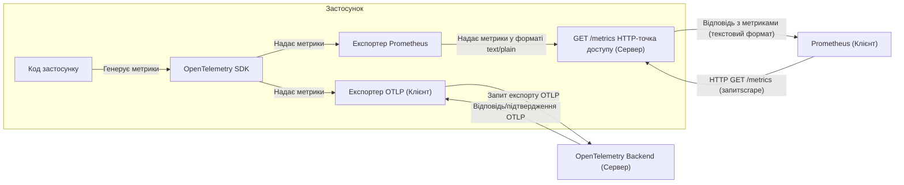

Багато застосунків експортують свої метрики безпосередньо в [Prometheus](https://prometheus.io/). Якщо ви не знайомі з Prometheus — це база даних часових рядів для зберігання метрик, таких як лічильники та гістограми. Застосунки, які зберігають метрики в Prometheus, зазвичай використовують популярний клієнт Prometheus як частину інтеграції.

З огляду на те, що OpenTelemetry [став дипломованим проєктом CNCF](/blog/2026/otel-graduates/), багато компаній все частіше прагнуть перейти на OpenTelemetry, щоб додати до своєї архітектури спостереження більше сигналів окрім метрик. Логи та трасування є популярними доповненнями для отримання глибшого розуміння поведінки застосунків. Профілювання також починає ставати популярним четвертим сигналом телеметрії для ще глибшого аналізу.

Це може створити перешкоду для міграції — як ми можемо перенести наші застосунки з однієї системи в іншу для обробки метрик, не проводячи одноразового переходу? Щоб зменшити ризики будь-якої міграції, краще застосовувати інкрементний підхід, за якого метрики експортуються в обидві системи протягом певного періоду, щоб можна було порівняти та перевірити стани «до» та «після» і переконатися, що в жодній із систем не відбувається втрати видимості виробничих процесів для спостереження за метриками або управління сповіщеннями.

## Використання експортера OpenTelemetry Prometheus для .NET {#using-the-opentelemetry-prometheus-exporter-for-net}

Останній [реліз](https://github.com/open-telemetry/opentelemetry-dotnet/releases/tag/coreunstable-1.18.0-beta.1) експортера OpenTelemetry Prometheus для .NET дозволяє застосувати саме такий підхід до ваших виробничих метрик. Ви можете використовувати [клас .NET Meter](https://learn.microsoft.com/dotnet/core/diagnostics/metrics-instrumentation) у коді вашого застосунку та фреймворку, щоб збирати метрики й експортувати їх як у Prometheus, так і через інший експортер, наприклад [експортер OTLP](/docs/specs/otel/protocol/exporter/), який надає NuGet-пакунок [`OpenTelemetry.Exporter.OpenTelemetryProtocol`](https://www.nuget.org/packages/OpenTelemetry.Exporter.OpenTelemetryProtocol).

Експортер Prometheus — це фактично [клієнтська бібліотека Prometheus](https://prometheus.io/docs/instrumenting/clientlibs/), написана поверх OpenTelemetry SDK, яка надає HTTP-точку доступу для збору метрик (scrape) у вашому застосунку, щоб сервер Prometheus міг регулярно збирати метрики з вашого застосунку. Експортер реалізує [специфікацію Prometheus OpenTelemetry](https://github.com/open-telemetry/opentelemetry-specification/blob/27b10516ad3a27c12a0ab5c63456ddc95766bc68/specification/metrics/sdk_exporters/prometheus.md) ([матрицю](https://github.com/open-telemetry/opentelemetry-specification/blob/27b10516ad3a27c12a0ab5c63456ddc95766bc68/spec-compliance-matrix.md)) та всі [документовані текстові формати представлення](https://prometheus.io/docs/instrumenting/exposition_formats/) (окрім [OpenMetrics 2.0](https://prometheus.io/docs/specs/om/open_metrics_spec_2_0/), який усе ще експериментальний), щоб забезпечити [сумісність з OpenMetrics](https://github.com/open-telemetry/opentelemetry-specification/blob/27b10516ad3a27c12a0ab5c63456ddc95766bc68/specification/compatibility/prometheus_and_openmetrics.md).



Використовуючи лише клас `Meter` разом з інструментами `Counter<T>`, `Gauge<T>` та `Histogram<T>` у коді вашого .NET-застосунку, метрики можна збирати без потреби використовувати одночасно .NET OpenTelemetry SDK та окремий клієнт Prometheus.

```csharp
public class BlogPostComments
{
    private readonly Meter _meter;
    private readonly Counter<long> _likes;

    public BlogPostComments(IMeterFactory meterFactory)
    {
        _meter = meterFactory.Create("OpenTelemetry.Blog");
        _likes = _meter.CreateCounter<long>("blog_post_likes");
    }

    public void BlogPostLiked(long id) =>
        _likes.Add(1, new KeyValuePair<string, object?>("post_id", id));
}
```

Далі потрібно зовсім небагато коду, щоб налаштувати OpenTelemetry SDK на експорт ваших метрик як у Prometheus, так і через OTLP до бекенду, що підтримує OpenTelemetry, додавши до проєкту NuGet-пакунок [`OpenTelemetry.Exporter.Prometheus.AspNetCore`](https://www.nuget.org/packages/OpenTelemetry.Exporter.Prometheus.AspNetCore).

```csharp
using OpenTelemetry;
using OpenTelemetry.Exporter;
using OpenTelemetry.Metrics;

using var meterProvider = Sdk.CreateMeterProviderBuilder()
    .SetResourceBuilder(CreateResourceBuilder())
    .AddMeter("OpenTelemetry.Blog")
    .AddOtlpExporter()
    .AddPrometheusExporter()
    .Build();
```

Ваш застосунок також має надавати HTTP-точки доступу для збору метрик, які Prometheus використовуватиме для збору метрик з вашого застосунку. Це можна зробити, додавши метод розширення `UseOpenTelemetryPrometheusScrapingEndpoint` до вашого `IApplicationBuilder` у методі `Configure` вашого класу `Startup`.

Наприклад:

```csharp
var builder = WebApplication.CreateBuilder(args);

// Налаштуйте сервіси тут

var app = builder.Build();

// Налаштуйте інший проміжне програмне забезпечення тут

app.MapPrometheusScrapingEndpoint();

app.Run();
```

Використання API `Meter` для експорту метрик робить код вашого застосунку більш переносним і незалежним від специфічних для Prometheus API. Це дозволяє прибрати залежності від клієнтських бібліотек Prometheus з коду вашого застосунку. Окрім того, що ваш код готовий до використання в екосистемі OpenTelemetry, це також відкриває можливість використовувати інші інструменти екосистеми .NET, як-от [`dotnet-counters`](https://learn.microsoft.com/dotnet/core/diagnostics/dotnet-counters), для перегляду метрик.

Якщо ваш застосунок наразі використовує лише нативний клієнт Prometheus, наприклад [prometheus-net](https://github.com/prometheus-net/prometheus-net), вам спершу доведеться поступово мігрувати на використання API `Meter`. Скільки часу займе ця міграція, залежить від складності вашої наявної інструментації Prometheus та ресурсів, доступних вам для внесення відповідних змін.

Деякі труднощі, з якими ви можете зіткнутися під час цієї міграції, можуть включати такі функції Prometheus, які не мають прямих аналогів в API `Meter` і тому не підтримуються:

- тип даних summary у Prometheus;
- нативні гістограми.

## Надсилання метрик до Prometheus через OTLP {#pushing-metrics-to-prometheus-using-otlp}

Альтернативно, якщо у вас є лише сервер Prometheus і немає бекенду, сумісного з OTLP, і ви хочете лише експортувати метрики, сам Prometheus має опційну підтримку приймання метрик, надісланих до нього через OTLP.

Спершу переконайтеся, що ви запускаєте Prometheus із прапорцем командного рядка `--web.enable-otlp-receiver`.

Потім налаштуйте експортер OTLP так само, як у фрагменті коду вище, але в цьому випадку вам не потрібно буде також використовувати експортер Prometheus. Зверніть також увагу, що експортер OTLP вказує базовий шлях для OTLP-точки доступу метрик і використовує HTTP/protobuf як протокол для експортера OTLP.

```csharp
using OpenTelemetry;
using OpenTelemetry.Exporter;
using OpenTelemetry.Metrics;

using var meterProvider = Sdk.CreateMeterProviderBuilder()
    .SetResourceBuilder(CreateResourceBuilder())
    .AddMeter("OpenTelemetry.Blog")
    .AddOtlpExporter((options, _) =>
    {
        options.Endpoint = new Uri("http://prometheus:9090/api/v1/otlp/v1/metrics");
        options.Protocol = OtlpExportProtocol.HttpProtobuf;
    })
    .Build();
```

Цей підхід дозволяє надсилати метрики до Prometheus за допомогою OpenTelemetry .NET SDK через OTLP, не покладаючись на клієнтську бібліотеку Prometheus у коді вашого застосунку.

Повний приклад цього підходу ви можете знайти у зразку [Getting Started with Prometheus and Grafana](https://github.com/open-telemetry/opentelemetry-dotnet/blob/fcd9fb6db19baf1d24373e517f6810126dd7d26a/docs/metrics/getting-started-prometheus-grafana/README.md) у репозиторії OpenTelemetry .NET.

## Підсумок {#summary}

З мінімальними накладними витратами під час виконання застосунок може як надсилати метрики через OTLP, так і дозволяти збирати метрики Prometheus, що дає змогу використовувати обидві системи паралельно, доки ви не вирішите повністю перейти на бекенд, сумісний з OpenTelemetry, для ваших метрик.
