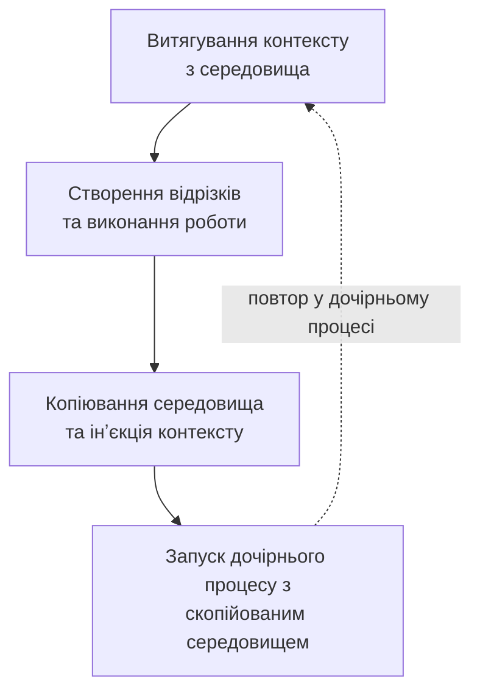
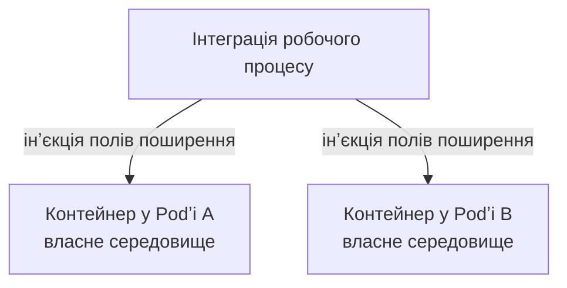

Трасування не завжди перетинає межі мережі. Виконавець робочого процесу запускає оболонку, оболонка запускає інструмент збірки, а інструмент збірки запускає тести. Пакетні системи та системи обробки даних створюють подібні ланцюжки дочірніх процесів. Без спільного способу передачі інформації про трасування через ці межі відрізки з кожного процесу можуть опинитися в окремих трасуваннях.

Якщо [поширення контексту][context propagation] для вас нове, це механізм, який переносить інформацію з одного сервісу або процесу до наступного. Для трасування це включає ідентифікатори трасування та відрізків, які дозволяють новим відрізкам приєднатися до того ж трасування. Поширення контексту також може переносити baggage — визначені користувачем пари ключ-значення, які передаються подальшій роботі.

Специфікація OpenTelemetry тепер має реліз-кандидат для використання [змінних середовища як носіїв поширення контексту][env-carrier-spec]. Він стандартизує, як поширювачі контексту можуть використовувати змінні середовища для перенесення даних, таких як контекст трасування та baggage, між процесами, коли заголовки протоколу або метадані повідомлень недоступні.

Перш ніж ми позначимо цю специфікацію як стабільну, нам потрібен відгук від розробників мовних реалізацій, авторів інструментів, інженерів платформ та користувачів, які працюють із реальними CI/CD, пакетними та навантаженнями з командного рядка.

## Що таке носій змінних середовища? {#What is an environment variable carrier}

Носій — це середовище, яке використовується для передачі даних поширення між сервісами або процесами. Поширювач (контексту) записує поля поширення в носій і зчитує їх на приймальному боці. HTTP-заголовки — звичний приклад носія. Коли один процес запускає інший, середовище дочірнього процесу може відігравати ту саму роль: поля поширення записуються до запуску дочірнього процесу та зчитуються під час його ініціалізації.

Реліз-кандидат визначає правила, щоб це працювало однаково на різних платформах. У специфікації тип поширювача, який використовується з носіями у вигляді рядкових пар ключ-значення, називається [`TextMapPropagator`][text-map-propagator].

Наприклад, під час використання поширювачів W3C Trace Context і W3C Baggage поля поширення представлені такими змінними середовища:

```text
TRACEPARENT=00-4bf92f3577b34da6a3ce929d0e0e4736-00f067aa0ba902b7-01
TRACESTATE=vendorname=opaquevalue
BAGGAGE=build.id=42,repository.name=example
```

[OpenTelemetry Propagators API][propagators-api] називає запис полів поширення в носій **інʼєкцією**, а їх зчитування — **витягом**.

Усередині процесу OpenTelemetry зберігає дані поширення в `Context`. Для трасування ці дані включають `SpanContext`; вони також можуть включати `Baggage`. Під час інʼєкції поширювач зчитує дані з поточного `Context` і записує їх у носій. Під час витягування він зчитує носій і повертає новий `Context`, що містить ці дані.

Носій середовища не інтерпретує ці значення; він розглядає їх як звичайні рядки. Налаштований поширювач залишається відповідальним за вибір назв полів, а також за перевірку та розбір значень. Це дозволяє використовувати носій як із форматами W3C, так і з такими форматами, як B3.

Назви змінних середовища мають більше обмежень, ніж назви HTTP-заголовків, тому специфікація визначає алгоритм нормалізації. Він перетворює літери ASCII на великі, замінює непідтримувані символи на підкреслення та гарантує, що назва не починається з цифри. Наприклад:

```text
x-b3-traceid -> X_B3_TRACEID
```

Правила застосовуються однаково, коли реалізація зчитує (`Get`), записує (`Set`) або перелічує (`Keys`) змінні середовища, зокрема на платформах, які не розрізняють регістр символів, таких як Windows.

## Як працює поширення між процесами {#how-propagation-works-between-processes}

Передбачений життєвий цикл повторює те, як уже працюють середовища процесів:

1. Під час ініціалізації налаштовані поширювачі витягують значення з середовища, яке дочірній процес отримав під час запуску, у `Context`.
2. Застосунок створює відрізки та виконує роботу, використовуючи цей `Context`.
3. Перед запуском наступного дочірнього процесу застосунок копіює середовище та робить інʼєкцію полів поширення зі свого поточного `Context` у цю копію.
4. Застосунок запускає дочірній процес із зміненим середовищем, і цикл повторюється.



Застосунки повинні використовувати окрему копію середовища для кожного дочірнього процесу. Це особливо важливо, коли кілька процесів працюють одночасно та належать до різних відрізків. Розгляд змінних поширення як вхідних даних під час запуску також дозволяє уникнути залежності від змін глобального середовища батьківського процесу.

## Варіанти використання та реалізації {#use-cases-and-implementations}

### Мовні реалізації OpenTelemetry {#opentelemetry-language-implementations}

Мовні реалізації OpenTelemetry можуть надавати допоміжні засоби, які дозволяють налаштованому поширювачу зчитувати з середовища процесу та записувати в нього. Залежно від мови, допоміжна функція може бути типом-носієм, методами getter і setter або іншим API, відповідним для даної мови. Він може розташовуватися в пакунку API, SDK або contrib. Інструментування може використовувати ці засоби для витягування вхідних значень під час запуску процесу та інʼєкції полів у скопійоване середовище перед запуском дочірнього процесу.

Ці засоби не запускають дочірні процеси. Код застосунку або інструментування запускає дочірній процес і передає підготовлене середовище відповідному API процесу. Налаштований поширювач обробляє свій формат поширення, тому інтеграціям не потрібно самостійно розбирати W3C Trace Context, W3C Baggage, B3 чи інші підтримувані формати.

### Інструменти командного рядка, такі як otel-cli{#command-line-tools-such-as-otel-cli}

Інструмент командного рядка може застосовувати той самий підхід, не вимагаючи, щоб кожен shell-скрипт безпосередньо інтегрувався з API OpenTelemetry. З налаштованим трасуванням, наприклад, через вказання OTLP-точок доступу, [otel-cli][] може створити відрізок навколо команди та виконати інʼєкцію `TRACEPARENT` цього відрізку в середовище команди:

```console
otel-cli exec --service build --name compile -- make all
```

Зазвичай, коли присутній дійсний вхідний `TRACEPARENT`, `otel-cli` використовує його як батьківський для створюваного відрізку. Якщо `make`, процес, який він запускає, або інший виклик `otel-cli` витягує поширений `TRACEPARENT`, його відрізки можуть залишитися в тому самому трасуванні. Це практичний приклад використання змінних середовища для продовження трасування через межі команд. Мовні реалізації OpenTelemetry надають ті самі базові будівельні блоки для інструментованих застосунків і бібліотек.

### Shell-скрипти {#shell-scripts}

[Thoth][] надає інструментування OpenTelemetry для shell-скриптів, а також для GitHub Actions. Для shell-скриптів підключення його файлу `otel.sh` ініціалізує SDK проєкту та автоматичне інструментування. Він створює кореневий відрізок для скрипту, створює відрізки для підтримуваних команд і продовжує інструментування в дочірніх оболонках та виконуваних скриптах, які використовують shebang. Він також може робити інʼєкцію заголовків W3C `traceparent` через підтримувані HTTP-клієнти, такі як `curl` і `wget`. Thoth поширює `TRACEPARENT` і `TRACESTATE` через середовища дочірніх процесів.

### GitHub Actions

Поширення через середовище для GitHub Actions — не лише гіпотетична можливість. Два незалежні проєкти спільноти ілюструють різні підходи:

- Thoth також надає інструментування на рівні робочого процесу та на рівні завдання. Його інструментування на рівні завдання працює на GitHub runner, робить інʼєкцію інструментування в кроки shell, Node.js, Docker та composite actions і використовує `TRACEPARENT` і `TRACESTATE` для продовження контексту в дочірніх процесах.
- [Run with Telemetry][] обгортає конкретну команду у відрізок і розміщує отриманий `TRACEPARENT` у середовищі цієї команди. Його опційний режим `job-as-parent` дозволяє згенерованому відрізку команди приєднатися до трасування, що представляє ширше завдання.

### Jenkins

[Втулок OpenTelemetry для Jenkins][Jenkins OpenTelemetry plugin] надає конкретний приклад в усталеній CI-системі. Він надає поточні `TRACEPARENT` і `TRACESTATE` у середовищі кроків shell, batch та PowerShell. Інструмент збірки або тестування, який розуміє OpenTelemetry і викликається кроком, може використати цей контекст, щоб зʼєднати свої відрізки з трасуванням конвеєра Jenkins.

Втулок також має опцію конфігурації для експорту вибраних змінних конфігурації SDK `OTEL_*` у наступні інструменти. Ці змінні вирішують іншу проблему: `TRACEPARENT` і `TRACESTATE` переносять контекст трасування, тоді як такі змінні, як `OTEL_EXPORTER_OTLP_ENDPOINT`, налаштовують, як наступний процес обробляє телеметрію.

### Argo Workflows

[Argo Workflows][] — ще один корисний приклад. Argo моделює кроки робочого процесу як контейнери, що працюють в Kubernetes. Інтеграція робочого процесу могла б робити інʼєкції полів поширення в середовище кожного контейнера. Інструментований код або такий інструмент, як `otel-cli`, міг би потім витягти ці поля та продовжити трасування.



Кожен цільовий контейнер потребує окремої інʼєкції, оскільки Podʼи Kubernetes не успадковують середовища процесів один одного. Усередині контейнера той самий носій може передавати поля поширення будь-яким дочірнім процесам, які він запускає.

Цей механізм також застосовується до пакетних планувальників, ETL-систем, виконавців тестів та інших середовищ, де робота повʼязана через створення процесів, а не через протокол запитів.

## Безпека та обмеження {#security-and-limitations}

Змінні середовища доступні всьому коду, що працює в процесі. На деяких системах вони також можуть бути видимі іншим процесам або користувачам із достатніми правами. Не використовуйте змінні поширення для секретів і переглядайте baggage перед передачею через межу довіри. Процеси приймання повинні розглядати поля поширення як ненадійні вхідні дані та надати можливість налаштованому поширювачу їх перевірити.

Носій середовища лише транспортує поля поширення. Він не створює відрізки, не налаштовує SDK, не замінює поширення через мережеві протоколи та не поширює автоматично між контейнерами або Podʼами Kubernetes.

## Повідомляйте про проблеми вже зараз {#please-report-problems-now}

Документ наразі позначено як реліз-кандидат. Реалізації доступні в кількох мовах OpenTelemetry, а поточне покриття зафіксовано в [матриці відповідності специфікації][specification compliance matrix]. Ширша робота над реалізаціями відстежується в [тікеті \#4771 трекера реалізацій SDK][sdk-tracker].

**Період зворотного звʼязку:** Ми чекатимемо щонайменше до 2 листопада 2026 року та щонайменше 14 днів без нових повʼязаних задач, перш ніж стабілізувати специфікацію. Якщо значні знахідки вимагатимуть оновлень специфікації, ми перезапустимо 14-денний період зворотного звʼязку, коли ці оновлення будуть доступні для перегляду. Це дає спільноті час перевірити будь-які суттєві зміни перед стабілізацією.

Тепер ми хочемо визначити, чи достатньо зрозумілі, переносимі, безпечні та реалізовні вимоги, щоб позначити документ як Stable. Зокрема, ми будемо вдячні за відгуки щодо таких питань:

- Чи працюють правила нормалізації для ваших операційних систем і середовищ виконання?
- Чи може ваша мовна реалізація надати витяг та інʼєкцію у спосіб, відповідний мові?
- Чи достатньо зрозумілі вказівки щодо запуску процесів і середовища дочірніх процесів?
- Чи працює ця модель для CI/CD-систем, таких як GitHub Actions та Argo Workflows, а також для пакетних і інструментів командного рядка?
- Чи бракує якихось аспектів паралельності, безпеки чи меж довіри?
- Чи призводить якась вимога до несумісної поведінки різних реалізацій?

Будь ласка, прочитайте [специфікацію носіїв змінних середовища][env-carrier-spec] та оцініть її на основі реалізації або конкретного варіанта використання. Коли ви знайдете проблему, повідомте про неї там, де її можна вирішити:

- Для незрозумілих або неправильних вимог, проблем із переносимістю, відсутніх варіантів використання чи проблем безпеки на рівні специфікації [відкрийте задачу в репозиторії специфікації OpenTelemetry][new-spec-issue]. Додайте коментар до [задачі стабілізації \#5040][stabilization-issue] із посиланням на нову задачу.
- Для поведінки, специфічної для однієї мовної реалізації, відкрийте задачу в репозиторії цієї реалізації та додайте перехресне посилання на [трекер реалізацій][sdk-tracker].
- Для поведінки, специфічної для інструмента чи платформи робочих процесів, відкрийте задачу в репозиторії цього проєкту. Якщо вона також виявляє прогалину в специфікації, створіть задачу специфікації та повʼяжіть їх.

Корисний звіт містить процес або робочий процес, який інструментується, операційну систему та середовище виконання, налаштований поширювач, назви змінних середовища, очікувану та фактичну поведінку, а також, за можливості, мінімальний приклад. Будь ласка, також зазначте, чи стосується проблема паралельних дочірніх процесів, нормалізації назв чи межі безпеки.

Відреагуйте на задачу стабілізації вподобайкою великого пальця угору, щоб допомогти пріоритезувати роботу. Додайте коментар, коли знайдете перешкоду або зможете поділитися конкретним досвідом реалізації чи виробничого використання; коментарі, що містять лише «+1», не допомагають нам оцінювати специфікацію.

Ваш відгук зараз допоможе гарантувати, що Stable означає: цей механізм працює однаково в мовних реалізаціях, інструментах і платформах робочих процесів.

[Argo Workflows]: https://github.com/argoproj/argo-workflows
[context propagation]: /docs/concepts/context-propagation/
[env-carrier-spec]: https://github.com/open-telemetry/opentelemetry-specification/blob/eec6fadba46a5002f55ff88ce4405d58a1aa4aec/specification/context/env-carriers.md
[Jenkins OpenTelemetry plugin]: https://github.com/jenkinsci/opentelemetry-plugin/blob/6f67e4ab1d1513f7f513d7570907dd341094a74d/docs/job-traces.md#environment-variables-for-trace-context-propagation-and-integrations
[new-spec-issue]: https://github.com/open-telemetry/opentelemetry-specification/issues/new/choose
[otel-cli]: https://github.com/tobert/otel-cli
[propagators-api]: https://github.com/open-telemetry/opentelemetry-specification/blob/ce9394dc3dd53bb182611d2f3ba1e8f53975e905/specification/context/api-propagators.md#operations
[Run with Telemetry]: https://github.com/krzko/run-with-telemetry/blob/c2636c369317450dfd825ae4b67760d49600ca18/README.md#environment-variables-injection
[sdk-tracker]: https://github.com/open-telemetry/opentelemetry-specification/issues/4771
[specification compliance matrix]: https://github.com/open-telemetry/opentelemetry-specification/blob/eec6fadba46a5002f55ff88ce4405d58a1aa4aec/spec-compliance-matrix.md
[stabilization-issue]: https://github.com/open-telemetry/opentelemetry-specification/issues/5040
[text-map-propagator]: https://github.com/open-telemetry/opentelemetry-specification/blob/ce9394dc3dd53bb182611d2f3ba1e8f53975e905/specification/context/api-propagators.md#textmap-propagator
[Thoth]: https://github.com/plengauer/Thoth/blob/f1837aa22450dd691359f1dd05bcc6aec41162dd/README.md#automatic-instrumentation-of-shell-scrips
