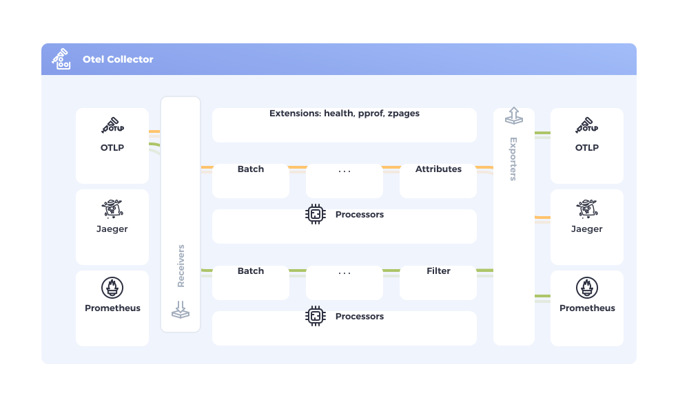

## Вступ {#introduction}

OpenTelemetry Collector пропонує незалежну від постачальника реалізацію того, як отримувати, обробляти та експортувати телеметричні дані. Це усуває потребу в запуску, експлуатації та обслуговуванні кількох агентів/колекторів. Це працює з покращеною масштабованістю та підтримує формати даних спостережуваності з відкритим кодом (наприклад, Jaeger, Prometheus, Fluent Bit тощо), що надсилаються до одного або кількох відкритих або комерційних бекендів.

## Цілі {#objectives}

- _Зручність_: Розумна типова конфігурація, підтримка популярних протоколів, працює та збирає дані з коробки.
- _Продуктивність_: Висока стабільність та продуктивність при різних навантаженнях та конфігураціях.
- _Спостережуваність_: Приклад спостережуваної служби.
- _Розширюваність_: Налаштовується без змін в основному коді.
- _Уніфікація_: Єдина кодова база, що може бути розгорнута як агент або колектор з
  підтримкою трасування, метрик та логів.

## Коли використовувати колектор {#when-to-use-a-collector}

Для більшості бібліотек інструментування, специфічних для мови, є експортери для популярних бекендів та OTLP. Ви можете запитати,

> за яких обставин слід використовувати колектор для надсилання даних, а не дозволяти кожній службі надсилати дані безпосередньо до бекенду?

Для спроб та початку роботи з OpenTelemetry, надсилання ваших даних безпосередньо до бекенду — це чудовий спосіб швидко отримати цінність. Також у розробці або маломасштабному середовищі ви можете отримати пристойні результати без колектора.

Однак, загалом ми рекомендуємо використовувати колектор разом із вашою службою, оскільки це дозволяє вашій службі швидко вивантажувати дані, а колектор може займатися додатковою обробкою, такою як повторні спроби, пакетування, шифрування або навіть фільтрація конфіденційних даних.

Також легше [налаштувати колектор](quick-start), ніж ви могли б подумати: стандартні експортери OTLP у кожній мові припускають наявність локальної точки доступу колектора, тому якщо ви запустите колектор, він автоматично почне отримувати телеметрію.

## Безпека колектора {#collector-security}

Дотримуйтесь найкращих практик, щоб переконатися, що ваші колектори [розміщені][hosted] та [налаштовані][configured] безпечним чином.

## Статус {#status}

Статус **Колектора**: [змішаний][mixed], оскільки основні компоненти Колектора наразі мають змішані [рівні стабільності][stability levels].

**Компоненти колектора** відрізняються за рівнем зрілості. Кожен компонент має свою стабільність, задокументовану у своєму `README.md`. Ви можете знайти список усіх доступних компонентів Колектора у [реєстрі][registry].

Підтримка гарантована для програмних артефактів Колектора протягом певного періоду часу залежно від призначеної аудиторії артефакту. Ця підтримка включає, як мінімум, виправлення критичних помилок та проблем безпеки. Дивіться [політики підтримки](https://github.com/open-telemetry/opentelemetry-collector/blob/main/VERSIONING.md) для отримання додаткової інформації.

## Дистрибутиви та випуски {#випуски}

Настанови щодо дистрибутивів і випусків Collector, зокрема [останнього випуску][latest release], наведено у розділі [Дистрибутиви](distributions/).

[configured]: /docs/security/config-best-practices/
[hosted]: /docs/security/hosting-best-practices/
[latest release]: https://github.com/open-telemetry/opentelemetry-collector-releases/releases/latest
[mixed]: /docs/specs/otel/document-status/#mixed
[registry]: /ecosystem/registry/?language=collector
[stability levels]: https://github.com/open-telemetry/opentelemetry-collector#stability-levels
