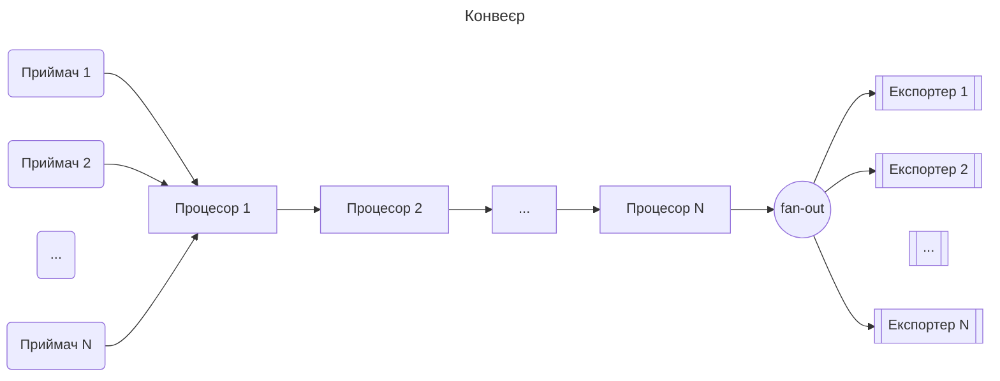
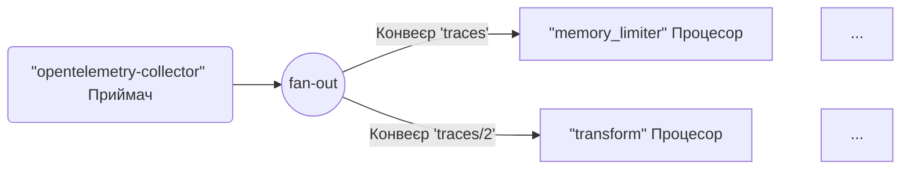
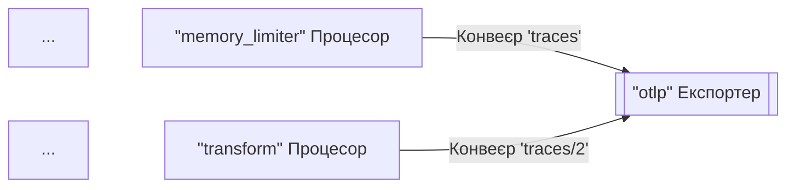
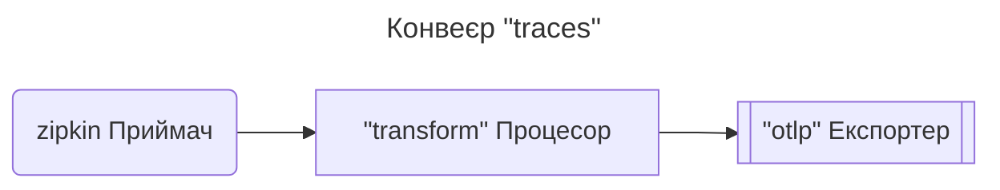
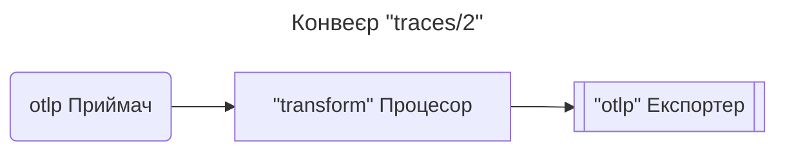
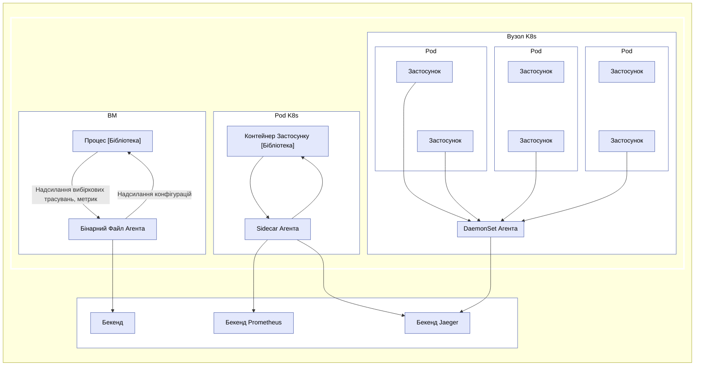
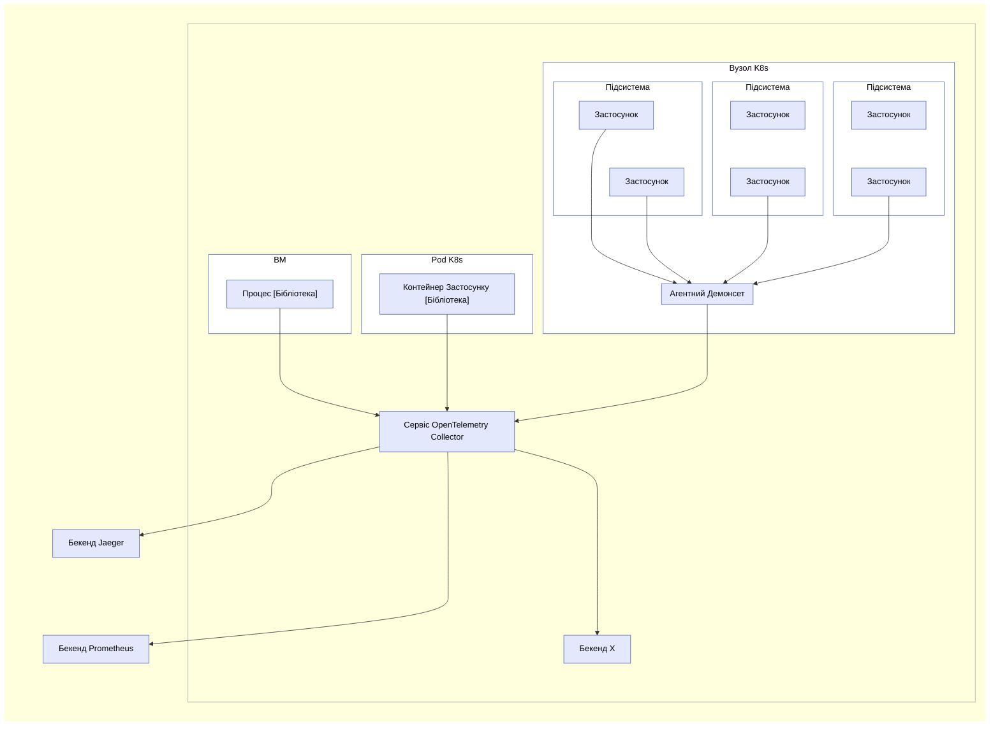

OpenTelemetry Collector — це виконуваний файл, який може отримувати телеметрію,
обробляти її та експортувати до кількох цілей, таких як бекенди спостереження.

Колектор підтримує кілька популярних протоколів з відкритим кодом для отримання та
надсилання даних телеметрії, і він пропонує розширювану архітектуру для додавання нових
протоколів.

Отримання, обробка та експорт даних здійснюються за допомогою [конвеєрів](#pipelines). Ви можете налаштувати Колектор для використання одного або кількох конвеєрів.

Кожен конвеєр включає наступне:

- Набір [приймачів](#receivers), які збирають дані.
- Серію необовʼязкових [процесорів](#processors), які отримують дані від приймачів і обробляють їх.
- Набір [експортерів](#exporters), які отримують дані від процесорів і надсилаються їх за межі Колектора.

Той самий приймач може бути включений у кілька конвеєрів, і кілька конвеєрів можуть включати одного й того ж експортера.

## Конвеєри {#pipelines}

Конвеєр визначає шлях, який дані проходять у Колекторі: від отримання до обробки (або модифікації) і, нарешті, до експорту.

Конвеєри можуть працювати з трьома типами телеметричних даних: трасуваннями, метриками та логами. Тип даних є властивістю конвеєра, визначеною його конфігурацією. Приймачі, процесори та експортери, що використовуються в конвеєрі, повинні підтримувати конкретний тип даних, інакше при завантаженні конфігурації буде повідомлено про помилку `pipeline.ErrSignalNotSupported`.

Наступна діаграма представляє типовий конвеєр:



Конвеєри можуть мати один або кілька приймачів. Дані від усіх приймачів надходять до першого процесора, який обробляє дані, а потім передає їх наступному процесору. Процесор також може відкинути дані, якщо він виконує вибірку або фільтрацію. Це продовжується до тих пір, поки останній процесор у конвеєрі не передасть дані експортерам. Кожен експортер отримує копію кожного елемента даних. Останній процесор використовує `fanoutconsumer`, щоб надіслати дані кільком експортерам.

Конвеєр створюється під час запуску Колектора на основі визначення конвеєра в конфігурації.

Типова конфігурація конвеєра виглядає так:

```yaml
service:
  pipelines: # розділ, який може містити кілька підрозділів, по одному на кожен конвеєр
    traces: # тип конвеєра
      receivers: [otlp, zipkin]
      exporters: [otlp, zipkin]
```

Попередній приклад визначає конвеєр для типу телеметричних даних трасування, з двома приймачами, двома процесорами та двома експортерами.

### Приймачі {#receivers}

Приймачі зазвичай слухають на мережевому порту та отримують телеметричні дані. Вони також можуть активно отримувати дані, як скрепери. Зазвичай один приймач налаштовується для надсилання отриманих даних до одного конвеєра. Однак, також можливо налаштувати той самий приймач для надсилання тих самих отриманих даних до кількох конвеєрів. Це можна зробити, вказавши той самий приймач у ключі `receivers` кількох конвеєрів:

```yaml
receivers:
  otlp:
    protocols:
      grpc:
        endpoint: localhost:4317

service:
  pipelines:
    traces: # конвеєр типу “traces”
      receivers: [otlp]
      exporters: [otlp]
    traces/2: # інший конвеєр типу “traces”
      receivers: [otlp]
      processors: [transform]
      exporters: [otlp]
```

У наведеному вище прикладі приймач `otlp` надсилатиме ті самі дані до конвеєра `traces` і до конвеєра `traces/2`.

> Конфігурація використовує композитні імена ключів у формі `type[/name]`.

Коли Колектор завантажує цю конфігурацію, результат виглядає так (частину процесорів та експортерів опущено для стислості):



> [!WARNING]
>
> Коли той самий приймач згадується в більш ніж одному конвеєрі, Колектор створює лише один екземпляр приймача під час виконання, який надсилає дані до споживача fan-out. Споживач fan-out, своєю чергою, надсилає дані до першого процесора кожного конвеєра. Передача даних від приймача до споживача fan-out і потім до процесорів здійснюється за допомогою синхронного виклику функції. Це означає, що якщо один процесор блокує виклик, інші конвеєри, підключені до цього приймача, блокуються від отримання тих самих даних, і сам приймач припиняє обробку та пересилання нових отриманих даних.

### Експортери {#exporters}

Експортери зазвичай пересилають отримані дані до місця призначення в мережі, але вони також можуть надсилати дані в інше місце. Наприклад, експортер `debug` записує телеметричні дані до місця призначення журналу.

Конфігурація дозволяє мати кілька експортерів одного типу, навіть в одному конвеєрі. Наприклад, ви можете мати два експортери `otlp`, кожен з яких надсилає дані до різних точок доступу OTLP:

```yaml
exporters:
  otlp/1:
    endpoint: example.com:4317
  otlp/2:
    endpoint: localhost:14317
```

Експортер зазвичай отримує дані від одного конвеєра. Однак, ви можете налаштувати кілька конвеєрів для надсилання даних до одного експортера:

```yaml
exporters:
  otlp:
    protocols:
      grpc:
        endpoint: localhost:14250

service:
  pipelines:
    traces: # конвеєр типу “traces”
      receivers: [zipkin]
      processors: [memory_limiter]
      exporters: [otlp]
    traces/2: # інший конвеєр типу “traces”
      receivers: [otlp]
      processors: [transform]
      exporters: [otlp]
```

У наведеному вище прикладі експортер `otlp` отримує дані від конвеєра `traces` і від конвеєра `traces/2`. Коли Колектор завантажує цю конфігурацію, результат виглядає так (частину процесорів та приймачів опущено для стислості):



### Процесори {#processors}

Конвеєр може містити послідовно зʼєднані процесори. Перший процесор отримує дані від одного або кількох приймачів, налаштованих для конвеєра, а останній процесор надсилає дані одному або кільком експортерам, налаштованим для конвеєра. Усі процесори між першим і останнім отримують дані лише від одного попереднього процесора і надсилають дані лише одному наступному процесору.

Процесори можуть трансформувати дані перед їх пересиланням, наприклад, додавати або видаляти атрибути з трасувань. Вони також можуть відкидати дані, вирішуючи не пересилати їх (наприклад, процесор `probabilisticsampler`). Або вони можуть генерувати нові дані.

Те саме імʼя процесора може бути згадане в ключі `processors` кількох конвеєрів. У цьому випадку одна й та сама конфігурація використовується для кожного з цих процесорів, але кожен конвеєр завжди отримує свій власний екземпляр процесора. Кожен з цих процесорів має свій власний стан, і процесори ніколи не діляться між конвеєрами. Наприклад, якщо процесор `transform` використовується в кількох конвеєрах, кожен конвеєр має свій власний процесор transform, але кожен процесор transform налаштований однаково, якщо вони посилаються на той самий ключ у конфігурації. Дивіться наступну конфігурацію:

```yaml
processors:
  transform:
    error_mode: ignore
    trace_statements:
      - set(resource.attributes["namespace"],
        resource.attributes["k8s.namespace.name"])
      - delete_key(resource.attributes, "k8s.namespace.name")

service:
  pipelines:
    traces: # конвеєр типу “traces”
      receivers: [zipkin]
      processors: [transform]
      exporters: [otlp]
    traces/2: # інший конвеєр типу “traces”
      receivers: [otlp]
      processors: [transform]
      exporters: [otlp]
```

Коли Колектор завантажує цю конфігурацію, результат виглядає так:





Зверніть увагу, що кожен процесор `transform` є незалежним екземпляром, хоча вони налаштовані однаково з `send_batch_size` `10000`.

> Те саме імʼя процесора не повинно згадуватися кілька разів у ключі `processors` одного конвеєра.

## Запуск в якості агента {#opentelemetry-agent}

На типовій ВМ/контейнері застосунки користувача працюють у деяких процесах/подах з бібліотекою OpenTelemetry. Раніше бібліотека виконувала всі записи, збирання, вибірку та агрегацію трасувань, метрик та логів, а потім або експортувала дані до інших постійних сховищ через бібліотечні експортери, або відображала їх на локальних zpages. Ця схема має кілька недоліків, наприклад:

1. Для кожної бібліотеки OpenTelemetry експортери та zpages повинні бути повторно реалізовані на рідних мовах.
2. У деяких мовах програмування (наприклад, Ruby або PHP) важко виконувати агрегацію статистики в процесі.
3. Щоб увімкнути експорт трасувань, статистики або метрик OpenTelemetry, користувачі застосунків повинні вручну додавати бібліотечні експортери та повторно розгортати свої бінарні файли. Це особливо важко, коли стався інцидент, і користувачі хочуть використовувати OpenTelemetry для розслідування проблеми негайно.
4. Користувачі застосунків повинні брати на себе відповідальність за налаштування та ініціалізацію експортерів. Ці завдання схильні до помилок (наприклад, налаштування неправильних облікових даних або ресурсів, яким потрібен моніторинг), і користувачі можуть неохоче “забруднювати” свій код OpenTelemetry.

Щоб вирішити наведені вище проблеми, ви можете запустити OpenTelemetry Collector як агента. Агент працює як демон у ВМ/контейнері і може бути розгорнутий незалежно від бібліотеки. Після розгортання та запуску агент повинен мати можливість отримувати трасування, метрики та логи з бібліотеки та експортувати їх до інших бекендів. Ми також можемо надати агенту можливість надсилати конфігурації (наприклад, ймовірність вибірки) до бібліотеки. Для тих мов, які не можуть виконувати агрегацію статистики в процесі, вони можуть надсилати сирі вимірювання, а агент буде виконувати агрегацію.



> Для розробників та підтримувачів інших бібліотек: Додавши конкретні приймачі, ви можете налаштувати агент для приймання трасувань, метрик та логів від інших бібліотек трасування/моніторингу, таких як Zipkin, Prometheus тощо. Дивіться [Приймачі](#receivers) для деталей.

## Запуск в якості шлюзу {#opentelemetry-collector}

OpenTelemetry Collector може працювати як екземпляр шлюзу та отримувати трасування та метрики, експортовані одним або кількома агентами або бібліотеками, або завданнями/агентами, які використовують один із підтримуваних протоколів. Колектор налаштований на надсилання даних до налаштованих експортерів. Наступна діаграма підсумовує архітектуру розгортання:



OpenTelemetry Collector також може бути розгорнутий в інших конфігураціях, таких як отримання даних від інших агентів або клієнтів у одному з форматів, підтримуваних його приймачами.
