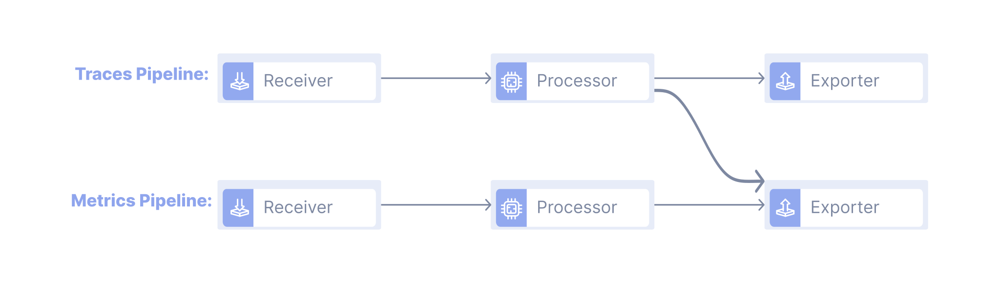
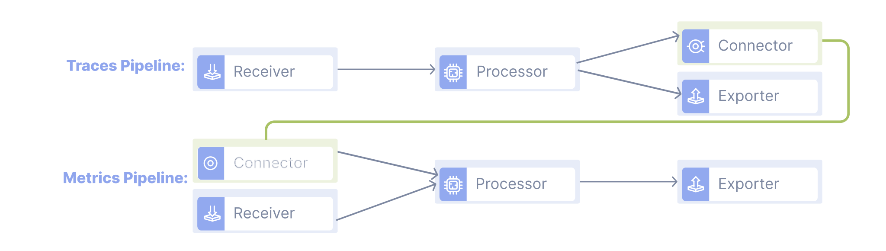

## Конектори в OpenTelemetry {#connectors-in-opentelemetry}

Цей матеріал найбільш корисний, якщо у вас вже є інструментований застосунок, який генерує деякі дані трасування, і ви вже маєте розуміння [OpenTelemetry Collector](/docs/collector).

## Що таке Конектор? {#what-is-a-connector}

Конектор діє як засіб передачі даних телеметрії між різними конвеєрами колектора, зʼєднуючи їх. Конектор діє як експортер для одного конвеєра і як приймач для іншого. Кожен конвеєр в OpenTelemetry Collector обробляє один тип даних телеметрії. Може виникнути потреба перетворити один вид даних телеметрії в інший, але необхідно направити відповідні дані до їхнього правильного конвеєра колектора.

## Чому треба використовувати Конектор? {#why-use-a-connector}

Конектор корисний для обʼєднання, маршрутизації та реплікації потоків даних. Разом з послідовним конвеєрним зʼєднанням, яке полягає в зʼєднанні конвеєрів разом, компонент конектора здатний до умовного потоку даних і генерації потоків даних. Умовний потік даних означає надсилання даних до конвеєра з найвищим пріоритетом і має виявлення помилок для маршрутизації до альтернативного конвеєра, якщо це необхідно. Генерація потоків даних означає, що компонент генерує і генерує власні дані на основі отриманих даних. Цей підручник підкреслює здатність конектора зʼєднувати конвеєри.

Існують процесори в OpenTelemetry, які перетворюють дані телеметрії одного типу в інший. Деякі приклади — це процесор spanmetrics, а також процесор servicegraph. Процесор spanmetrics генерує агреговані запити, помилки та метрики тривалості з даних відрізків. Процесор servicegraph аналізує дані трасування і генерує метрики, які описують взаємозвʼязок між сервісами. Обидва ці процесори споживають дані трасування і перетворюють їх у метрики. Оскільки конвеєри в OpenTelemetry Collector призначені лише для одного типу даних, необхідно перетворити дані трасування з процесора в конвеєрі трасування і відправити їх у конвеєр метрик. Історично склалося так, що деякі процесори передавали дані, використовуючи обхідний шлях, що є поганою практикою, коли процесор безпосередньо експортує дані після обробки. Компонент конектора вирішує потребу в цьому обхідному шляху, і процесори, які використовували обхідний шлях, були знецінені. Аналогічно, згадані вище процесори також визнані застарілими в останніх випусках і замінені конекторами.

Додаткові деталі про повні можливості конектора можна знайти за наступними посиланнями: [Що таке Конектори в OpenTelemetry?](https://observiq.com/blog/what-are-connectors-in-opentelemetry/), [Конфігурації Конектора OpenTelemetry](/docs/collector/configuration/#connectors)

### Стара Архітектура: {#the-old-architecture}



### Нова Архітектура Використовуючи Конектор: {#new-architecture-using-a-connector}



## Створення демонстраційного Конектора {#building-example-connector}

У цьому підручнику ми напишемо демонстраційний конектор, який бере трейси та перетворює їх у метрики як базовий приклад того, як функціонує компонент конектора в OpenTelemetry. Функціональність базового конектора полягає в простому підрахунку кількості відрізків у трейсах, які містять певне імʼя атрибута. Кількість цих випадків зберігається в конекторі.

## Конфігурації {#configuration}

### Налаштування Конфігурації Колектора: {#setting-up-collector-config}

Налаштуйте конфігурацію, яку ви будете використовувати для OpenTelemetry Collector у файлі `config.yaml`. Цей файл визначає, як ваші дані будуть маршрутизовані, оброблені та експортовані. Конфігурації, визначені у файлі, деталізують, як ви хочете, щоб ваш конвеєр даних працював. Ви можете визначити компоненти і як дані переміщуються через ваш визначений конвеєр від початку до кінця. Додаткові деталі про те, як налаштувати колектор, можна знайти на сторінці [Конфігурації Колектора](/docs/collector/configuration).

Використовуйте наступний код для демонстраційного конектора, який ми будемо створювати. Код є прикладом базового дійсного файлу конфігурації OpenTelemetry Collector.

```yaml
receivers:
  otlp:
    protocols:
      grpc:
        endpoint: 0.0.0.0:4317
      http:
        endpoint: 0.0.0.0:4318

exporters:
  # ЗАУВАЖЕННЯ: До v0.86.0 використовуйте `logging` замість `debug`.
  debug:

connectors:
  example:

service:
  pipelines:
    traces:
      receivers: [otlp]
      processors: [batch]
      exporters: [example]
    metrics:
      receivers: [example]
      exporters: [debug]
```

У розділі connectors в наведеному вище коді вам потрібно оголосити імена використовуваних конекторів для вашого конвеєра. Тут `example` — це імʼя конектора, який ми створимо в цьому підручнику.

## Реалізація {#implementation}

1.  Створіть теку для вашого демонстраційного конектора. У цьому підручнику ми створимо теку з назвою `exampleconnector`.
2.  Перейдіть до теки та виконайте

    ```sh
    go mod init github.com/gord02/exampleconnector
    ```

3.  Запустіть `go mod tidy`

    Це створить файли `go.mod` і `go.sum`.

4.  Створіть наступні файли в теці
    - `config.go` - файл для визначення налаштувань конектора
    - `factory.go` - файл для створення екземплярів конектора

### Створіть налаштування вашого конектора в config.go {#create-your-connector-settings-in-configgo}

Щоб бути створеним та брати участь у конвеєрах, колектор повинен ідентифікувати ваш конектор і правильно завантажити його налаштування з конфігураційного файлу.

Щоб надати вашому конектору доступ до його налаштувань, створіть структуру `Config`. Структура повинна мати експортоване поле для кожного з налаштувань конектора. Поля параметрів, додані до структури, будуть доступні з файлу config.yaml. Їх імʼя у конфігураційному файлі встановлюється через теґ структури. Створіть структуру і додайте параметри. Ви можете додатково додати функцію валідатора, щоб перевірити, чи є задані стандартні значення є дійсними для екземпляра вашого конектора.

```go
package exampleconnector

import "fmt"

type Config struct {
    AttributeName string `mapstructure:"attribute_name"`
}

func (c *Config) Validate() error {
    if c.AttributeName == "" {
        return fmt.Errorf("attribute_name must not be empty")
    }
    return nil
}
```

Додаткові деталі про mapstructure можна знайти на сторінці [Go mapstructure](https://pkg.go.dev/github.com/mitchellh/mapstructure).

## Реалізація Фабрики {#implement-the-factory}

Щоб створити обʼєкт, вам потрібно використовувати функцію `NewFactory`, повʼязану з кожним з компонентів. Ми будемо використовувати функцію `connector.NewFactory`. Функція `connector.NewFactory` створює та повертає `connector.Factory` і вимагає наступних параметрів:

- `component.Type`: унікальний текстовий ідентифікатор для вашого конектора серед усіх компонентів колектора того ж типу. Цей рядок також діє як імʼя для посилання на конектор.
- `component.CreateDefaultConfigFunc`: посилання на функцію, яка повертає стандартний екземпляр `component.Config` для вашого конектора.
- `...FactoryOption`: масив `connector.FactoryOptions`, який визначає, який тип сигналу ваш конектор здатний обробляти.

1.  Створіть файл factory.go і визначте унікальний рядок для ідентифікації вашого конектора як глобальну константу.

    ```go
    const (
        defaultVal = "request.n"
        // це ім'я, яке використовується для посилання на конектор у config.yaml
        typeStr = "example"
    )
    ```

2.  Створіть функцію стандартної конфігурації. Це спосіб ініціалізації вашого обʼєкта конектора стандартними значеннями.

    ```go
    func createDefaultConfig() component.Config {
        return &Config{
            AttributeName: defaultVal,
        }
    }
    ```

3.  Визначте тип конектора, з яким ви будете працювати. Це буде передано як опція фабрики. Конектор може зʼєднувати конвеєри різних або подібних типів. Ми повинні визначити тип експортованого кінця конектора і приймального кінця конектора. Конектор, який експортує трейси і приймає метрики, є лише однією окремою конфігурацією компонента конектора, і порядок визначення має значення. Конектор, який експортує трейси і приймає метрики, не є тим самим, що і конектор, який може експортувати метрики і приймати трейси.

    ```go
    // createTracesToMetricsConnector визначає тип споживача конектора
    // Ми хочемо отримувати трейси і експортувати метрики, тому визначаємо nextConsumer як метрики, оскільки споживач є наступним компонентом у конвеєрі
    func createTracesToMetricsConnector(ctx context.Context, params connector.CreateSettings, cfg component.Config, nextConsumer consumer.Metrics) (connector.Traces, error) {
        c, err := newConnector(params.Logger, cfg)
        if err != nil {
            return nil, err
        }
        c.metricsConsumer = nextConsumer
        return c, nil
    }
    ```

    `createTracesToMetricsConnector` — це функція, яка додатково ініціалізує компонент конектора, визначаючи його компонент споживача, або наступний компонент, який буде споживати дані після передачі їх конектором. Слід зазначити, що конектор не обмежується однією впорядкованою комбінацією типів, як у нас тут. Наприклад, конектор count визначає кілька таких функцій для трасування до метрик, логів до метрик і метрик до метрик.

    Параметри для `createTracesToMetricsConnector`: {.h4}

    - `context.Context`: посилання на `context.Context` колектора, щоб ваш приймач трейсів міг правильно керувати своїм контекстом виконання.
    - `connector.CreateSettings`: посилання на деякі налаштування колектора, під якими створюється ваш приймач.
    - `component.Config`: посилання на налаштування конфігурації приймача, передані колектором до фабрики, щоб вона могла правильно читати свої налаштування з конфігурації колектора.
    - `consumer.Metrics`: посилання на наступний тип споживача в конвеєрі, куди підуть отримані трасування. Це може бути процесор, експортер або інший конектор.

4.  Напишіть функцію `NewFactory`, яка створює вашу власну фабрику для вашого конектора (компонента).

    ```go
    // NewFactory створює фабрику для демонстраційного конектора.
    func NewFactory() connector.Factory {
        // Фабрика конекторів OpenTelemetry для створення фабрики для конекторів
        return connector.NewFactory(
        typeStr,
        createDefaultConfig,
        connector.WithTracesToMetrics(createTracesToMetricsConnector, component.StabilityLevelAlpha))
    }
    ```

    Слід зазначити, що конектори можуть підтримувати кілька впорядкованих комбінацій типів даних.

Після завершення, ось `factory.go`:

```go
package exampleconnector

import (
    "context"

    "go.opentelemetry.io/collector/component"
    "go.opentelemetry.io/collector/connector"
    "go.opentelemetry.io/collector/consumer"
)

const (
    defaultVal = "request.n"
    // це імʼя, яке використовується для посилання на конектор у config.yaml
    typeStr = "example"
)


// NewFactory створює фабрику для прикладного конектора.
func NewFactory() connector.Factory {
    // Фабрика конекторів OpenTelemetry для створення фабрики для конекторів

    return connector.NewFactory(
    typeStr,
    createDefaultConfig,
    connector.WithTracesToMetrics(createTracesToMetricsConnector, component.StabilityLevelAlpha))
}


func createDefaultConfig() component.Config {
    return &Config{
        AttributeName: defaultVal,
    }
}


// createTracesToMetricsConnector визначає тип споживача конектора
// Ми хочемо споживати трейси і експортувати метрики, тому визначаємо nextConsumer як метрики, оскільки споживач є наступним компонентом у конвеєрі
func createTracesToMetricsConnector(ctx context.Context, params connector.CreateSettings, cfg component.Config, nextConsumer consumer.Metrics) (connector.Traces, error) {
    c, err := newConnector(params.Logger, cfg)
    if err != nil {
        return nil, err
    }
    c.metricsConsumer = nextConsumer
    return c, nil
}
```

## Реалізація Конектора Трейсів {#implement-the-trace-connector}

Реалізуйте методи з інтерфейсу компонента, специфічного для типу компонента, у файлі `connector.go`. У цьому підручнику ми реалізуємо конектор трейсів, тому повинні реалізувати інтерфейси: `baseConsumer`, `Traces` і `component.Component`.

1.  Визначте структуру конектора з бажаними параметрами для вашого конектора

    ```go
    // схема для конектора
    type connectorImp struct {
        config Config
        metricsConsumer consumer.Metrics
        logger *zap.Logger
    }
    ```

2.  Визначте функцію `newConnector` для створення конектора

    ```go
    // newConnector - це функція для створення нового конектора
    func newConnector(logger *zap.Logger, config component.Config) (*connectorImp, error) {
        logger.Info("Створення конектора exampleconnector")
        cfg := config.(*Config)

        return &connectorImp{
            config: *cfg,
            logger: logger,
        }, nil
    }
    ```

    Функція `newConnector` є функцією фабрики для створення екземпляра конектора.

3.  Реалізуйте метод `Capabilities`, щоб правильно реалізувати інтерфейс

    ```go
    // Capabilities реалізує інтерфейс споживача.
    func (c *connectorImp) Capabilities() consumer.Capabilities {
        return consumer.Capabilities{MutatesData: false}
    }
    ```

    Реалізуйте метод `Capabilities`, щоб переконатися, що ваш конектор є типом споживача. Цей метод визначає можливості компонента, чи може компонент змінювати дані, чи ні. Якщо `MutatesData` встановлено в true, це означає, що конектор змінює структури даних, які йому передаються.

4.  Реалізуйте метод `Consumer` для споживання даних телеметрії

    ```go
    // Метод ConsumeTraces викликається для кожного екземпляра трасування, переданого конектору
    func (c *connectorImp) ConsumeTraces(ctx context.Context, td ptrace.Traces) error{
    // перебір рівнів спанів одного спожитого трасування
        for i := 0; i < td.ResourceSpans().Len(); i++ {
            resourceSpan := td.ResourceSpans().At(i)

            for j := 0; j < resourceSpan.ScopeSpans().Len(); j++ {
                scopeSpan := resourceSpan.ScopeSpans().At(j)

                for k := 0; k < scopeSpan.Spans().Len(); k++ {
                    span := scopeSpan.Spans().At(k)
                    attrs := span.Attributes()
                    mapping := attrs.AsRaw()
                    for key, _ := range mapping {
                        if key == c.config.AttributeName {
                            // створити метрику тільки якщо спан трасування мав певний атрибут
                            metrics := pmetric.NewMetrics()
                            return c.metricsConsumer.ConsumeMetrics(ctx, metrics)
                        }
                    }
                }
            }
        }
        return nil
    }
    ```

5.  Необовʼязково: Реалізуйте методи `Start` і `Shutdown`, щоб правильно реалізувати інтерфейс, тільки якщо потрібна конкретна реалізація. В іншому випадку достатньо включити `component.StartFunc` і `component.ShutdownFunc` як частину визначеної структури конектора.

Повний файл конектора:

```go
package exampleconnector

import (
    "context"
    "fmt"

    "go.uber.org/zap"

    "go.opentelemetry.io/collector/component"
    "go.opentelemetry.io/collector/consumer"
    "go.opentelemetry.io/collector/pdata/pmetric"
    "go.opentelemetry.io/collector/pdata/ptrace"
)


// схема для конектора
type connectorImp struct {
    config Config
    metricsConsumer consumer.Metrics
    logger *zap.Logger
    // Включіть ці параметри, якщо не потрібна конкретна реалізація функцій Start і Shutdown
    component.StartFunc
	component.ShutdownFunc
}

// newConnector - це функція для створення нового конектора
func newConnector(logger *zap.Logger, config component.Config) (*connectorImp, error) {
    logger.Info("Створення конектора exampleconnector")
    cfg := config.(*Config)

    return &connectorImp{
    config: *cfg,
    logger: logger,
    }, nil
}


// Capabilities реалізує інтерфейс споживача.
func (c *connectorImp) Capabilities() consumer.Capabilities {
    return consumer.Capabilities{MutatesData: false}
}

// Метод ConsumeTraces викликається для кожного екземпляра трасування, переданого конектору
func (c *connectorImp) ConsumeTraces(ctx context.Context, td ptrace.Traces) error {
    // перебір рівнів спанів одного спожитого трасування
    for i := 0; i < td.ResourceSpans().Len(); i++ {
        resourceSpan := td.ResourceSpans().At(i)

        for j := 0; j < resourceSpan.ScopeSpans().Len(); j++ {
            scopeSpan := resourceSpan.ScopeSpans().At(j)

            for k := 0; k < scopeSpan.Spans().Len(); k++ {
                span := scopeSpan.Spans().At(k)
                attrs := span.Attributes()
                mapping := attrs.AsRaw()
                for key, _ := range mapping {
                    if key == c.config.AttributeName {
                        // створити метрику тільки якщо спан трасування мав певний атрибут
                        metrics := pmetric.NewMetrics()
                        return c.metricsConsumer.ConsumeMetrics(ctx, metrics)
                    }
                }
            }
        }
    }
    return nil
}
```

## Використання Компонента {#using-the-component}

### Підсумки Використання OpenTelemetry Collector Builder: {#summary-of-using-opentelemetry-collector-builder}

Ви можете використовувати [OpenTelemetry Collector Builder](/docs/collector/custom-collector/), щоб зібрати ваш код і запустити його. Збирач — це інструмент, який дозволяє створювати власний двійковий файл OpenTelemetry Collector. Ви можете додавати або видаляти компоненти (приймачі, процесори, конектори та експортери) відповідно до ваших потреб.

1.  Дотримуйтесь інструкцій з установки [OpenTelemetry Collector Builder](/docs/collector/custom-collector/).

2.  Створіть Конфігураційний Файл:

    Після установки наступним кроком є створення конфігураційного файлу `builder-config.yaml`. Цей файл визначає компоненти колектора, які ви хочете включити у ваш власний двійковий файл.

    Ось приклад конфігураційного файлу, який ви можете використовувати з вашим новим компонентом конектора:

    ```yaml
    dist:
        name: otelcol-dev-bin
        description: Basic OpenTelemetry collector distribution for Developers
        output_path: ./otelcol-dev


    exporters:
        - gomod:
        # ЗАУВАЖЕННЯ: До v0.86.0 використовуйте `loggingexporter` замість `debugexporter`.
        go.opentelemetry.io/collector/exporter/debugexporter v0.86.0


    processors:
        - gomod:
        go.opentelemetry.io/collector/processor/batchprocessor v0.86.0


    receivers:
        - gomod:
    go.opentelemetry.io/collector/receiver/otlpreceiver v0.86.0


    connectors:
        - gomod: github.com/gord02/exampleconnector v0.86.0


    replaces:
    # список директив "replaces", які будуть частиною результативного go.mod

    # Ця директива заміни необхідна, оскільки новостворений компонент ще не знайдено/опубліковано на GitHub. Замініть посилання на шлях GitHub на локальний шлях
    - github.com/gord02/exampleconnector => [PATH-TO-COMPONENT-CODE]/exampleconnector
    ```

    Необхідно включити директиву заміни. Розділ заміни, оскільки ваш новостворений компонент ще не опубліковано на GitHub. Посилання на шлях GitHub для вашого компонента потрібно замінити на локальний шлях до вашого коду.

    Додаткові деталі про заміну в go можна знайти на сторінці [Go mod file Replace](https://go.dev/ref/mod#go-mod-file-replace).

3.  Зберіть ваш двійковий файл колектора:

    Запустіть збирач, передаючи конфігураційний файл збирача, який деталізує включений компонент конектора, що потім збере власний двійковий файл колектора:

    ```sh
    builder --config [PATH-TO-CONFIG]/builder-config.yaml
    ```

    Це створить двійковий файл колектора в зазначеній теці виводу, яка була у вашому конфігураційному файлі.

4.  Запустіть ваш двійковий файл колектора:

    Тепер ви можете запустити ваш власний двійковий файл колектора:

    ```sh
    ./[OUTPUT_PATH]/[NAME-OF-DIST] --config [PATH-TO-CONFIG]/config.yaml
    ```

    Імʼя вихідного шляху та імʼя dist детально описані у `build-config.yaml`.

Додаткові ресурси про OpenTelemetry Collector Builder:

- [Створення власного колектора](/docs/collector/custom-collector)
- [OpenTelemetry Collector Builder README](https://github.com/open-telemetry/opentelemetry-collector/tree/main/cmd/builder)
- [Connected Observability Pipelines in the OpenTelemetry Collector by Dan Jaglowski](https://www.youtube.com/watch?v=uPpZ23iu6kI)
- [Connector README](https://github.com/open-telemetry/opentelemetry-collector/blob/main/connector/README.md)
