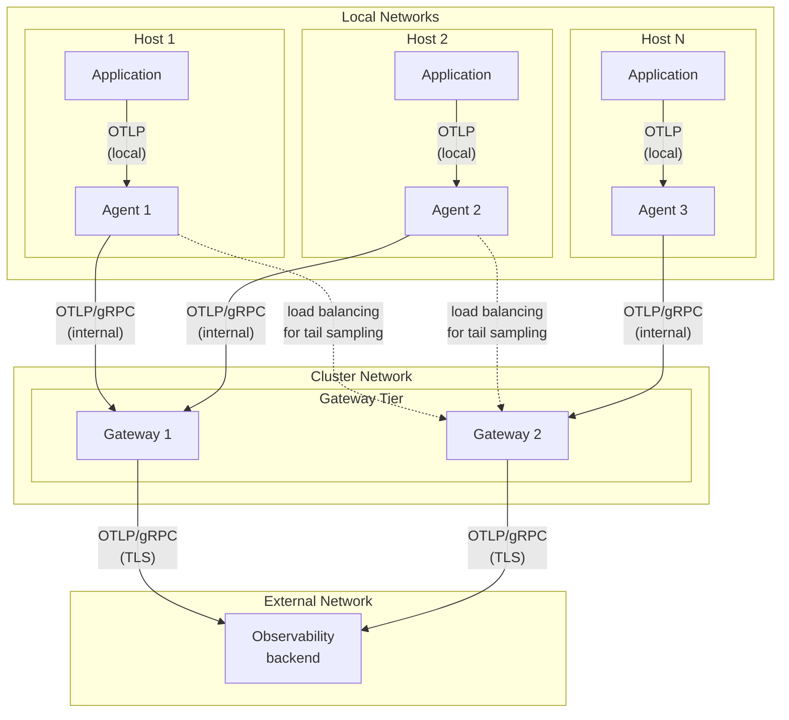
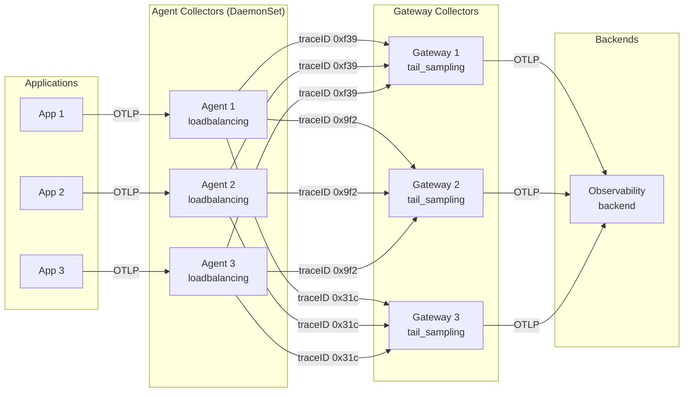

Шаблони [Agent](/docs/collector/deploy/agent/) та [Gateway](/docs/collector/deploy/gateway/) вирішують різні проблеми. Поєднуючи їх у вашому розгортанні, ви можете створити архітектуру спостережуваності, яка вирішує наступні питання:

- **Розділення обовʼязків**: Дозволяє уникати розміщення складної конфігурації та логіки обробки на кожній машині або в кожному вузлі. Конфігурації агентів залишаються невеликими та сфокусованими, тоді як центральні процесори (обробники) виконують більш важкі завдання збору.
- **Масштабоване управління витратами**: Приймайте кращі рішення щодо вибірки та пакетування у шлюзах, які можуть отримувати телеметрію від кількох агентів. Шлюзи можуть бачити повну картину, включаючи повні трасування, і можуть масштабуватися незалежно.
- **Безпека та стабільність**: Надсилайте телеметрію через локальні мережі від агентів до шлюзів. Шлюзи стають стабільною точкою виходу, яка може обробляти повторні спроби та керувати обліковими даними.

## Приклад архітектури Agent-Gateway {#example-agent-to-gateway-architecture}

Наступна діаграма показує архітектуру для комбінованого розгортання Agent-Gateway:

- Колектори-агенти працюють на кожному хості за схемою DaemonSet і збирають телеметричні дані як від служб, що працюють на хості, так і від самого хосту, забезпечуючи при цьому балансування навантаження.
- Колектори-шлюзи отримують дані від агентів, виконують централізовану обробку, таку як фільтрування та вибірка, а потім експортують дані до бекендів.
- Застосунки спілкуються з локальними агентами через внутрішню мережу хосту, агенти спілкуються зі шлюзами через внутрішню мережу кластера, а шлюзи спілкуються з зовнішніми бекендами у захищеному режимі за допомогою TLS.



## Коли використовувати цей шаблон {#when-to-use-this-pattern}

Шаблон Agent-Gateway додає операційну складність порівняно з простішими варіантами розгортання. Використовуйте цей шаблон, коли вам потрібні одна або кілька з наступних можливостей:

- **Централізована обробка**: Ви хочете виконувати складні операції обробки, такі як вибірка на основі хвостів, розширене фільтрування або трансформація даних, у центральному місці, а не на кожному хості.

- **Ізоляція мережі**: Ваші застосунки працюють у обмеженому мережевому середовищі, де лише певні вихідні точки можуть спілкуватися з зовнішніми бекендами.

- **Оптимізація витрат у масштабі**: Вам потрібно приймати рішення щодо вибірки на основі повних даних трасування або виконувати агрегацію з кількох джерел перед надсиланням даних до бекендів.

## Коли простіші шаблони працюють краще {#when-simpler-patterns-work-better}

Вам може не знадобитися шаблон Agent-Gateway, якщо:

- Ваші застосунки можуть надсилати телеметрію безпосередньо до бекендів за допомогою OTLP.
- Вам не потрібно збирати метрики або журнали, специфічні для хосту.
- Вам не потрібна складна обробка, така як вибірка на основі хвостів.
- Ви запускаєте невелике розгортання, де операційна простота важливіша за переваги, які надає цей шаблон.

Для простіших випадків використання розгляньте можливість використання лише [агентів](/docs/collector/deploy/agent/) або лише [шлюзів](/docs/collector/deploy/gateway/).

## Приклади конфігурації {#configuration-examples}

Наступні приклади показують типові конфігурації для агентів і шлюзів у розгортанні за шаблоном Agent-Gateway.

> [!WARNING]
>
> Хоча зазвичай краще привʼязувати точки доступу до `localhost`, коли всі клієнти локальні, наші приклади конфігурацій використовують "не визначену" адресу `0.0.0.0` для зручності. Зазвичай Collector використовує `localhost`. Для деталей щодо будь-якого з цих варіантів як значення конфігурації точки доступу див. [Захист від атак відмови в обслуговуванні](/docs/security/config-best-practices/#protect-against-denial-of-service-attacks).

### Приклад конфігурації агента без балансування навантаження {#example-agent-configuration-without-load-balancing}

Цей приклад показує конфігурацію агента, який збирає телеметрію застосунків і метрики хосту, а потім пересилає їх до шлюзу. Якщо ви плануєте робити вибірку наприкінці, конвертацію кумулятивних метрик у дельту або потребуєте маршрутизації з урахуванням даних з іншої причини, див. [наступну конфігурацію](#example-agent-configuration-with-load-balancing) для прикладу з маршрутизацією з урахуванням даних.

```yaml
receivers:
  # Отримання телеметрії від застосунків
  otlp:
    protocols:
      grpc:
        endpoint: 0.0.0.0:4317

  # Отримання метрик хоста
  hostmetrics:
    scrapers:
      cpu:
      memory:
      disk:
      filesystem:
      network:

processors:
  # Виявлення та додавання атрибутів ресурсу про хост
  resourcedetection:
    detectors: [env, system, docker]
    timeout: 5s

  # Запобігання проблемам з пам'яттю
  memory_limiter:
    check_interval: 1s
    limit_mib: 512

exporters:
  # Відправка до шлюзу
  otlp:
    endpoint: otel-gateway:4317
    # Поглинання короткочасних відмов шлюзу
    sending_queue:
      batch:
        sizer: items
        flush_timeout: 1s

service:
  pipelines:
    traces:
      receivers: [otlp]
      processors: [memory_limiter, resourcedetection]
      exporters: [otlp]
    metrics:
      receivers: [otlp, hostmetrics]
      processors: [memory_limiter, resourcedetection]
      exporters: [otlp]
    logs:
      receivers: [otlp]
      processors: [memory_limiter, resourcedetection]
      exporters: [otlp]
```

### Приклад конфігурації агента з балансуванням навантаження {#example-agent-configuration-with-load-balancing}

Цей приклад показує конфігурацію агента для використання експортера з балансуванням навантаження, виконуючи маршрутизацію телеметрії на основі `traceID`. Маршрутизація з урахуванням даних необхідна для деяких обробок, включаючи вибірку наприкінці та конвертацію кумулятивних метрик у дельту.

```yaml
receivers:
  otlp:
    protocols:
      grpc:
        endpoint: 0.0.0.0:4317

processors:
  memory_limiter:
    check_interval: 1s
    limit_mib: 512

exporters:
  # Балансування навантаження за trace ID
  loadbalancing:
    resolver:
      dns:
        hostname: otel-gateway-headless
        port: 4317
    routing_key: traceID
    sending_queue:
      batch:
        sizer: items
        flush_timeout: 1s

service:
  pipelines:
    traces:
      receivers: [otlp]
      processors: [memory_limiter]
      exporters: [loadbalancing]
```

### Приклад конфігурації шлюзу {#example-gateway-configuration}

Цей приклад показує конфігурацію шлюзу, який отримує дані від агентів, виконує вибірку наприкінці та експортує їх до бекендів:

```yaml
receivers:
  # Отримання даних від агентів
  otlp:
    protocols:
      grpc:
        endpoint: 0.0.0.0:4317

processors:
  # Запобігання проблемам з пам'яттю при більших обмеженнях
  memory_limiter:
    check_interval: 1s
    limit_mib: 2048

  # Необов'язково: вибірка наприкінці
  tail_sampling:
    policies:
      # Завжди вибирати трасування з помилками
      - name: errors-policy
        type: status_code
        status_code: { status_codes: [ERROR] }
      # Вибірка 10% інших трасувань
      - name: probabilistic-policy
        type: probabilistic
        probabilistic: { sampling_percentage: 10 }

exporters:
  # Експорт до вашого бекенду спостереження
  otlp:
    endpoint: your-backend:4317
    headers:
      api-key: ${env:BACKEND_API_KEY}
    # Поглинання короткочасних відмов бекенду
    sending_queue:
      batch:
        sizer: items
        flush_timeout: 10s

service:
  pipelines:
    traces:
      receivers: [otlp]
      processors: [memory_limiter, tail_sampling]
      exporters: [otlp]
    metrics:
      receivers: [otlp]
      processors: [memory_limiter]
      exporters: [otlp]
    logs:
      receivers: [otlp]
      processors: [memory_limiter]
      exporters: [otlp]
```

## Процесори в агентах та шлюзах {#processors-in-agents-and-gateways}

У схемі "агент-шлюз" обробляйте телеметрію обережно, щоб забезпечити точність ваших даних.

### Рекомендована обробка {#recommended-processing}

Обидва, агенти та шлюзи, повинні включати:

- **Процесор обмеження памʼяті**: Цей процесор запобігає проблемам з памʼяттю, застосовуючи зворотний тиск, коли використання памʼяті високе. Налаштуйте його як перший процесор у вашому конвеєрі. Агенти зазвичай потребують менших обмежень, тоді як шлюзи потребують більше памʼяті для пакетної обробки та операцій вибірки. Налаштуйте обмеження відповідно до вимог ваших робочих навантажень та доступних ресурсів.

- **Пакетна обробка**: Ви можете підвищити ефективність, обробляючи телеметрію пакетами перед експортом. Налаштуйте агенти з меншими розмірами пакетів і коротшими тайм-аутами, щоб мінімізувати затримку та використання памʼяті. Налаштуйте шлюзи з більшими розмірами пакетів і довшими тайм-аутами для кращої пропускної здатності та ефективності бекенду.

### Питання щодо вибірки {#sampling-considerations}

- **Ймовірнісна вибірка**: При використанні ймовірнісної вибірки на кількох колекторах переконайтеся, що вони використовують однаковий хеш-сід для узгоджених рішень щодо вибірки.

- **Вибірка наприкінці**: Налаштуйте вибірку наприкінці лише на шлюзах. Процесор повинен бачити всі відрізки з трасування, щоб приймати рішення щодо вибірки. Використовуйте [`loadbalancingexporter`](https://github.com/open-telemetry/opentelemetry-collector-contrib/tree/main/exporter/loadbalancingexporter) у ваших агентах для розподілу трасувань за ідентифікатором трасування до ваших екземплярів шлюзів.

  > [!CAUTION]
  >
  > Процесор вибірки наприкінці може приймати точні рішення лише тоді, коли всі відрізки для трасування надходять на один екземпляр колектора. Хоча експортер балансування навантаження підтримує маршрутизацію за ідентифікатором трасування, запуск вибірки наприкінці на кількох екземплярах шлюзу є складною конфігурацією і має практичні обмеження, такі як повторне розподілення маршрутизації при зміні бекендів та узгодженість кешу/рішень. Тестуйте уважно і віддавайте перевагу одному добре забезпеченому шлюзу з вибіркою наприкінці, якщо у вас немає надійної стратегії "липкої" маршрутизації.

#### Приклад архітектури вибірки наприкінці {#example-tail-sampling-architecture}

Наступна діаграма показує, як балансування навантаження на основі trace-ID працює з вибіркою наприкінці на кількох екземплярах шлюзу.

Експортер `loadbalancingexporter` використовує `traceID`, щоб визначити, який шлюз отримує відрізки

- Всі відрізки з **traceID 0xf39** (з будь-якого агента) спрямовуються до Gateway 1.
- Всі відрізки з **traceID 0x9f2** (з будь-якого агента) спрямовуються до Gateway 2.
- Всі відрізки з **traceID 0x31c** (з будь-якого агента) спрямовуються до Gateway 3.

Ця конфігурація забезпечує, що кожен шлюз бачить всі відрізки для трасування, що дозволяє приймати точні рішення щодо вибірки наприкінці.



### Інші міркування щодо обробки {#other-processing-considerations}

- **Обчислення кумулятивних до дельт**: Обробка метрик кумулятивних до дельт вимагає балансування навантаження з урахуванням даних, оскільки обчислення є точним лише тоді, коли всі точки певної серії метрик надходять на один екземпляр шлюзу. При використанні [`cumulativetodelta` процесора](https://github.com/open-telemetry/opentelemetry-collector-contrib/tree/main/processor/cumulativetodeltaprocessor) у розгортанні агент-шлюз переконайтеся, що кожен потік метрик надсилається на один екземпляр колектора.

## Звʼязок між агентами та шлюзами {#communication-between-agents-and-gateways}

Агенти повинні надійно надсилати телеметричні дані до шлюзів. Налаштуйте протокол звʼязку, кінцеві точки та параметри безпеки відповідно до вашого середовища.

### Вибір протоколу {#protocol-selection}

Використовуйте протокол OTLP для звʼязку між агентами та шлюзами. OTLP забезпечує найкращу сумісність у всій екосистемі OpenTelemetry. Налаштуйте експортер OTLP у ваших агентах для надсилання даних до приймача OTLP у ваших шлюзах.

У середовищах Kubernetes використовуйте імена сервісів для конфігурації точок доступу. Наприклад, якщо ваш сервіс шлюзу називається `otel-gateway`, налаштуйте експортер агента з `endpoint: otel-gateway:4317`.

### Повторні спроби {#retries}

Налаштуйте чергу експорту та параметри повторних спроб (наприклад, `retry_on_failure` або `sending_queue`) на агентах і шлюзах, щоб обробляти тимчасові відключення між агентами та шлюзами або між шлюзами та бекендами. Шлюзи часто потребують більших черг і політик повторних спроб для обробки відключень бекендів. Також розгляньте можливість встановлення `max_size` для пакетів, щоб уникнути тимчасових відмов бекендів через надмірно великі пакети.

## Масштабування агентів та шлюзів {#scaling-agents-and-gateways}

У міру зростання обсягу телеметричних даних необхідно відповідним чином масштабувати колектори. Агенти та шлюзи мають різні характеристики та вимоги щодо масштабування.

### Агенти {#agents}

Агенти зазвичай не потребують горизонтального масштабування, оскільки вони працюють на кожному хості. Натомість масштабування агентів здійснюється вертикально шляхом налаштування обмежень ресурсів. Ви можете моніторити використання CPU та памʼяті за допомогою [внутрішніх метрик](/docs/collector/internal-telemetry/) колектора.

### Шлюзи {#gateways}

Ви можете масштабувати шлюзи як вертикально, так і горизонтально:

- **Без вибірки наприкінці**: Використовуйте будь-який балансувальник навантаження або сервіс Kubernetes з розподілом по колу. Всі екземпляри шлюзу працюють незалежно.

  > [!NOTE]
  >
  > Під час масштабування екземплярів шлюзу, які експортують метрики, переконайтеся, що ваше розгортання дотримується принципу одного записувача, щоб уникнути одночасного запису однієї і тієї ж серії метрик кількома колекторами. Див. [документацію з розгортання шлюзу](/docs/collector/deploy/gateway/#multiple-collectors-and-the-single-writer-principle) для деталей.

- **З вибіркою наприкінці**: Розгорніть агенти з `loadbalancingexporter`, щоб маршрутизувати відрізки за ідентифікатором трасування та забезпечити, щоб усі відрізки для одного трасування надходили до одного екземпляра шлюзу.

Для автоматичного масштабування в Kubernetes використовуйте [Horizontal Pod Autoscaling (HPA)](https://kubernetes.io/docs/concepts/workloads/autoscaling/horizontal-pod-autoscale/) на основі метрик CPU або памʼяті. Налаштуйте HPA для масштабування шлюзів відповідно до ваших шаблонів навантаження.

## Додаткові ресурси {#additional-resources}

Для отримання додаткової інформації див. наступну документацію:

- [Порівняння продуктивності колектора](/docs/collector/benchmarks/)
- [Конфігурація колектора](/docs/collector/configuration/)
- [Процесор cumulative-to-delta](https://github.com/open-telemetry/opentelemetry-collector-contrib/tree/main/processor/cumulativetodeltaprocessor)
- [Експортер балансування навантаження](https://github.com/open-telemetry/opentelemetry-collector-contrib/tree/main/exporter/loadbalancingexporter)
- [Процесор обмеження памʼяті](https://github.com/open-telemetry/opentelemetry-collector/tree/main/processor/memorylimiterprocessor)
- [Процесор вибірки наприкінці](https://github.com/open-telemetry/opentelemetry-collector-contrib/tree/main/processor/tailsamplingprocessor)
