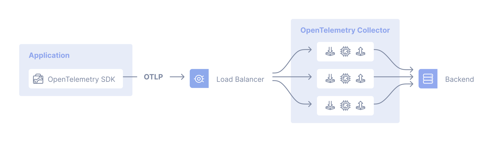
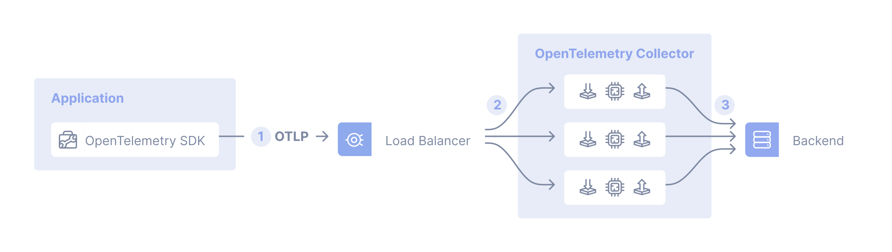
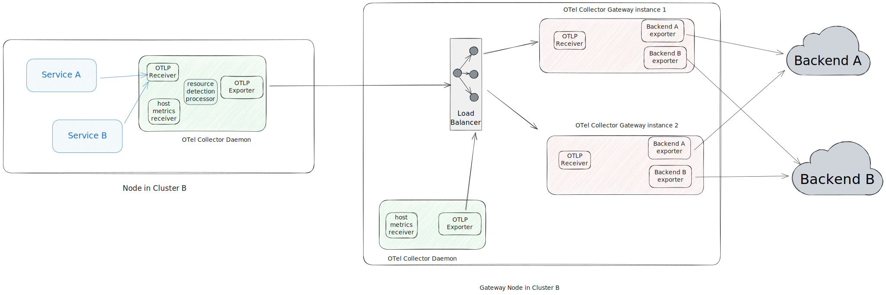

Шаблон розгортання колектора-шлюзу складається з застосунків (або інших колекторів), які надсилають сигнали телеметрії на єдину точку доступу OTLP, що надається одним або кількома екземплярами колектора, які працюють як окрема служба (наприклад, розгортання в Kubernetes), зазвичай на кластер, центр обробки даних або регіон.

У загальному випадку ви можете використовувати готовий балансувальник навантаження для розподілу навантаження між колекторами:



Для випадків, коли обробка даних телеметрії повинна відбуватися в конкретному колекторі, ви можете використовувати дворівневе налаштування з колектором, який має конвеєр, налаштований з [експортером балансування навантаження за ідентифікатором трасування/назвою служби][lb-exporter] на першому рівні та колекторами, що обробляють масштабування на другому рівні. Наприклад, вам потрібно буде використовувати експортер балансування навантаження при використанні [процесора вибіркового відбору наприкінці][tailsample-processor], щоб усі відрізки для цього трасування досягали одного і того ж екземпляра колектора, де застосовується політика вибіркового відбору наприкінці.

Розглянемо такий випадок, коли ми використовуємо експортер балансування навантаження:



1. У застосунку SDK налаштовано на надсилання даних OTLP до центрального місця.
2. Колектор, налаштований з використанням експортера балансування навантаження, який розподіляє сигнали на групу колекторів.
3. Колектори налаштовані на надсилання телеметричних даних до одного або кількох бекендів.

## Приклади {#examples}

### NGINX як "готовий" балансувальник навантаження {#nginx-as-an-out-of-the-box-load-balancer}

Припустимо, у вас є три колектори (`collector1`, `collector2` та `collector2`), налаштовані, і ви хочете балансувати трафік між ними за допомогою NGINX, ви можете використовувати наступну конфігурацію:

```nginx
server {
    listen 4317 http2;
    server_name _;

    location / {
            grpc_pass      grpc://collector4317;
            grpc_next_upstream     error timeout invalid_header http_500;
            grpc_connect_timeout   2;
            grpc_set_header        Host            $host;
            grpc_set_header        X-Real-IP       $remote_addr;
            grpc_set_header        X-Forwarded-For $proxy_add_x_forwarded_for;
    }
}

server {
    listen 4318;
    server_name _;

    location / {
            proxy_pass      http://collector4318;
            proxy_redirect  off;
            proxy_next_upstream     error timeout invalid_header http_500;
            proxy_connect_timeout   2;
            proxy_set_header        Host            $host;
            proxy_set_header        X-Real-IP       $remote_addr;
            proxy_set_header        X-Forwarded-For $proxy_add_x_forwarded_for;
    }
}

upstream collector4317 {
    server collector1:4317;
    server collector2:4317;
    server collector3:4317;
}

upstream collector4318 {
    server collector1:4318;
    server collector2:4318;
    server collector3:4318;
}
```

### Експортер балансування навантаження {#load-balancing-exporter}

Для конкретного прикладу централізованого шаблону розгортання колектора нам спочатку потрібно детальніше розглянути експортер балансування навантаження. Він має два основні поля конфігурації:

- `resolver`, який визначає, де знайти підлеглі (downstream) колектори (або: бекенди). Якщо ви використовуєте підключення `static`, вам доведеться вручну вказати всі URL-адреси колекторів. Інший підтримуваний резолвер — це DNS резолвер, який періодично перевірятиме оновлення та виявлятиме IP-адреси. Для цього типу резолвера підключення `hostname` вказує імʼя хосту для запиту, щоб отримати список IP-адрес.
- З полем `routing_key` ви вказуєте експортеру балансування навантаження маршрутизувати відрізки до конкретних підлеглих колекторів. Якщо ви встановите це поле на `traceID` (стандартно), експортер балансування навантаження експортує відрізки на основі їх `traceID`. В іншому випадку, якщо ви використовуєте `service` як значення для `routing_key`, він експортує відрізки на основі назви їх служби, що корисно при використанні конекторів, таких як [конектор метрик відрізків][spanmetrics-connector], щоб усі відрізки служби надсилалися до одного і того ж підлеглого колектора для збору метрик, гарантуючи точні агрегування.

Колектор першого рівня, що обслуговує точку доступу OTLP, буде налаштований, як показано нижче:

 {}

```yaml
receivers:
  otlp:
    protocols:
      grpc:
        endpoint: 0.0.0.0:4317

exporters:
  loadbalancing:
    protocol:
      otlp:
        tls:
          insecure: true
    resolver:
      static:
        hostnames:
          - collector-1.example.com:4317
          - collector-2.example.com:5317
          - collector-3.example.com

service:
  pipelines:
    traces:
      receivers: [otlp]
      exporters: [loadbalancing]
```

{} {}

```yaml
receivers:
  otlp:
    protocols:
      grpc:
        endpoint: 0.0.0.0:4317

exporters:
  loadbalancing:
    protocol:
      otlp:
        tls:
          insecure: true
    resolver:
      dns:
        hostname: collectors.example.com

service:
  pipelines:
    traces:
      receivers: [otlp]
      exporters: [loadbalancing]
```

{} {}

```yaml
receivers:
  otlp:
    protocols:
      grpc:
        endpoint: 0.0.0.0:4317

exporters:
  loadbalancing:
    routing_key: service
    protocol:
      otlp:
        tls:
          insecure: true
    resolver:
      dns:
        hostname: collectors.example.com
        port: 5317

service:
  pipelines:
    traces:
      receivers: [otlp]
      exporters: [loadbalancing]
```

{} 

Експортер балансування навантаження генерує метрики, включаючи `otelcol_loadbalancer_num_backends` та `otelcol_loadbalancer_backend_latency`, які ви можете використовувати для моніторингу справності та продуктивності колектора точки доступу OTLP.

## Комбіноване розгортання колекторів як агентів та шлюзів {#combined-deployment-of-collectors-as-agents-and-gateways}

Часто розгортання кількох колекторів OpenTelemetry включає запуск як колекторів-шлюзів, так і [агентів](/docs/collector/deployment/agent/).

Наступна діаграма показує архітектуру для такого комбінованого розгортання:

- Ми використовуємо колектори, що працюють у шаблоні розгортання агента (що працюють на кожному хості, подібно до daemonsets Kubernetes), для збору телеметрії зі служб, що працюють на хості, і телеметрії хосту, таких як метрики хосту та збирання логів.
- Ми використовуємо колектори, що працюють у шаблоні розгортання шлюзу, для обробки даних, таких як фільтрація, вибірковий відбір і експорт до бекендів тощо.



Цей комбінований шаблон розгортання необхідний, коли ви використовуєте компоненти у вашому колекторі, які або повинні бути унікальними для кожного хосту, або споживають інформацію, яка доступна лише на тому ж хості, де працює застосунок:

- Приймачі, такі як [`hostmetricsreceiver`](https://github.com/open-telemetry/opentelemetry-collector-contrib/tree/main/receiver/hostmetricsreceiver) або [`filelogreceiver`](https://github.com/open-telemetry/opentelemetry-collector-contrib/tree/main/receiver/filelogreceiver) повинні бути унікальними для кожного екземпляра хосту. Запуск кількох екземплярів цих приймачів призведе до дублювання даних.

- Процесори, такі як [`resourcedetectionprocessor`](https://github.com/open-telemetry/opentelemetry-collector-contrib/tree/main/processor/resourcedetectionprocessor) використовуються для додавання інформації про хост, колектор і застосунок, що працюють на ньому. Запуск їх у колекторі на віддаленій машині призведе до некоректних даних.

## Компроміси {#tradeoffs}

Переваги:

- Розділення обовʼязків, таких як централізоване управління обліковими даними
- Централізоване управління політиками (наприклад, фільтрація певних логів або вибірковий відбір)

Недоліки:

- Це ще одна річ, яку потрібно підтримувати і яка може вийти з ладу (складність)
- Додана затримка у випадку каскадних колекторів
- Вищі загальні витрати ресурсів (витрати)

[lb-exporter]: https://github.com/open-telemetry/opentelemetry-collector-contrib/tree/main/exporter/loadbalancingexporter
[tailsample-processor]: https://github.com/open-telemetry/opentelemetry-collector-contrib/tree/main/processor/tailsamplingprocessor
[spanmetrics-connector]: https://github.com/open-telemetry/opentelemetry-collector-contrib/tree/main/connector/spanmetricsconnector

## Кілька колекторів та принцип єдиного записувача {#multiple-collectors-and-the-single-writer-principle}

Всі потоки даних метрик в OTLP повинні мати [єдиного записувача](/docs/specs/otel/metrics/data-model/#single-writer). При розгортанні декількох колекторів у конфігурації шлюзу важливо переконатися, що всі потоки метрик мають єдиного записувача і глобальний унікальний
ідентифікатор.

### Потенційні проблеми {#potential-problems}

Одночасний доступ з декількох застосунків, які змінюють або звітують про ті самі дані, може призвести до втрати даних або погіршення їх якості. Наприклад, ви можете побачити неузгоджені дані з декількох джерел на одному ресурсі, де різні джерела можуть перезаписати один одного, оскільки ресурс не має однозначної ідентифікації.

Існують закономірності в даних, які можуть дати певне уявлення про те, чи відбувається це чи ні. Наприклад, при візуальному огляді серія з незрозумілими прогалинами або стрибками в одній серії може свідчити про те, що кілька колекторів надсилають одну й ту ж вибірку. Ви також можете побачити помилки у вашому бекенді. Наприклад, у бекенді Prometheus:

`Error on ingesting out-of-order samples`

Ця помилка може вказувати на те, що в двох завданнях існують однакові цілі, а порядок міток часу неправильний. Наприклад:

- Метрика `M1` отримана в `T1` з міткою часу 13:56:04 зі значенням `100`.
- Метрика `M1` отримана о `T2` з міткою часу 13:56:24 зі значенням `120`
- Метрика `M1` отримана о `T3` з часовою міткою 13:56:04 зі значенням `110`
- Метрика `M1` отримана о 13:56:24 зі значенням `120
- Метрика `M1`, отримана о 13:56:04 зі значенням `110

### Поради {#best-practices}

- Використовуйте [обробник атрибутів Kubernetes](https://github.com/open-telemetry/opentelemetry-collector-contrib/tree/main/processor/k8sattributesprocessor) для додавання міток до різних ресурсів Kubernetes.
- Використовуйте [процесор виявлення ресурсів](https://github.com/open-telemetry/opentelemetry-collector-contrib/blob/main/processor/resourcedetectionprocessor/README.md) для виявлення інформації про ресурси на хості та збору метаданих про ресурси.
