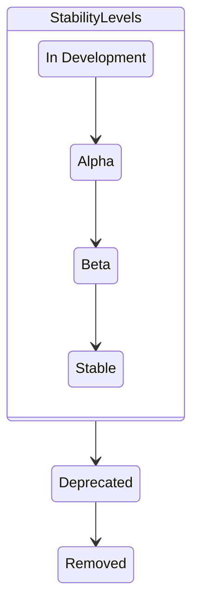

Ви можете перевірити стан будь-якого екземпляра OpenTelemetry Collector за допомогою його внутрішньої телеметрії. Читайте далі, щоб дізнатися про цю телеметрію та як її налаштувати, щоб допомогти вам [моніторити](#use-internal-telemetry-to-monitor-the-collector) та [усувати несправності](/docs/collector/troubleshooting/) Колектора.

> [!WARNING]
>
> Колектор використовує [декларативну схему конфігурації](https://github.com/open-telemetry/opentelemetry-configuration) OpenTelemetry SDK для налаштування експорту внутрішньої телеметрії. Ця схема все ще перебуває на стадії [розробки](/docs/specs/otel/document-status/) і може зазнати **суттєвих змін** у майбутніх випусках. Ми маємо намір продовжувати підтримувати старі схеми до випуску схеми 1.0 і пропонуємо перехідний період для користувачів, щоб оновити свої конфігурації перед тим, як відмовитися від схем pre-1.0. Для отримання детальної інформації та відстеження прогресу див. [Issue #10808](https://github.com/open-telemetry/opentelemetry-collector/issues/10808).

## Активація внутрішньої телеметрії у колекторі {#activate-internal-telemetry-in-the-collector}

Стандартно колектор показує власну телеметрію двома способами:

- Внутрішні [метрики](#configure-internal-metrics) експонуються за допомогою інтерфейсу Prometheus, який стандартно налаштовано на порт `8888`.
- [Журнали](#configure-internal-logs) стандартно виводяться на `stderr`.

### Налаштування атрибутів ресурсів {#configure-resource-attributes}

Колектор автоматично додає атрибути ресурсів `service.name`, `service.version` та `service.instance.id` (генеруються випадковим чином) до своїх внутрішніх телеметричних сигналів. Їх можна вимкнути, встановивши значення атрибуту `null` (наприклад, `service.name: null`).

Якщо ви хочете додати додаткові атрибути ресурсу до внутрішніх телеметричних сигналів колектора (трейси, метрики та журнали), ви можете встановити їх у `service::telemetry::resource`:

```yaml
service:
  telemetry:
    resource:
      attribute_key: 'attribute_value'
```

### Налаштування внутрішніх метрик {#configure-internal-metrics}

#### Експортер OTLP для внутрішніх метрик {#otlp-exporter-for-internal-metrics}

Ви можете налаштувати, як колектор генерує та експонує внутрішні метрики. Стандартно, Колектор генерує основні метрики про себе і експонує їх за допомогою OpenTelemetry Go [Prometheus exporter](https://github.com/open-telemetry/opentelemetry-go/tree/main/exporters/prometheus) для отримання даних за адресою `http://127.0.0.1:8888/metrics`.

Колектор може передавати свої внутрішні метрики до бекенду OTLP за допомогою наступної конфігурації:

```yaml
service:
  telemetry:
    metrics:
      readers:
        - periodic:
            exporter:
              otlp:
                protocol: http/protobuf
                endpoint: https://backend:4318
```

#### Точка доступу Prometheus для внутрішніх метрик {#prometheus-endpoint-for-internal-metrics}

Крім того, ви можете відкрити точку доступу Prometheus для одного певного або всіх мережевих інтерфейсів, коли це необхідно. У контейнерних середовищах ви можете відкрити цей порт на загальнодоступному інтерфейсі.

Налаштуйте конфігурацію Prometheus у розділі `service::telemetry::metrics`:

```yaml
service:
  telemetry:
    metrics:
      readers:
        - pull:
            exporter:
              prometheus:
                host: '0.0.0.0'
                port: 8888
```

Якщо ви хочете додати додаткові мітки до метрик Prometheus, ви можете додати їх за допомогою `prometheus::with_resource_constant_labels`:

```yaml
prometheus:
  host: '0.0.0.0'
  port: 8888
  with_resource_constant_labels:
    included:
      - label_key
```

А потім зробіть посилання на мітки в `service::telemetry::resource`:

```yaml
resource:
  label_key: label_value
```

#### Адреса Service {#service-address}

> [!NOTE] Зміни конфігурації внутрішньої телеметрії
>
> Починаючи з колектора [v0.123.0], параметр `service::telemetry::metrics::address` ігнорується. У попередніх версіях його можна було налаштувати за допомогою:
>
> ```yaml
> service:
>   telemetry:
>     metrics:
>       address: 0.0.0.0:8888
> ```

[v0.123.0]: https://github.com/open-telemetry/opentelemetry-collector/releases/tag/v0.123.0

#### Рівень деталізації метрик {#metrics-verbosity}

Ви можете налаштувати докладність виведення метрик колектора, встановивши в полі `level` одне з наступних значень:

- `none`: телеметрія не збирається.
- `basic`: телеметрія основних сервісів.
- `normal`: стандартний рівень, додає стандартні показники на додачу до базових.
- `detailed`: найбільш докладний рівень, включає виміри та подання.

Кожен рівень деталізації являє собою поріг, при якому певні метрики будуть видаватися. Повний список метрик з розбивкою за рівнями наведено у [Списку внутрішніх метрик](#lists-of-internal-metrics).

Стандартний рівень виведення метрик — `normal`. Щоб використовувати інший рівень, задайте `service::telemetry::metrics::level`:

```yaml
service:
  telemetry:
    metrics:
      level: detailed
```

#### Перегляд метрик {#metric-views}

Ви можете додатково налаштувати виведення метрик з колектора за допомогою [`views`](/docs/specs/otel/metrics/sdk/#view). Наприклад, у наведених нижче налаштуваннях метрику з назвою `otelcol_process_uptime` буде оновлено на нову назву `process_uptime` та опис:

```yaml
service:
  telemetry:
    metrics:
      views:
        - selector:
            instrument_name: otelcol_process_uptime
            instrument_type:
          stream:
            name: process_uptime
            description: The amount of time the Collector has been up
```

Ви також можете використовувати `views` для оновлення кінцевої агрегації, атрибутів та лімітів кардинальності. Для повного списку опцій дивіться приклади у схемі конфігурації OpenTelemetry [репозиторій](https://github.com/open-telemetry/opentelemetry-configuration/blob/main/snippets/View_kitchen_sink.yaml).

### Налаштування внутрішніх журналів {#configure-internal-logs}

Вивід логів знаходиться у файлі `stderr`. Налаштувати логи можна у конфігураційному файлі `service::telemetry::logs`. Ось [параметри конфігурації](https://github.com/open-telemetry/opentelemetry-collector/blob/main/service/telemetry/otelconftelemetry/config.go):

| Назва поля             | Стандартне значення | Опис                                                                                                                                                                                                                                                                                                                                                                            |
| ---------------------- | ------------------- | ------------------------------------------------------------------------------------------------------------------------------------------------------------------------------------------------------------------------------------------------------------------------------------------------------------------------------------------------------------------------------- |
| `level`                | `INFO`              | Задає мінімальний дозволений рівень ведення журналу. Інші можливі значення: `DEBUG`, `WARN` та `ERROR`.                                                                                                                                                                                                                                                                         |
| `development`          | `false`             | Переводить логер у режим розробки.                                                                                                                                                                                                                                                                                                                                              |
| `encoding`             | `console`           | Задає кодування журналу. Іншим можливим значенням є `json`.                                                                                                                                                                                                                                                                                                                     |
| `disable_caller`       | `false`             | Зупиняє анотування журналів із зазначенням імені файлу та номера рядка функції, що його викликала. Типово, всі логи анотовано.                                                                                                                                                                                                                                                  |
| `disable_stacktrace`   | `false`             | Вимикає автоматичне захоплення stacktrace. Stacktraces записуються для журналів з рівнем `WARN` і вище у розробці та з рівнем `ERROR` і вище у промисловій експлуатації.                                                                                                                                                                                                        |
| `sampling::enabled`    | `true`              | Встановлює політику вибірки.                                                                                                                                                                                                                                                                                                                                                    |
| `sampling::tick`       | `10s`               | Інтервал у секундах, який логер застосовує до кожної вибірки.                                                                                                                                                                                                                                                                                                                   |
| `sampling::initial`    | `10`                | Кількість повідомлень, що реєструються на початку кожного `sampling::tick`.                                                                                                                                                                                                                                                                                                     |
| `sampling::thereafter` | `100`               | Задає політику вибірки для наступних повідомлень після того, як до журналу буде записано повідомлення `sampling::initial`. Якщо `sampling::thereafter` встановлено у `N`, кожне `N`-е повідомлення буде записано до журналу, а всі інші буде пропущено. Якщо `N` дорівнює нулю, логер пропускає усі повідомлення після того, як буде записано повідомлення `sampling::initial`. |
| `output_paths`         | `["stderr"]`        | Список URL-адрес або шляхів до файлів для запису виводу журналу.                                                                                                                                                                                                                                                                                                                |
| `error_output_paths`   | `["stderr"]`        | Список URL-адрес або шляхів до файлів, куди слід записувати помилки журналу.                                                                                                                                                                                                                                                                                                    |
| `initial_fields`       |                     | Набір статичних пар ключ-значення, що додаються до всіх записів журналу для збагачення контексту журналу. Типово, початкове поле відсутнє.                                                                                                                                                                                                                                      |

Ви також можете переглянути журнали колектора у системі Linux systemd за допомогою `journalctl`:

 {}

```sh
journalctl | grep otelcol
```

{} {}

```sh
journalctl | grep otelcol | grep Error
```

{} 

Наступна конфігурація може бути використана для надсилання внутрішніх журналів з Колектора до OTLP/HTTP бекенда:

```yaml
service:
  telemetry:
    logs:
      processors:
        - batch:
            exporter:
              otlp:
                protocol: http/protobuf
                endpoint: https://backend:4318
```

### Налаштування внутрішніх трейсів {#configure-internal-traces}

Стандартно колектор не показує трасування, але його можна налаштувати.

> [!CAUTION]
>
> Внутрішнє трасування є експериментальною функцією, і немає жодних гарантій щодо стабільності назв та атрибутів відрізків, що генеруються.

Наступна конфігурація може бути використана для надсилання внутрішніх трейсів з Колектора до бекенду OTLP:

```yaml
service:
  telemetry:
    traces:
      processors:
        - batch:
            exporter:
              otlp:
                protocol: http/protobuf
                endpoint: https://backend:4318
```

Додаткові параметри наведено у [example configuration][kitchen-sink-config]. Зверніть увагу, що розділ `tracer_provider` там відповідає `traces` тут.

[kitchen-sink-config]: https://github.com/open-telemetry/opentelemetry-configuration/blob/v0.3.0/examples/kitchen-sink.yaml

## Типи внутрішньої телеметрії {#types-of-internal-telemetry}

OpenTelemetry Collector прагне бути зразком спостережуваного сервісу, чітко показуючи свої власні операційні метрики. Крім того, він збирає метрики ресурсів хосту, які можуть допомогти вам зрозуміти, чи проблеми спричинені іншим процесом на тому ж хості. Окремі компоненти Колектора також можуть створювати власні телеметричні дані. У цьому розділі ви дізнаєтеся про різні типи спостережуваності, які генерує сам Колектор.

### Підсумок значень, спостережуваних за допомогою внутрішніх метрик {#summary-of-values-observable-with-internal-metrics}

Колектор генерує внутрішні метрики щонайменше для таких значень:

- Час роботи процесу та час роботи CPU з моменту запуску.
- Використання памʼяті процесу та купи.
- Для приймачів: Прийняті та відхилені елементи для кожного типу даних.
- Для процесорів: Вхідні та вихідні елементи.
- Для експортерів: Елементи, які експортер надіслав, не поставив у чергу і не надіслав, за кожним типом даних.
- Для експортерів: Розмір і ємність черги.
- Кількість, тривалість і розмір HTTP/gRPC запитів і відповідей.

Більш детальний список доступний у наступних розділах.

### Назви метрик {#metric-names}

У цьому розділі пояснюються спеціальні правила іменування, що застосовуються до деяких внутрішніх метрик.

#### Префікс `otelcol_` {#otelcol-prefix}

Починаючи з Collector v0.106.1, внутрішні назви метрик обробляються по-різному залежно від їхнього джерела:

- Метрики, створені з компонентів Колектора, мають префікс `otelcol_`.
- Метрики, створені з інструментальних бібліотек, стандартно не використовують префікс `otelcol_`, якщо тільки в їхніх назвах явно не вказано префікс.

У версіях Колектора до v0.106.1 всі внутрішні метрики, створені за допомогою експортера Prometheus, незалежно від їхнього походження, мають префікс `otelcol_`. Це включає метрики як з компонентів Колектора, так і з інструментальних бібліотек.

#### Суфікс `_total` {#total-suffix}

Стандартно і тільки для Prometheus, експортер Prometheus додає суфікс `_total` до сумарних метрик, щоб дотримуватися правил іменування Prometheus, наприклад `otelcol_exporter_send_failed_spans_total`. Цю поведінку можна вимкнути, встановивши `without_type_suffix: false` у конфігурації експортера Prometheus.

Якщо ви залишите `service::telemetry::metrics::readers` у конфігурації Collector, стандартний експортер Prometheus, налаштований Колектором, вже має `without_type_suffix` встановлений у `false`. Однак, якщо ви налаштуєте читачів і вручну додасте експортер Prometheus, ви повинні встановити цю опцію, щоб повернутися до "raw" імені метрики. Для отримання додаткової інформації див. [Примітки до випуску Collector v1.25.0/v0.119.0](https://github.com/codeboten/opentelemetry-collector/blob/313167505b44e5dc9a29c0b9242cc4547db11ec3/CHANGELOG.md#v1250v01190).

Внутрішні метрики, що експонуються через OTLP, не мають цієї поведінки. [Внутрішні метрики](#lists-of-internal-metrics) на цій сторінці наведені в OTLP форматі, такі як `otelcol_exporter_send_failed_spans`.

#### Крапки (`.`) чи підкреслення (`_`) {#dots-v-underscores}

Метрики `http*` та `rpc*` походять з бібліотек інструментування. У їхніх оригінальних назвах використовувалися крапки (`.`). До версії Collector v0.120.0 внутрішні метрики, що експонувались за допомогою Prometheus, замінювали крапки (`.`) на підкреслення (`_`) відповідно до правил іменування Prometheus, в результаті чого назви метрик мали вигляд `rpc_server_duration`.

Версії 0.120.0 і пізніші колектора використовують сканери Prometheus 3.0, тому оригінальні назви метрик `http*` і `rpc*` з крапками зберігаються. [Внутрішні метрики](#lists-of-internal-metrics) на цій сторінці наведені у своїй оригінальній формі, такі як `rpc.server.duration`. Для отримання додаткової інформації див. [Примітки до випуску Collector v0.120.0](https://github.com/open-telemetry/opentelemetry-collector-contrib/blob/main/CHANGELOG.md#v01200).

### Списки внутрішніх метрик {#lists-of-internal-metrics}

У наступних таблицях кожна внутрішня метрика згрупована за рівнем деталізації: `basic`,
`normal`, та `detailed`. Кожна метрика ідентифікується за назвою та описом і класифікується за типом інструментарію.



Щоб скласти цей список, налаштуйте екземпляр колектора на надсилання власних метрик на точку доступу localhost:8888/metrics. Виберіть метрику і виконайте grep для неї у основному репозиторії колектора. Наприклад, `otelcol_process_memory_rss` можна знайти за допомогою:`grep -Hrn "memory_rss" .` Переконайтеся, що вилучили з пошукового рядка всі слова, які можуть бути префіксами. Переглядайте результати, поки не знайдете .go-файл, який містить список метрик. У випадку з `otelcol_process_memory_rss`, його та інші метрики процесу можна знайти за адресою <https://github.com/open-telemetry/opentelemetry-collector/blob/31528ce81d44e9265e1a3bbbd27dc86d09ba1354/service/internal/proctelemetry/process_telemetry.go#L92>. Зауважте, що внутрішні метрики колектора визначено у кількох різних файлах у репозиторії.



#### Метрики рівня `basic` {#basic-level-metrics}

| Назва метрики                                          | Опис                                                                                       | Тип     |
| ------------------------------------------------------ | ------------------------------------------------------------------------------------------ | ------- |
| `otelcol_exporter_enqueue_failed_`<br>`log_records`    | Кількість журналів, які експортер(и) не зміг(ли) поставити в чергу.                        | Counter |
| `otelcol_exporter_enqueue_failed_`<br>`metric_points`  | Кількість пунктів метрики, які експортер(и) не зміг(ли) подати на розгляд.                 | Counter |
| `otelcol_exporter_enqueue_failed_`<br>`spans`          | Кількість відрізків, на які експортер(и) не зміг подати заявку.                            | Counter |
| `otelcol_exporter_queue_capacity`                      | Фіксована ємність черги надсилання, в партіях.                                             | Gauge   |
| `otelcol_exporter_queue_size`                          | Поточний розмір черги на надсилання, в партіях.                                            | Gauge   |
| `otelcol_exporter_send_failed_`<br>`log_records`       | Кількість журналів, які експортер(и) не зміг(ли) надіслати до місця призначення.           | Counter |
| `otelcol_exporter_send_failed_`<br>`metric_points`     | Кількість пунктів метрики, які експортер(и) не зміг(ли) відправити до місця призначення.   | Counter |
| `otelcol_exporter_send_failed_`<br>`spans`             | Кількість відрізків, які експортер(и) не зміг(ли) надіслати до місця призначення.          | Counter |
| `otelcol_exporter_sent_log_records`                    | Кількість журналів, успішно надісланих до місця призначення.                               | Counter |
| `otelcol_exporter_sent_metric_points`                  | Кількість пунктів метрики, успішно надісланих до місця призначення.                        | Counter |
| `otelcol_exporter_sent_spans`                          | Кількість успішно надісланих до місця призначення відрізків.                               | Counter |
| `otelcol_process_cpu_seconds`                          | Загальний час роботи CPU в просторі користувача та системи в секундах.                     | Counter |
| `otelcol_process_memory_rss`                           | Загальна фізична памʼять (розмір резидентного набору) в байтах.                            | Gauge   |
| `otelcol_process_runtime_heap_`<br>`alloc_bytes`       | Байти виділених обʼєктів купи (див. 'go doc runtime.MemStats.HeapAlloc').                  | Gauge   |
| `otelcol_process_runtime_total_`<br>`alloc_bytes`      | Кумулятивні байти, виділені для обʼєктів купи (див. 'go doc runtime.MemStats.TotalAlloc'). | Counter |
| `otelcol_process_runtime_total_`<br>`sys_memory_bytes` | Загальна кількість байтів памʼяті, отриманих від ОС (див. 'go doc runtime.MemStats.Sys').  | Gauge   |
| `otelcol_process_uptime`                               | Час безвідмовної роботи процесу в секундах.                                                | Counter |
| `otelcol_processor_incoming_items`                     | Кількість елементів, переданих процесору.                                                  | Counter |
| `otelcol_processor_outgoing_items`                     | Кількість елементів, переданих з процесора.                                                | Counter |
| `otelcol_receiver_accepted_`<br>`log_records`          | Кількість логів, які успішно потрапили в конвеєр і були проштовхнуті в нього.              | Counter |
| `otelcol_receiver_accepted_`<br>`metric_points`        | Кількість точок метрики, які були успішно отримані та проштовхнуті в конвеєр.              | Counter |
| `otelcol_receiver_accepted_spans`                      | Кількість відрізків, які були успішно отримані та проштовхнуті в конвеєр.                  | Counter |
| `otelcol_receiver_refused_`<br>`log_records`           | Кількість логів, які не вдалося проштовхнути в конвеєр.                                    | Counter |
| `otelcol_receiver_refused_`<br>`metric_points`         | Кількість точок метрик, які не вдалося проштовхнути в конвеєр.                             | Counter |
| `otelcol_receiver_refused_spans`                       | Кількість відрізків, які не вдалося проштовхнути в конвеєр.                                | Counter |
| `otelcol_scraper_errored_`<br>`metric_points`          | Кількість точок метрик, які не вдалося отримати колектору.                                 | Counter |
| `otelcol_scraper_scraped_`<br>`metric_points`          | Кількість точок метрики, отриманих колектором.                                             | Counter |

#### Додаткові метрики рівня `normal` {#additional-normal-level-metrics}

| Назва метрики                                           | Опис                                                                           | Тип       |
| ------------------------------------------------------- | ------------------------------------------------------------------------------ | --------- |
| `otelcol_processor_batch_batch_`<br>`send_size`         | Кількість одиниць у надісланій партії.                                         | Histogram |
| `otelcol_processor_batch_batch_size_`<br>`trigger_send` | Кількість разів, коли партія була надіслана через спрацювання тригера розміру. | Counter   |
| `otelcol_processor_batch_metadata_`<br>`cardinality`    | Кількість різних комбінацій значень метаданих, що обробляються.                | Counter   |
| `otelcol_processor_batch_timeout_`<br>`trigger_send`    | Кількість разів, коли пакет було надіслано через спрацювання тайм-ауту.        | Counter   |

> [!NOTE] Зміни рівня метрик пакетних процесорів
>
> У Collector [v0.99.0] усі метрики пакетного процесора було покращено з `basic` до `normal` (поточний рівень), окрім `otelcol_processor_batch_batch_send_size_bytes`, яка була `detailed` з моменту її запровадження. Зауважте, однак, що ці метрики було випадково повернуто до `basic` з v0.109.0 до v0.121.0.

[v0.99.0]: https://github.com/open-telemetry/opentelemetry-collector/releases/tag/v0.99.0

#### Додаткові метрики рівня `detailed` {#additional-detailed-level-metrics}

| Назва метрики                                         | Опис                                                                                                | Тип       |
| ----------------------------------------------------- | --------------------------------------------------------------------------------------------------- | --------- |
| `http.client.request.body.size`                       | Вимірює розмір тіла запиту клієнта HTTP.                                                            | Counter   |
| `http.client.request.duration`                        | Вимірює тривалість запитів клієнта HTTP.                                                            | Histogram |
| `http.server.request.body.size`                       | Вимірює розмір тіла запиту сервера HTTP.                                                            | Counter   |
| `http.server.request.duration`                        | Вимірює тривалість запитів сервера HTTP.                                                            | Histogram |
| `http.server.response.body.size`                      | Вимірює розмір тіла відповіді сервера HTTP.                                                         | Counter   |
| `otelcol_processor_batch_batch_`<br>`send_size_bytes` | Кількість байт у пакеті, який було надіслано.                                                       | Histogram |
| `rpc.client.duration`                                 | Вимірює тривалість вихідного RPC.                                                                   | Histogram |
| `rpc.client.request.size`                             | Вимірює розмір повідомлень RPC-запитів (без стиснення).                                             | Histogram |
| `rpc.client.requests.per.rpc`                         | Вимірює кількість повідомлень, отриманих на один RPC. Має дорівнювати 1 для всіх не потокових RPC.  | Histogram |
| `rpc.client.response.size`                            | Вимірює розмір повідомлень-відповідей RPC (без стиснення).                                          | Histogram |
| `rpc.client.responses.per.rpc`                        | Вимірює кількість повідомлень, надісланих за один RPC. Має дорівнювати 1 для всіх не потокових RPC. | Histogram |
| `rpc.server.duration`                                 | Вимірює тривалість вхідного RPC.                                                                    | Histogram |
| `rpc.server.request.size`                             | Вимірює розмір повідомлень RPC-запитів (без стиснення).                                             | Histogram |
| `rpc.server.requests.per.rpc`                         | Вимірює кількість повідомлень, отриманих на один RPC. Має дорівнювати 1 для всіх не потокових RPC.  | Histogram |
| `rpc.server.response.size`                            | Вимірює розмір повідомлень-відповідей RPC (без стиснення).                                          | Histogram |
| `rpc.server.responses.per.rpc`                        | Вимірює кількість повідомлень, надісланих за один RPC. Має дорівнювати 1 для всіх не потокових RPC. | Histogram |

> [!NOTE]
>
> Метрики `http*` та `rpc*` не охоплюються наведеними нижче рівнями зрілості, оскільки вони не перебувають під контролем Collector SIG.
>
> Метрики `otelcol_processor_batch_` є унікальними для `batchprocessor`.
>
> Метрики `otelcol_receiver_`, `otelcol_scraper_`, `otelcol_processor_` і `otelcol_exporter_` походять з відповідних пакетів `helper`. Таким чином, деякі компоненти, які не використовують ці пакунки, можуть не виводити їх.

### Події, які можна спостерігати у внутрішніх журналах {#events-observable-with-internal-logs}

Колектор реєструє такі внутрішні події:

- Запуск або зупинка екземпляра колектора.
- Починається втрата даних через тротлінг з певної причини, наприклад, локальне насичення, низхідне насичення, низхідна недоступність тощо.
- Втрата даних через зупинку тротлінгу.
- Починається втрата даних через недопустимі дані. Приклад невірних даних додається.
- Припиняється втрата даних через недопустимі дані.
- Виявлено аварію, що відрізняється від чистої зупинки. Дані про аварію включено, якщо вони доступні.

## Рівні зрілості телеметрії {#telemetry-maturity-levels}

Рівні зрілості телеметрії Колектора застосовуються до всієї сторонньої телеметрії, створеної Колектором. Бібліотеки сторонніх розробників, у тому числі OpenTelemetry Go, не охоплюються цими рівнями зрілості.

### Трасування {#traces}

Інструментування трасування все ще перебуває у стадії активної розробки, тому можуть бути внесені зміни до назв відрізків, доданих атрибутів, інструментованих точок доступу або інших аспектів телеметрії. Доки ця функція не стане стабільною, немає жодних гарантій зворотної сумісності для інструментування трасування.

### Метрики {#metrics}

Власні метрики Collector відповідають такому життєвому циклу:



Рівні стабільності відповідають семантичним [домовленостям][SemConvGuidance], виведеним з [OTEP-0232][OTEP-0232]. Метрики колектора пропускають рівень `release_candidate`.

Зверніть увагу, що застарілі та видалені етапи є станами життєвого циклу, а не рівнями стабільності.

Сторонні метрики, включаючи ті, що генеруються інструментальними бібліотеками OpenTelemetry Go, не охоплюються цими рівнями зрілості.

#### Розробка {#development}

Показники розробки все ще знаходяться в стадії активної розробки і можуть змінюватися в будь-якій версії.

#### Альфа-метрика {#alpha}

Альфа-метрики не мають гарантій стабільності. Ці метрики можуть бути змінені або видалені в будь-який час.

#### Бета-метрика {#beta}

Бета-метрики можуть змінюватися між релізами, але власники компонентів повинні намагатися мінімізувати руйнівні зміни. Цей етап сприяє ширшому використанню і є останнім кроком перед переходом до стадії `stable`.

#### Стабільна метрика {#stable}

Стабільні метрики гарантовано не змінюватимуться. Це означає:

- Стабільна метрика без статусу застарілої не буде видалена або перейменована.
- Тип та атрибути стабільної метрики не будуть змінені.

#### Застаріла метрика {#deprecated}

Застарілі метрики планується видалити, але вони все ще доступні для використання. Опис цих метрик включає анотацію про версію, в якій вони стали застарілими. Наприклад:

Перед застаріванням:

```sh
# HELP otelcol_exporter_queue_size це рахує щось
# TYPE otelcol_exporter_queue_size лічильник
otelcol_exporter_queue_size 0
```

Після застарівання:

```sh
# HELP otelcol_exporter_queue_size (Застаріла з 1.15.0) це рахує щось
# TYPE otelcol_exporter_queue_size лічильник
otelcol_exporter_queue_size 0
```

#### Видалена метрика {#deleted}

Видалені метрики більше не публікуються і не можуть бути використані.

### Журнали {#logs}

Окремі записи журналу та їх форматування можуть змінюватися від випуску до випуску. Наразі немає жодних гарантій стабільності.

## Використання внутрішньої телеметрії для моніторингу колектора {#use-internal-telemetry-to-monitor-the-collector}

У цьому розділі наведено найкращі практики моніторингу колектора за допомогою його власної телеметрії.

### Моніторинг {#monitoring}

#### Довжина черги {#queue-length}

Більшість експортерів надають [механізм черги та/або повторної спроби](https://github.com/open-telemetry/opentelemetry-collector/blob/main/exporter/exporterhelper/README.md), який рекомендується використовувати у будь-якому промисловому розгортанні Колектора.

Метрика `otelcol_exporter_queue_capacity` вказує ємність черги надсилання у пакетах. Метрика `otelcol_exporter_queue_size` показує поточний розмір черги надсилання. Використовуйте ці дві метрики, щоб перевірити, чи може ємність черги витримати ваше робоче навантаження.

За допомогою наступних трьох метрик ви можете визначити кількість відрізків, точок метрики і записів журналу, які не потрапили до черги надсилання:

- `otelcol_exporter_enqueue_failed_spans
- `otelcol_exporter_enqueue_failed_metric_points
- `otelcol_exporter_enqueue_failed_log_records

Ці помилки можуть бути спричинені переповненням черги невстановленими елементами. Можливо, вам слід зменшити швидкість надсилання або горизонтально масштабувати колектори.

Механізм черги або повторної спроби також підтримує ведення журналу для моніторингу. Перевірте журнали на наявність таких повідомлень, як `Dropping data because sending_queue is full`.

#### Помилки отримання {#receive-failures}

Сталі значення `otelcol_receiver_refused_log_records`, `otelcol_receiver_refused_spans` і `otelcol_receiver_refused_metric_points` вказують на те, що клієнтам було повернуто занадто багато помилок. Залежно від розгортання та відмовостійкості клієнтів, це може свідчити про втрату даних клієнтами.

Сталі показники `otelcol_exporter_send_failed_log_records`, `otelcol_exporter_send_failed_spans` і `otelcol_exporter_send_failed_metric_points` вказують на те, що колектор не може експортувати дані належним чином. Ці метрики за своєю суттю не означають втрату даних, оскільки можуть бути повторні спроби. Але висока кількість невдалих спроб може вказувати на проблеми з мережею або бекендом, який отримує дані.

#### Потік даних {#data-flow}

Ви можете відстежувати надходження даних за допомогою метрик `otelcol_receiver_accepted_log_records`, `otelcol_receiver_accepted_spans` і `otelcol_receiver_accepted_metric_points` та вихід даних за допомогою метрик `otelcol_exporter_sent_log_records`, `otelcol_exporter_sent_spans` і `otelcol_exporter_sent_metric_points`.

[SemConvGuidance]: /docs/specs/semconv/general/semantic-convention-groups#group-stability
[OTEP-0232]: https://github.com/open-telemetry/opentelemetry-specification/blob/v1.50.0/oteps/0232-maturity-of-otel.md
