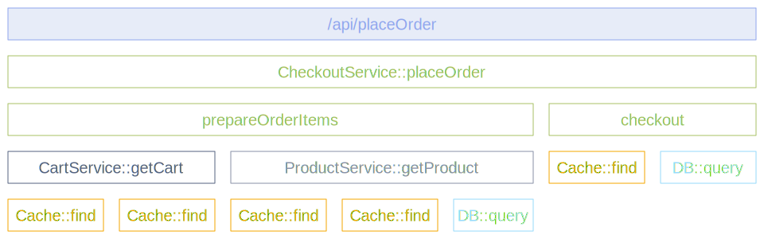

[Область застосування інструментування](/docs/specs/otel/common/instrumentation-scope/) представляє логічну одиницю в коді застосунку, з якою можна асоціювати поширювану телеметрію.

Розробники можуть вирішити, що означає розумну область інструментування. Наприклад, вони можуть вибрати модуль, пакет або клас як область інструментування. У випадку бібліотеки або фреймворку, загальним підходом є використання ідентифікатора як області, який є унікальним для бібліотеки або фреймворку, наприклад, повністю кваліфіковане імʼя
та версія бібліотеки або фреймворку. Якщо сама бібліотека не має вбудованого інструментування OpenTelemetry, і замість цього використовується бібліотека інструментування, використовуйте імʼя та версію бібліотеки інструментування як область інструментування.

Область інструментування визначається парою імʼя та версія, коли трасувальник, лічильник або екземпляр логера отримується від провайдера. Кожен відрізок, метрика або запис журналу, створений екземпляром, асоціюється з наданою областю інструментування.

У вашій системі спостереження, області дозволяють розділяти та аналізувати ваші телеметричні дані за областями, наприклад, щоб побачити, які з ваших користувачів використовують яку версію бібліотеки та яка продуктивність цієї версії бібліотеки, або щоб вказати проблему на конкретний модуль вашого застосунку.

Наступна діаграма ілюструє трейс з декількома областями інструментування. Різні області представлені різними кольорами:

- У верхній частині відрізок `/api/placeOrder` згенерований використовуваним HTTP фреймворком.
- Відрізки зеленого кольору (`CheckoutService::placeOrder`, `prepareOrderItems` та `checkout`) є кодом застосунку, згрупованим за класом `CheckoutService`.
- Відрізки для `CartService::getCart` та `ProductService::getProduct` також є кодом застосунку, згрупованим за класами `CartService` та `ProductService`.
- Відрізки помаранчевого кольору (`Cache::find`) та світло-блакитного кольору (`DB::query`) є кодом бібліотеки, згрупованим за імʼям та версією бібліотеки.

