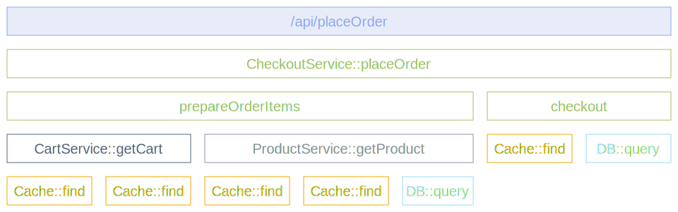

[Область застосування інструментування](/docs/specs/otel/common/instrumentation-scope/)  – це логічна одиниця програмного забезпечення, з якою асоціюється телеметрія, що генерується. Вона може представляти модуль, пакунок, клас, бібліотеку або фреймворк — будь-який значущий кордон, який розробник обирає для розрізнення одного джерела телеметрії від іншого.

## Як визначається область {#how-a-scope-is-defined}

Область ідентифікується кортежем `(name, version, schema_url, attributes)`, де `version`, `schema_url` та `attributes` є необовʼязковими. `name` має унікально ідентифікувати логічну одиницю програмного забезпечення — наприклад, повністю кваліфіковане імʼя бібліотеки, класу або модуля.

Ви вказуєте область при отриманні трасувальника, лічильника або логера від провайдера. Кожен відрізок, метрика та запис журналу, створені цим екземпляром, потім позначаються областю:

- **Для бібліотек та фреймворків**: використовуйте повністю кваліфіковане імʼя та версію бібліотеки як область. Якщо ви пишете бібліотеку інструментування для бібліотеки, яка не має вбудованої підтримки OpenTelemetry, використовуйте імʼя та версію самої бібліотеки інструментування.
- **Для коду застосунку**: поширеним вибором є імʼя класу або модуля, наприклад `CheckoutService`.

## Чому області важливі {#why-scopes-matter}

У вашій системі спостереження ви можете фільтрувати, групувати та порівнювати телеметрію за областю. Це дозволяє визначити, яка версія бібліотеки спричиняє затримку, ізолювати сигнали від конкретного модуля або порівнювати поведінку різних версій одного компонента.

## Області в трасуванні {#scopes-in-a-trace}

Наступна діаграма показує трейс з відрізків з шести різних областей інструментування, позначених кольорами та ідентифікованих у легенді:

- Область `http-framework` створює кореневий відрізок `/api/placeOrder`.
- Область `CheckoutService` створює `CheckoutService::placeOrder`, `CheckoutService::prepareOrderItems` та `CheckoutService::checkout`. Усі три відрізки мають однакову область інструментування, оскільки вони створені одним екземпляром трасувальника, отриманим з імʼям `CheckoutService`.
- Області `CartService` та `ProductService` кожна створює відрізок з відповідних компонентів застосунку.
- Області `Cache library` та `DB library` створюють відрізки з коду бібліотек, згруповані за імʼям та версією бібліотеки.

