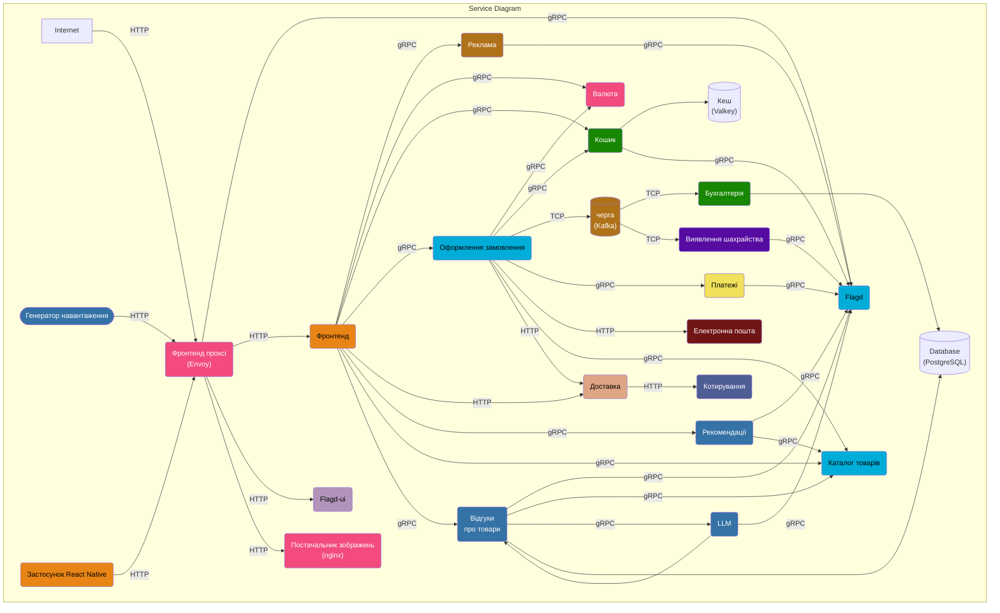
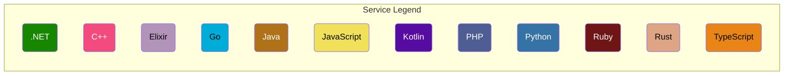
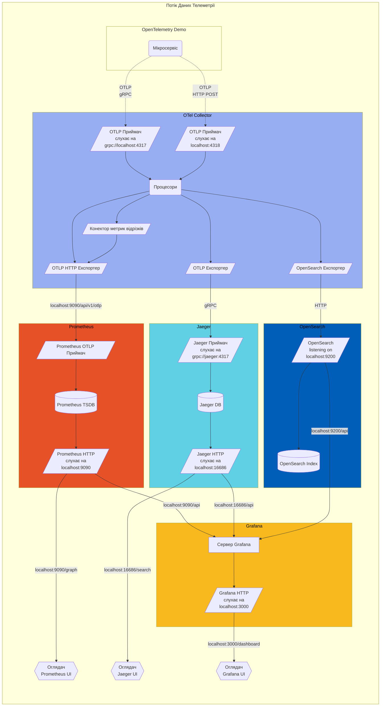

**OpenTelemetry Demo** складається з мікросервісів, написаних різними мовами програмування, які взаємодіють між собою через gRPC та HTTP; і генератора навантаження, який використовує [Locust](https://locust.io/) для імітації користувацького трафіку.

Перейдіть за цими посиланнями, щоб дізнатися про поточний стан [логів](/docs/demo/telemetry-features/log-coverage/), [метрик](/docs/demo/telemetry-features/metric-coverage/) та [трасування](/docs/demo/telemetry-features/trace-coverage/) інструментування демонстраційних застосунків.

Колектор налаштований в [otelcol-config.yml](https://github.com/open-telemetry/opentelemetry-demo/blob/main/src/otel-collector/otelcol-config.yml), альтернативні експортери можна налаштувати тут.

Дивіться **Визначення Протокольних Буферів** у теці `/pb/`.
