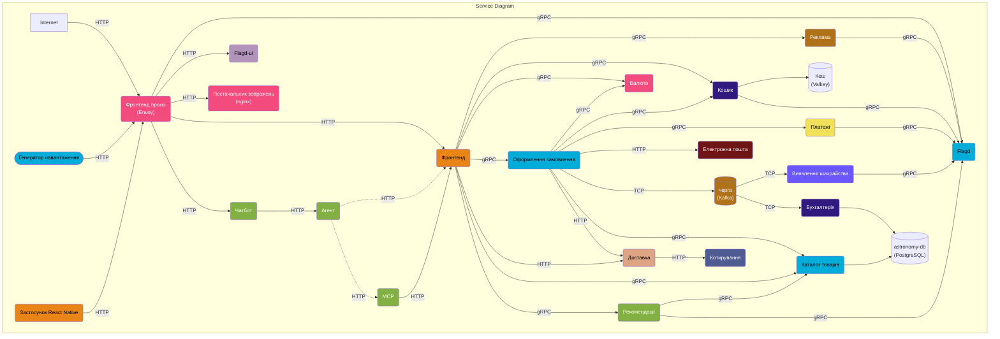
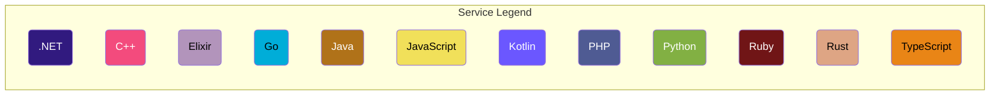
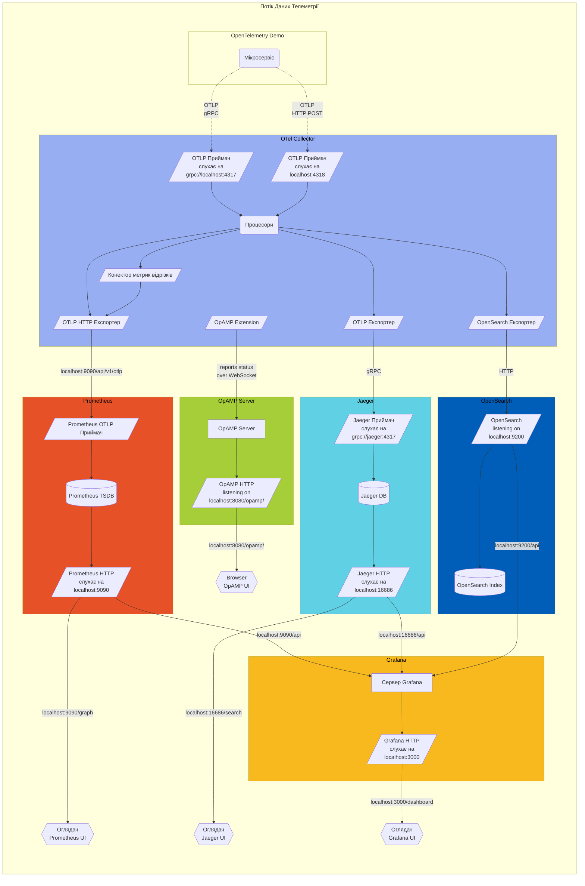

**OpenTelemetry Demo** складається з мікросервісів, написаних різними мовами програмування, які взаємодіють між собою через gRPC та HTTP; і генератора навантаження, який використовує [k6](https://k6.io/) для імітації користувацького трафіку.

```mermaid
graph TD
subgraph Service Diagram
accounting(Бухгалтерія):::dotnet
ad(Реклама):::java
agent(Агент):::python
cache[(Кеш<br/>&#40Valkey&#41)]
cart(Кошик):::dotnet
chatbot(Чатбот):::python
checkout(Оформлення замовлення):::golang
currency(Валюта):::cpp
email(Електронна пошта):::ruby
flagd(Flagd):::golang
flagd-ui(Flagd-ui):::elixir
fraud-detection(Виявлення шахрайства):::kotlin
frontend(Фронтенд):::typescript
frontend-proxy(Фронтенд проксі <br/>&#40Envoy&#41):::cpp
image-provider(Постачальник зображень <br/>&#40nginx&#41):::cpp
load-generator([Генератор навантаження]):::golang
mcp(MCP):::python
payment(Платежі):::javascript
product-catalog(Каталог товарів):::golang
quote(Котирування):::php
recommendation(Рекомендації):::python
shipping(Доставка):::rust
queue[(черга<br/>&#40Kafka&#41)]:::java
react-native-app(Застосунок React Native):::typescript
postgresql[(astronomy-db<br/>&#40PostgreSQL&#41)]

chatbot -->|HTTP| agent
agent -.->|HTTP| frontend
agent -.->|HTTP| mcp

ad --->|gRPC| flagd

checkout -->|gRPC| currency
checkout -->|gRPC| cart
cart --> cache
cart --->|gRPC| flagd

checkout --->|gRPC| payment
checkout --->|HTTP| email
checkout -->|TCP| queue
checkout ---->|gRPC| product-catalog
checkout -->|HTTP| shipping
shipping -->|HTTP| quote

fraud-detection --->|gRPC| flagd

frontend -->|gRPC| ad
frontend ---->|gRPC| cart
frontend -->|gRPC| currency
frontend -->|gRPC| checkout
frontend -->|HTTP| shipping
frontend -->|gRPC| product-catalog
frontend --->|gRPC| recommendation

frontend-proxy -->|gRPC| flagd
frontend-proxy -->|HTTP| flagd-ui
frontend-proxy -->|HTTP| image-provider
frontend-proxy -->|HTTP| frontend
frontend-proxy -->|HTTP| chatbot

mcp -->|HTTP| frontend

payment --->|gRPC| flagd

queue -->|TCP| fraud-detection

recommendation -->|gRPC| product-catalog
recommendation ----->|gRPC| flagd

product-catalog --> postgresql

Internet -->|HTTP| frontend-proxy
load-generator -->|HTTP| frontend-proxy
react-native-app -->|HTTP| frontend-proxy
accounting --> postgresql
queue -->|TCP| accounting
end

classDef dotnet fill:#311a7f,color:white;
classDef cpp fill:#f34b7d,color:white;
classDef elixir fill:#b294bb,color:black;
classDef golang fill:#00add8,color:black;
classDef java fill:#b07219,color:white;
classDef javascript fill:#f1e05a,color:black;
classDef kotlin fill:#6b57ff,color:white;
classDef php fill:#4F5B93,color:white;
classDef python fill:#82b043,color:white;
classDef ruby fill:#701516,color:white;
classDef rust fill:#dea584,color:black;
classDef typescript fill:#e98516,color:black;
```

```mermaid
graph LR
subgraph Service Legend
  dotnetsvc(.NET):::dotnet
  cppsvc(C++):::cpp
  elixirsvc(Elixir):::elixir
  golangsvc(Go):::golang
  javasvc(Java):::java
  javascriptsvc(JavaScript):::javascript
  kotlinsvc(Kotlin):::kotlin
  phpsvc(PHP):::php
  pythonsvc(Python):::python
  rubysvc(Ruby):::ruby
  rustsvc(Rust):::rust
  typescriptsvc(TypeScript):::typescript
end

classDef dotnet fill:#311a7f,color:white;
classDef cpp fill:#f34b7d,color:white;
classDef elixir fill:#b294bb,color:black;
classDef golang fill:#00add8,color:black;
classDef java fill:#b07219,color:white;
classDef javascript fill:#f1e05a,color:black;
classDef kotlin fill:#6b57ff,color:white;
classDef php fill:#4F5B93,color:white;
classDef python fill:#82b043,color:white;
classDef ruby fill:#701516,color:white;
classDef rust fill:#dea584,color:black;
classDef typescript fill:#e98516,color:black;
```

Перейдіть за цими посиланнями, щоб дізнатися про поточний стан [логів](/docs/demo/telemetry-features/log-coverage/), [метрик](/docs/demo/telemetry-features/metric-coverage/) та [трасування](/docs/demo/telemetry-features/trace-coverage/) інструментування демонстраційних застосунків.

Колектор налаштований в [otelcol-config.yml](https://github.com/open-telemetry/opentelemetry-demo/blob/main/src/otel-collector/otelcol-config.yml), альтернативні експортери можна налаштувати тут.

Коли запускається зі стеком спостережуваності, Колектор також підʼєднується до сервера OpAMP демо через [розширення OpAMP](https://github.com/open-telemetry/opentelemetry-collector-contrib/tree/main/extension/opampextension) і повідомляє про стан своєї справності, версію, атрибути та поточну конфігурацію. Відкрийте інтерфейс OpAMP за адресою <http://localhost:8080/opamp/> та оберіть екземпляр Колектора, щоб переглянути стан.

```mermaid
graph TB
subgraph tdf[Потік Даних Телеметрії]
    subgraph subgraph_padding [ ]
        style subgraph_padding fill:none,stroke:none;
        %% padding to stop the titles clashing
        subgraph od[OpenTelemetry Demo]
        ms(Мікросервіс)
        end

        ms -.->|"OTLP<br/>gRPC"| oc-grpc
        ms -.->|"OTLP<br/>HTTP POST"| oc-http

        subgraph oc[OTel Collector]
            style oc fill:#97aef3,color:black;
            oc-grpc[/"OTLP Приймач<br/>слухає на<br/>grpc://localhost:4317"/]
            oc-http[/"OTLP Приймач<br/>слухає на <br/>localhost:4318<br/>"/]
            oc-proc(Процесори)
            oc-spanmetrics[/"Конектор метрик відрізків"/]
            oc-prom[/"OTLP HTTP Експортер"/]
            oc-otlp[/"OTLP Експортер"/]
            oc-opensearch[/"OpenSearch Експортер"/]

            oc-grpc --> oc-proc
            oc-http --> oc-proc

            oc-proc --> oc-prom
            oc-proc --> oc-otlp
            oc-proc --> oc-opensearch
            oc-proc --> oc-spanmetrics
            oc-spanmetrics --> oc-prom

            oc-opamp[/"OpAMP Extension"/]

        end

        oc-prom -->|"localhost:9090/api/v1/otlp"| pr-sc
        oc-otlp -->|gRPC| ja-col
        oc-opensearch -->|HTTP| os-http

        subgraph op[OpAMP Server]
            style op fill:#a6ce39,color:black;
            op-srv["OpAMP Server"]
            op-http[/"OpAMP HTTP<br/>listening on<br/>localhost:8080/opamp/"/]

            op-srv --> op-http
        end

        oc-opamp -->|"reports status<br/>over WebSocket"| op-srv

        op-b{{"Browser<br/>OpAMP UI"}}
        op-http -->|"localhost:8080/opamp/"| op-b

        subgraph pr[Prometheus]
            style pr fill:#e75128,color:black;
            pr-sc[/"Prometheus OTLP Приймач"/]
            pr-tsdb[(Prometheus TSDB)]
            pr-http[/"Prometheus HTTP<br/>слухає на<br/>localhost:9090"/]

            pr-sc --> pr-tsdb
            pr-tsdb --> pr-http
        end

        pr-b{{"Оглядач<br/>Prometheus UI"}}
        pr-http ---->|"localhost:9090/graph"| pr-b

        subgraph ja[Jaeger]
            style ja fill:#60d0e4,color:black;
            ja-col[/"Jaeger Приймач<br/>слухає на<br/>grpc://jaeger:4317"/]
            ja-db[(Jaeger DB)]
            ja-http[/"Jaeger HTTP<br/>слухає на<br/>localhost:16686"/]

            ja-col --> ja-db
            ja-db --> ja-http
        end

        subgraph os[OpenSearch]
            style os fill:#005eb8,color:black;
            os-http[/"OpenSearch<br/>listening on<br/>localhost:9200"/]
            os-db[(OpenSearch Index)]

            os-http ---> os-db
        end

        subgraph gr[Grafana]
            style gr fill:#f8b91e,color:black;
            gr-srv["Сервер Grafana"]
            gr-http[/"Grafana HTTP<br/>слухає на<br/>localhost:3000"/]

            gr-srv --> gr-http
        end

        pr-http --> |"localhost:9090/api"| gr-srv
        ja-http --> |"localhost:16686/api"| gr-srv
        os-http --> |"localhost:9200/api"| gr-srv

        ja-b{{"Оглядач<br/>Jaeger UI"}}
        ja-http ---->|"localhost:16686/search"| ja-b

        gr-b{{"Оглядач<br/>Grafana UI"}}
        gr-http -->|"localhost:3000/dashboard"| gr-b
    end
end
```

Дивіться **Визначення Протокольних Буферів** у теці `/pb/`.
