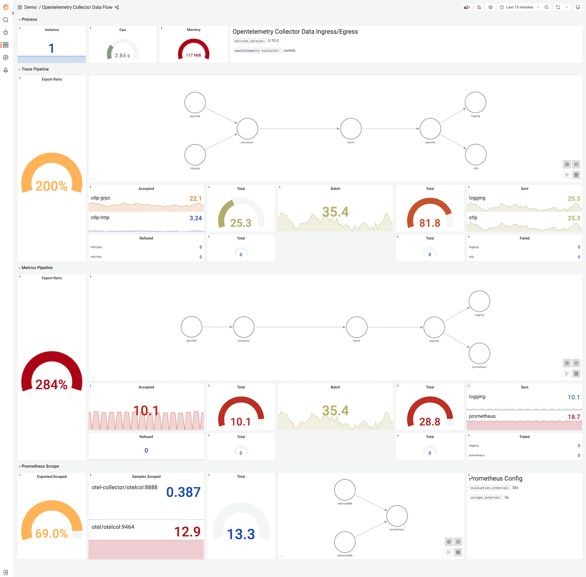

Моніторинг потоку даних через OpenTelemetry Collector є важливим з кількох причин. Отримання макрорівневого уявлення про вхідні дані, такі як кількість зразків та кількість елементів в зразках, є важливим для розуміння внутрішньої динаміки колектора. Однак, коли справа доходить до деталей, взаємозвʼязки можуть стати складними. Інформаційна панель (дашборд) потоку даних Collector має на меті продемонструвати можливості демонстраційного застосунку OpenTelemetry, пропонуючи міцну основу для користувачів для подальшого розвитку. Інформаційна панель потоку даних Collector надає цінні рекомендації щодо того, які метрики слід моніторити. Користувачі можуть налаштовувати власні варіації інформаційної панелі, додаючи необхідні метрики, специфічні для їхніх випадків використання, такі як обробник memory_delimiter або інші індикатори потоку даних. Ця демонстраційна інформаційна панель слугує відправною точкою, дозволяючи користувачам досліджувати різноманітні сценарії використання та адаптувати інструмент до своїх унікальних потреб моніторингу.

## Огляд потоку даних {#data-flow-overview}

Діаграма нижче надає огляд компонентів системи, демонструючи конфігурацію, отриману з файлу конфігурації OpenTelemetry Collector (otelcol), який використовується демонстраційним застосунком OpenTelemetry. Крім того, вона висвітлює потік даних спостережуваності (трасування та метрики) в системі.

## Метрики вхідного/вихідного потоку {#ingress-egress-metrics}

Метрики, зображені на діаграмі нижче, використовуються для моніторингу як вихідного, так і вхідного потоків даних. Ці метрики генеруються процесом otelcol, експортуються на порт 8888 і згодом зчитуються Prometheus. Простір імен, повʼязаний з цими метриками, — "otelcol", а імʼя завдання позначено як `otel.`

Мітки слугують цінним інструментом для ідентифікації конкретних наборів метрик (таких як експортер, приймач або завдання), дозволяючи розрізняти набори метрик у загальному просторі імен. Важливо зазначити, що ви зіткнетеся з відкиданням метрик лише у випадку перевищення обмежень памʼяті, визначених в обробнику memory delimiter.

### Трасування вхідного потоку {#ingress-trace-pipeline}

- `otelcol_receiver_accepted_spans`
- `otelcol_receiver_refused_spans`
- `by (receiver,transport)`

### Метрики вхідного потоку {#ingress-metric-pipeline}

- `otelcol_receiver_accepted_metric_points`
- `otelcol_receiver_refused_metric_points`
- `by (receiver,transport)`

### Процесор {#processor}

Зараз єдиним процесором у демонстраційному застосунку є пакетний процесор, який використовується як для трасування, так і для метрик.

- `otelcol_processor_batch_batch_send_size_sum`

### Трасування вихідного потоку {#egress-trace-pipeline}

- `otelcol_exporter_sent_spans`
- `otelcol_exporter_send_failed_spans`
- `by (exporter)`

### Метрики вихідного потоку {#egress-metric-pipeline}

- `otelcol_exporter_sent_metric_points`
- `otelcol_exporter_send_failed_metric_points`
- `by (exporter)`

### Зчитування Prometheus {#prometheus-scraping}

- `scrape_samples_scraped`
- `by (job)`

## Інформаційна панель {#dashboard}

Ви можете отримати доступ до інформаційної панелі, перейшовши до інтерфейсу Grafana, вибравши інформаційну панель **OpenTelemetry Collector** під значком перегляду з лівого боку екрана.

Інформаційна панель має чотири основні розділи:

1. Метрики процесу
2. Трасування
3. Метрики
4. Зчитування Prometheus

Розділи 2, 3 і 4 представляють загальний потік даних, використовуючи вищезгадані метрики. Крім того, для кожного потоку обчислюється коефіцієнт експорту для розуміння потоку даних.

### Коефіцієнт експорту {#export-ratio}

Коефіцієнт експорту — це, по суті, співвідношення між метриками приймача та експортера. Ви можете помітити на скріншоті інформаційної панелі вище, що коефіцієнт експорту для метрик значно вищий, ніж для отриманих метрик. Це тому, що демонстраційний застосунок налаштований на генерацію метрик трасування, що є процесором, який генерує метрики з трасувань всередині колектора, як показано на оглядовій діаграмі.

### Метрики процесу {#process-metrics}

Дуже обмежені, але інформативні метрики процесу додані до інформаційної панелі. Наприклад, ви можете спостерігати більше одного екземпляру otelcol, що працює в системі під час перезапусків або подібних подій. Це може бути корисним для розуміння піків у потоці даних.

