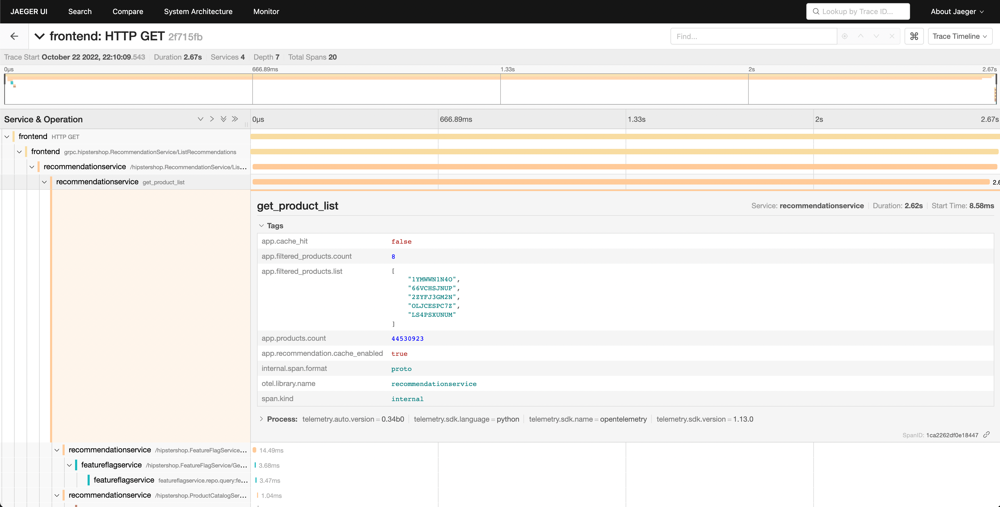

Телеметрія застосунків, така як та, що надає OpenTelemetry, дуже корисна для діагностики проблем у розподіленій системі. У цьому сценарії ми пройдемо через приклад, демонструючи, як перейти від високорівневих метрик і трейсів до визначення причини витоку памʼяті.

## Налаштування {#setup}

Щоб запустити цей сценарій, вам потрібно розгорнути демонстраційний застосунок і увімкнути прапорець функції `recommendationServiceCacheFailure`. Дайте застосунку працювати приблизно 10 хвилин після увімкнення прапорця функції, щоб дані могли накопичитися.

## Діагностика {#diagnose}

Перший крок у діагностиці проблеми — визначити, що проблема існує. Часто першим кроком буде панель метрик, надана інструментом, таким як Grafana.

Після запуску демонстрації повинна існувати [тека з інфопанелями](http://localhost:8080/grafana/dashboards) з двома панелями (дашбордами); одна для моніторингу вашого OpenTelemetry Collector, а інша містить кілька запитів і графіків для аналізу затримки та швидкості запитів від кожної служби.

Ця панель міститиме кілька графіків, але деякі з них повинні виглядати цікавими:

- Служба рекомендацій (CPU% і памʼять)
- Затримка служби (з SpanMetrics)
- Рівень помилок

Графіки служби рекомендацій створюються з метрик OpenTelemetry, експортованих до Prometheus, тоді як графіки затримки служби та рівня помилок створюються за допомогою процесора метрик трейсів OpenTelemetry Collector.

З нашої панелі ми можемо побачити, що в службі рекомендацій спостерігається аномальна поведінка — пікове використання CPU, а також довгі затримки в наших гістограмах p95, 99 і 99.9. Ми також можемо побачити, що в цій службі є періодичні піки у використанні памʼяті.

Ми знаємо, що ми також випромінюємо дані трейсів з нашого застосунку, тому подумаймо про інший спосіб, за допомогою якого ми могли б визначити, що проблема існує.

Jaeger дозволяє нам шукати трейси та відображати кінцеву затримку всього запиту з видимістю кожної окремої частини загального запиту. Можливо, ми помітили збільшення затримки на наших запитах до фронтенду. Jaeger дозволяє нам потім шукати та фільтрувати наші трейси, включаючи лише ті, що містять запити до служби рекомендацій.

Сортування за затримкою дозволяє нам швидко знайти конкретні трейси, які зайняли багато часу. Натискаючи на трейс в правій панелі, ми можемо переглянути вигляд водоспаду.

Ми можемо побачити, що служба рекомендацій займає багато часу для завершення своєї роботи, і перегляд деталей дозволяє нам краще зрозуміти, що відбувається.

## Підтвердження діагнозу {#confirming-the-diagnosis}

Ми можемо побачити у вигляді водоспаду, що атрибут `app.cache_hit` встановлено на `false`, і що значення `app.products.count` є надзвичайно високим.

Повертаючись до інтерфейсу пошуку, оберіть `recommendation` у меню Service та шукайте `app.cache_hit=true` у полі Tags. Зверніть увагу, що запити, як правило, швидші, коли вони влучають в кеш. Тепер шукайте `app.cache_hit=false` і порівняйте затримку. Ви повинні помітити деякі зміни у візуалізації у верхній частині списку трейсів.

Тепер, оскільки це вигаданий сценарій, ми знаємо, де знайти основну помилку в нашому коді. Однак у реальному світі нам, можливо, доведеться виконати подальший пошук, щоб зʼясувати, що відбувається в нашому коді або взаємодії між службами, що це викликає.
