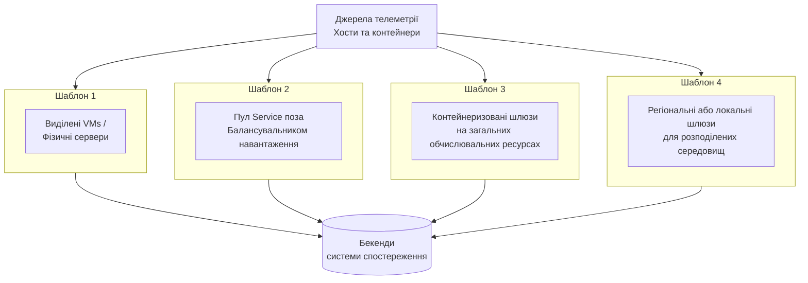
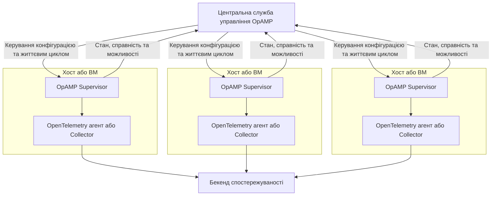
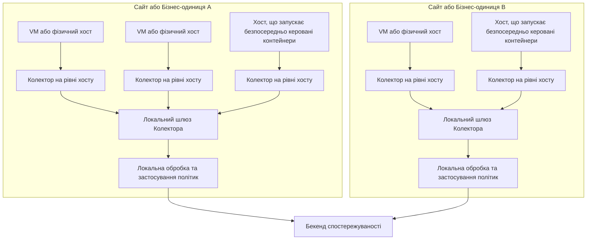

## Короткий зміст {#summary}

Ця схема окреслює стратегічні орієнтири для команд Platform Engineering та SRE, які працюють у традиційних середовищах віртуальних машин (VM), фізичних серверів та локальних середовищах, включаючи сценарії, де контейнери запускаються безпосередньо на операційній системі без оркестрування, такого як Kubernetes.

Вона вирішує проблеми, які часто виникають при спробах встановити цілісну спостережуваність у гетерогенній інфраструктурі, застарілих процесах та контейнеризованих робочих навантаженнях.

Впроваджуючи шаблони, описані в цій схемі, організації можуть очікувати досягнення наступних результатів:

- Готова до використання, високоякісна телеметрія для застосунків та сервісів, що працюють у середовищах без Kubernetes, включаючи контейнери, керовані безпосередньо.
- Узгоджене управління життєвим циклом агентів OpenTelemetry, разом зі стандартизованими шаблонами завантаження та конфігурації для інструментування на основі SDK.
- Єдина спостережуваність у змішаній інфраструктурі: віртуальні машини, фізичні сервери та контейнери без оркестрування.
- Покращене управління якістю сигналів телеметрії, збагаченням даних, маршрутизацією та експортними конвеєрами.
- Зменшення ручної праці та когнітивного навантаження для розробників та операторів.

## Передумови {#background}

Багато організацій підтримують суміш застарілої інфраструктури, віртуальних машин, фізичних серверів та контейнерів, що запускаються безпосередньо, поряд або замість Kubernetes. Ці середовища можуть бути складними і часто не мають автоматизації та стандартизації, які забезпечують інструменти оркестрування. Забезпечення цілісної, високоякісної спостережуваності в таких сценаріях є критично важливим, але часто ускладнюється фрагментованими інструментами та ручними процесами.

[Протокол управління відкритими агентами (Open Agent Management Protocol, OpAMP)](/docs/specs/opamp/) забезпечує стандартизований спосіб віддаленого управління, конфігурації та моніторингу агентів OpenTelemetry у різноманітній інфраструктурі, де це підтримується. На момент написання специфікація OpAMP знаходиться на стадії бета-тестування, тому організаціям слід оцінити зрілість реалізації та операційну підтримку перед стандартизацією на конкретному рішенні. Там, де OpAMP ще не підходить, спільні бібліотеки, попередньо підготовлені образи, централізовано підтримувані артефакти конфігурації та наявні інструменти розгортання або управління конфігурацією все ще можуть забезпечити послідовне управління життєвим циклом для інструментування на основі SDK та агентів.

## Загальні виклики {#common-challenges}

Організації, що працюють у середовищах без Kubernetes, зазвичай стикаються з рядом проблем, які ускладнюють ефективну спостережуваність. Без вбудованої автоматизації, стандартизації та централізованого управління ці середовища часто мають труднощі з забезпеченням цілісної, високоякісної телеметрії в різноманітній інфраструктурі та застосунках. Багато з цих проблем спостережуваності не є унікальними для середовищ без Kubernetes. Однак у таких середовищах команди часто мають менше вбудованих механізмів платформи для управління розгортанням, виявлення сервісів, збагачення метаданих та централізованого розповсюдження політик.

### 1. Обмежена автоматизація для розгортання та управління телеметрією {#1-limited-automation-for-telemetry-deployment-and-management}

Інструментування та розгортання агентів на віртуальних машинах, фізичних серверах та безпосередньо керованих контейнерах часто здійснюється вручну або за допомогою скриптів, а постійне управління конфігурацією важко здійснювати в масштабі. Такий децентралізований, спорадичний підхід зазвичай вимагає від операторів або розробників встановлення, налаштовування та оновлення агентів OpenTelemetry індивідуально на кожному хості або робочому навантаженні.

Це призводить до:

- **Важка праця:** Нові робочі навантаження або хости вимагають повторюваних, схильних до помилок кроків конфігурації.
- **Повільне розгортання та оновлення:** Оновлення інструментування або конфігурації повільні та важко поширюються на весь парк.
- **Операційний ризик:** Відкочування, контроль версій та моніторинг стану важче виконувати послідовно по всьому середовищу.

Цей розрив в автоматизації також створює умови для фрагментації, описаної в Виклику 2: коли кожен хост або робоче навантаження налаштовується вручну, команди схильні робити незалежні вибори щодо агентів, SDK та експортерів, які потім важко узгодити.

### 2. Фрагментовані підходи до інструментування {#2-fragmented-instrumentation-approaches}

Спираючись на відсутність автоматизації, описану у Виклику 1, відсутність стандартизованих шаблонів розгортання та управління призводить до того, що команди використовують різні агенти OpenTelemetry, SDK або експортери для робочих навантажень на хості та контейнеризованих робочих навантажень.

Це призводить до:

- **Непослідовність семантичних домовленостей:** у телеметричних сигналах можуть бути відсутні стандартні атрибути ресурсів, такі як `service.name`, `host.id`, `host.name`, `container.id` та `deployment.environment`, що ускладнює міжсистемну кореляцію.
- **Різна поведінка інструментування:** різні команди можуть застосовувати різні стандартні значення для вибірки, поширення, виявлення ресурсів або експорту, що призводить до нерівномірної якості телеметрії.
- **Дрейф ручної конфігурації:** агенти на хостах та контейнерах часто потребують ручної конфігурації, що призводить до дрейфу та підвищеного ризику помилок.

### 3. Ізольована обробка та експорт даних {#3-siloed-data-processing-and-export}

Розрив в автоматизації (Виклик 1) та отримана фрагментація (Виклик 2) ускладнюють роботу на рівні конвеєра даних: конвеєри збору та експорту даних часто налаштовуються для кожного застосунку, хосту або команди окремо. За відсутності централізованого управління окремі команди можуть незалежно налаштовувати агенти телеметрії, експортери та логіку обробки даних для кожного робочого навантаження або середовища.

Це призводить до:

- **Задвоєння зусиль:** команди можуть дублювати логіку збагачення, фільтрації та маршрутизації даних у різних середовищах.
- **Непослідовне застосування політик:** політики редагування, повторних спроб, пакетування та маршрутизації можуть відрізнятися між командами.
- **Відсутність видимості:** команди з підтримки операційної діяльності та управління не мають єдиного контролю над тим, яка телеметрія збирається та як вона обробляється або експортується.

## Загальні рекомендації {#general-guidelines}

Щоб вирішити описані вище проблеми, організаціям слід прийняти набір стратегічних рекомендацій, спрямованих на оптимізацію практик спостережуваності в різних середовищах. Ці рекомендації забезпечують основу для стандартизації інструментування, автоматизації управління агентами та забезпечення послідовної якості даних.

### 1. Централізоване управління життєвим циклом агентів з можливістю контрольованого налаштування {#1-centrally-manage-agent-lifecycle-while-allowing-controlled-customization}

**Вирішувані проблеми:** 1, 2

У випадках, коли це підтримується та є доцільним з операційної точки зору, використовуйте OpAMP для централізованого управління агентами OpenTelemetry, що працюють як системні служби або контейнери служб.

Оскільки специфікація OpAMP наразі знаходиться на стадії бета-тестування, організаціям слід оцінити зрілість та підтримку доступних реалізацій у своєму середовищі перед стандартизацією на конкретному рішенні. Там, де OpAMP не підтримується або ще не підходить, організації повинні використовувати інші механізми централізованого управління, такі як інструменти управління конфігураціями, "золоті" образи або стандартизовані артефакти розгортання, щоб підтримувати послідовне розгортання агентів, конфігурацію та управління життєвим циклом.

Незалежно від механізму управління, команди платформи повинні володіти базовим розподілом агентів, необхідними процесорами та експортерами, налаштуваннями безпеки, звітністю про стан та поведінкою виявлення ресурсів.

Водночас організації повинні чітко визначити, як дозволяється налаштування для конкретного середовища або робочого навантаження. Практичною моделлю є використання **багаторівневого підходу до конфігурації**:

- **Базова конфігурація в управлінні команди платформи**, зазвичай підпорядкована **інженерному підрозділу платформи**, яка визначає стандартні параметри, заходи безпеки та процесори/експортери в масштабах організації.
- **Прошарок середовища**, зазвичай підпорядкована **операторам інфраструктури або середовища**, для відмінностей, таких як точки доступу, оренда, середовище розгортання, метадані конкретного сайту або налаштування мережі.
- **Прошарок робочого навантаження**, зазвичай підпорядкована **командам розробників застосунків** в межах визначених платформою обмежень, для затверджених варіацій, таких як опціональні приймачі, додаткові атрибути ресурсів або безпечні параметри налаштування.

Це створює чітку межу між стандартизацією та гнучкістю: команди можуть розширювати затверджені частини конфігурації, не створюючи одноразові, некеровані розгортання.

Впроваджуючи ці рекомендації, організації можуть очікувати досягнення наступного:

- Автоматизованої, послідовної конфігурації телеметрії у всіх середовищах.
- Зменшення ручних помилок та спрощення процесу підключення нових робочих навантажень.
- Швидших та безпечніших оновлень і відкочування конфігурацій агентів.
- Контрольованого механізму локального налаштування без шкоди для центрального управління.

### 2. Централізоване збирання та обробка телеметрії через шар шлюзу OpenTelemetry Collector {#2-centralize-telemetry-collection-and-processing-through-an-opentelemetry-collector-gateway-layer}

**Вирішувані проблеми:** 2, 3

Розгорніть один чи більше [Шлюзів OpenTelemetry Collector](/docs/collector/deploy/gateway/) як точки агрегації даних телеметрії з хостів та безпосередньо керованих контейнерів. У цьому контексті "централізоване" не обовʼязково означає єдине глобальне розгортання. Залежно від організаційної структури, мережевих меж, вимог до ізоляції та моделей трафіку, шар шлюзу може бути реалізований на різних рівнях, таких як регіон, сайт, середовище або обліковий запис у хмарі, при цьому забезпечуючи централізоване застосування політик у межах цієї області.

У середовищах, що не використовують Kubernetes, ці шлюзи можуть бути розгорнуті за кількома схемами, залежно від масштабу та операційної моделі, включаючи:

- Окремі шлюзи на віртуальних машинах або фізичних серверах.
- Пул сервісів за балансувальником навантаження.
- Контейнеризовані шлюзи на загальних обчислювальних ресурсах.
- Регіональні або локальні шлюзи для розподілених середовищ.

Діаграма нижче показує шар шлюзу з його альтернативними схемами розгортання. Кожен блок представляє окремий спосіб реалізації ролі шлюзу; організація зазвичай обирає один шаблон або комбінує шаблони між сайтами:

Впроваджуючи цю рекомендацію, організації можуть очікувати досягнення наступного:

- Єдиний контроль над обробкою даних, збагаченням та експортними конвеєрами.
- Спрощене управління та легше впровадження політик на рівні всієї організації.
- Менше прямих підключень від хостів або застосунків до зовнішніх бекендів спостереження, що може спростити управління брандмауером та мережевими політиками.
- Краща стійкість та масштабованість порівняно з топологіями експорту на рівні хосту або додатка.
- Чітке розділення між локальним збором даних та централізованим впровадженням політик.

### 3. Стандартизація визначення ресурсів та розповсюдження повторно використовуваних блоків інструментування {#3-standardize-resource-attribution-and-distribute-reusable-instrumentation-building-blocks}

**Вирішувані проблеми:** 2

Визначте організаційний стандарт телеметрії для зазначення ресурсів і забезпечте його послідовне застосування до всіх робочих навантажень. Це визначення не повинно покладатися лише на документацію; воно повинно реалізовуватися через повторно використовувані блоки, такі як:

- Попередньо налаштовані образи агентів.
- Упаковані агенти для мов програмування та артефакти автоматичного інструментування, де це застосовується.
- Стандартизовані бінарні файли або дистрибутиви OpenTelemetry Collector.
- Спільні бібліотеки або стартові пакети для інструментування на основі SDK.
- Стандартні обгортки для запуску або домовленості щодо змінних середовища.
- Централізовано підтримувані фрагменти конфігурації або шаблони.

Рекомендована модель ресурсів для середовищ, що не використовують Kubernetes, повинна відповідати [семантичним домовленостям ресурсів OpenTelemetry](/docs/specs/semconv/resource/) і покладатися на автоматичне виявлення ресурсів, де це можливо. У OpenTelemetry ресурс ідентифікує сутність, яка створила телеметрію, таку як хост, віртуальна машина, процес, контейнер або екземпляр служби. На практиці організації повинні забезпечити можливість кореляції телеметрії в наступних доменах ресурсів, використовуючи автоматично виявлені атрибути, де це підтримується:

- **[Host](/docs/specs/semconv/resource/host/)**
- **[Device](/docs/specs/semconv/resource/device/)** (де застосовується)
- **[Process](/docs/specs/semconv/resource/process/)**
- **[Process runtime](/docs/specs/semconv/resource/process/#process-runtimes)**
- **[Operating system](/docs/specs/semconv/resource/os/)**
- **[Container](/docs/specs/semconv/resource/container/)** (де застосовується)
- **[Service identity](/docs/specs/semconv/resource/#service)**

Замість ручного підтримання всіх відповідних атрибутів організації повинні віддавати перевагу наявному інструментуванню та виявленню ресурсів для метаданих хосту, процесу, середовища виконання, ОС та контейнера, а також використовувати спільну конфігурацію або артефакти завантаження для забезпечення постійного включення цього виявлення.

Сферою, що зазвичай потребує найбільш ретельної стандартизації, є **ідентичність служби**. Організації повинні забезпечити, щоб телеметрія служби використовувала відповідні [семантичні домовленості служби](/docs/specs/semconv/registry/attributes/service/), з атрибутами, такими як `service.name`, а там, де це доречно, `service.version`, `service.namespace`, `service.instance.id` та `deployment.environment`.

Які атрибути служби повинні бути присутні, залежить від того, як робочі навантаження розгортаються та ідентифікуються в середовищі. Наприклад, `service.namespace` може бути корисним для розрізнення служб крізь організаційні або платформні межі, тоді як `service.instance.id` може бути потрібним для розрізнення реплікованих екземплярів однієї служби.

Телеметрія застосунків повинна включати достатньо контексту служби та інфраструктури, щоб підтримувати кореляцію з телеметрією на рівні хосту та інфраструктури, використовуючи семантичні домовленості як джерело істини для визначення, які атрибути ідентифікації застосовуються до кожного типу ресурсу.

Впроваджуючи цю рекомендацію, організації можуть очікувати досягнення:

- Покращена кореляція та можливість пошуку телеметричних даних у різних системах.
- Легший аналіз та усунення несправностей незалежно від типу інфраструктури.
- Послідовна якість метаданих без необхідності кожній команді винаходити власні шаблони інструментування.
- Швидше впровадження завдяки повторно використовуваним, підтримуваним будівельним блокам.

## Впровадження {#implementation}

Перетворення цих рекомендацій у практику вимагає поєднання автоматизації, стандартизованих інструментів та централізованого управління. Кроки впровадження, наведені нижче, створені як елементи плану з діями у стилі контрольного списку, які організації можуть використовувати для планування та послідовного виконання.

### 1. Визначення базового стандарту телеметрії та багаторівневої моделі конфігурації {#1-define-a-baseline-telemetry-standard-and-layered-configuration-model}

**Підтримувані рекомендації:** 1, 3

Визначте мінімально необхідний стандарт телеметрії для організації та задокументуйте, які частини конфігурації телеметрії централізовано керуються, а які можуть бути налаштовані локально. Це включає підтримувану конфігурацію для агентів хосту або служби, мовних агентів, де це застосовується, інструментування на основі SDK та OpenTelemetry Collectors, які використовуються для локального збору або пересилання. Там, де використовується OpAMP, він повинен бути узгоджений з цією моделлю, щоб централізовано керована конфігурація агентів відповідала тому ж базовому рівню та затвердженим накладанням. Це є основою для забезпечення послідовності в масштабі.

Контрольний список:

- Визначте обовʼязкові атрибути ресурсів та домовленості сигналів, які повинні генерувати всі робочі навантаження.
- Визначте базову конфігурацію для підтримуваних компонентів телеметрії, включаючи агентів, мовні агенти, де це застосовується, SDK та OpenTelemetry Collectors.
- Стандартизуйте експортери, автентифікацію, TLS, звітність про стан справності та стандартні процесори відповідно до ролі кожного компонента.
- Визначте дозволені точки розширення для налаштування специфічних речей для середовища та робочого навантаження.
- Додавайте версії до всіх базових та додаткових прошарків конфігурації, щоб їх можна було безпечно впроваджувати та відкочувати.
- Опублікуйте межі відповідальності, щоб команди знали, що вони можуть і не можуть змінювати.

Документація:

- [Специфікація OpAMP](/docs/specs/opamp/)
- [Семантичні домовленості OpenTelemetry](/docs/specs/semconv/)

### 2. Розгортання панелі управління OpAMP для агентів {#2-stand-up-an-opamp-management-plane-for-agents}

**Підтримувані рекомендації:** 1

Надайте центральну можливість управління OpAMP для керування конфігурацією агентів, звітністю про стан, моніторингом справності та контрольованими розгортаннями для підтримуваних агентів. Цей план впровадження рекомендує шаблон управління, а не конкретну реалізацію сервера; організації повинні використовувати готове до промислової експлуатації рішення, відповідне для їхнього середовища.

Контрольний список:

- Визначте, які агенти або розгортання OpenTelemetry Collector будуть керуватися через OpAMP, виходячи з можливостей дистрибутивів, що використовуються у вашому середовищі (наприклад, чи вони є upstream або специфічними для постачальника, чи вбудовують клієнт OpAMP, чи використовують [OpAMP Supervisor для OpenTelemetry Collector](https://github.com/open-telemetry/opentelemetry-collector-contrib/tree/main/cmd/opampsupervisor), і чи OpAMP компілюється або пакується окремо), а також компоненти, які ви хочете керувати централізовано.
- Розгорніть або прийміть готовий до промислової експлуатації сервер OpAMP або кінцеву точку управління, дотримуючись [документації з управління Collector](/docs/collector/management/#opamp), з відповідною автентифікацією, авторизацією та безпекою транспорту.
- Налаштуйте агенти або супервізори для реєстрації в службі управління та звітування про їхню ідентичність, можливості, стан справності та ефективний стан конфігурації, як визначено в [специфікації OpAMP](/docs/specs/opamp/).
- Організуйте агентів у логічні групи, такі як розробка, тестування, промислова експлуатація, регіон або середовище, щоб зміни конфігурації можна було впроваджувати поетапно.
- Визначте, як оновлення конфігурації просуваються між групами розгортання та як виявляються та відкочуються невдалі зміни.
- Відстежуйте стан панелі управління, підключення агентів, стан оновлень та відхилення конфігурації, щоб забезпечити контроль над флотом.

OpAMP може бути інтегрований з OpenTelemetry Collector двома способами, з різними обсягами можливостей:

- Використання **OpAMP Supervisor** — окремого процесу на локальному хості, який керує життєвим циклом Collector і застосовує віддалену конфігурацію, а також звітує про стан, справність та можливості. Це найпотужніша інтеграція і підходить, коли OpAMP є основним механізмом для керування конфігурацією та життєвим циклом.

- Використання **вбудованого розширення OpAMP у Collector** — легка інтеграція, яка звітує про стан, справність та можливості в службу управління, але не обробляє доставку віддаленої конфігурації або керування життєвим циклом. Це підходить, коли конфігурація та життєвий цикл вже обробляються іншими інструментами (наприклад, управління конфігурацією, "золоті" образи або паковані дистрибутиви), а OpAMP використовується переважно для централізованої спостережуваності за флотом агентів.

У розгортанні на основі Supervisor служба управління взаємодіє з локальним Supervisor, який потім керує життєвим циклом і конфігурацією локального агента або Collector. Діаграма нижче ілюструє шаблон Supervisor; шаблон тільки з розширенням виглядає подібно, але без блоку Supervisor, і служба управління взаємодіє безпосередньо з Collector тільки для звітування про стан.

Документація:

- [Специфікація OpAMP](/docs/specs/opamp/)
- [OpAMP керівництво для початківців](/docs/collector/management/)
- [Конфігурація OpenTelemetry Collector](/docs/collector/configuration/)

### 3. Пакетування та розгортання стандартизованих агентів і SDK артефактів bootstrap {#3-package-and-deploy-standardized-agents-and-sdk-bootstrap-artifacts}

**Підтримувані рекомендації:** 1, 3

Використовуйте керування конфігурацією та пакування образів для забезпечення послідовного розгортання підтримуваних компонентів телеметрії на хостах і в контейнеризованих робочих навантаженнях. Віддавайте перевагу [декларативній конфігурації](/docs/specs/otel/configuration/#declarative-configuration) для інструментування на основі SDK, де це підтримується. Там, де це недоступно, стандартизуйте змінні середовища, параметри запуску або [конфігурацію, специфічну для SDK](/docs/languages/sdk-configuration/), щоб команди успадковували послідовні стандартні значення з мінімальними ручними налаштуваннями.

Загальні шаблони пакування включають стандартні пакети системних служб для агентів на основі хосту, попередньо зібрані образи контейнерів для розгортання Collector або агентів, а також спільні артефакти bootstrap SDK, такі як стартові пакети або обгортки запуску. Наприклад:

- Агент на основі хосту може бути встановлений як стандартна системна служба з централізовано керованим файлом конфігурації та файлом середовища.
- Контейнеризоване розгортання може використовувати попередньо зібраний образ, який включає затверджений бінарний файл Collector, розширення та стандартну конфігурацію.
- Інструментування на основі SDK може розповсюджуватися через спільні обгортки запуску, [мовні агенти](/docs/zero-code/) або стартові пакети, які автоматично застосовують затверджені організацією стандартні значення.

Контрольний список:

- Агенти на основі хосту повинні бути упаковані як стандартні системні служби.
- Забезпечте попередньо зібрані образи або визначення сервіс-контейнерів для контейнеризованих розгортань.
- Публікуйте спільні бібліотеки, стартові пакети або обгортки bootstrap для підтримуваних мов SDK.
- Віддавайте перевагу декларативній конфігурації SDK там, де це підтримується, і в іншому випадку стандартизуйте змінні середовища, параметри запуску та конвенції файлів конфігурації в різних середовищах.
- Перевірте, що нові робочі навантаження успадковують базову конфігурацію за замовчуванням.

Документація:

- [Конфігурація OpenTelemetry Collector](/docs/collector/configuration/)
- [Мови та SDK OpenTelemetry](/docs/languages/)
- [Інструментування без програмування OpenTelemetry](/docs/zero-code/)
- [Інструментування без програмування Java](/docs/zero-code/java/)
- [Конфігурація агента Java](/docs/zero-code/java/agent/configuration/)

### 4. Розгортання шару шлюзу OpenTelemetry Collector {#4-deploy-an-opentelemetry-collector-gateway-layer}

**Підтримувані рекомендації:** 2

Розгорніть один або кілька шлюзів OpenTelemetry Collector як центральний рівень обробки та експорту. Виберіть топологію, що відповідає середовищу, наприклад виділені ВМ, пул сервісів за балансувальником навантаження або регіональні вузли шлюзу.

Контрольний список:

- Виберіть топологію розгортання шлюзу для кожного середовища.
- Визначте, як локальні агенти виявляють і підключаються до шлюзів.
- Налаштуйте процесори для пакетної обробки, захисту пам'яті, збагачення, повторних спроб і маршрутизації.
- Розділіть легке приймання даних від більш важкої централізованої обробки там, де це необхідно для масштабування.
- Визначте поведінку високої доступності та відновлення після відмови для шлюзів.
- Перевірте маршрутизацію від початку до кінця до бекендів спостереження.

Поширеним шаблоном у середовищах без Kubernetes є запуск колекторів на рівні хосту на окремих хостах і пересилання телеметрії до локального або регіонального шлюзу колектора. Цей рівень шлюзу повинен бути горизонтально масштабованим і високодоступним, використовуючи відповідні механізми балансування навантаження та відновлення після відмови для середовища, такі як шаблони масштабування в хмарі або еквівалентні налаштування високої доступності в інфраструктурі без хмари.

Документація:

- [Шаблони розгортання OpenTelemetry Collector](/docs/collector/deploy/)
- [Конфігурація OpenTelemetry Collector](/docs/collector/configuration/)

### 5. Забезпечення стандартів атрибуції ресурсів та кореляції {#5-enforce-resource-attribution-and-correlation-standards}

**Підтримувані рекомендації:** 1, 3

Переконайтеся, що вся телеметрія містить необхідні метадані для кореляції між інфраструктурними та прикладними шарами.

Контрольний список:

- Визначте, які ресурси хосту, процесу, середовища виконання, операційної системи та контейнера повинні бути виявлені та корельовані, і увімкніть автоматичне виявлення ресурсів для них послідовно через спільну конфігурацію, артефакти завантаження або централізовано підтримувані шаблони.
- Переконайтеся, що телеметрія застосунків містить достатній контекст інфраструктури для кореляції, наприклад `host.id` або `host.name`, де це доречно, наприклад через конфігурацію SDK, агенти мови, обгортки запуску або автоматичне виявлення ресурсів, де це підтримується.
- Увімкніть і перевірте детектори ресурсів, де це підтримується, щоб метадані хосту, ОС, процесу, середовища виконання та контейнера заповнювалися автоматично та послідовно, і доповнюйте вихідні дані детектора централізовано визначеними атрибутами, де це необхідно.
- Перевірте отриману телеметрію відповідно до визначеного стандарту атрибутів, перевіряючи репрезентативну телеметрію з хостів та застосунків перед широким розгортанням.
- Додайте перевірки відповідності до конвеєрів розгортання або кроків перевірки після розгортання, щоб нові робочі навантаження могли бути перевірені відповідно до очікуваного набору атрибутів.

Ця схема зосереджується на вимогах до атрибутів та практиках на рівні робочих навантажень, необхідних для їх послідовного формування. Більш детальні моделі централізованого контролю та нормалізації виходять за межі цього розділу і можуть бути розглянуті окремо.

Документація:

- [Семантичні домовленості OpenTelemetry](/docs/specs/semconv/)
- [Семантичні домовленості ресурсів OpenTelemetry](/docs/specs/semconv/resource/)

### 6. Централізоване управління, забезпечення політик та управління змінами {#6-centralize-governance-policy-enforcement-and-change-management}

**Підтримувані рекомендації:** 2, 3

Використовуйте шар шлюзу Collector та централізовано керовану конфігурацію для забезпечення правил організації щодо обробки, маршрутизації та експорту телеметрії.

Контрольний список:

- Визначте затверджені експортери та точки доступу бекенду.
- Централізовано керуйте політиками редагування, фільтрації, збагачення та маршрутизації.
- Визначте стандартні політики повторних спроб, пакетування та вибірки.
- Встановіть процес винятків для робочих навантажень, які потребують нестандартної поведінки.
- Регулярно перевіряйте якість телеметрії та відповідність політикам.

Документація:

- [Налаштування OpenTelemetry Collector](/docs/collector/configuration/)
- [Розгортання шлюзу OpenTelemetry Collector](/docs/collector/deploy/gateway/)

## Референсні архітектури {#reference-architectures}

Ці шаблони, описані в цій схемі, були успішно реалізовані наступними кінцевими користувачами:

_Далі буде!_

Ви реалізували архітектуру для цього шаблону? Поділіться своїм досвідом або посиланням на вашу статтю, відкривши тікет в репозиторії GitHub [End User SIG](https://github.com/open-telemetry/sig-end-user/issues).
