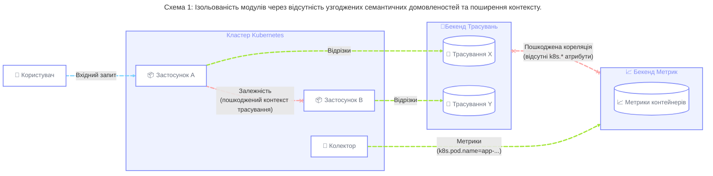
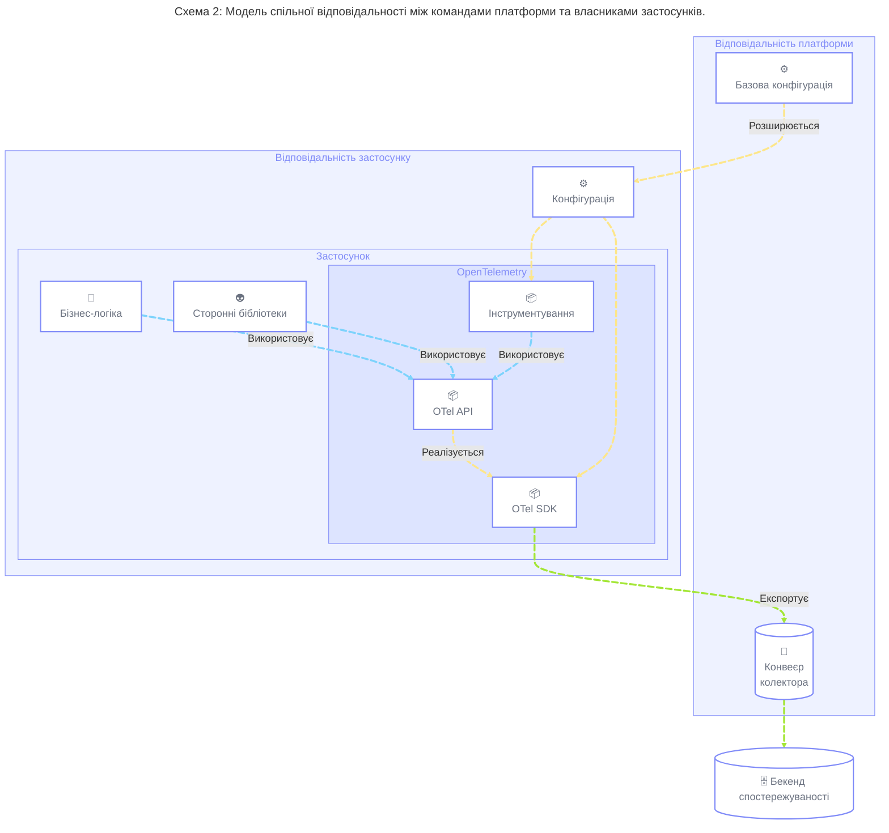
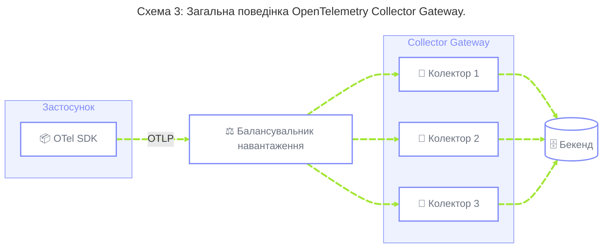
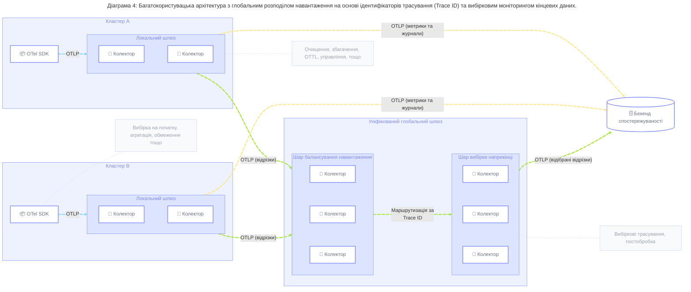

## Резюме {#summary}

Ця схема дає стратегічні рекомендації для організацій, які прагнуть впроваджувати практики Platform Engineering, щоб спростити використання інструментів та стандартів OpenTelemetry серед своїх інженерних команд. Вона охоплює використання SDK, бібліотек інструментування, шаблонів конфігурації та архітектур Collector для створення централізовано керованих платформ телеметрії, поєднаних з інструментами самообслуговування, розробленими для використання "як послуга".

Схема призначена для організацій, що працюють у хмарних та Kubernetes-середовищах і прагнуть забезпечити послідовну, масштабовану та керовану платформу телеметрії для робочих навантажень високо автономних продуктових команд, досягаючи таких результатів:

- Послідовна конфігурація SDK та інструментування, що прискорює отримання результату завдяки впровадженню організаційних стандартів у всіх робочих навантаженнях, знижуючи когнітивне навантаження для продуктових команд.
- Узгоджені семантичні домовленості, що дають змогу корелювати телеметрію між сигналами, застосунками та доменами, від клієнтської сторони до інфраструктури, забезпечуючи високоякісну телеметрію для ручного або автоматичного аналізу.
- Усунення розпорошеності конфігурації Collector, зниження операційного навантаження через консолідацію конвеєрів телеметрії.
- Стійкі, масштабовані та надійні конвеєри обробки даних для всіх сигналів телеметрії, що дають змогу уникнути окремих точок відмови.
- Централізоване управління телеметрією та оптимізація даних для зменшення операційних витрат і викидів вуглецю шляхом мінімізації потреб у сховищі, передаванні даних мережею та обчислювальних ресурсах для обробки телеметрії.
- Захищені від змін конвеєри телеметрії, що убезпечують продуктові команди від змін у базовій платформі спостереження, дозволяючи міграцію даних або стратегії з кількома постачальниками з мінімальними змінами в інструментуванні застосунків або інфраструктурі збору.

## Передісторія {#background}

У міру того, як організації пришвидшують впровадження хмарних стандартів і сучасних практик постачання програмного забезпечення, вони часто переходять на федеративні моделі, за яких команди або бізнес-підрозділи працюють із високим рівнем автономії та відповідають за повний життєвий цикл розробки програмного забезпечення (Software Development Lifecycle, SDLC) своїх систем — від проєктування до експлуатації.

Ця модель «ви будуєте – ви керуєте» має на меті пришвидшити випуск продукту, але може ненавмисно призвести до фрагментації практик управління сервісами та перевантаження середовища спостережуваності, що не дає змоги повною мірою скористатися перевагами OpenTelemetry та сучасних інструментів. Продуктові команди надають пріоритет випуску нових функцій над нефункціональними вимогами (Non-Functional Requirements, NFR), зокрема телеметрією, і розглядають ці завдання як перешкоду для досягнення своїх цілей.

Щоб вирішити цю проблему, організації широко впроваджують хмарні моделі Platform Engineering для зниження когнітивного навантаження та абстрагування складності. Розглядаючи телеметрію як ретельно спроєктований внутрішній [продукт платформи][1], організації можуть запропонувати «прямий шлях» або «золотий шлях», що забезпечує високоякісне, контекстне спостереження з мінімальними перешкодами, дозволяючи командам зосередитися на інструментуванні специфічних для їхньої сфери концепцій, які неможливо охопити готовими рішеннями телеметрії.

## Поширені проблеми {#common-challenges}

Організації, що працюють у таких федеративних, розподілених середовищах, зазвичай стикаються з певним набором проблем, які перешкоджають ефективному спостереженню та хмарній зрілості.

### 1. Несумісна конфігурація та низьке впровадження організаційних стандартів {#challenge-1}

У середовищах, де продуктові команди працюють автономно, можуть співіснувати різні способи налаштування окремих застосунків та сервісів для спостереження, навіть у межах спільного обчислювального шару. Це охоплює налаштування OpenTelemetry SDK для застосунків, конфігурацію пакунків та бібліотек інструментування або вирішення того, як поширювати контекст спостереження від своїх залежностей і до них.

Організації можуть мати набір задокументованих інженерних стандартів, яких мають дотримуватися всі інженери, але вони часто покладаються на ручне впровадження цих стандартів кожною окремою командою, включно з конфігурацією та змінами на рівні коду. Це часто сприймається командами як другорядна справа, а не частина процесу розробки, і зосереджене на конкретному застосунку без урахування загальної розподіленої системи в цілому.



Це призводить до:

- **Неузгоджені [семантичні домовленості][2]:** Телеметрія не має спільних [ресурсних][3] атрибутів (наприклад, `service.version`, `k8s.cluster.name`, `example.cost.center`), що перериває кореляцію між різними сигналами, застосунками та системними шарами й обмежує корисність телеметричних даних для автоматичного аналізу.
- **Ізольований контекст:** Без послідовного [поширення контексту][4] (наприклад, W3C Trace Context) у кожному SDK, розподілені трасування перериваються на межах сервісів, що унеможливлює прив'язку регресій продуктивності бекенду до клієнтського бізнес-впливу.
- **Фрагментація версій SDK:** В операційній діяльності використовуються дуже різні версії OpenTelemetry SDK, що створює проблеми з підтримкою та безпекою.
- **Високе когнітивне навантаження:** Розробники змушені вручну конфігурувати SDK та пакунки інструментування для кожного нового сервісу, що підвищує навантаження та ризик неправильного налаштування.
- **Уповільнення розвитку:** Будь-яка зміна інженерних стандартів, повʼязана з інструментуванням телеметрії, або зміна базової платформи спостереження (наприклад, міграція даних чи протоколів) створює навантаження та знижує загальну динаміку організації, оскільки впровадження технологій, зрештою, гальмується ручним виконанням завдань.

### 2. Розповсюдження конфігурації Collector серед кластерів {#challenge-2}

Коли впровадження OpenTelemetry масштабується й організації розгортають свої системи в десятках або сотнях Kubernetes-кластерів, ручне керування конфігураціями OpenTelemetry Collector у цих середовищах стає тягарем для підтримки. Це особливо складно в організаціях, де різні розгортання Collector обслуговуються різними командами.

Це призводить до:

- **Дрейф конфігурації:** Різні кластери зрештою отримують різні правила обробки, логіку фільтрації та конфігурації точок доступу, що створює непередбачувану поведінку телеметрії.
- **Відсутність розділення обовʼязків:** Немає чіткого розрізнення між різними типами телеметричної обробки, що виконуються на різних шарах Collector (наприклад, де трансформувати, де застосовувати вибірку), що може призвести до неузгодженої або неповної інформації.
- **Ручна робота:** Команди платформи витрачають надмірну кількість часу на повторювані завдання конфігурації та ручні оновлення замість створення масштабованих рішень.
- **Ненадійні розгортання:** Без відстеження системами контролю версій та аудиту розгортання застосування виправлень або нової конфігурації в масштабі флоту стає високоризикованим і схильним до помилок.

### 3. Конвеєри не оптимізовані для вимог телеметричних даних {#challenge-3}

У минулих моделях інструментування застосунки або агенти часто експортували телеметрію безпосередньо до бекендів. Ця модель не має можливості обробки та трансформації телеметрії між застосунком і бекендом, знижуючи суверенітет даних. Вона також може додати зайвої складності, якщо бекенд є сервісом стороннього постачальника або будь-якою точкою доступу, що потребує публічного трафіку чи автентифікації. Керувати обліковими даними серед тисяч застосунків може бути складно, а проблеми з спорадичні мережевим зʼєднанням між окремим експортером і публічною точкою доступу можуть спричинити перебої в роботі сервісів.

Навпаки, у середовищах із централізованими конвеєрами даних вимоги до телеметричних даних часто змішуються з вимогами до інших типів даних. Це може призвести до рішень, оптимізованих для повноти (наприклад, аудит логів, фінансова звітність), а не для контекстно-залежних трансформацій та обробки з низькими затримками. Це збільшує час між надходженням даних і отриманням дієвих висновків, необхідних для надійної експлуатації.

Це призводить до появи:

- **Окремі точки відмови:** Прямий вихід із сотень окремих застосунків в інтернет позбавляє організацію можливості централізованого управління мережею та використання експортних каналів із балансуванням навантаження.
- **Затримка та операційна цінність:** Застарілі телеметричні дані майже не кращі за відсутні. Надмірно складні конвеєри логів можуть внести значну затримку, що робить операційні сповіщення марними під час великого інциденту.
- **Відсутність централізованого контролю:** Команди платформи не можуть легко перенаправляти дані, змінювати постачальників або застосовувати глобальні мережеві політики, коли конфігурації глибоко вбудовані в окремі застосунки.

> [!NOTE] Потрібна допомога
>
> Сфера застосування цього шаблону визначається типовими проблемами, з якими стикаються команди платформ при створенні конвеєрів, оптимізованих для низької затримки та ефективного використання ресурсів. У певних сценаріях, наприклад тих, що вимагають ведення журналу аудиту або складання бізнес-звітності, критично важливим є баланс між гарантіями повноти та стійкості даних. Ці проблеми виходять за межі даного шаблону і можуть бути розглянуті в окремому шаблоні. Якщо ви зацікавлені у співпраці, ознайомтеся з нашими [рекомендаціями][5].

### 4. Відсутність управління телеметрією та низька рентабельність {#challenge-4}

Без централізованого управління та вимірюваного впровадження стандартів спостережуваності автономні команди можуть генерувати величезні обсяги даних із низькою цінністю, що знижує співвідношення сигнал/шум. Сигнали OpenTelemetry часто використовуються не за призначенням, що зрештою ускладнює роботу команд платформи (наприклад, доводиться забезпечувати швидкий і точний пошук у журналах за кілька днів або тижнів лише для того, щоб порахувати кількість запитів до певного сервісу). У міру зростання трафіку та збільшення обсягу телеметричних даних команди, відповідальні за спостережуваність, не мають масштабованого способу забезпечення якості даних у всій своїй інфраструктурі.

Це призводить до появи:

- **Проблеми з якістю даних без визначеного джерела**: Оскільки семантичні домовленості не дотримуються, команди платформи не можуть повʼязати витрати на телеметрію або проблеми якості з конкретними бізнес-підрозділами або інженерними командами.
- **Неефективні типи даних**: Організації несуть витрати на зберігання та індексування необроблених логів або інших сигналів, які не використовуються за призначенням, що знижує загальну якість висновків, отриманих із телеметричних даних.
- **Зайві витрати**: Зростання витрат на зберігання даних, вихідний трафік або завантаження даних у певний бекенд через дані, які не завжди покращують аналітичні висновки, необхідні для надійної експлуатації систем.
- **Викиди вуглецю**: Обробка малоцінних даних може перешкоджати досягненню цілей екологічного програмного забезпечення, зокрема через прихований вуглецевий слід пристроїв, необхідних для швидкого отримання телеметричних даних, наприклад SSD.
- **Високе когнітивне навантаження**: Великі обсяги даних не лише призводять до зайвих витрат, але й можуть збільшити шум, змушуючи користувачів та агентів фільтрувати низькоякісні дані, щоб знайти релевантну телеметрію.

> [!NOTE] Потрібна допомога
>
> У багатокористувацьких середовищах часто доводиться дотримуватися суворих вимог щодо відповідності нормам (GDPR, HIPAA, PCI) та проблем безпеки, таких як автентифікація та шифрування між шарами конвеєрів. Ці проблеми виходять за межі даного шаблону і можуть бути розглянуті в окремому шаблоні. Якщо ви зацікавлені у співпраці, ознайомтеся з нашими [рекомендаціями][5].

### 5. Низька спостережуваність та операційна ефективність SDK та конвеєрів даних {#challenge-5}

Одна з проблем експлуатації OpenTelemetry SDK та Collector — визначити, чи є стандартна конфігурація черг, повторних спроб або пакетування телеметричних даних оптимальною для конкретного середовища. Раціональні стандартні налаштування OpenTelemetry можуть виявитися непридатними як для більш економного використання ресурсів, так і для забезпечення вищого рівня надійності. Це може залежати від архітектурних шаблонів, що використовуються: наприклад, експорт до локальної точки доступу кластера може вимагати меншої буферизації, ніж експорт до публічної точки доступу.

Це призводить до:

- **Прихованих втрат даних та збоїв під час експорту:** Експорт даних страждає від помилок експорту до бекендів, або Collector непомітно пропускає дані, без виявлення цих помилок чи сповіщення про них.
- **Непотрібного використання ресурсів:** Оператори виділяють надмірні обсяги ресурсів для SDK та колекторів, що підвищує рівень завантаження ресурсів і може вплинути на накладні витрати на продуктивність та загальні витрати.

## Загальні рекомендації {#general-guidelines}

### 1. Централізуйте базову, розширювану конфігурацію для SDK та пакунків інструментування {#guideline-1}

**Проблеми, що вирішуються**: [1](#challenge-1), [4](#challenge-4) |
**Заходи щодо реалізації**: [1](#action-1), [2](#action-2)

Ми рекомендуємо командам, відповідальним за інструменти спостереження, підтримувати набір ресурсів (див. [Дію 1](#action-1)) для забезпечення базової, готової до використання конфігурації для [SDK][6] та [бібліотек інструментування][7]. Мета — щоб застосунки, розгорнуті в Kubernetes-кластері, видавали базовий рівень телеметрії та поширювали контекст до залежностей і від них із мінімальною участю власників застосунків, наприклад, додаванням лише анотації або викликом спільної внутрішньої бібліотеки.

Команди платформи мають забезпечити, щоб ця базова конфігурація залишалася розширюваною, дозволяючи власникам застосунків контролювати різні аспекти SDK (наприклад, розміри буферів, повторні спроби) та бібліотек інструментування відповідно до потреб їхніх застосунків.

Реалізувавши цю рекомендацію, організації можуть очікувати досягнення:

- **Єдиних організаційних стандартів:** Специфічні організаційні стандарти (наприклад, ресурсні атрибути, точка доступу для експорту тощо) застосовуються автоматично у всьому стеку.
- **Послідовного поширення контексту:** Trace Context поширюється між сервісами, використовуючи сумісні конфігурації поширювача.
- **Зниження когнітивного навантаження:** Власники застосунків можуть абстрагуватися від низькорівневої конфігурації, такої як та, що повʼязана з налаштуванням OpenTelemetry SDK.
- **Легшої підтримки:** Зусилля з впровадження інженерних стандартів та найкращих практик у спостереженні мінімізуються, оскільки нові стандарти можуть бути впроваджені через версійні оновлення внутрішніх інструментів.

### 2. Встановіть спільну відповідальність за створення телеметрії {#guideline-2}

**Проблеми, що вирішуються**: [4](#challenge-4), [5](#challenge-5) |
**Заходи щодо реалізації**: [1](#action-1), [2](#action-2), [5](#action-5)

Щоб збалансувати управління та автономність, команди платформи, що працюють у середовищах, описаних у цій схемі, мають прагнути до «зсуву ліворуч» (shift-left) в інструментуванні, забезпечуючи власникам застосунків повний контроль і відповідальність за телеметрію, яку створюють їхні застосунки. Базові конфігурації, згадані в [Рекомендації 1](#guideline-1), мають гарантувати походження даних, включно з технічними атрибутами (наприклад, кластер, розгортання, под) та організаційною інформацією (наприклад, команда, бізнес-домен), щоб ідентифікація джерела телеметрії та відповідальної команди була тривіальною.

[Принципи проєктування клієнтів][8] OpenTelemetry встановлюють чітке розділення між API (яке є стандартною заглушкою) та SDK (яке забезпечує реалізацію цього API після реєстрації). Це забезпечує чітке розмежування відповідальностей і дозволяє власникам застосунків покладатися виключно на OpenTelemetry API, зосереджуючи свої зусилля на збагаченні телеметрії доменно-специфічним контекстом (наприклад, бізнес-транзакціями, ідентифікаторами користувачів), який неможливо захопити узагальнено, покладаючись на надану базову конфігурацію для створення телеметрії з нуля.



Ця модель покладається на архітектуру API OpenTelemetry для абстрагування деталей реалізації. Ми рекомендуємо використовувати різні сигнальні API безпосередньо та уникати створення додаткових абстракцій навколо них, якщо ці абстракції не дають більшої цінності, ніж просто приховування деталей реалізації. Коли потрібно, функції SDK (наприклад, [Metric Views][9] або [Span Processors][10]) можна використовувати для трансформації телеметрії на рівні застосунку (див. [Рекомендацію 4](#guideline-4)).

> [!NOTE] Потрібна допомога
>
> [Weaver][11] може допомогти командам керувати організаційними реєстрами семантичних домовленостей, вимірювати та перевіряти їх дотримання, забезпечуючи якість стандартної інструментації. Дізнайтеся більше про Weaver у [цьому блог-пості][12]. Керування семантичними домовленостями виходить за межі цього шаблону і може бути розглянуте в окремому шаблоні. Якщо ви зацікавлені у співпраці, ознайомтеся з нашими [рекомендаціями][5].

Власники застосунків повинні залишатися відповідальними за телеметрію, яку видають їхні застосунки (як інструментовані вручну, так і автоматично), зокрема за її якість та надійність. Це охоплює моніторинг та сповіщення про [SDK телеметрію][13], автоматично налаштовану командою платформи в мовах, що це підтримують, а також оптимізацію конфігурації відповідно до потреб конкретних застосунків. Це включає налаштування компонентів SDK, таких як `BatchSpanProcessor` або `PeriodicMetricReader`, для зміни розмірів буферів, черг повторних спроб, лімітів кардинальності або тайм-аутів відповідно до обсягів телеметрії.

Реалізувавши цю рекомендацію, організації можуть очікувати досягнення:

- **Кореляції з бізнес-висновками:** Телеметричні дані, що генеруються застосунками, містять необхідний контекст домену та бізнес-логіки, що дозволяє повʼязати досвід користувача з технічними компонентами та інфраструктурою.
- **Чіткої відповідальності та обовʼязків:** Походження даних гарантовано дозволяє командам вимірювати якість телеметрії та забезпечувати впровадження стандартів у масштабі.
- **Покращеного використання сигналів телеметрії:** Коли власники застосунків стають більш знайомими з сигналами OpenTelemetry, керованими організаційними стандартами, їхнє оптимальне використання OpenTelemetry API покращиться.
- **Надійного створення телеметрії:** Моніторинг внутрішніх SDK-метрик забезпечує власникам застосунків або команд платформи необхідну інформацію для оптимізації аспектів, повʼязаних з чергами, повторними спробами або пакетуванням телеметричних даних.

### 3. Підтримуйте набір централізовано керованих Collector Gateways {#guideline-3}

**Проблеми, що вирішуються**: [2](#challenge-2), [3](#challenge-3), [4](#challenge-4) | **Заходи щодо реалізації**: [1](#action-1), [3](#action-3), [5](#action-5)

Ми рекомендуємо, щоб телеметрія в Kubernetes-середовищі автоматично потрапляла до централізованого шару, розгорнутого як OpenTelemetry [Collector Gateway][14]. Базова конфігурація, надана в межах [Рекомендації 1](#guideline-1), має забезпечити експорт телеметрії до цього шару через OTLP.



У багатокористувацьких середовищах може знадобитися каскадне підключення кількох Collector Gateway для різних сценаріїв. Наприклад, у багатокластерних конфігураціях із локальними шлюзами для кожного кластера та глобальним шлюзом для вибіркового збору даних (див. [Рекомендацію 4](#guideline-4)) або в середовищах із високим рівнем федерації, де шлюзи в межах простору імен, керовані незалежними командами, передають дані до шлюзу, що охоплює весь кластер.

В ідеалі базова конфігурація SDK має автоматично обирати найоптимальнішу точку доступу Collector та всі необхідні облікові дані на основі інформації, доступної в середовищі застосунку (наприклад, маршрутизація трафіку залежно від місцеперебування, умовна зміна адреси сервера залежно від назви середовища тощо).

Залежно від організаційних умов, різні сигнали OpenTelemetry можуть мати різні нефункціональні вимоги. Наприклад, через стабільні обсяги телеметрії та використання в критичних сповіщеннях метрики можуть мати вищі вимоги до надійності, ніж відрізки, що сприяє відкиданню даних останніх перед впливом перших. Щоб задовольнити ці умови, команди платформи можуть розглядати різні варіанти, зокрема:

- **Ізольовані Gateway на окремий сигнал:** Розгортання окремих Gateway для логів, метрик та відрізків. Ізольовані розгортання спрощують розподіл обчислювальних ресурсів та планування потужностей на сигнал, але спільна конфігурація процесора має бути дубльована між Gateway. Цим можна керувати через зовнішні шаблонні інструменти, наприклад Kapitan, Kustomize, або використовуючи кілька [місць][61] конфігурації, що перевизначають одна одну. Однак це може збільшити тягар підтримки.
- **Кілька memory_limiter на одному Gateway:** Визначення окремих конфігурацій [memory_limiter][15] для кожного сигналу з різними пороговими значеннями. Це ґрунтується на тому, що приймач OTLP, розташований перед `memory_limiter`, повертає код помилки, що допускає повторну спробу, клієнтам OTLP (наприклад, SDK або іншим колекторам) у разі відмови в передачі телеметрії, застосовуючи зворотний тиск за необхідності. Конвеєри з нижчим пріоритетом можна налаштувати з нижчими пороговими значеннями обмежувача пам'яті, щоб застосувати зворотний тиск раніше, залишаючи запас пам'яті для конвеєрів із вищим пріоритетом.

Інженери команди платформи повинні використовувати [внутрішню телеметрію Collector][16] для забезпечення надійності даних, що отримуються, обробляються та експортуються їхніми конвеєрами, та оптимізувати їх конфігурацію відповідно. Це включає конфігурацію компонентів, таких як `memory_limiter`, або опцій OTLP, таких як `sending_queue` або `retry_on_failure`. Ці метрики слід використовувати, щоб уникнути автоматичного масштабування Collector Gateways на основі завантаження процесора, масштабуючи парки на основі глибини черги конвеєра або споживання пам’яті, з метою обробки раптових стрибків телеметричних даних.

Реалізувавши цю рекомендацію, організації можуть очікувати досягнення:

- **Конвеєрів, оптимізованих для вимог даних телеметрії:** Поєднуючи OTLP exporter та receiver конфігурації з збалансованими, надійними Collector конвеєрами, команди здатні задовольнити свої вимоги надійності на основі сигналів.
- **Ефективного використання обчислювальних ресурсів:** Горизонтально масштабовані, централізовані Gateways використовують обчислювальні ресурси більш ефективно, ніж DaemonSets на кожному вузлі або Sidecars у кожному поді у гетерогенних, багатосистемних середовищах. DaemonSets зазвичай мають бути наділені надлишковими ресурсами, щоб впоратися зі змінними розмірами вузлів (тобто один вузол може обслуговувати 4 або 40 подів застосунків) та змінним обсягом телеметрії на кожен под, який коливається з часом. Важливо підтримувати невеликі розміри на вузол, оскільки команди часто стикаються з труднощами при плануванні робочих навантажень на менших вузлах. Центральний Gateway масштабується незалежно, а його розмір визначається загальним обсягом телеметрії.
- **Консолідованої конфігурації Collector:** Як описано в [Дії 3](#action-3), ця модель дозволяє консолідоване розгортання конфігурації Collector серед кількох шарів, мінімізуючи тягар підтримки та зменшуючи ризик невдачі зміни.

### 4. Ефективно агрегуйте, обробляйте та відбирайте телеметрію на різних шарах {#guideline-4}

**Проблеми, що вирішуються**: [3](#challenge-3), [4](#challenge-4) |
**Заходи щодо реалізації**: [2](#action-2), [4](#action-4)

На рівні застосунку архітектура клієнта OpenTelemetry розділяє API інструментування та їх реалізації в SDK. Це дозволяє авторам інструментування (зокрема власникам застосунків або бібліотек) використовувати API для [запису вимірювань][17], [створення відрізків][18] або [створення записів логів][19] без необхідності визначати, як вони агрегуватимуться в памʼяті, оброблятимуться та врешті експортуватимуться. Це рішення можна відкласти до моменту, коли провайдери [meter][20], [tracer][21] та [logger][22] будуть створені як частина налаштування SDK. Конфігурація цих аспектів має бути спільною: команди платформи забезпечують базовий шар конфігурації, а власники застосунків розширюють її під свої конкретні потреби.

На рівні розподіленої системи, різні техніки [вибірки трасувань][23] можуть бути використані для ефективного зберігання найцінніших трасувань. Дивіться [Додаток 1](#appendix-1) для ознайомлення з цими техніками.

Коли вибірка трасувань впроваджена, послідовне використання семантичних домовленостей стає критичним. Метрики дають повне (але агреговане) уявлення про телеметрію, використовуючи [Exemplars][27] для кореляції з високодетальними відрізками трасувань певної операції, які потім можна повʼязати з логами та іншими сигналами телеметрії (наприклад, профілями). Використання стандартних семантичних домовленостей та послідовних _ресурсних_ атрибутів також уможливлює кореляцію між цими сигналами, даючи операторам змогу "наближатися" від довгострокових агрегованих метричних потоків до високодетальних контекстних трасувань.

Наступна діаграма підсумовує різні шари, де агрегацію, обробку та вибірку можна налаштувати як вибірку наприкінці в багатокластерному сценарії.



Загалом, обробку телеметрії варто виконувати якомога ближче до шару застосунку, щоб уникнути зайвих витрат на обчислення та передавання. Однак відкладення рішень про обробку до різних шарів Collector може бути доцільним у певних ситуаціях, як-от полегшення супроводу, дотримання стандартів, виконання розширеної фільтрації/трансформації за допомогою [OTTL][28] або налаштування конвеєрів із [правилами цензурування (redaction)][31], щоб гарантувати, що конфіденційна інформація ніколи не потрапляє до певного бекенду.

Поєднуючи розумну вибірку, агрегацію метрик на різних шарах та центральні трансформатори/фільтри, щоб зменшити надлишкову телеметрію, ця архітектура може знизити витрати на передавання та обчислення, зберігаючи операційну видимість для інженерних команд.

Реалізувавши цю рекомендацію, організації можуть очікувати досягнення:

- **Ефективних обсягів телеметрії:** Оптимальне використання сигналів OpenTelemetry, вибірки та агрегації забезпечує обсяги телеметрії, що дають організаціям змогу знаходити баланс між високодетальними даними, витратами та вимогами спостереження.
- **Ефективного використання обчислювальних ресурсів:** Позиціонування обробки даних на різних рівнях обмежує ресурси на передавання та обчислення, повʼязані з даними, що можуть бути агреговані або відфільтровані на ранніх етапах.
- **Центрального управління та захисних обмежень:** Команди платформи мають централізовану точку для контролю надходження даних, дозволяючи фільтрувати, трансформувати, редагувати або повністю блокувати телеметрію, що не відповідає організаційним стандартам або перевищує ліміт обсягів даних, захищаючи організацію від надходження небажаної телеметрії до бекендів.

## Впровадження {#implementation}

### 1. Використовуйте OpenTelemetry Operator, або внутрішні спільні пакунки, для додаткової конфігурації {#action-1}

**Рекомендації, що впроваджуються:** [1](#guideline-1)

Якщо середовище, що розглядається, відповідає вимогам щодо підтримуваних [версій Kubernetes][32] та [мов, що підтримують інструментування][33], ми рекомендуємо надавати перевагу використанню [OpenTelemetry Operator для Kubernetes][34] для [автоматичного інструментування][35]. Це включає:

- Встановлення OpenTelemetry Operator.
- Створення відповідних `Instrumentation` CRs для конфігурації SDK та інструментування.
- Додавання анотацій до окремих подів або просторів імен (щоб інструментувати всі поди в просторі імен).

Якщо розгортання OpenTelemetry Operator неможливе або несумісне, ми рекомендуємо надати власникам застосунків ресурси для легкої конфігурації OpenTelemetry SDK та бібліотек інструментування. Це можна реалізувати двома основними способами:

- Для мов, що підтримують [інструментування без коду][36], ми рекомендуємо підготувати базові контейнерні образи із завантаженими агентами/бібліотеками інструментування, налаштувати стандартну конфігурацію та задати базову інструкцію `CMD` для використання цих налаштувань.
- Для мов, які не підтримують інструментування без коду, ми рекомендуємо надати спільні [бібліотеки для певних мов][37], які програмно налаштовують OpenTelemetry SDK та бібліотеки інструментування, забезпечуючи хуки для користувачів цих бібліотек, щоб розширити цю конфігурацію за потреби.

Ця модель без оператора покладає на власників застосунків відповідальність за використання цих базових контейнерних образів або спільних бібліотек у своєму коді. Хоча спочатку це може вимагати більше зусиль, ніж автоматичне інструментування, воно дає командам платформи механізм для керування етапними оновленнями або змінами конфігурації через мінімальні версійні оновлення внутрішніх бібліотек, що не потребує додаткових змін коду з боку власників застосунків.

Під час керування централізованою конфігурацією в базових образах контейнерів або внутрішніх бібліотеках, а також у випадках, коли це підтримується мовою програмування, ми рекомендуємо стандартизувати використання [декларативної конфігурації][38]. Хоча наразі ця YAML-модель конфігурації не повністю підтримується всіма мовами програмування, вона забезпечує узгодженість у конфігурації SDK та інструментів.

### 2. Включіть організаційні стандарти до базової, розширюваної додаткової конфігурації {#action-2}

**Рекомендації, що впроваджуються:** [1](#guideline-1), [2](#guideline-2), [4](#guideline-4)

Незалежно від способу надання конфігурації в межах [Дії 1](#action-1), ми рекомендуємо команді платформи включити такий мінімальний базовий набір конфігурації до своєї пропозиції:

- **Експортери:** OTLP HTTP/protobuf (стандартно) або OTLP gRPC, сконфігуровані для експорту до найоптимальнішого Collector (наприклад, локальний Gateway в тому ж кластері). Дивіться [Додаток 2](#appendix-2) та [Дію 3](#action-3) для більш детальної інформації про побічні ефекти використання OTLP gRPC зі стандартними Kubernetes Services.
  - **Примітка:** Точки доступу бекендів/SaaS або API ключі не повинні бути включені в додаткову конфігурацію, оскільки ми рекомендуємо обробляти їх на рівні Collector Gateway.
- **Поширювачі:** W3C Trace Context (`tracecontext`) для забезпечення того, щоб розподілені трасування не переривалися на межах сервісів. Якщо необхідно, включіть старі формати як другорядні варіанти (API Propagators надаватимуть їм пріоритет у порядку, в якому вони сконфігуровані).
- **Детектори ресурсів:** Авто-детектори для базової інфраструктури (наприклад, постачальник хмари, Kubernetes, ОС, контейнер) для досягнення послідовності з мінімальним внеском з боку людини.
- **Бібліотеки інструментування:** Забезпечте мінімальний набір бібліотек інструментування, сконфігурованих з нуля. Якщо використовується автоматичне інструментування, команди платформи зазвичай не повинні вмикати всі бібліотеки інструментування, а натомість ретельно обирати ті, що найкритичніші для їхнього середовища, надаючи пріоритет клієнтському та серверному інструментуванню (наприклад, gRPC, HTTP, messaging, database).
- **Процесори, зчитувачі та представлення:** Налаштування, специфічні для бекенду (наприклад, агрегація за часовою шкалою, інтервали експорту, ліміти атрибутів) або організаційні стандарти (наприклад, атрибути відрізків/метрик).
  - **Примітка:** Залежно від мовних реалізацій, OTLP експортери можуть повторювати спроби при отриманні повторних помилок, як-от HTTP `429`, `503` або gRPC `UNAVAILABLE` з необовʼязковою `RetryInfo`. Однак ці експортери не мають таких самих можливостей черг, як Collector, і будуть пропускати пакети даних, якщо спроба невдала. Команди платформи мають керувати відповідними стандартними розмірами цих буферів та надавати пріоритет експорту до локальних Collector'ів (наприклад, кластер-локального Gateway), щоб якомога швидше та надійніше перемістити телеметрію з процесу застосунку.

- **Організаційно-специфічні ресурсні атрибути:** Стандартні конвенції, критичні для маршрутизації, виставлення рахунків та власності. Як мінімум, ми рекомендуємо:
  - `service.name` бажано отриманий з наявних змінних середовища або міток, встановлених через CI/CD інструменти.
  - `service.version` для ідентифікації телеметричного джерела під час blue-green розгортань або прогресивних розгортань.
  - `service.namespace` або `service.owner` для власності ресурсу.
  - `deployment.environment.name` (наприклад, `production`, `staging`).
  - Інші атрибути, встановлені як змінні середовища через Kubernetes [Downward API][39] (наприклад, `valueFrom.fieldRef.fieldPath`), стандартизовані серед додаткових шаблонів розгортання.

Команди платформи мають забезпечити власникам застосунків способи перевизначати та розширювати цю базову конфігурацію. Механізм для цього залежатиме від методів, визначених у [Дії 1](#action-1) для забезпечення OTel конфігурації. Можливі варіанти задокументовані в [Додатку 3](#appendix-3).

### 3. Використовуйте OpenTelemetry Operator або Helm Charts для розгортання Collector Gateways {#action-3}

**Рекомендації, що впроваджуються:** [3](#guideline-3)

Щоб розгорнути централізовані Gateway-шари, команди платформи повинні стандартизувати використання або [OpenTelemetry Operator][34], або офіційних [OpenTelemetry Helm Charts][44]. Обидва підтримують GitOps робочі процеси, але вони вимагають специфічних архітектурних міркувань для корпоративних робіт:

- **OpenTelemetry Operator:** Ідеальний варіант, якщо Operator вже використовується для автоматичного інструментування застосунків ([Дія 1](#action-1)). Gateway може бути розгорнутий шляхом створення `OpenTelemetryCollector` CR та встановлення `mode: deployment` або `mode: statefulset` (залежно від вимог). Operator приховує багато шаблонного коду Kubernetes. Дивіться Operator [документацію][45] для більшої інформації про те, як увімкнути горизонтальне автомасштабування.
- **Офіційні Helm Charts:** Кращий варіант, якщо інфраструктурні команди віддають перевагу гранулярному контролю над нативними Kubernetes маніфестами (наприклад, специфічними конфігураціями `Ingress`, `PodDisruptionBudgets` або складними афінними правилами) без використання CRD.

Незалежно від обраного інструменту розгортання, Gateway шар є критичною точкою, та власники повинні забезпечити стійкість з самого початку:

- **Налаштуйте [memory_limiter][15]:** Коли налаштований як перший процесор у кожному конвеєрі Collector, це запобігає Out-of-Memory (OOM) збоям під час масованих телеметричних сплесків, змушуючи Collector відмовитися від даних та/або застосувати зворотний тиск, коли використання пам'яті досягає налаштованого порогу. Як згадувалося в [Рекомендації 3](#guideline-3), можуть знадобитися різні `memory_limiter` процесори на сигнал.
- **Налаштуйте [otlp][46] або [otlp_http][47] експортер:** Забезпечте узгодженість черг та повторних спроб з очікуваннями надійності та використанням ресурсів, обробляючи тимчасові бекенд-невдачі перед відкиданням даних. Зокрема, розгляньте опції `sending_queue`, такі як `batch`, що дозволяє ефективний мережевий трансфер та зворотний тиск, та `block_on_overflow`, що визначає, чи повинен Collector відмовитися від даних або чекати, доки зʼявиться вільне місце, якщо черга (персистентна або в памʼяті) заповнена.
- **Розгляньте [file_storage][48] розширення:** Якщо втрата даних під час тривалої недоступності бекенду критична для бізнесу, налаштуйте `sending_queue.storage` у OTLP експортері з [file_storage][48] розширенням. Коли це розширення налаштоване, Collector буферизуватиме дані на диску та автоматично повторюватиме спроби, якщо бекенд недоступний або обмежує експорт, запобігаючи втраті даних. Дивіться [Додаток 4](#appendix-4) щодо розгортання `file_storage` розширення.
- **gRPC балансування навантаження:** OTLP/gRPC може бути дуже ефективним, але стандартна маршрутизація Kubernetes Service може зробити його неефективним. Дивіться [Додаток 2](#appendix-2) щодо впровадження gRPC балансування навантаження або розгляньте OTLP/HTTP (за замовчуванням для більшості SDK), який працює через HTTP/1.1 або короткочасні HTTP/2 зʼєднання та не має цього недоліку.
- **Масштабуйте на основі памʼяті та внутрішньої телеметрії:** Використовуйте Kubernetes Horizontal Pod Autoscaler (HPA) з користувацькими метриками (див. [Дію 5](#action-5)). Налаштуйте кластер для масштабування Gateway реплік на основі використання пам'яті, активних з'єднань або глибини черги конвеєра.
- **Конфігурація як код:** Зберігайте Helm значення або Operator CRs у центральному Git репозиторії та використовуйте інструменти, як-от ArgoCD або Flux, для їх розгортання. Це забезпечує можливість відстеження змін і дозволяє здійснювати поетапне впровадження та миттєве скасування змін.

### 4. Налаштуйте Collector процесори для ефективних обсягів телеметрії {#action-4}

**Рекомендації, що впроваджуються:** [4](#guideline-4)

Щоб збагатити телеметрію інфраструктурним контекстом, зменшити витрати на передавання та приймання малоцінних телеметричних даних, а також забезпечити відповідність перед тим, як дані залишать корпоративну мережу, команда платформи повинна розглянути конфігурацію конвеєрів Collector Gateway для виконання таких кроків обробки (в порядку):

- [**k8s_attributes**][49] **процесор:** Хоча деякі Kubernetes-ресурсні деталі (як-от pod ID або імʼя простору імен) можуть бути додані на рівні додаткового налаштування (див. [Дію 2](#action-2)), команда платформи повинна забезпечити 100% відповідність для некерованих робочих навантажень. Це включає поля, недоступні через Downward API. Налаштуйте цей процесор для отримання та додавання атрибутів, як-от `k8s.deployment.name`, `k8s.statefulset.name` тощо, залежно від pod IP вхідного зʼєднання. Дивіться [Додаток 5](#appendix-5) щодо важливих деталей використання `k8s_attributes` процесора.
- **Процесори для фільтрації та трансформації даних:** Як резервний захід для застосунків, які не змогли застосувати ці налаштування на рівні SDK перед надсиланням до Collector, використовуйте процесори, як-от [attributes][50], [filter][51], [redaction][31], [resource][52] або [transform][53], для визначення правил:
  - Відкидати однокрокові трасування та логи доступу для рутинних точок доступу (`/health`, `/metrics`, `/ready`) або неактуальні debug логи (`level=DEBUG` чи `level=TRACE`).
  - Видаляти специфічні надлишкові атрибути (наприклад, `process.command_line`), які можуть бути менш корисними в Kubernetes-середовищах, де ці атрибути присутні в CI/CD конвеєрах.
  - Застосовуйте будь-яку іншу обробку для видалення малоцінних, надлишкових телеметричних даних.
- [**tail_sampling**][25] **процесор:** Визначте чіткі політики збереження, наприклад, зберігати 100% трасувань, що містять помилки або перевищують поріг затримки, та невеликий базовий обсяг (наприклад, 5%) успішних запитів із нормальною тривалістю. Як зазначено в [Рекомендації 4](#guideline-4), це вимагає двох шарів Collector: [load_balancing][26] експортер на першому шарі переспрямовує трасування до другого шару залежно від Trace ID. Докладніше про збалансований експорт читайте в нашій [документації][26].

Це не є вичерпним списком. OpenTelemetry Collector має багато [процесорів][54] та [конекторів][55], що дозволяють організаціям отримати більше цінності зі своїх телеметричних даних.

### 5. Стежте за SDK та Collector, щоб забезпечити вимоги надійності {#action-5}

**Рекомендації, що впроваджуються:** [2](#guideline-2), [3](#guideline-3)

OpenTelemetry SDK та Collector експортують стандартні телеметричні дані, що описують внутрішній стан своїх компонентів під час роботи. Власники застосунків та команди платформи мають забезпечити надійне створення, відстеження та сповіщення про ці дані в разі потреби.

Щоб виявити втрату даних, яка відбувається до того, як телеметрія взагалі залишає процес застосунку (наприклад, якщо внутрішня черга SDK заповнюється), ми рекомендуємо:

- Там, де підтримується мовною екосистемою (наприклад, Java через бібліотеку інструментування `opentelemetry-sdk` або Go через пакунок `sdk/metric`), увімкніть SDK self-метрики для експорту обсягу внутрішніх черг, пропущених відрізків та затримки експортера. [OpenTelemetry SDK Semantic Conventions][56] визначають телеметрію, що створюється SDK, але підтримка відрізняється залежно від мови.
- Мови, що не мають вбудованої SDK підтримки метрик для внутрішніх телеметричних даних, можуть все ще підтримувати внутрішню діагностику різними способами (наприклад, .NET's `EventSource`, Java's `java.util.logging` або Node.js's `diag`). Користувачі мають звернутися до відповідних реалізацій, щоб налаштувати їх під свої конкретні потреби та рівень деталізації.

Щоб контролювати стан шару агрегації та обробки, команда платформи має активно збирати та сповіщати про внутрішню [телеметрію Collector][16]. Ми рекомендуємо дотримуватися порад із розділів [monitor][16] та [troubleshoot][57] документації Collector та створити необхідні високопріоритетні сповіщення для виявлення вичерпання ресурсів і помилок отримання/експорту до того, як дані будуть відкинуті окремими репліками.

## Реалізації за посиланням {#reference-implementations}

- [Adobe: An OpenTelemetry pipeline designed for simplicity at scale][58]
- [Mastodon: Running OpenTelemetry Collectors in production with a small team][59]
- [Skyscanner: Managing OpenTelemetry Collectors across 24 production clusters][60]

## Додаток {#appendix}

### 1. Техніки вибірки розподілених трасувань {#appendix-1}

На дуже високому рівні вибірку можна налаштувати на двох різних шарах:

- **SDK:** Head-вибірка, налаштована на рівні SDK, забезпечує ефективне використання обчислювальних ресурсів, оскільки невибрані трасування ніколи не записуються або не експортуються застосунком. Однак рішення про вибірку мають бути прийняті під час створення відрізка, що зазвичай призводить до ймовірнісної вибірки, яка може пропустити критичні трасування (наприклад, ті, що містять помилки).
- **Collector:** Collector надає дві основні техніки вибірки:
  - [_Ймовірнісна_][24] _вибірка:_ Може бути налаштована на будь-якому шарі Collector та не потребує координації між Collector, якщо використовується один і той самий алгоритм і seed для того самого трасування.
  - [_Tail_][25] _вибірка:_ Одна репліка Collector повинна зберігати всі відрізки для даного трасування в памʼяті перед прийняттям рішення. Оскільки розгортання з однією реплікою не рекомендується у промисловій експлуатації, ця модель зазвичай потребує одного шару Collector для [балансування][26] відрізків за Trace ID та ще одного — для виконання вибірки.

Tail-вибірка потребує більше ресурсів для експлуатації та підтримки. Однак вона дає гнучкіший спосіб визначення політик вибірки, дозволяючи організаціям ефективно зберігати лише ті трасування, які критичні для роботи їхніх сервісів. Наприклад, трасування з тривалістю, що перевищує певний поріг, або ті, що містять помилки в будь-якому відрізку.

> [!NOTE] Потрібна допомога
>
> Розподілена вибірка трасувань є складною темою сама по собі, особливо проєктування архітектури вибірки через різні шари. Ці питання виходять за межі даного шаблону і можуть бути розглянуті в окремому шаблоні. Якщо ви зацікавлені у співпраці, ознайомтеся з нашими [рекомендаціями][5].

### 2. Збалансоване маршрутизування gRPC {#appendix-2}

gRPC покладається на HTTP/2, мультиплексуючи багато запитів через єдине довготривале TCP зʼєднання. Стандартні Kubernetes Services працюють на рівні 4 (TCP), використовуючи `kube-proxy`, тому вони балансують _зʼєднання_, а не окремі _запити_. Коли SDK, локальний Collector або застосунок зʼєднується з Gateway через стандартний Kubernetes Service, він встановлює одне TCP зʼєднання та тримає його відкритим постійно. Після встановлення зʼєднання SDK або Collector може надсилати багато запитів через це зʼєднання, використовуючи HTTP/2 фрейми.

У середовищах з високою пропускною здатністю це створює гарячі точки на окремих репліках Gateway, оскільки щойно масштабовані поди не отримують трафіку, підриваючи горизонтальне автомасштабування та ризикуючи вичерпанням ресурсів на довготривалих подах.

Щоб розподілити телеметрію рівномірно, команди платформи повинні розглянути одну з трьох таких моделей:

#### Клієнтське балансування навантаження {#client-side-load-balancing}

OTLP gRPC експортери можуть виконувати балансування на клієнтському боці, запитуючи Kubernetes DNS для отримання IP-адрес усіх доступних Gateway подів та розподіляючи запити в порядку round-robin між ними.

Щоб досягти цього, Gateway шар має бути розгорнутий з Headless Service, щоб DNS запити повертали список pod IP-адрес, а не єдину віртуальну IP.

- **OpenTelemetry Operator:** Якщо ви розгортаєте `OpenTelemetryCollector` CR у режимі `statefulset`, Operator автоматично генерує headless service під назвою `{collector-name}-collector-headless.{namespace}.svc.cluster.local`. Якщо розгорнуто як `deployment`, вам потрібно буде вручну створити headless Kubernetes Service з `ClusterIP: None`.
- **Helm Chart:** Встановіть `service.clusterIP: None` при розгортанні Gateway.

Відправний OTLP експортер повинен бути сконфігурований для використання DNS resolver та round-robin balancer. Коли конфігуруєте OTLP експортер на Collector (наприклад, від локального Collector до Gateway):

- **`endpoint`** повинен починатися з `dns:///`, щоб інструктувати gRPC клієнт виконувати безперервне DNS розвʼязання.
- **`balancer_name`** повинен бути встановлений на `round_robin` (за замовчуванням в Collector з `v0.105.0`).

Окремі клієнтські SDK можуть конфігурувати gRPC клієнти різними способами. Зверніться до відповідних клієнтських реалізацій, щоб налаштувати клієнтське балансування навантаження gRPC.

#### Шар 7 Proxy / Service Mesh {#layer-7-proxy-service-mesh}

У цьому підході HTTP/2-свідомий шар 7 proxy розміщується між OTLP gRPC експортером та Gateway шаром. Оскільки proxy працює на шарі 7, він розуміє HTTP/2 фрейми, приймає єдине довготривале TCP зʼєднання, аналізує окремі gRPC запити та розподіляє їх рівномірно між усіма подами бекендів Gateway.

**Методи впровадження:**

- **Service Mesh (наприклад, Istio, Linkerd):** Якщо кластер вже працює з service mesh, gRPC збалансоване маршрутизацію обробляється автоматично. Mesh sidecar (або еквівалентний) перехоплює вихідний трафік від edge агента та збалансовує його серед Gateway подів.
- **Standalone Proxy (наприклад, Envoy, NGINX):** Розгорніть Envoy або NGINX proxy (сконфігурований для `grpc_pass`) безпосередньо перед Gateway шаром. Edge агенти вказують на Proxy's Kubernetes Service, та Proxy збалансовує трафік до Gateways.
- **Ingress Controllers:** Якщо SDK або локальні Collectors надсилають телеметричні дані з-поза меж кластера (або між кластерами), переконайтеся, що контролер Ingress (наприклад, NGINX Ingress, Traefik, AWS ALB) явно налаштований на підтримку маршрутизації до бекенду за протоколами gRPC та HTTP/2.

#### Повторне використання зʼєднань на стороні сервера {#server-side-connection-recycling}

Нарешті, Gateway OTLP gRPC receiver може бути сконфігурований для закриття довго-життєвих зʼєднань після встановленого періоду використовуючи `keepalive.server_parameters.max_connection_age`. Коли з’єднання досягає цього віку, сервер відправляє `GoAway` фрейм, змушуючи клієнт повторно зʼєднатися. На повторному з’єднанні, стандартне Kubernetes Service маршрутизації розподіляє клієнт серед доступних Gateway подів.

Ця опція не потребує жодних клієнтських змін — тільки конфігурація Gateway receiver потребує оновлення:

```yaml
receivers:
  otlp:
    protocols:
      grpc:
        keepalive:
          server_parameters:
            max_connection_age: 60s
            max_connection_age_grace: 10s
```

Цей підхід є менш точним, ніж балансування за запитами (трафік перерозподіляється лише при повторному зʼєднанні, а не за кожним запитом), і щойно масштабовані поди не отримують трафіку, доки поточні зʼєднання не завершаться. Однак це найпростіший варіант, оскільки він не вимагає headless services, DNS resolvers або L7 proxies.

#### Рекомендація {#recommendation}

Якщо організація вже використовує Service Mesh, варіант з L7 proxy не потребує жодних додаткових налаштувань з боку OpenTelemetry. Якщо Service Mesh немає і трафік залишається в межах того самого кластера, клієнтське балансування забезпечує найточніший розподіл. Серверне повторне використання зʼєднань є найпростішим стартовим варіантом, коли немає ні того, ні іншого. Як альтернатива, зокрема у випадках, коли оператори не мають контролю над приймачем (наприклад, зʼєднання через публічний інтернет), розгляньте використання OTLP/HTTP (див. [Дію 2](#action-2)), який працює через HTTP/1.1 або короткочасні HTTP/2 з'єднання та не має цього недоліку.

### 3. Перевизначення параметрів конфігурації SDK {#appendix-3}

Залежно від методів, визначених у [Дії 1](#action-1) для забезпечення OTel конфігурації, команда платформи має чітко задокументувати, як розробники успадковують базову конфігурацію та як вони можуть її розширити:

- **OpenTelemetry Operator**: Команда платформи забезпечує центральний `Instrumentation` CR у кластері. Власники застосунків можуть увімкнути або вимкнути інструментування через pod/namespace анотації.
  - _Базові перевизначення:_ Власники застосунків можуть перевизначити окремі базові властивості, встановлюючи стандартні [environment variables][40] безпосередньо у свій Pod spec. [Матриця сумісності][41] деталізує підтримку різних environment variables для кожної мови. Крім того, деякі мовні реалізації (наприклад, [Java][42]) підтримують конфігурацію бібліотек інструментування через специфічні для бібліотек environment variables.
  - _Складні перевизначення:_ Якщо командам потрібно модифікувати сам `Instrumentation` CR (наприклад, додати користувацькі семплери або специфічні бібліотеки автоінструментування), команда платформи має керувати CR через Helm або Kustomize. Це дозволяє платформі підтримувати базовий шаблон, тоді як власники застосунків надають локальні перевизначення або файли зі значеннями, які обʼєднуються перед розгортанням у кластер.
- **Базові контейнерні образи**: Аналогічно до вищезазначеного, команди можуть перевизначати специфічні аспекти через environment variables, що перевизначають стандартні значення, встановлені в базовому образі.
- **Внутрішні бібліотеки:** Внутрішні спільні бібліотеки мають надавати необхідні хуки для користувачів, щоб передавати стандартні конфігураційні блоки за потреби. Наприклад, бібліотека-обгортка на JavaScript для налаштування Node SDK має дозволити користувачеві передавати стандартні конфігурації [NodeSDKConfiguration][43], такі як `resource` або `traceExporter`.
- **Декларативна конфігурація**: Команди платформи можуть використовувати можливості інтерполяції змінних середовища бібліотек, що дозволяють власникам застосунків встановлювати локальні environment variables, які зчитує базовий YAML файл. Або, зі зростанням популярності файлової конфігурації як стандарту, використовувати злиття конфігураційних файлів, щоб обʼєднати заданий розробником `custom-otel.yaml` із платформним `base-otel.yaml`.

### 4. Примітки щодо розгортання розширення `file_storage` {#appendix-4}

Хоча використання розширення [file_storage][48] та `sending_queue.storage` OTLP експортера забезпечує додаткові гарантії повноти, воно передбачає перехід від stateless-розгортань, вимагаючи, щоб Gateway був розгорнутий як `StatefulSet` з `PersistentVolumeClaims`. Як і з налаштуваннями OTLP експортера, оператори мають шукати компроміс між критичністю втрати даних (у цьому випадку потенційно застарілі дані) та витратами на супровід і підтримку (наприклад, керування дисковим простором, зміною розмірів томів тощо).

Крім того, увімкнення постійних черг затримує поширення зворотного тиску до підлеглих клієнтів. Дані буферизуються на диску до того, як створиться тиск на памʼять, що означає, що `memory_limiter` не спрацює досить рано, щоб застосувати зворотний тиск. Коли постійна черга заповнюється, конвеєр блокується, і receiver повертає коди помилок, що допускають повторну спробу (наприклад, `429`), сигналізуючи про зворотний тиск.

Оператори повинні правильно розраховувати постійну чергу та відповідно відстежувати дискове використання.

### 5. Примітки щодо розгортання процесора `k8s_attributes` {#appendix-5}

Якщо proxy розташовано між pod, що видає телеметрію, та Collector, який її обробляє, увімкніть pass-through режим на proxy, щоб Gateway бачив оригінальний Pod IP застосунку, а не IP proxy. Як альтернатива, додавайте поля, доступні через Downward API (наприклад, `k8s.pod.uid`), як Resource атрибути під час конфігурації OTel SDK та налаштовуйте правила асоціації pod для `k8s_attributes`, щоб зіставити вхідні Resource атрибути з відповідним Pod.

Під час використання `k8s_attributes` процесора `ServiceAccount`, який використовує Collector, повинен мати RBAC дозволи `get`, `watch` та `list` на ресурси Kubernetes, що відповідають атрибутам, які витягуються, наприклад `deployments` для `k8s.deployment.name` та `k8s.deployment.uid`. Відсутність будь-якого з цих дозволів призведе до того, що Collector мовчки пропустить збагачення відповідних атрибутів.

Запуск цього процесора в Gateway призведе до збільшення використання памʼяті на кожному Collector, пропорційно до розміру кластера. `k8s_attributes` процесор зберігає метадані в памʼяті, пов'язані з об'єктами (Objects) у кластері, і чим більше Objects кешується, тим більше памʼяті споживатиме Collector.

Працюючи як Gateway, кожен pod у Deployment або StatefulSet Collector має памʼятати всі метадані про весь кластер (на відміну від роботи в режимі DaemonSet, де pod повинен знати лише метадані про свій власний вузол). Документація компонента містить більше деталей про [deployment та scaling considerations][62].

<!-- Link references -->

[1]: https://platformengineering.org/talks-library/platform-as-a-product
[2]: /docs/concepts/semantic-conventions/
[3]: /docs/concepts/resources/
[4]: /docs/concepts/context-propagation/
[5]: /docs/guidance/
[6]: /docs/languages/sdk-configuration/
[7]: /docs/concepts/instrumentation/libraries/
[8]: /docs/specs/otel/library-guidelines/#opentelemetry-client-generic-design
[9]: /docs/specs/otel/metrics/sdk/#view
[10]: /docs/specs/otel/trace/sdk/#span-processor
[11]: https://github.com/open-telemetry/weaver
[12]: /blog/2025/otel-weaver/
[13]: /docs/specs/semconv/otel/sdk-metrics/
[14]: /docs/collector/deploy/gateway/
[15]: https://github.com/open-telemetry/opentelemetry-collector/tree/main/processor/memorylimiterprocessor/README.md
[16]: /docs/collector/internal-telemetry/
[17]: /docs/specs/otel/metrics/#programming-model
[18]: /docs/specs/otel/trace/api/#span-creation
[19]: /docs/specs/otel/logs/api/#emit-a-logrecord
[20]: /docs/specs/otel/metrics/sdk/#meterprovider
[21]: /docs/specs/otel/trace/sdk/#tracer-provider
[22]: /docs/specs/otel/logs/sdk/#loggerprovider
[23]: /docs/concepts/sampling/
[24]: https://github.com/open-telemetry/opentelemetry-collector-contrib/tree/main/processor/probabilisticsamplerprocessor/README.md
[25]: https://github.com/open-telemetry/opentelemetry-collector-contrib/tree/main/processor/tailsamplingprocessor/README.md
[26]: https://github.com/open-telemetry/opentelemetry-collector-contrib/tree/main/exporter/loadbalancingexporter/README.md
[27]: /docs/specs/otel/metrics/sdk/#exemplar
[28]: https://github.com/open-telemetry/opentelemetry-collector-contrib/blob/main/pkg/ottl/README.md
[31]: https://github.com/open-telemetry/opentelemetry-collector-contrib/tree/main/processor/redactionprocessor/README.md
[32]: https://github.com/open-telemetry/opentelemetry-operator/blob/main/docs/compatibility.md#compatibility-matrix
[33]: https://github.com/open-telemetry/opentelemetry-operator#opentelemetry-auto-instrumentation-injection
[34]: /docs/platforms/kubernetes/operator/
[35]: /docs/platforms/kubernetes/operator/automatic/
[36]: /docs/zero-code/
[37]: /docs/languages/
[38]: /docs/languages/sdk-configuration/declarative-configuration/
[39]: https://kubernetes.io/docs/concepts/workloads/pods/downward-api/
[40]: /docs/specs/otel/configuration/sdk-environment-variables/
[41]: https://github.com/open-telemetry/opentelemetry-specification/blob/main/spec-compliance-matrix.md#environment-variables
[42]: /docs/zero-code/java/agent/configuration/
[43]: https://github.com/open-telemetry/opentelemetry-js/blob/main/experimental/packages/opentelemetry-sdk-node/src/types.ts
[44]: /docs/platforms/kubernetes/helm/
[45]: /docs/platforms/kubernetes/operator/horizontal-pod-autoscaling/
[46]: https://github.com/open-telemetry/opentelemetry-collector/tree/main/exporter/otlpexporter/README.md
[47]: https://github.com/open-telemetry/opentelemetry-collector/blob/main/exporter/otlphttpexporter/README.md
[48]: https://github.com/open-telemetry/opentelemetry-collector-contrib/tree/main/extension/storage/filestorage/README.md
[49]: https://github.com/open-telemetry/opentelemetry-collector-contrib/tree/main/processor/k8sattributesprocessor/README.md
[50]: https://github.com/open-telemetry/opentelemetry-collector-contrib/tree/main/processor/attributesprocessor/README.md
[51]: https://github.com/open-telemetry/opentelemetry-collector-contrib/tree/main/processor/filterprocessor/README.md
[52]: https://github.com/open-telemetry/opentelemetry-collector-contrib/tree/main/processor/resourceprocessor/README.md
[53]: https://github.com/open-telemetry/opentelemetry-collector-contrib/tree/main/processor/transformprocessor/README.md
[54]: /docs/collector/components/processor/
[55]: /docs/collector/components/connector/
[56]: /docs/specs/semconv/otel/
[57]: /docs/collector/troubleshooting/
[58]: /docs/guidance/reference-implementations/adobe/
[59]: /docs/guidance/reference-implementations/mastodon/
[60]: /docs/guidance/reference-implementations/skyscanner/
[61]: /docs/collector/configuration/#location
[62]: https://github.com/open-telemetry/opentelemetry-collector-contrib/blob/main/processor/k8sattributesprocessor/README.md#production-deployment-guide
